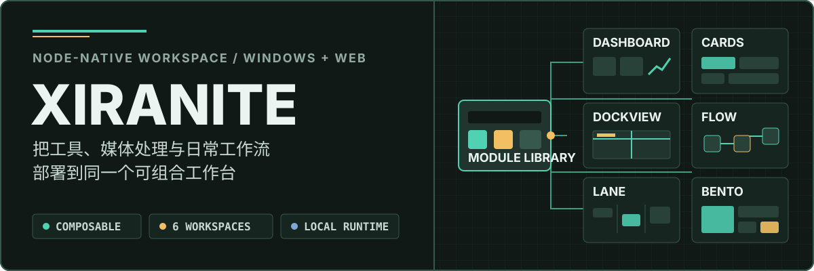
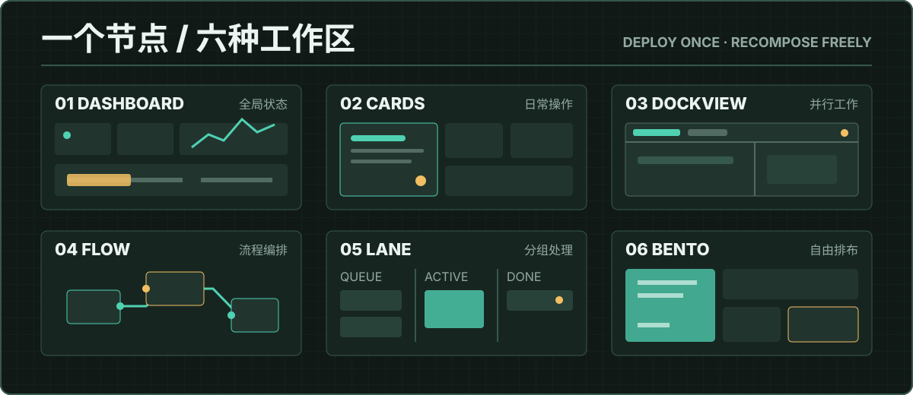
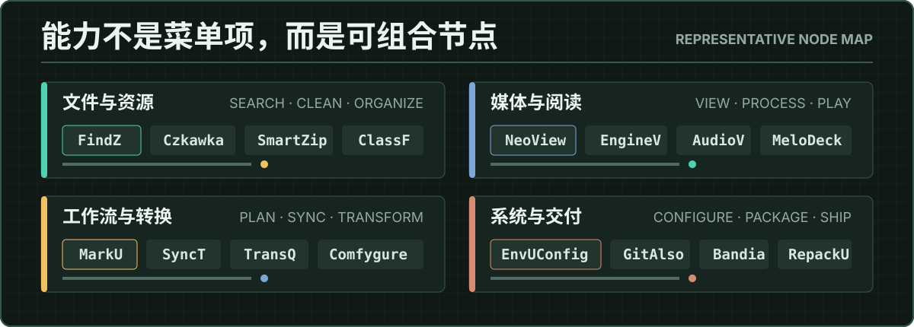

<p align="center">
  
</p>

Xiranite 适合需要频繁切换工具、整理本地资源并持续调整工作区的人。节点只负责自己的能力，工作区负责组合、布局、运行和持久化。

<p align="center">
  <a href="https://github.com/HibernalGlow/Xiranite"></a>
  <a href="https://github.com/HibernalGlow/Xiranite/stargazers"></a>
  <a href="https://github.com/HibernalGlow/Xiranite/commits/master"></a>
  <a href="./LICENSE"></a>
  
</p>

<p align="center">
  <a href="https://react.dev/"></a>
  <a href="https://www.typescriptlang.org/"></a>
  <a href="https://vite.dev/"></a>
  <a href="https://tailwindcss.com/"></a>
  <a href="https://bun.sh/"></a>
  <a href="https://wails.io/"></a>
</p>

<p align="center">
  <a href="#一个节点六种工作区">工作区</a> ·
  <a href="#你可以用它做什么">能力</a> ·
  <a href="#快速开始">快速开始</a> ·
  <a href="#架构与技术栈">架构</a> ·
  <a href="#文档地图">文档</a>
</p>

## 一个节点，六种工作区

<p align="center">
  
</p>

模块库负责发现和部署节点，工作区负责展示和组织节点。节点通过统一的 `deployComponent` 机制进入不同视图，同一能力可以随任务切换布局，而不需要重新实现运行逻辑。

## 你可以用它做什么

<p align="center">
  
</p>

- 从模块库搜索节点，并拖拽到工作区立即使用
- 在仪表盘、卡片、标签页、流程画布、泳道和自由网格之间切换同一组节点的呈现方式
- 将文件整理、媒体处理、同步转换、环境配置等工具集中到一个界面
- 使用本地后端运行节点，把 Web 开发模式和 Wails 桌面模式共用同一套前端与节点契约
- 用主题、背景、操作栏位置和布局持久化，把工作区调整成自己的工具环境

| 视图 | 适合场景 | 主要能力 |
| --- | --- | --- |
| **Dashboard** | 查看全局状态 | 资源概览、运行历史、后端健康状态和快捷操作 |
| **Cards** | 日常操作 | Grid、Stack、Split、Focus 四种卡片布局 |
| **Dockview** | 并行工作 | IDE 式标签页、拖拽分屏和多节点监控 |
| **Flow** | 编排工作流 | 无限画布、缩放平移和节点连线 |
| **Lane** | 分组处理 | 泳道、跨列拖拽和工作流分组 |
| **Bento** | 自由排布 | 12 列网格、调整尺寸、折叠和布局持久化 |

## 节点架构

系统模块提供设置、模块库、运行历史、终端、任务、看板、数据库、富文本和音乐播放等基础能力。PackU 节点则覆盖媒体处理、文件整理、同步转换和系统工具等场景；节点的核心运行时位于 `packages/nodes/*`，应用侧工作台位于 `src/nodes/<id>/`。

<p align="center">
  
</p>

平台差异被限制在 host / adapter 边界，共享 TypeScript contract 不依赖具体前端框架或 Windows API。详细分层、调用链和数据边界见 [架构概览](docs/architecture-overview.md)。

## 快速开始

### 前置依赖

- [Bun](https://bun.sh) 1.3.0+
- Go 1.21+（桌面端开发与构建）
- Node.js 24+（备用运行时）

### Web 开发模式

```bash
bun install
bun run dev
```

`bun run dev` 会生成节点注册表、构建 workspace 包，并启动前端与本地后端。桌面开发与结束会话：

```bash
bun run dev:desktop    # 启动 Wails 桌面开发模式
bun run dev:stop       # 关闭本次开发会话的受管进程
```

低内存入口、CLI shim、串行验证规则和 Windows 构建流程见 [快速上手](docs/getting-started.md)。并行开发的端口、backend manifest 与共享 Vite 缓存约定见 [开发会话](docs/development-sessions.md)。

## 主题系统

Xiranite 提供 16+ 内置主题预设，并支持系统跟随、浅色/深色模式、网格或点阵背景、自定义图片背景、操作栏位置和自定义主题对象导入。

其中 **Wuling Jade Industrial** 是项目的代表性主题：以冷灰实验室表面、玉绿强调色、硬边阴影、技术面板和数据等宽字体构成偏工业的工作台视觉。主题细节集中在 `src/styles/themes/`。

## 架构与技术栈

| 层级 | 技术 |
| --- | --- |
| 前端 | React 19、TypeScript、Vite 8 |
| UI | Tailwind CSS v4、shadcn/ui、Lucide |
| 状态与布局 | Zustand、dockview-react、gridstack、@dnd-kit |
| 国际化 | i18next（中文/英文） |
| 桌面端 | Wails v3、Go |
| 包管理与工作流 | Bun 1.3.0、Turbo |

## 开发验证

```bash
bun run build
bun run typecheck
bun run lint
```

前端布局和交互回归使用 Vitest Browser Mode，纯逻辑使用普通 Vitest，Wails 跨进程行为使用 Go 或宿主集成测试。完整命令和串行运行约束见 [快速上手](docs/getting-started.md) 与 [前端测试规范](docs/frontend-testing.md)。

## 文档地图

| 我想要…… | 从这里开始 |
| --- | --- |
| 安装、启动、停止或构建项目 | [快速上手](docs/getting-started.md) |
| 理解模块分层、运行链路和数据边界 | [架构概览](docs/architecture-overview.md) |
| 创建节点或扩展节点 UI | [节点编写指南](docs/node-authoring.md) |
| 编写前端交互与视觉回归测试 | [前端测试规范](docs/frontend-testing.md) |
| 浏览节点、性能、迁移与 ADR 文档 | [完整文档中心](docs/README.md) |

## 国际化

界面支持中文和英文。可以在 **设置 → Language** 切换语言；节点名称和描述通过 `module:<id>.name` 等 i18next key 管理。

## 致谢

Xiranite 使用或参考了以下开源项目：

- [shadcn/ui](https://ui.shadcn.com/)：基础组件体系
- [dockview](https://dockview.dev/)：标签页与分屏布局
- [gridstack](https://gridstackjs.com/)：自由网格布局
- [Wails](https://wails.io/)：桌面应用框架
- Endfield、Onlook、Tori、Conductor：主题视觉参考

## License

[MIT](LICENSE)
