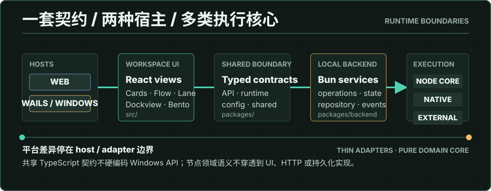

# Xiranite 架构概览

Xiranite 是一个以节点为能力单元、以工作区为组合表面的 Windows / Web 混合应用。架构目标不是让每个节点各自拥有一套应用壳，而是让节点领域能力可以被 GUI、CLI、TUI 与桌面宿主复用。

## 核心原则

1. 节点拥有领域能力，工作区拥有布局、部署和交互状态。
2. 纯 TypeScript contract 与领域逻辑不依赖 React、Wails 或 Windows API。
3. React 组件负责渲染、生命周期和事件绑定，不复制 package 中的运行逻辑。
4. 平台差异停在 host、desktop 或 adapter 边界。
5. native 与外部工具通过明确能力接口接入，不穿透到通用 UI。

## 分层

| 层 | 主要路径 | 职责 |
| --- | --- | --- |
| 宿主 | `main.go`、`cmd/`、桌面 adapter | Wails 窗口、Windows 集成与宿主生命周期 |
| 工作区 UI | `src/components/`、`src/nodes/` | 六种工作区、节点界面、设置和交互状态 |
| 共享契约 | `packages/contract/`、`packages/api/`、`packages/shared/` | DTO、客户端、跨端类型与平台无关工具 |
| 运行时与服务 | `packages/runtime/`、`packages/backend/`、`packages/services/` | 节点调度、本地 HTTP、服务编排与事件 |
| 持久化 | `packages/repository/`、`packages/config/` | Xiranite 工作区数据与明文配置 |
| 节点能力 | `packages/nodes/*` | 独立节点 package、CLI/TUI 与领域核心 |
| 原生边界 | `native/`、外部 node adapter | Rust Node-API、系统工具与外部运行时 |

## 从部署到执行

1. 模块注册表发现节点及其前端入口。
2. 工作区通过统一部署契约把节点放入 Dashboard、Cards、Dockview、Flow、Lane 或 Bento。
3. React adapter 收集用户输入，并通过共享 API / contract 发起操作。
4. 本地后端将请求交给节点服务或运行时，并统一管理状态、取消、日志与结果。
5. 节点核心按需调用纯 TypeScript、Rust Node-API 或隔离的外部工具 adapter。
6. 结果通过共享契约返回，工作区只投影状态，不接管节点领域语义。

## 节点边界

新增节点通常包含两个明确部分：

- `packages/nodes/<id>/`：领域逻辑、运行时、CLI/TUI、schema 与 package 测试。
- `src/nodes/<id>/`：React 工作台、控件和 Browser Mode 测试。

共享 DTO 应放入公共 contract；平台专属操作应放入 host adapter；一次性 UI 状态不应写入节点领域服务。具体规范见 [节点编写指南](node-authoring.md) 和 [代码规范](code-quality.md)。

## 数据边界

- `xiranite.config.toml` 保存用户可编辑的节点设置与应用配置。
- `xiranite.db` 保存 Xiranite 项目自己的工作区和运行数据。
- 兼容旧应用的业务数据库由对应节点 adapter 管理，不应被悄悄迁入 Xiranite 主库。
- 测试后端必须使用隔离临时目录和有限 TTL，不连接默认用户数据库。

## 验证边界

| 变更 | 首选验证 |
| --- | --- |
| 纯逻辑、转换、状态机 | 普通 Vitest |
| React 交互、布局、视觉 | Vitest Browser Mode |
| package contract | package 自身测试与 build |
| Wails / Windows 宿主行为 | Go 或宿主集成测试 |
| Rust native crate | 串行 Cargo test / Clippy，`-j 1` |

继续阅读：[前端测试规范](frontend-testing.md)、[外部节点包](external-node-packages.md)、[节点配置策略](node-config-toml-strategy.md) 和 [`docs/adr/`](adr/)。
