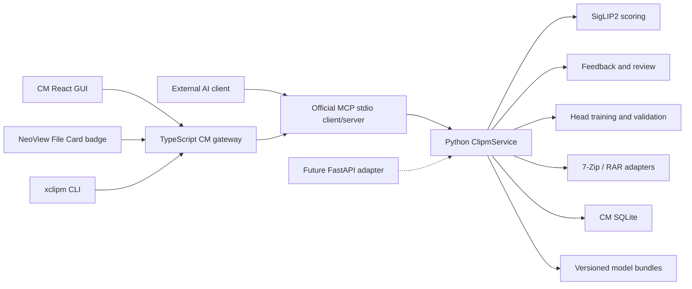

# CM 漫画偏好评分节点设计

> 状态：已确认，待实现
> 节点 ID：`clipm`
> 显示名称：`CM`
> 更新日期：2026-08-01

## 1. 目标

CM 面向个人漫画库完成以下闭环：

1. 扫描一个目录中的漫画压缩包和已解压漫画文件夹。
2. 自动抽取兼顾彩图与黑白页的代表页，输出喜欢/不喜欢分类和 `0000-1000` 个人评分。
3. 分组后按分数降序展示，并把结果持久化到文件名、漫画根目录 JSON 和独立 SQLite。
4. 接受文件名修改、CM GUI 和 NeoView File Card 的人工修正。
5. 使用保留的 embedding 重训分类头和评分头，不要求每次重新读取原图。
6. 通过候选验证、自动激活、历史版本和回滚形成持续修正闭环。
7. 由 Xiranite GUI、CLI 和标准 MCP stdio 共用同一个 Python 领域服务。

CM 是个人偏好模型，不负责作品题材、角色、画师等通用标签识别。当前不做 SigLIP2 视觉编码器的完整微调或 LoRA。

## 2. 已验证模型基线

正式实现以现有 pilot-v2 结果为 `v1` 基线：

| 项目 | 值 |
| --- | --- |
| 视觉编码器 | `google/siglip2-base-patch16-224` |
| 预处理 | 224 白色 letterbox |
| 选页 | 从 12 个候选页选 4 页，保留彩图/黑白混合 |
| 聚合 | 单页 embedding L2 归一化，均值池化，再 L2 归一化 |
| 分类头 | `StandardScaler + LogisticRegression(C=0.01, class_weight="balanced")` |
| 阈值 | `0.48017321753783504` |
| ROC-AUC | `0.8714` |
| macro AP | `0.8266` |
| balanced accuracy | `0.8032` |

当前可信导入源：

```text
D:\1VSCODE\Projects\Xiranite\artifacts\doujin-preference\pilot-v2\evaluation\best_preference_model.joblib
```

`joblib` 只用于首次导入这一本地可信模型。正式 CM 模型包不继续使用 pickle/joblib 作为长期格式。

## 3. 总体架构



边界规则：

- Python `ClipmService` 拥有评分、身份、反馈、训练、模型和归档元数据领域语义。
- MCP stdio、未来 FastAPI、CLI 和 React 都是薄 adapter，不复制领域逻辑。
- TypeScript 不承载第二套 ONNX/Transformers.js 推理实现。
- FastAPI 未来只包装同一 application service，不改变训练或持久化协议。
- CM 使用自己的数据目录和 SQLite，不把业务表写入 Xiranite 的 `xiranite.db` 或 NeoView 的 `thumbnails.db`。

## 4. 文件名协议

### 4.1 规范格式

```text
作品名 [CM1P0873-4K7Q].zip
作品文件夹 [CM1N0342-9X2M]
```

字段含义：

| 字段 | 含义 |
| --- | --- |
| `CM` | 固定协议标识 |
| `1` | 模型 bundle 版本 |
| `P` / `N` | 喜欢 / 不喜欢分类 |
| `0873` | 固定四位评分，范围 `0000-1000` |
| `4K7Q` | 作品短码，默认至少四位 |

解析正则：

```regex
\s*\[CM(?<version>\d+)(?<label>[PN])(?<score>\d{4})-(?<workCode>[0-9A-HJKMNP-TV-Z]{4,})\]$
```

压缩包后缀位于扩展名前。重新评分只替换已有 CM 后缀，不改变标题主体。新模型激活后不自动改写旧版本文件名，重新评分必须显式触发。

### 4.2 短码

- 每本作品使用完整 UUID `workId` 作为稳定身份。
- SQLite 为作品分配本地整数记录号。
- 使用官方 Sqids 和固定 Crockford Base32 字母表把记录号编码为短码：

```text
0123456789ABCDEFGHJKMNPQRSTVWXYZ
```

- 短码不是哈希、密钥或文件名压缩结果；它只能解码为本地记录号，再通过映射表查询完整 UUID 和名称。
- 解码后必须重新编码并比较，拒绝 Sqids 的非规范等价编码。
- 默认最少四位，容量不足时自然增长，不截断。
- 完整 UUID、记录号、短码和名称同时保存在 SQLite 与根目录 JSON，因此 SQLite 可由 JSON 重建。
- 合并两个独立数据目录时，以 UUID 解决短码冲突；必要时重新分配短码并事务性重命名。

## 5. 根目录元数据

### 5.1 固定位置

不创建 `.xiranite/` 或 `XR/` 子目录。每个压缩包或漫画文件夹的根目录直接保存：

```text
xiranite.cm-score.json
```

匹配规则：

```regex
(?i)^xiranite\.cm-score\.json$
```

### 5.2 建议 schema

```json
{
  "schemaVersion": 1,
  "work": {
    "workId": "018f...",
    "recordNumber": 1234,
    "shortCode": "4K7Q",
    "firstSeenName": "original.zip",
    "currentBaseName": "renamed title.zip",
    "nameRevision": 3
  },
  "score": {
    "bundleVersion": 1,
    "classification": {
      "predicted": "P",
      "current": "P",
      "source": "model"
    },
    "ranking": {
      "predicted": 873,
      "current": 873,
      "source": "model"
    },
    "scoredAt": "2026-08-01T00:00:00Z"
  },
  "embedding": {
    "encoder": "google/siglip2-base-patch16-224",
    "preprocess": "white-letterbox-224/four-of-twelve/color-mono-v1",
    "dtype": "float16",
    "shape": [768],
    "encoding": "base64",
    "data": "..."
  },
  "archive": {
    "format": "zip",
    "metadataWriteStatus": "written"
  },
  "nameHistory": [],
  "feedbackHistory": []
}
```

正式 schema 使用 Pydantic 定义并生成 JSON Schema；TypeScript 类型从协议生成或由同一 schema 校验，不维护手写的宽松副本。

embedding 使用 `float16 + Base64`，768 维约占 1.5 KiB。头部重训可直接使用 embedding；更换编码器、LoRA 或完整编码器微调仍需要原始图片像素。

JSON 保存当前快照和该作品的追加式反馈/名称历史。SQLite 保存全库权威历史、索引和训练快照。

## 6. 身份、恢复和冲突

持久化分四层：

1. SQLite：完整历史和训练数据的权威来源。
2. 根目录 JSON：随作品移动的可移植备份。
3. 文件名 CM 后缀：人眼可见的评分和短码快照。
4. 内容证据：用于 JSON 和短码同时缺失时生成恢复候选。

身份判断遵循“宁可重复，不自动误合并”：

- 完整 UUID 相同才自动视为同一本。
- 精确内容哈希只能覆盖未改变像素的情况。
- 重新压缩、JPEG 转换、裁切或水印会破坏精确哈希。
- 感知相似度、页级 SigLIP embedding 和多页顺序共识只产生“疑似同一本”候选，绝不自动合并。
- 未确认候选按新作品处理。误拆分的成本低于把两本不同作品的反馈和历史合并。

冲突规则：

- 短码、JSON UUID 和 SQLite 一致时，文件名中变化的 P/N 或分数是权威人工修正。
- JSON 丢失但短码有效时，从 SQLite 重建 JSON。
- SQLite 记录丢失但 JSON 完整时，从 JSON 重建 SQLite。
- 短码与 JSON 指向不同作品、不同 UUID 共用短码或后缀非法时，禁止自动写入并进入审核队列。
- 审核操作固定为：采用文件名修正、采用 JSON、关联已有作品、作为新作品。
- 文件修改时间不参与冲突裁决。

## 7. 名称历史

- `firstSeenName` 首次入库后不可变。
- `currentBaseName` 保存最新标题主体；名称变化追加到名称历史。
- CM 重评分只替换 CM 后缀，绝不恢复旧标题。
- NeoView 普通重命名只编辑标题主体并自动保留 CM 后缀。
- 资源管理器中改标题但保留短码时，更新路径和名称历史，作品身份不变。
- 删除整个 CM 后缀不代表“不喜欢”或删除反馈；下一次同步可由 JSON 恢复。
- 删除 CM 身份和元数据必须通过明确的“移除 CM 元数据”命令完成。
- 同时修改标题和评分时，两类变化分别进入名称历史和反馈历史。

## 8. 扫描、评分和归档写入

### 8.1 输入发现

- 输入为一个目录，也允许 CLI/MCP 传入单个作品路径。
- 支持漫画压缩包与内部均为图片的已解压漫画文件夹。
- 已有有效 CM 后缀默认复用；旧模型版本标记为 stale，但不自动重算。
- 输出先分 P/N，再在各组内按分数降序。

### 8.2 归档格式

| 格式 | 读取 | 写入根目录 JSON | 工具 |
| --- | --- | --- | --- |
| ZIP / CBZ | 是 | 是 | 7-Zip |
| 7Z / CB7 | 是 | 是 | 7-Zip |
| RAR / CBR | 是 | 条件支持 | 官方 RAR CLI |

RAR CLI 缺失时仍完成评分、文件名和 SQLite 写入，但不修改 RAR/CBR，并在 GUI 显示 `internal metadata unsupported`。不得自动把 RAR 转换成其他格式。

### 8.3 事务写入

每个可写压缩包执行：

1. 在同目录创建唯一临时副本。
2. 向临时归档根目录添加或替换 JSON。
3. 列出更新前后条目，排除 CM JSON 后逐项比较路径、未压缩大小和 CRC。
4. 运行 7-Zip 或 RAR 完整性测试。
5. 通过后原子替换目标；失败时保留原归档并清理临时文件。
6. 替换与取消边界内禁止中断；取消在当前归档事务完成后生效。

已解压目录使用临时 JSON、flush 和原子 rename。所有归档路径必须防止 path traversal，外部进程参数不得经过 shell 字符串拼接。

## 9. 反馈语义

P/N 与分数是两个独立字段：

- 只改 P/N：只训练分类头。
- 只改分数：只训练评分头。
- 两者都改：分别训练两个头。
- `N0873` 等组合合法，不强制让一个头覆盖另一个头。
- 是否改变以 JSON 中最后一次模型预测/已接受反馈为基准，不以 mtime 判断。

反馈发现方式：

- 开始目录评分前自动扫描有效修正。
- GUI 提供独立“扫描修正”操作。
- GUI 和 NeoView 内修改时立即写入反馈。
- 不建立常驻文件系统 watcher。
- 自动训练只统计成功写入 SQLite 的有效修正。

反馈事件追加保存并支持撤销。训练只消费每个 `workId`、每个字段的最新有效值；历史事件不重复成为训练样本。

## 10. 头部训练

### 10.1 数据集

- 原始正负样本作为权重 `1` 的稳定基础。
- 最新人工修正覆盖同一作品的对应原始标签，权重默认 `3`。
- 使用 scikit-learn 原生 `sample_weight`。
- 验证使用 `StratifiedGroupKFold`，优先按画师分组，退化时按作品/系列分组。
- 同一本及同一组不得跨训练集与验证集。

### 10.2 分类头

保持已验证的 `StandardScaler + LogisticRegression(class_weight="balanced")` 管线，`v1` 使用 `C=0.01`。后续超参数变化必须作为显式训练配置进入 manifest，并通过相同门禁验证，不得静默改变基线。

### 10.3 评分头

使用 scikit-learn `RidgeCV` 学习相对当前基准评分的残差：

```text
最终评分 = 当前基准评分 + 个人修正残差
```

- 输出裁剪至 `0000-1000`。
- 少于 20 个明确数字评分修正时只保存反馈，不启用新评分头。
- P/N 修改不会被伪造为数字评分样本。
- 不引入缺少自然 query group 的 LightGBM/XGBoost Ranker。

### 10.4 自动训练

- 默认关闭，手动训练是主要入口。
- 开启后，每累计 20 本新的有效修正作品形成一批。
- CM 空闲 10 分钟后启动；评分或迁移中不启动。
- 同一批只触发一次，失败不循环重试。
- 两个头分别判断数据和门禁，允许只更新一个头。
- 手动“立即训练”不受批次和空闲时间限制，但仍必须验证。

## 11. 候选验证和模型版本

固定 pilot 验证集只保存 embedding 和标签，不进入训练：

- 分类头必须改善修正数据表现。
- 固定验证集 balanced accuracy 相对活动头最多下降 `0.03`。
- 固定验证集 ROC-AUC 相对活动头最多下降 `0.02`。
- 评分头的加权 MAE 必须改善，Spearman 排序相关性不得下降。
- 两个头独立验收。失败的头沿用旧版本，不阻塞另一个头升级。

候选通过后自动激活；失败候选保持 inactive 并展示原因，GUI 允许明确强制激活。

正式模型 bundle：

```text
models/
  v1/
    manifest.json
    heads.safetensors
  v2/
    manifest.json
    heads.safetensors
  active-model.json
```

- 权重数组使用 Hugging Face safetensors，参数、指标和数据 revision 使用 JSON。
- 版本目录不可变，激活只原子切换 `active-model.json`。
- 默认保留全部历史版本；活动版本、回滚目标和固定版本禁止删除。
- 可回滚到任意历史 bundle。
- 激活新版本不自动重命名或重评分已有作品。

## 12. SQLite 数据边界

建议最小表边界：

- `works`：UUID、记录号、短码和当前状态。
- `work_locations`：当前及历史路径。
- `work_names`：首次名称、当前名称和名称历史。
- `embeddings`：按 encoder/preprocess 版本保存 embedding。
- `score_snapshots`：每次模型预测。
- `feedback_events`：追加式修正和撤销事件。
- `review_queue`：冲突、非法后缀和模糊恢复候选。
- `training_runs`：数据 revision、配置、进度和结果。
- `model_bundles`：候选、活动、失败、固定和指标。

SQLite 使用 WAL、外键和 schema migration。每次训练先取得一致的数据 revision 快照；训练期间的新反馈进入下一批。

## 13. MCP 与服务契约

正式通信使用官方 Model Context Protocol stdio：

- TypeScript：`@modelcontextprotocol/sdk`。
- Python：官方 `mcp` SDK。
- stdout 只承载 MCP 协议；日志使用 MCP logging 或 stderr。
- 使用 SDK 的 schema、请求 ID、进度、取消和错误能力，不自研 JSONL RPC。

初始工具集合：

| MCP tool | 用途 |
| --- | --- |
| `health` | 环境、GPU、模型、数据库和归档工具检查 |
| `score_library` | 扫描并评分目录 |
| `score_work` | 评分单本作品 |
| `scan_feedback` | 扫描并导入外部文件名修正 |
| `apply_feedback` | 应用 GUI/NeoView 单本修正 |
| `list_review_items` | 查询冲突审核队列 |
| `resolve_review_item` | 执行明确冲突决策 |
| `train_heads` | 手动或自动创建训练任务 |
| `list_models` | 查询候选和历史版本 |
| `activate_model` | 激活或强制激活版本 |
| `rollback_model` | 回滚历史版本 |
| `environment_status` | 查询外部运行环境 |
| `migrate_environment` | 执行低频一键迁移 |

长任务通过 MCP progress 通知报告阶段、当前作品、计数和百分比。取消在安全检查点生效。

未来 FastAPI adapter 使用相同 Pydantic command/result 模型和 `ClipmService`，但不把 HTTP 类型渗入领域层。stdio 本地模式不开放网络端口；未来 HTTP 模式必须另行定义认证和绑定地址。

## 14. 并发和 worker 生命周期

### 14.1 分层并发

- Xiranite 内 CM 与 NeoView 通过统一 gateway 共享同一个 worker。
- 外部 AI 可启动独立 MCP worker，但共享同一数据目录。
- SQLite WAL 处理正常并发读写。
- 使用维护中的 `portalocker` 提供 Windows 跨进程锁。
- GPU 推理按批次串行。
- 压缩包按 `workId` 锁定，单本反馈无需等待整个目录任务完成。
- 模型激活和环境迁移使用全局独占锁。

### 14.2 按需生命周期

- Xiranite 项目启动时不启动 CM worker。
- 运行 CM 节点、打开需要实时状态的 CM 工作区或点击 NeoView CM 徽章时按需启动。
- NeoView 通过 headless CM 节点取得短期 lease，画布上不要求存在 CM Card。
- 没有节点 lease、NeoView/MCP 调用或后台任务后，worker 正常退出。
- 外部 AI 的 MCP 连接显式拥有自己的 worker 生命周期。

编码器按需加载。worker 仍被 CM 节点持有时，支持：

- 任务后立即卸载。
- 空闲 10 分钟卸载（默认）。
- worker 生命周期内始终驻留。

卸载释放模型引用和 PyTorch CUDA cache。SQLite、模型头和 MCP 服务继续可用；纯 embedding 头部训练不加载编码器。

## 15. UV 环境和数据目录

### 15.1 默认位置

首次设置要求用户确认非系统盘目录。开发默认：

```text
D:\1VSCODE\Projects\Xiranite\artifacts\clipm-runtime
```

开发版和编译版读取 `xiranite.config.toml` 中同一个绝对 `runtime_root`，通过健康检查后直接共用环境。大型依赖和模型不进入编译包。

建议配置：

```toml
[nodes.clipm]
runtime_root = "D:\\1VSCODE\\Projects\\Xiranite\\artifacts\\clipm-runtime"
device = "cuda"
model_residency = "idle-10m"
auto_train = false
auto_train_batch_size = 20
```

建议目录：

```text
clipm-runtime/
  tools/
  python-installations/
  python/
  uv-cache/
  huggingface-cache/
  data/clipm.sqlite
  models/
  logs/
  temp/
```

### 15.2 首次设置

- 优先使用 PATH 中已有 `uv`。
- 找不到时从 uv 官方 release 下载固定版本并校验 SHA-256，保存到 `runtime_root/tools`，不修改系统 PATH。
- 使用 UV 管理的 Python 3.11。
- `UV_PYTHON_INSTALL_DIR`、`UV_PROJECT_ENVIRONMENT`、`UV_CACHE_DIR` 和 Hugging Face cache 全部定向到 `runtime_root`。
- 可选择采用已有环境或新建环境；采用前检查 Python、PyTorch CUDA、模型、MCP worker 和归档工具。
- CUDA 不可用时允许显式 CPU 降级并在 GUI 告警，不静默重装环境。

正式 Python 依赖至少包括已验证版本的 PyTorch CUDA、Transformers、scikit-learn、NumPy、Pillow、safetensors、MCP SDK、portalocker 和 Sqids。依赖由 `pyproject.toml + uv.lock` 固定。

### 15.3 一键迁移

迁移是低频维护能力：

1. 用户选择新 `runtime_root`。
2. 使用 `uv.lock` 在目标位置重新创建 Python 环境，不直接复制 virtualenv。
3. 复制并校验 SQLite、模型、配置和可复用 Hugging Face/UV cache。
4. 运行 SQLite integrity check、新 Python、CUDA、模型和 MCP worker 健康检查。
5. 全部通过后原子切换 `xiranite.config.toml`。
6. 原目录保留，由用户明确清理；不建设额外撤销系统。

直接复制 virtualenv 被禁止，因为 `pyvenv.cfg`、activation 脚本和 console launcher 可能含绝对路径。

## 16. GUI、CLI 和 NeoView

### 16.1 CM GUI

同一个节点工作区提供四个视图：

1. 评分：目录、扫描选项、进度、P/N 分组和分数排序。
2. 修正：已导入反馈、冲突审核、撤销和手动扫描。
3. 训练：手动训练、自动训练开关、数据计数、候选指标和日志。
4. 模型与环境：活动版本、候选、回滚、健康检查和迁移。

GUI 是完整操作面，MCP 和 CLI 提供同等领域能力。首版不新增 TUI adapter。

### 16.2 CLI

`xclipm` 提供 `score`、`feedback`、`train`、`model`、`env` 子命令和 `--json`。CLI 通过相同 MCP/ClipmService 执行，不导入第二套推理实现。

### 16.3 NeoView File Card

漫画归档和漫画文件夹显示可点击徽章：

```text
CM P 873
CM N 342
CM --
```

- P/N 使用不同语义颜色，同时保留文字，不只依赖颜色。
- tooltip 显示完整评分、模型版本和短码。
- 点击徽章阻止打开漫画，并惰性加载单本 CM 编辑 Dialog。
- Dialog 使用 P/N segmented control 和 `0-1000` 数字输入，显示模型原预测与当前人工值。
- 保存调用 headless CM 节点，事务性同步 SQLite、根目录 JSON 和文件名。
- NeoView 使用返回的新路径更新当前目录 catalog，不做整目录重扫。
- 使用现有重命名/路径迁移能力维护打开中的 Reader 身份。
- 保存失败时回滚乐观徽章和路径，并显示底层错误。
- 首版徽章只编辑单本，不提供批量反馈。
- `CM --` 可触发单本评分。

实现必须覆盖 compact、list/grid/mosaic 和 details 等共享 File Card 呈现；details 视图应提供可配置 CM 列或等价可发现入口。该扩展需要新增独立 NeoView compatibility contract，并按现有 File Card 验收流程实施，不能用 CM 节点 smoke UI 代替。

## 17. 成熟依赖选择

| 能力 | 选择 | 原因 |
| --- | --- | --- |
| 模型推理 | PyTorch CUDA + Transformers | 当前 pilot 已验证，RTX 4060 可用；不保留重复 TS 推理栈 |
| 训练 | scikit-learn | 已验证分类头，原生支持 scaler、sample weight、grouped CV 和 RidgeCV |
| RPC/AI | 官方 MCP TypeScript/Python SDK | 标准 stdio、schema、进度、取消和 AI 生态 |
| 模型存储 | safetensors + JSON | 非 pickle、可审查、适合数组权重和不可变 bundle |
| 短码 | 官方 Sqids | 成熟可逆整数短码；固定规范字母表，避免自研编码 |
| 跨进程锁 | portalocker | Windows 兼容、维护活跃，不自研锁文件协议 |
| 环境 | uv | lock 驱动、可指定 Python/venv/cache 目录、适合共享外部环境 |
| 图像 | Pillow | 当前预处理基线已验证 |
| 归档 | 7-Zip + 条件 RAR CLI | 格式覆盖成熟，支持列举、更新、CRC 和完整性测试 |
| 数据库 | SQLite | 本地事务、WAL、迁移和完整性检查，无服务依赖 |

实现前仍需把新增依赖的锁定版本、许可证文件和 Windows 实测结果写入变更说明。不得因为已有试验代码而保留 `@huggingface/transformers`、ONNX Runtime 或 Sharp 的第二套正式推理路径。

## 18. 验收门禁

### 18.1 领域和持久化

- 新旧后缀解析、替换、扩展名和非法输入单元测试。
- Sqids 规范重编码、短码冲突和数据目录合并测试。
- JSON schema round-trip、embedding dtype/shape 和数据库重建测试。
- ZIP/7Z/RAR 临时副本、CRC 对比、完整性失败和取消测试。
- 文件移动、改标题、丢 JSON、丢 SQLite、冲突 UUID 和显式重评分场景。
- 最新逐字段反馈、撤销、训练 snapshot 和模型激活原子性测试。

### 18.2 模型

- 固定 pilot 指标可复现。
- 分类/评分头按画师或作品组隔离。
- 候选门禁、单头通过、强制激活和任意历史回滚测试。
- 无原图、仅 embedding 的头部重训测试。
- CUDA 和显式 CPU 降级健康检查。

### 18.3 接口和 UI

- MCP stdio 集成测试覆盖 schema、progress、cancel 和 stderr/stdout 隔离。
- CLI 与 GUI 调用同一服务结果一致。
- CM GUI 与 NeoView 徽章/Dialog 使用 Vitest Browser Mode `*.browser.test.tsx`。
- 覆盖桌面和窄 Card 几何、文本不溢出、徽章点击不打开漫画、失败回滚和路径身份保持。
- 不新增普通 Playwright spec。

### 18.4 工程门禁

- 重任务严格串行，Vitest 使用 `--maxWorkers=1`。
- 原生任务如有新增，遵守单 Cargo job 和 `sccache` 规则。
- 运行 `bun run check:source-size`；新源码文件不得超过 1000 行。
- 只提交 CM 及明确的 NeoView 集成文件，不混入并行工作区修改。

## 19. 实施顺序

1. 冻结 Pydantic/TypeScript contract、SQLite migration、文件名和 JSON schema。
2. 建立 UV Python package、`ClipmService`、官方 MCP stdio server/client 和按需 worker manager。
3. 导入 pilot 模型到 safetensors bundle，完成评分和 embedding 持久化。
4. 完成 7-Zip/RAR 事务 adapter、短码、恢复和冲突审核。
5. 完成反馈扫描、两个头的训练、验证、激活和回滚。
6. 重构 CM React GUI 和 CLI，移除试验性 Transformers.js/ONNX 正式路径及其任务自有依赖。
7. 按 NeoView compatibility/AST 原型/Browser Mode 流程实现 File Card 徽章和编辑 Dialog。
8. 完成首次设置、健康检查、共享编译版环境和低频迁移。
9. 串行执行领域、MCP、GUI、NeoView 和打包验证。

每个阶段应形成范围明确的提交，避免把协议、模型运行时、NeoView UI 和环境迁移堆在一个不可审查的提交中。
