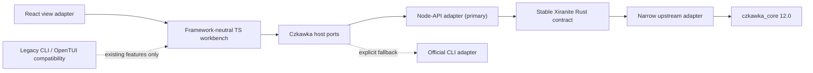

# Czkawka 12.0 upgrade and maintenance plan

Status: implementation in progress; core upgrade and boundary refactor are complete, GUI feature slices are ongoing

Target: Windows/Wails production path

Baseline: `czkawka_core = 10.0.0`, Xiranite Node-API v5

Target upstream: `czkawka_core = 12.0.0`

## 1. Decision

Upgrade Xiranite from the published `czkawka_core` 10.0.0 crate to the published 12.0.0 crate, but first narrow the existing upstream boundary while behavior is still on 10.0.0. The upgrade must reduce the work needed for later Czkawka releases instead of spreading 12.0 types through Rust, TypeScript, React, CLI, and persisted state.

The fixed architecture is:



- Rust owns native scanning, hashing, image/video/audio processing, cache integration, progress transport, cancellation, and conversion at the upstream boundary.
- Framework-neutral TypeScript owns product semantics, defaults, validation, capabilities, migration, scan orchestration, result state, filtering, sorting, selection, analysis, preview state, and operation plans.
- React owns rendering, lifecycle binding, component composition, and direct interaction handling only.
- Node-API remains the primary runtime. The installed official CLI is an explicit fallback and diagnostic path, not the default backend.
- GUI is the only 12.0 delivery target. Existing CLI and OpenTUI paths remain available for compatibility, but new 12.0 feature parity, UI work, and release validation for them are intentionally deferred.
- `@xiranite/node-czkawka` remains the reusable headless package. Do not create another workspace package during this upgrade.
- Production source files must remain below 1000 physical lines; 800 lines is the warning threshold.
- Upgrades remain manually initiated. Do not add Dependabot, scheduled workflows, automated pull requests, or automatic binary commits for this plan.

## 2. Goals

1. Preserve all current 10.0 user-visible behavior while establishing a narrow, testable upstream adapter.
2. Upgrade the core to 12.0 without exposing upstream Rust types to Node-API or application TypeScript.
3. Retain the GUI contract and migrate persisted state without deleting unknown or legacy fields. Preserve existing CLI and OpenTUI behavior where the shared core permits it, without making new 12.0 parity a delivery requirement.
4. Expose the useful 11.0 and 12.0 scan capabilities in staged feature slices.
5. Add the three missing tools, but keep destructive execution behind Xiranite's operation, audit, confirmation, and recovery boundaries.
6. Move stateful application logic out of React without adding measurable scan or rendering overhead.
7. Make later Czkawka upgrades primarily affect `native/czkawka-core/src/upstream/`, the capability registry, and focused compatibility tests.

## 3. Non-goals

- Do not port Krokiet, Czkawka GTK, or the Svelte UI from `czkawka-web`.
- Do not replace the Node-API runtime with subprocess-only CLI execution.
- Do not add a Git dependency or vendor the complete upstream core.
- Do not preserve simultaneous compiled support for Czkawka 10 and 12. Git history and prebuilt assets provide rollback; parallel adapters would double maintenance.
- Do not let upstream fix methods bypass Xiranite's safe file-operation contract.
- Do not combine unrelated XLchemy, NeoView, ArcThumb, or slimg changes with this work.
- Do not add release automation. The maintainer chooses when to upgrade and merge.

## 4. Evidence and source baseline

### 4.1 Official sources

- [Czkawka 11.0.0 release](https://github.com/qarmin/czkawka/releases/tag/11.0.0)
- [Czkawka 11.0.1 release](https://github.com/qarmin/czkawka/releases/tag/11.0.1)
- [Czkawka 12.0.0 release](https://github.com/qarmin/czkawka/releases/tag/12.0.0)
- Published `czkawka_core 12.0.0`: MIT, Rust 1.94.1, edition 2024.
- Local read-only source reference: `ref/czkawka-official`, tag `12.0.0`, commit `e56dc1160bf9efd4b232f3abb4e21b21817436c1`.

The current machine has Rust 1.97.1 and therefore satisfies the upstream minimum. This plan does not require a compiler downgrade.

### 4.2 Existing Xiranite baseline

- `native/czkawka-core/Cargo.toml` pins the published 10.0.0 crate and enables `libavif` with default features disabled.
- `native/czkawka-core/src/lib.rs` directly imports many upstream tools, parameter structs, progress types, and `vid_dup_finder_lib::Cropdetect`.
- `native/czkawka-node/src/lib.rs` mirrors scan DTOs and string-to-enum conversion for duplicate, basic, and media scans.
- `packages/czkawka-native/src/index.ts` manually repeats the Node-API DTOs.
- `packages/nodes/czkawka` already contains substantial reusable TypeScript logic for filters, analysis, selection, operations, presets, layout, source inputs, CLI, and OpenTUI.
- `src/nodes/czkawka/Component.tsx` is an historical 1635-line file and still owns scan lifecycle, persistence, per-tool result state, selection history, and operation orchestration.
- Native smoke tests and the compatibility facade require exact `sourceVersion === "10.0.0"`, creating unnecessary update fan-out.
- `native/prebuilt/win32-x64/manifest.json` currently identifies `10.0.0-api5`.

The functional baseline remains `docs/czkawka-fork-migration-checklist.md`. This plan must not weaken its completed behavior or replace its evidence with a smaller smoke test.

## 5. Official changes after 10.0

### 5.1 Version 11.0.0

Important core changes:

- Deterministic comparison results and improved similar-image grouping.
- Broken-video detection through `ffmpeg` and `ffprobe`.
- Video optimizer, EXIF remover, and bad-name tools.
- Scanning individual files in addition to directories.
- Video metadata including bitrate, codec, FPS, dimensions, and duration.
- Manual outdated-cache cleanup and weekly automatic cleanup.
- Corrected HEIF rotation and decoding behavior.

Breaking or integration-relevant changes:

- Broken-file and similar-image caches are incompatible and regenerate.
- Similar-image presets became integer `Max Difference` values from 0 through 40.
- Applications must call `register_image_decoding_hooks()` at startup for HEIF and JXL.
- Public functions and difference-related names changed.

### 5.2 Version 11.0.1

- Fixes excluded directories on Windows, which is directly relevant to Xiranite.
- Adds Windows cargo-test CI upstream.
- Includes GUI fixes that are not part of Xiranite's core integration.

### 5.3 Version 12.0.0

Important core changes:

- Replaces `vid_dup_finder_lib` with `similario_core` for similar videos.
- Adds temporal window count, duration tolerance, minimum matching windows, subclip detection, and audio matching for similar videos.
- Adds geometric invariance for mirrored, flipped, and rotated similar images.
- Adds same-resolution exclusion for images and videos.
- Allows multiple broken-file checkers, including fonts, markup, and more archive formats.
- Splits broken-video checking into fast `ffprobe` and slow full-decode `ffmpeg` modes.
- Adds non-printable and NUL-only content checks to empty files.
- Makes temporary-file extensions configurable.
- Reads both the head and tail for duplicate prehash.
- Adds the `$TRASH` exclusion preset.
- Reworks progress stages and display data.
- Adds video optimizer noise reduction, custom commands, and experimental hardware encoding.

Breaking or migration-relevant changes:

- Duplicate prehash, similar-image, similar-video, and broken-file caches regenerate.
- Similar-video crop detection changes from `none / letterbox / motion` to a boolean letterbox option. Motion detection is removed.
- Similar-video result and parameter types are replaced with the new engine's model.
- Progress is represented by richer tool-specific stages rather than the old simple stage sequence.
- The core requires Rust 1.94.1 or later.

This is not a safe Cargo-only version bump for the current wrapper.

## 6. Dependency decisions

| Dependency | Decision | Reason | Cost |
| --- | --- | --- | --- |
| `czkawka_core = 12.0.0` | Accept exact crates.io pin | Mature upstream core, MIT, required domain implementation | Native compile and cache changes |
| `@napi-rs/cli` | Add as a development dependency | Official generator for napi-rs `.d.ts`; removes a manual DTO mirror | Build-time only; no runtime or release size |
| `@xstate/store` | Reuse existing dependency | Framework-neutral subscription and event model already present in the repository | No new dependency; selectors must avoid hot-path allocation |
| Official `czkawka_cli` | Optional adapter only | Useful JSON output and system fallback | End-of-scan JSON, terminal-oriented progress, process-level cancellation |
| New state library | Reject | Existing dependency and pure TS are sufficient | Avoids another framework or runtime dependency |
| Git/forked Rust dependency | Reject | Violates the stable published-core boundary | Reconsider only for an explicitly approved unreleased fix |

Before implementation, record the resolved `@napi-rs/cli` version and MIT license in the dependency change. Its current CLI supports Node 20.17 or later and a configurable `--dts` output.

## 7. Target module boundaries

The names below define ownership. Exact file names may change during implementation, but the boundaries may not collapse back into a large entry file.

```text
native/czkawka-core/src/
  lib.rs                         thin public assembly
  contract.rs                    stable Xiranite request/result types
  capabilities.rs               native capability declarations
  scan_control.rs                cancellation and normalized progress channel
  upstream/
    mod.rs                       the only upstream assembly
    common.rs                    CommonData setup and image hook initialization
    duplicate.rs                 Czkawka duplicate adapter
    basic.rs                     big/empty/folder/temp/symlink adapters
    similar_images.rs            image parameter and result conversion
    similar_videos.rs            similario parameter and result conversion
    same_music.rs                music adapter
    broken_files.rs              checker set and result conversion
    bad_extensions.rs            extension adapter
    new_tools.rs                 split further before reaching 800 lines

native/czkawka-node/src/
  lib.rs                         exports and assembly only
  session.rs                     scan registry, progress, cancellation
  duplicate.rs                   Node-API duplicate task
  basic.rs                       Node-API basic task
  media.rs                       Node-API media task
  info.rs                        API/capability handshake
  trash_api.rs                   existing trash adapter

packages/czkawka-native/
  generated/binding.generated.d.ts
  src/index.ts                   dynamic loader and narrow convenience exports
  src/compatibility.ts           API/capability validation

packages/nodes/czkawka/src/
  domain/                        stable product types, validation, migrations
  application/                   commands, workbench store, selectors, use cases
  adapters/native.ts             Node-API host port
  adapters/official-cli.ts       explicit fallback host port
  adapters/xiranite.ts           Xiranite runner and persistence integration
  presentation/                  framework-neutral view models
  core.ts                        compatibility exports and thin assembly

src/nodes/czkawka/
  Component.tsx                  composition root only
  use-czkawka-workbench.ts       React subscription/lifecycle adapter
  views/                         source, result, analysis, settings views
  preview/                       media and comparison renderers
```

Rules:

- Only files under `native/czkawka-core/src/upstream/` may import `czkawka_core` types, except the informational version constant in `capabilities.rs` when required.
- `native/czkawka-node` depends only on Xiranite core contract types, never on `czkawka_core` directly.
- `domain`, `application`, and `presentation` may not import React, Svelte, Vue, DOM components, or Wails APIs.
- Platform operations enter through explicit host ports.
- `Component.tsx` must be reduced below 1000 lines during the work it is touched. The target is below 400 lines, not 999 lines.
- New modules should stay below 800 lines. Split by domain responsibility before the hard limit.

## 8. Stable Node-API contract

### 8.1 Version handshake

`getCzkawkaInfo()` should return at least:

```ts
interface CzkawkaInfo {
  apiVersion: number
  sourceVersion: string
  capabilities: string[]
}
```

- `apiVersion` describes only the Xiranite Node-API transport contract.
- `sourceVersion` is informational and is retained in logs and native asset manifests.
- Runtime compatibility checks use a minimum supported API plus required capabilities.
- Do not reject a binding only because `sourceVersion` is newer than an exact string.
- Increment `apiVersion` only for an incompatible transport change. Additive optional exports should normally use capabilities.

Initial capability names should be stable, namespaced strings such as:

```text
scan.duplicate
scan.progress.v2
scan.cancel
similar-images.geometric-invariance
similar-videos.similario
similar-videos.audio
broken-files.multi-checker
operation.trash.list
operation.trash.restore
```

Do not encode the upstream version into capability names.

### 8.2 Generated transport declarations

- Use `@napi-rs/cli` through `napi build --dts` to generate `binding.generated.d.ts` from Rust exports.
- Commit the generated declaration so normal TypeScript builds do not require native compilation.
- Add a drift check that generates into a temporary directory and compares content.
- Use `#[napi(string_enum)]` for stable transport enums where precise generated unions are valuable.
- Remove manually mirrored transport interfaces from `packages/czkawka-native/src/index.ts`.
- Keep `CzkawkaInput`, defaults, option visibility, migrations, and product validation in TypeScript. Generated transport types are not the product domain model.

## 9. State and configuration migration

Upgrade the Czkawka card state from schema v1 to schema v2 without deleting legacy or unknown properties.

### 9.1 Similar-video crop migration

| Legacy value | New canonical value | Behavior |
| --- | --- | --- |
| `none` | `similarVideosLetterboxCrop: false` | Keep the full frame |
| `letterbox` | `similarVideosLetterboxCrop: true` | Detect and crop static black bars |
| `motion` | `similarVideosLetterboxCrop: true` | Closest available behavior; emit a one-time semantic-change warning |

- Keep `similarVideosCropDetect` for one rollback window.
- New readers prefer `similarVideosLetterboxCrop` when present.
- Migrate persisted card state and scan presets through the same codec. Legacy CLI/OpenTUI retain their existing crop compatibility path but receive no new 12.0 option migration.
- Do not silently represent `motion` as if 12.0 still supported motion analysis.
- Do not write the removed value into new canonical presets.

### 9.2 Cache migration

- Do not forcibly delete the entire cache directory.
- Let Czkawka regenerate incompatible prehash, image, video, and broken-file cache entries.
- Record a source-version sentinel and show a bounded first-scan notice for affected tools.
- A cache regeneration failure must not mutate user configuration or scan presets.
- Rollback may regenerate the older cache again; cache files are disposable, user state is not.

## 10. Implementation phases

Each phase should be independently reviewable and committed with only its owned files.

### Phase 0: Freeze the 10.0 contract

Purpose: establish evidence before moving code or changing upstream behavior.

- Retain the completed cases in `docs/czkawka-fork-migration-checklist.md`.
- Add focused fixtures for all current tool option mappings, reference groups, progress, cancellation, stopped partial results, and Windows excluded directories.
- Add state migration characterization for all current persisted option fields and scan presets.
- Record the current Windows native artifact size and representative scan timing/RSS baselines.
- Record the current large-result rendering baseline and mounted row/media counts.

Exit criteria:

- Existing 11 tools have contract-level coverage.
- No production behavior changes.
- Baseline commands and measurements are reproducible from an isolated fixture.

### Phase 1: Narrow boundaries while still on 10.0

Purpose: make the later dependency bump an adapter change rather than an application rewrite.

- Split `native/czkawka-core/src/lib.rs` into stable contract, control, and upstream adapter modules.
- Split `native/czkawka-node/src/lib.rs` into tasks and session ownership modules.
- Add capability negotiation while preserving current exports.
- Integrate napi-rs generated declarations and delete the manual native DTO mirror.
- Introduce the framework-neutral `@xstate/store` workbench in `@xiranite/node-czkawka`.
- Move scan lifecycle, per-tool results, selection history, persistence commands, and operation orchestration out of React.
- Split the historical `Component.tsx` by domain boundary and migrate touched component tests to Vitest Browser Mode.
- Preserve current rendering geometry and interaction behavior.

Exit criteria:

- `czkawka_core` imports are confined to the upstream adapter.
- React reads snapshots and dispatches commands; it does not implement scan or operation state transitions.
- GUI consumes the normalized TypeScript model. Existing CLI and OpenTUI continue to use it where practical, but their 12.0 feature parity is deferred.
- Current 10.0 behavior and baseline performance remain intact.
- Every touched production source file passes `bun run check:source-size`.

### Phase 2: Upgrade the core to 12.0 in compatibility mode

Purpose: update the native engine while preserving the current product surface.

- Change the exact crates.io pin to `czkawka_core = "=12.0.0"`.
- Remove the direct `vid_dup_finder_lib` dependency and old `Cropdetect` usage.
- Remove other direct helper dependencies when 12.0 re-exports or its public contract supersedes them.
- Call `register_image_decoding_hooks()` exactly once before image-capable scans.
- Adapt duplicate, similar-image, similar-video, broken-file, and progress constructors in `upstream/`.
- Normalize new tool-specific progress into the stable Xiranite progress contract.
- Implement schema v2 and the legacy crop migration.
- Update source-version metadata and cache notices.
- Keep new 12.0 controls hidden until their focused feature slices are complete.

Exit criteria:

- All existing 11 tools pass their 10.0 characterization tests on 12.0.
- Windows excluded directories work.
- HEIF/JXL initialization is covered.
- Progress is monotonic at the Xiranite boundary and cancellation releases sessions.
- Partial stopped results remain visible and marked.
- No consumer requires an exact `sourceVersion` string.

### Phase 3: Expose non-destructive 11/12 scan capabilities

Implement independent GUI vertical slices, each containing domain types, capability gating, native mapping, GUI controls, migration/defaults, and tests. CLI/OpenTUI parity is deferred.

Recommended order:

1. Similar images: max difference, geometric invariance, and same-resolution exclusion.
2. Similar videos: similario window count, duration tolerance, matching-window threshold, subclip threshold, same-resolution exclusion, audio matching, and returned video metadata.
3. Broken files: multi-checker selection, fast/slow video modes, fonts, markup, and expanded archives.
4. Empty files: zero-length, NUL-only, and non-printable-only modes.
5. Temporary files: configurable extension set.
6. Shared input: individual files and the `$TRASH` exclusion preset.
7. Cache controls: explicit outdated-entry cleanup through the existing settings/action boundary.

Do not expose a control before the runtime advertises its capability.

Status: the similar-image, similar-video, broken-files, and empty-files GUI vertical slices are complete. CLI and OpenTUI retain their existing option surface and receive no new 12.0 controls or release-validation obligation.

Completed similar-video evidence:

- The stable core contract and Node-API expose window count, duration tolerance, matching-window and subclip thresholds, same-resolution exclusion, audio-content comparison, FPS, and codec without leaking `czkawka_core` types.
- `similar-videos.similario`, `similar-videos.same-resolution-exclusion`, and `similar-videos.audio` gate the GUI schema and reject non-default unsupported requests before native scanning starts.
- The pure TypeScript normalizer bounds 12.0 values, preserves fractional matching thresholds, and constrains legacy skip/hash-duration inputs to the current upstream limits.
- The result table and local video preview show FPS, codec, bitrate, and duration; Browser Mode covers capability visibility, persistence of every video setting, metadata rendering, and existing result selection behavior.

Completed broken-files evidence:

- The stable Rust and Node-API contracts map `ffprobe`, full `ffmpeg` decode, font, and markup checkers to the upstream `CheckedTypes` bitset without exposing upstream types above the native adapter.
- `broken-files.multi-checker` keeps the four GUI controls hidden until supported and rejects an explicitly enabled persisted checker before a legacy binding could silently ignore it. The new checks default to `false`, so older bindings retain their prior four-checker behavior.
- Browser Mode covers capability visibility and persistence for every new checker. The native smoke loads the release binding, verifies the advertised capability, and finds a malformed JSON file through the Markup checker; embedded smoke extracts the refreshed prebuilt ZIP before loading it.

Completed empty-files evidence:

- The stable Rust and Node-API contracts map NUL-only and non-printable-content checks to `EmptyFilesParameters` without leaking upstream types above the native adapter.
- `empty-files.content-checkers` keeps both GUI controls hidden until supported and rejects an explicitly enabled persisted checker before a legacy binding could silently ignore it. Both checks default to `false`, preserving the prior zero-length-only behavior.
- Browser Mode covers capability visibility and persistence. The release-binding smoke finds both an NUL-only file and a whitespace-only file; embedded smoke loads the refreshed Czkawka ZIP and verifies the advertised capability.

### Phase 4: Add missing tools behind safe operation contracts

Add the current missing tools:

- Bad names.
- EXIF remover.
- Video optimizer.

For each tool:

1. Deliver scan and preview first.
2. Deliver a deterministic TypeScript operation plan and dry-run.
3. Require explicit confirmation for live execution.
4. Preserve Xiranite activity logs, conflict handling, cancellation, and result status.
5. Route final filesystem replacement, rename, trash, and recovery through Xiranite's file-operation services.

Video optimizer and EXIF processing may remain native performance work, but native code should produce an output candidate rather than silently replacing the source. If the upstream API cannot provide a safe output boundary, keep live execution disabled until an adapter can enforce it.

### Phase 5: Add four-mode image comparison UX

Use `ref/czkawka-web` only as interaction research. It resolves `czkawka_core 11.0.1`, not 12.0, and its compare modes are frontend-only.

Status: complete for the GUI comparison slice. The implementation keeps the comparison state in the framework-neutral Czkawka workbench, persists only the mode and color-coding preference, and leaves the active image, target, swipe position, and opacity as session state.

Implement framework-neutral comparison state with these modes:

- Single image.
- Side by side.
- Swipe divider.
- Onion-skin opacity overlay.

Retain the useful ideas:

- Default to another image in the current result group.
- Select the comparison target through a thumbnail strip.
- Persist comparison mode and color-coding preference.
- Reset swipe position and opacity when the selected image changes.

Improve the reference behavior:

- Use Pointer Events rather than mouse-only listeners.
- Provide keyboard and accessible slider behavior.
- Align images predictably when dimensions or aspect ratios differ.
- Display each image's own size and dimensions.
- Keep comparison state in the TypeScript workbench, not React local state.
- Verify compact, portrait, regular, and maximized layouts in Vitest Browser Mode.

Completed evidence:

- `packages/nodes/czkawka/src/image-comparison.ts` covers group-local target selection, mode preferences, slider clamping, and reset rules.
- `src/nodes/czkawka/image-comparison-dialog.tsx` uses Pointer Events plus keyboard-accessible range controls, renders image-specific metadata, and preserves aspect ratio with `object-contain`.
- `src/nodes/czkawka/Component.browser.test.tsx` verifies all four modes, target changes, Pointer and keyboard controls, preference persistence, and the compact Results-tab workflow.

## 11. Official CLI fallback

The system installation currently exposes Czkawka CLI 12.0.0 and supports compact or pretty JSON files. It is not the primary backend because:

- Structured results are written at the end of a scan rather than streamed as the Node-API DTO.
- Progress is designed for terminal rendering.
- Cancellation is process/signal based rather than a scan-session contract.
- CLI flags and output schemas can change with the same upstream release.
- Fine-grained in-process capability and cache integration is weaker.

The fallback adapter must implement the same TypeScript host port and declare only capabilities it can actually provide. It may be selected explicitly or used when the native binding is unavailable. The UI must not infer full parity merely because `czkawka_cli --version` succeeds.

## 12. Fork and reference lessons

### `HibernalGlow/czkawka-tauri`

- The fork and its parent still use Czkawka 10.0-era integration and are not a 12.0 upgrade source.
- Their histories do not support a safe broad merge into Xiranite's rewritten architecture.
- Do not cherry-pick UI commits wholesale.

Useful ideas to reproduce through Xiranite contracts:

- Reject or explain included directories nested under excluded directories, using normalized Windows paths rather than string prefixes.
- Keep immutable scan results and derive filtered/sorted views to avoid reset inconsistency.
- Discover `ffmpeg` and `ffprobe` through explicit configured path, then `PATH`, then known Windows locations; probe both executables and report capabilities.

The 11.0.1 upstream Windows excluded-directory fix takes precedence over the fork's string-based workaround.

### `czkawka-web`

- Useful for the four image comparison interactions and resizable preview organization.
- Not evidence of Czkawka 12 compatibility; its lockfile resolves 11.0.1.
- Do not copy its mouse-only swipe handling, aspect-ratio assumptions, or duplicated file-size display bug.

## 13. Performance constraints

Moving application logic to TypeScript must not move native hot paths or add full-result copies on every render.

- Keep hashing, decoding, media analysis, cache parsing, and upstream grouping in Rust.
- Store canonical result groups once. Selectors should derive views with memoized inputs and stable references.
- Do not put large result arrays in React local state and persisted card state simultaneously.
- Do not serialize complete scan results merely to synchronize the workbench store.
- Scope subscriptions so progress updates do not rerender unrelated result rows or settings panels.
- Keep virtualized result fast paths and existing local-media loading behavior.
- Do not add generic framework adapters inside row rendering or media-cell hot paths.

Required comparisons:

- Representative duplicate, image, video, music, and broken-file scans before and after the boundary refactor.
- Native artifact and embedded ZIP size.
- Peak RSS and elapsed time for representative scans.
- 10,000-result mounted DOM row/media count, selection latency, filter latency, and progress-update rendering.

Any regression above measurement noise must be explained. A regression above 5% blocks the phase unless it is an explicit upstream quality tradeoff with recorded evidence and approval.

## 14. Verification matrix

Run heavy commands strictly serially on Windows. Use `RUSTC_WRAPPER=sccache` when available and one Cargo job.

### Pure TypeScript

- Input normalization and defaults.
- State schema v1 to v2 migration and idempotence.
- Legacy `motion` warning and rollback-field retention.
- Capability negotiation and fallback selection.
- Workbench transitions, selectors, per-tool isolation, persistence, and operation plans.
- GUI option visibility, native capability gating, and legacy terminal parser compatibility.

Use ordinary Vitest with `--maxWorkers=1`.

### Native Rust and Node-API

```bash
cargo test -p xiranite-czkawka-core -j 1
cargo clippy -p xiranite-czkawka-core --all-targets --no-deps -j 1 -- -D warnings
bun run --cwd packages/czkawka-native build:native
bun run --cwd packages/czkawka-native smoke:native
bun run --cwd packages/czkawka-native smoke:trash
```

The build script must continue to detect `sccache`, configure the bundled Windows dav1d development files, and fall back cleanly.

### Rendered frontend

- Component composition and store subscription.
- Tool settings added by 12.0.
- Capability-disabled controls.
- Four image comparison modes.
- Pointer, keyboard, focus, overflow, compact, portrait, regular, and maximized behavior.

Use focused `*.browser.test.tsx` files through:

```bash
bun run test:browser -- <test-file>
```

Do not add a Playwright test-runner spec or temporary browser probe.

### Packaging

- Generated `.d.ts` has no drift from Rust exports.
- Native info passes minimum API and capability checks.
- Development artifact smoke passes before prebuilt refresh.
- Refresh only the Czkawka-owned archive, manifest entry, and dependency hashes. Do not retain unrelated ArcThumb or slimg asset changes.
- Force an embedded-assets load and verify the packaged binding, not the development artifact.
- Verify the staged Czkawka node application and Windows/Wails production asset path.

### Structure

```bash
bun run check:source-size
bun run audit:node-architecture
```

Also verify:

```bash
rg -n "czkawka_core::" native/czkawka-core/src
rg -n "from \"react\"|from 'react'" packages/nodes/czkawka/src/domain packages/nodes/czkawka/src/application packages/nodes/czkawka/src/presentation
```

The first search may match only the approved upstream adapter and informational boundary. The second must return no matches.

## 15. Manual update runbook for later releases

No scheduled automation is required. When the maintainer chooses a future release:

1. Read every official release note after the currently pinned version.
2. Confirm the new crate's Rust minimum, license, feature flags, and Windows dependencies.
3. Update the exact crates.io version and lockfile only.
4. Compile the upstream adapter to locate public API changes.
5. Update only the affected adapter modules and normalized capability registry.
6. Add a state migration only when product semantics or persisted fields change.
7. Regenerate Node-API declarations and review the diff.
8. Run focused Rust, native smoke, TypeScript, and Browser Mode gates serially.
9. Compare scan performance, RSS, result behavior, and artifact size.
10. Refresh and verify the Czkawka prebuilt asset only after source-level gates pass.
11. Update `docs/native/image-core.md`, release evidence, and this plan's completed phase status. A transport-compatible bump must not force CLI/OpenTUI changes.

An upstream version bump that does not change Xiranite's transport contract must not force edits in React, CLI, OpenTUI, or every native smoke file.

## 16. Rollback

- Keep each phase in a scoped commit so the core bump can be reverted independently from later features.
- Keep the previous checked prebuilt ZIP and manifest available through Git history.
- Preserve legacy state fields for one rollback window.
- Never mutate or delete persisted configuration merely because a binding capability is absent.
- Cache files may regenerate in either direction and are not rollback-critical data.
- If packaged probing fails, do not publish or overwrite the last known-good native asset.

## 17. Completion criteria

The 12.0 program is complete when:

- The published `czkawka_core 12.0.0` crate is used with no Git or vendored fork dependency.
- Existing 11-tool behavior passes the frozen compatibility matrix.
- The useful non-destructive 11/12 capabilities are available in the GUI and explicitly capability-gated. CLI/OpenTUI keep their pre-existing behavior but are outside the 12.0 feature and release-validation scope.
- Bad names, EXIF remover, and video optimizer have safe scan/dry-run surfaces; live execution is either routed through the approved safety contract or remains intentionally disabled.
- All upstream Rust API usage is confined to the native upstream adapter.
- Node-API TypeScript declarations are generated and drift-checked.
- Runtime compatibility uses Xiranite API/capability negotiation rather than an exact upstream version string.
- State schema v2 migrates legacy video crop settings and presets without data loss.
- React is a thin adapter over the framework-neutral workbench.
- `Component.tsx` and all touched production files comply with the 1000-line limit.
- Four-mode image comparison is implemented and tested independently from the core upgrade.
- Windows native, embedded asset, staged node app, and Wails production paths are verified.
- Performance and artifact measurements show no unapproved regression.
