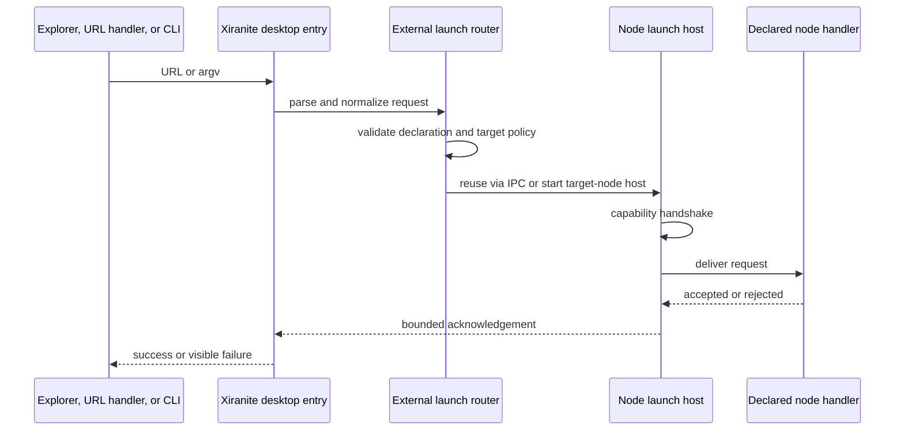

# External Node Launch Design

**Status:** implemented

**Decision record:** [ADR 0054](adr/0054-route-external-node-launches-through-declared-node-hosts.md)

## Purpose

Xiranite needs one dependable way for Windows Explorer, an external application, a shortcut, or a command prompt to request that a specific node open a local target. The first consumer is NeoView's `open` intent for supported media and directories. The design is intentionally general: a node opts in, describes exactly what it can receive, and runs in a complete direct-node desktop host.

This design does not make the workspace an external-launch gateway, does not point Shell keys at versioned Node App artifacts, and does not turn Owithu into a service node. The existing `NeoView` and `OpenInNeeView` keys observed under `HKCU\\Software\\Classes` are external legacy registrations and remain outside Xiranite ownership.

## Goals

- Expose one versioned request model over argv and `xiranite://` URL transport.
- Start or reuse the requested node without loading the workspace or unrelated nodes.
- Require a complete capability-checked node host before an external request can succeed.
- Give each node ownership of its target-to-domain behavior while centralizing process, Shell, and safety concerns.
- Register NeoView only for types it can handle and accurately reconcile managed Windows keys.
- Preserve legacy, user-created, Owithu-created, and third-party registry entries unless the user explicitly changes them.

## Non-goals

- A Windows 11 first-level compact context-menu COM extension. The initial registration is a traditional Shell verb available through "Show more options".
- Automatic replacement, deletion, or inference of pre-existing NeoView/NeeView registrations.
- Generic HTTP, browser URL, relative-path, or arbitrary payload activation in v1.
- Reader multi-tab behavior. NeoView v1 accepts exactly one target per request.
- A reduced-capability node window. Omitting the workspace is not permission to omit a node requirement.

## Ubiquitous Language

The canonical terms are recorded in [CONTEXT.md](../CONTEXT.md): External Node Launch Request, External Launch Declaration, Node Launch Host, and Managed Shell Registration. In particular, an external launch is not "the main application opening a node". The desktop executable is a transport and routing entry point; the selected node owns the accepted intent.

## Request Contract

The platform-neutral contract lives in `@xiranite/contract` and contains serializable data only.

```ts
export interface ExternalNodeLaunchRequest {
  version: 1
  requestId: string
  source: "argv" | "url" | "explorer"
  nodeId: string
  intent: "open" | string
  targets: readonly ExternalLaunchTarget[]
}

export interface ExternalLaunchTarget {
  uri: string // Canonical file: URI after transport parsing.
}

export interface ExternalLaunchDeclaration {
  intents: readonly ExternalLaunchIntentDeclaration[]
  instancePolicy: "reuse" | "new-window"
  requiredHostCapabilities: readonly string[]
}

export interface ExternalLaunchIntentDeclaration {
  id: string
  targetKinds: readonly ("file" | "directory")[]
  maxTargets: number
}
```

The exact TypeScript names may be refined while retaining these ownership and serializability constraints. The declaration is part of node metadata, participates in generated registries, and is the only authority the launcher consults before starting a node. A missing declaration fails before process creation.

### URL transport

The global, user-level protocol accepts this v1 form:

```text
xiranite://launch/<node-id>/<intent>?target=<encoded-file-uri>
```

For example:

```text
xiranite://launch/neoview/open?target=file%3A%2F%2F%2FC%3A%2FBooks%2Fbook.cbz
```

Repeated `target` query parameters represent an ordered batch. The parser accepts only `file:` URIs in v1, including local volumes and valid UNC file URIs. It rejects raw Windows paths, relative paths, `http:`/custom schemes, duplicate or invalid protocol fields, excessive URL/target counts, and targets disallowed by the selected declaration. No node-specific JSON is carried in the public URL.

### argv transport

Windows Explorer does not URI-encode `%1` or `%V`, so it invokes the desktop executable with positional argv instead of trying to compose a URL query:

```text
Xiranite.exe --launch-node neoview --intent open --source explorer -- "%1"
Xiranite.exe --launch-node neoview --intent open --source explorer -- "%V"
```

The command parser accepts only the documented flags and positional paths after `--`. A direct command-line invocation omits `--source` and is labeled `argv`; the registry adapter alone supplies `--source explorer`. The parser bounds public URL size and target count before filesystem work, resolves each path without a shell, and canonicalizes it to the same `file:` URI used by URL transport. Quoting belongs to the registry adapter; no caller or handler concatenates a command string.

## Launch Lifecycle



The entry process may exit successfully only after the node has acknowledged the request. A process spawn alone is not success. Startup and IPC handshakes are bounded; failure shows a native desktop error when no node UI exists, or an actionable in-node error when the target host already exists. Neither path opens a terminal window.

`instancePolicy: "reuse"` means a new request is sent to the active target-node host through IPC. `"new-window"` is reserved for nodes that deliberately require separate instances. The global launcher does not decide how NeoView uses tabs, sessions, folders, or Reader state.

## Complete Node Launch Hosts

A direct node launch host is a desktop run mode that loads one selected node only. It skips workspace composition and unrelated node imports, but it must instantiate every capability in that node's `requiredHostCapabilities`: backend feature slice, native assets, configuration, window controls, diagnostics, lifecycle/recovery, and host APIs. A failed capability handshake fails closed before request acknowledgement.

The existing Node Window is an in-workspace visual form and the existing Node App is a frozen package release. The new host reuses their shared node surface and host contracts where possible, but it is a runtime mode with its own argument, IPC, and capability handshake boundary. It must not depend on a workspace component instance or manufacture a reduced Node App state.

Implementation boundaries:

| Boundary | Responsibility |
| --- | --- |
| `@xiranite/contract` | External request/declaration/result types; no Windows, Wails, or React imports. |
| Desktop launcher adapter | argv/URL parsing, target normalization, request id, bounded process/IPC lifecycle, native diagnostics. |
| Node launch host | direct-node startup, complete capability handshake, host reuse/new-window behavior, request delivery. |
| Node package | serializable declaration and intent handler; owns domain behavior after validation. |
| Shared Shell Integration adapter | managed-registration plans, Windows `reg.exe` application/query/rollback, drift status, and ownership checks. |
| Owithu node | TOML-driven peer UI/CLI over the shared Shell Integration adapter. |

## NeoView Declaration and Handling

NeoView declares a single `open` intent with `targetKinds: ["file", "directory"]`, `maxTargets: 1`, and `instancePolicy: "reuse"`.

The direct NeoView host uses the normal NeoView capability set. After request validation:

- a supported image, archive book, or configured video opens Reader;
- a directory opens Folder;
- a protected Folder tab causes NeoView's existing folder policy to choose a new tab rather than replace protected work;
- an unsupported, missing, or no-longer-readable target is rejected with an actionable diagnostic.

The launcher does not choose Reader sessions, replaceable/protected Folder tabs, or page state. NeoView's handler is the only place allowed to translate `open` into those domain operations.

NeoView's effective Explorer file extensions derive from the existing image/video media-format registry plus the archive-book extension source (`zip`, `cbz`, `rar`, `cbr`, `7z`, `cb7`, `epub`). A media configuration change first persists normally and then reconciles an already-enabled Shell registration. A registry failure never rolls back valid media configuration; it marks the integration `needs-repair` and exposes a retry action.

## Windows Shell Integration

The shared Shell Integration adapter is a Windows platform adapter, not a node. Its typed registration plan supports:

- supported file extensions only, using the correct Windows file-type association location selected by the adapter;
- selected directories and directory-background scopes;
- a user-level global `xiranite://` URL protocol;
- exact argv, icon, label, and scope rendering;
- owner markers, registry status reads, rollback, and drift repair.

NeoView settings own the desired state:

```toml
[nodes.neoview.system_integration]
explorer_open_enabled = false
```

Enabling is opt-in, previews the full plan, and requires confirmation. While enabled, format changes reconcile the desired plan. Disabling removes every managed NeoView file-extension, directory, and directory-background key automatically. The global `xiranite://` protocol is registered separately from this node toggle so disabling NeoView does not break another declared node's URL route.

Initial automatic writes use `HKCU\\Software\\Classes` only. They need no elevation and must not write HKLM/HKCR. Owithu keeps its explicit advanced-hive capability for manual workflows, but the automatic node feature never asks for elevation.

### Ownership and coexistence

Each managed key receives stable ownership values such as:

```text
Xiranite.ManagedBy = xiranite.shell-integration/v1
Xiranite.NodeId = neoview
Xiranite.Intent = open
Xiranite.RegistrationId = xiranite.neoview.open
Xiranite.Fingerprint = <desired-plan-fingerprint>
```

The precise registry value spelling is centralized in the adapter. Status reads the merged HKCR view and compares the expected label, icon, command, scope, and ownership. It does not treat TOML `enabled` as evidence that a key is present.

A marked key that has drifted is repairable. A same-name key without Xiranite's marker is an external conflict: automatic reconcile reports it and never overwrites or deletes it. Disable deletes only keys whose marker matches the registration identity. The observed legacy `NeoView` and `OpenInNeeView` entries are not migrated, overwritten, or deleted automatically; a future explicit migration UI may inspect them and require a second confirmation.

The only compatibility exception is a confirmed NeoView setting change for the known failed Owithu verb: an `HKCU` file-association key named `Xiranite.NeoView.Open` whose default label is exactly `Open with NeoView`, with neither a `command` subkey nor any Xiranite ownership marker. The adapter removes that precise empty key before applying the managed plan. A command, any marker, another hive, directory scope, key name, or label remains an external conflict.

Registration is applied as a transaction-like plan. If a later managed key fails to write, already-created managed keys are removed; if disabling fails after earlier removals, the prior marked keys are restored. All `reg.exe` calls use argument arrays and hidden windows. Commands and labels reject control characters and command/path injection before any write.

## User Experience

NeoView exposes its Explorer integration inside its node configuration UI. It provides the explicit enable toggle, a human-readable preview, current status (`disabled`, `registered`, `needs-repair`, `conflict`, or unavailable), and repair action. The toggle controls only the NeoView Shell verbs.

Windows 11 initial support targets the traditional context menu under "Show more options". The design does not imply that a declarative `shell` verb appears in the first-level compact menu; COM `IExplorerCommand` support requires a separate native design, installer, lifecycle, and verification effort.

## Migration

1. Add external-launch declarations and generate them into the node registry.
2. Create the contract, direct-node host lifecycle, and argv/URL parser with no NeoView registry writes.
3. Extract Owithu's generic quoting/plan/application behavior into the shared Shell adapter and migrate Owithu to consume it.
4. Replace NeoView's private Explorer provider with an external-launch declaration and the settings-backed adapter consumer.
5. Add an opt-in NeoView configuration control; leave existing legacy keys untouched.
6. Once direct launch and Shell integration pass Windows gates, remove only the superseded private provider code and its tests.

No step rebuilds `dist` to pick up NeoView configuration parsing in development; the existing supervisor owns that lifecycle.

## Acceptance Gates

### Pure and package tests

- Contract parser tests cover URL/argv equivalence, path normalization, malformed input, target limits, and declaration rejection.
- Shell-plan tests cover every configured extension, folder/background placeholder substitution, quoting, ownership, drift, rollback, external conflict, and disable-only-owned deletion.
- Owithu tests prove it still previews/registers/unregisters through the extracted shared adapter.
- NeoView tests cover declaration eligibility, dynamic media-format reconciliation, and single-target rejection.

### Windows integration tests

- Use unique temporary HKCU test keys; query the merged HKCR view to verify exact command, icon, label, scope, and owner values.
- Verify registration failure rollback and disable restoration without touching legacy or other-user keys.
- Verify the global URL protocol registration independently from NeoView's toggle.
- Start the real direct-node desktop host with isolated data. A real supported media file must reach Reader; a real directory must reach Folder; a missing capability or invalid target must produce a failed acknowledgement and visible diagnostic.

### Frontend and package gates

- Use Vitest Browser Mode for the NeoView configuration toggle, preview, status, repair, and disabled/failed states.
- Run targeted unit/package tests with `--maxWorkers=1`, then the affected typecheck/build serially.
- Run `bun run check:source-size`, `git diff --check`, and targeted Windows smoke evidence before release. Do not access the default Xiranite database during tests.
