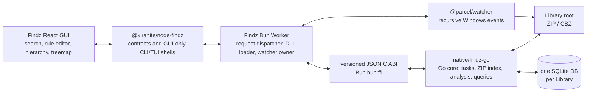
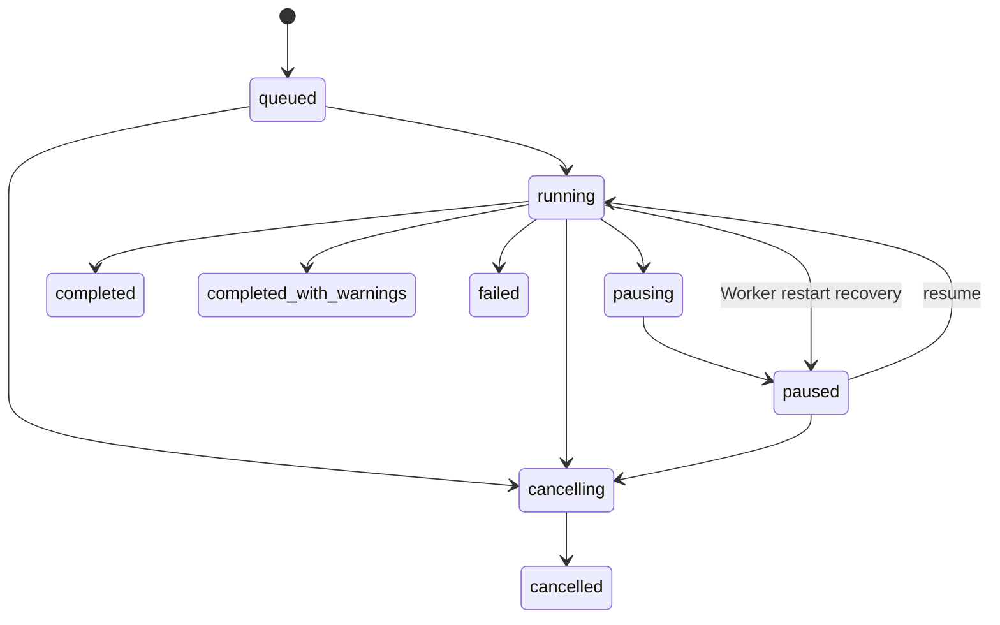

# Findz v2 design

**Status:** implemented and verified on Windows, 2026-07-27

**Audience:** Findz maintainers and the Xiranite node/runtime owners
**Decision record:** [ADR 0053](adr/0053-build-findz-as-a-go-index-core-with-a-bun-worker-boundary.md)

## Problem and scope

Findz indexes a large local library whose meaningful units are ZIP and CBZ archives. It must let a user find archives and members quickly, incrementally keep the index current, and manually inspect image headers when they need to identify unusually large images before choosing a separate recompression workflow.

Version 2 replaces the current command-oriented implementation. The `findz` node id, package identity, and node registration remain stable; its old query syntax, card state, CLI, and TUI behavior do not.

### Goals

- Scan one configured library root for `.zip` and `.cbz` archives, index their ZIP central directories, and update that index after file-system changes.
- Keep ordinary scans cheap: base scanning reads directory and ZIP metadata only. It never reads or decompresses image members.
- Provide a manual, resumable image-analysis task that reads bounded member prefixes and records dimensions, actual format, and size-density data.
- Support immediate text search and multi-condition filtering with the existing rule-tree editor. The GUI must never require users to write SQL.
- Present the library as a WizTree-style upper hierarchy/table plus a lower rectangle treemap. A treemap is a space-filling rectangle visualization, not a conventional tree widget.
- Put all archive interpretation, index mutation, analysis semantics, anomaly calculation, and task state in one Go core so the GUI, future CLI shell, and future TUI shell share one contract.

### Non-goals for v2

- Docker, a separate search server, Recoll, and a machine-wide desktop-search database.
- RAR, 7z, TAR, password entry, decryption, recompression, or automatic file replacement.
- Full image decoding, thumbnails, perceptual duplicate detection, and JPEG XL support. JPEG XL is explicitly recorded as `unsupported_format`.
- Automatically recursing into ZIP members that are themselves ZIP files. They are detected and shown as nested archives, but v2 indexes only the configured library's top-level ZIP/CBZ files. This keeps incremental work bounded and avoids materializing nested members during a normal scan.
- Compatibility migration for the prior Findz cards. An old card opens as a blank v2 library state rather than attempting to reinterpret SQL-like filters or old result blobs.

## Domain language

| Term | Meaning |
| --- | --- |
| **Library** | One configured filesystem root and its own Findz SQLite database. |
| **Archive** | One top-level ZIP or CBZ file under a Library. |
| **Member** | A central-directory entry in an Archive. A member may be an image candidate or a nested ZIP candidate. |
| **Incremental Change** | A created, updated, deleted, or renamed filesystem path received from the watcher and coalesced before index mutation. |
| **Image Analysis** | The explicit manual task that reads a candidate Member's bounded prefix and extracts header-level metadata. |
| **Analysis Revision** | The immutable parser/budget/anomaly-policy revision attached to every analysis result. Changing it invalidates derived analysis, not base archive metadata. |
| **Anomaly** | A derived reason that an analyzed image is unusually large for its actual format and pixel cohort, or has a diagnostic mismatch. It is not a claim that recompression is lossless or safe. |
| **Treemap Projection** | A queried, aggregated hierarchy plus a selected area metric and independent color metric used to lay out rectangles. |
| **Task** | A persisted, cancellable lifecycle for scan, reconciliation, or manual image analysis. |

## Architecture and ownership



### Boundaries

- `native/findz-go` is an independent Go module with its own `go.mod`. It produces a Windows `c-shared` DLL; it is not a Rust crate and does not join `native/Cargo.toml`.
- The Go core owns the schema, ZIP behavior, image-header readers, query compiler, task state machine, anomaly calculations, and all database transactions. It exposes no React, Bun, Wails, or SQLite-driver types.
- The Bun Worker owns exactly one loaded DLL client, performs the ABI/capability handshake, serializes native calls, translates Node-side messages to JSON requests, and owns the `@parcel/watcher` subscription. Long native work is always started as a native Task so an FFI call itself remains short.
- The node package owns Xiranite registration, request validation, worker lifecycle, and minimal CLI/TUI registration. CLI/TUI report that Findz is GUI-only; they do not recreate the removed interface.
- The React GUI owns only view state, interaction, and mapping the existing `RuleTreeEditor` output to the Findz query request. It never builds SQL or opens archives.
- Native DLL packaging follows the existing `@xiranite/native-loader` extraction and hash-verification model. Development artifacts live under `native/artifacts/<platform>-<arch>`; packaged assets are listed in the native manifest.

## Native dependencies

The implementation uses maintained dependencies behind small adapters rather than reimplementing archive and metadata primitives.

| Dependency | Use | License and cost boundary |
| --- | --- | --- |
| [`laktak/zfind`](https://github.com/laktak/zfind) | Reuse maintained Go traversal/filter primitives as a module; do not copy its source or shell out to its CLI. | MIT. Its SQL-like CLI language is not exposed as a user contract. The core keeps its own typed query AST and ZIP-only policy. |
| Go `archive/zip` | ZIP/CBZ central-directory reading and member streams. | Standard library; no hand-written ZIP parser and no non-ZIP archive codec is linked. |
| [`mattn/go-sqlite3`](https://github.com/mattn/go-sqlite3) with `database/sql` | Per-library durable index. | MIT and CGO-compatible with the selected `c-shared` DLL. No ORM is introduced. |
| [`bep/imagemeta`](https://github.com/bep/imagemeta) | Supplemental metadata only where its header/EXIF facilities apply. | MIT. It does not justify a full image decoder or unbounded reads. |
| Header-only format adapters | Dimensions and actual-format detection for JPEG, PNG, GIF, WebP, AVIF, and HEIF. | Each adapter must satisfy the prefix budget below. A format lacking a compliant adapter is persisted as `unsupported_format`, never guessed from its extension. |
| [`webtreemap-cdt@3.2.1`](https://github.com/paulirish/webtreemap-cdt) | Browser-side rectangle layout and accessible treemap interaction. | Apache-2.0; npm reports a 57,692-byte unpacked package. It is isolated behind a Findz adapter and styled only with existing shadcn/Tailwind tokens. |

Upstream license and activity were checked with `gh` on 2026-07-27 for zfind, imagemeta, and go-sqlite3. Exact Go module versions and checksums are pinned in `native/findz-go/go.mod` and `go.sum` when implementation begins; no fork or Git-source dependency is permitted.

## Persistence model

Each Library receives one database at:

```text
%LOCALAPPDATA%/Xiranite/findz/indexes/<library-id>.sqlite
```

The database is local Findz state, not `xiranite.db`, and it does not store image pixels or archive copies.

| Table | Essential data | Ownership/invalidation |
| --- | --- | --- |
| `schema_migrations` | Applied schema versions. | Go core only. |
| `library` | Root path, library id, scan policy, watcher health, active analysis revision. | One row per database. Changing root or ZIP policy requires reconciliation. |
| `archive` | Normalized relative path, filesystem identity, size, mtime, scan state, ZIP summary, and error code. | A changed source fingerprint replaces its descendants atomically. |
| `archive_member` | Member path, nesting depth, CRC, compressed/uncompressed size, ZIP timestamps, extension, and image/nested candidate flags. | Rebuilt only with its Archive. Base scan fills this table without opening member payloads. |
| `analysis_run` | Revision, parser/budget policy, start/end time, and summary. | Immutable audit record for an explicit manual analysis request. |
| `image_metadata` | Actual format, width, height, pixels, aspect ratio, compressed/uncompressed member size, animation, extension mismatch, status, and error code. | Valid only for its Archive source fingerprint and Analysis Revision. |
| `task` and `analysis_queue` | Persisted task lifecycle, progress counters, selected scope, and queued archive/member work. | A `running` task is recovered as `paused` after a Worker restart. Only one image-analysis Task may be active globally. |
| `anomaly` | Revisioned anomaly kind, cohort, score, baseline, and estimated-savings estimate. | Deleted and recomputed whenever its underlying image metadata or analysis policy changes. |

The primary query indexes are `(archive.library_id, archive.relative_path)`, `(archive.library_id, archive.scan_state)`, `(archive_member.archive_id, archive_member.member_path)`, and revision-qualified image/anomaly indexes used by filters and projections. Result ordering always includes a stable archive/member id tie-breaker so pagination cannot duplicate or skip records.

### Source identity and invalidation

An Archive source fingerprint is the normalized path plus Windows filesystem identity when available, file size, and mtime with nanosecond precision. A watcher event or reconciliation stats the path before deciding whether to skip it. Rename is modeled as delete-plus-upsert unless the filesystem identity proves it is the same file.

- **Created or changed archive:** transactionally replace the Archive, Members, invalid image metadata, and anomalies after reading its central directory.
- **Deleted archive:** delete the Archive and all descendants.
- **Unchanged archive:** skip ZIP work during normal incremental reconciliation.
- **Explicit verify unchanged archives:** compare a lightweight central-directory fingerprint to catch the rare same-size/same-mtime replacement without reading image payloads.
- **Changed analysis revision:** preserve Archive and Member rows; mark only analysis and anomaly data stale, then require a new manual analysis task.
- **Watcher failure or overflow:** mark the Library `watcher_degraded`, surface it in the GUI, and schedule a reconciliation. No event is silently treated as an indexed change.

## Scan, ZIP, and watcher behavior

The initial scan subscribes before walking the root. Events arriving while the snapshot is in progress are queued, then coalesced and applied after the snapshot commits, eliminating the watch-start blind window. Later events are coalesced by normalized path over a short quiet window and retried only after file size and mtime have stabilized.

The base scan accepts case-insensitive `.zip` and `.cbz` filenames, then validates the ZIP central directory rather than trusting extension alone. It records file and member metadata from headers only. ZIP archives with no image-like members remain useful search results.

| Situation | Indexed result | Task outcome |
| --- | --- | --- |
| Valid ZIP/CBZ | Archive and central-directory Members are committed. | `completed` or `completed_with_warnings`. |
| Corrupt or truncated ZIP | Archive row with `corrupt_archive`; no partial Member set is committed. | Warning; other archives continue. |
| Encrypted ZIP/member | Archive or Member is marked `encrypted_archive`/`encrypted_member`. No password prompt or decryption. | Warning; analysis skips it. |
| Nested ZIP member | Member is marked `nested_archive`; contents are not recursively indexed. | Informational, not an error. |
| Unsafe member path or configured safety limit exceeded | Archive is marked with a precise limit/path error. | Warning; no extraction occurs. |
| Non-ZIP file with ZIP-looking extension | Archive row is marked `unsupported_archive`. | Warning; other files continue. |

No member is extracted to disk. Member payloads are only streamed by a manual analysis task. The core applies configurable entry-count and path-length safety limits and records the exact exceeded limit; it does not silently truncate a successful archive.

## Image analysis and anomaly policy

Image analysis is intentionally a user-started operation. The GUI exposes its own progress, pause, resume, cancel, and per-result status. A selected archive/member set is snapshotted into `analysis_queue`; changing the visible filter later does not alter a running Task.

### Metadata contract

For every attempted image candidate, record:

- extension and detected **actual format**;
- width, height, `pixels = width * height`, and aspect ratio;
- compressed and uncompressed ZIP-member sizes;
- bytes per megapixel based on compressed member bytes;
- animation indication and frame count when the format adapter can obtain it without a full decode;
- extension mismatch, unsupported format, budget exceeded, corruption, encryption, or parser failure.

The extension is only a candidate hint. Cohorts and anomaly rules group by actual format, so a `.avif` member that is actually another format is visible and never distorts the AVIF baseline.

### I/O budget and concurrency

The metadata path uses header/config APIs and a bounded forward-seeking adapter over a ZIP member stream. It must not decode pixels, materialize the member, or implement a new image parser.

| Actual format family | Maximum bytes read per Member | Result after limit |
| --- | ---: | --- |
| JPEG, PNG, GIF, WebP | 512 KiB | `metadata_budget_exceeded` |
| AVIF, HEIF | 4 MiB | `metadata_budget_exceeded` |
| JPEG XL | 0 | `unsupported_format` |

A selected `metadata_budget_exceeded` result may be retried by an explicit **deep retry** command. The retry is restricted to its selected Member ids and increases the total budget to 8 MiB for JPEG, PNG, GIF, and WebP or 16 MiB for AVIF and HEIF. The adapter chooses that budget from the detected header signature after the initial 64-byte sniff, rather than trusting a misleading extension. Deep retry is never part of base scans or automatic watcher work. The core runs at most one image-analysis task across all open Libraries and applies bounded worker concurrency so file handles, decompression, and CPU use remain controlled.

The implementation benchmark gate is evaluated against the same durable-index control path, not against a bare ZIP reader that performs no persistence:

- base scan control-path time must add no more than 5% over the same durable-index benchmark with image analysis disabled; the bare central-directory loop is reported only as a reference;
- a supported metadata adapter must add no more than 20% over reading the same bounded ZIP prefix without parsing;
- benchmark reports include cold and warmed runs, archive/member counts, bytes read, skipped/budget-exceeded counts, and concurrency.

### Anomaly calculation

Anomaly detection is advisory and revisioned. It does not invoke an encoder or make any quality judgement. For a cohort of the same actual format and pixel bucket, Findz calculates the median and median absolute deviation (MAD) of compressed bytes and bytes per megapixel. A cohort smaller than the policy minimum is marked `insufficient_cohort` and produces no statistical alert.

The displayed reasons can include:

- `bytes_per_megapixel_high`: robust MAD score shows unusually high compression density for comparable images;
- `member_size_high`: member size is a robust outlier within its actual-format/pixel cohort;
- `extension_mismatch`, `unsupported_format`, and `metadata_budget_exceeded`: diagnostic states, visually distinct from size anomalies.

Estimated savings is `max(0, member_bytes - cohort_median_bytes_per_megapixel * pixels / 1_000_000)`. It is deliberately labelled an estimate, never a promised recompression output. Color expresses anomaly severity independently of treemap area.

## FFI protocol and task lifecycle

The DLL uses a narrow C ABI and versioned UTF-8 JSON envelopes. The Worker refuses to load a DLL whose ABI version or declared capability set is incompatible.

```c
uint32_t findz_abi_version(void);
uint8_t* findz_api_info(size_t* response_len);
uint8_t* findz_call(const uint8_t* request_json, size_t request_len, size_t* response_len);
void findz_free(uint8_t* response);
```

`findz_api_info` returns the ABI version, core version, capability flags, and supported request schema versions. `findz_call` never returns a Go panic over FFI: it returns either `{ "ok": true, "result": ... }` or `{ "ok": false, "error": { "code", "message", "retryable", "details" } }`. Every non-null response buffer is released exactly once with `findz_free` in a Worker `finally` block.

Requests have `requestVersion`, `requestId`, `method`, and `params`. Responses echo `requestId`. Mutating methods are idempotency-aware through the request id or a supplied client operation id. Queries include `page: { cursor, limit }` and return `{ items, nextCursor, total? }`; `limit` is bounded by the core. There is no free-form SQL endpoint.

Representative methods are `library.open`, `library.close`, `scan.start`, `scan.reconcile`, `watcher.apply_changes`, `watcher.set_health`, `query.archives`, `query.members`, `projection.treemap`, `analysis.start`, `task.pause`, `task.resume`, `task.cancel`, `task.get`, and `export.rows`.



Only a manual image-analysis task is globally exclusive. Scan and reconciliation tasks are serialized per Library and report that they are waiting if the relevant library is busy. `cancel` leaves already committed archive-level or member-level transactions intact and clearly reports the final committed counters.

## GUI contract

The first screen is the working library, not a landing page. Its layout has an upper results region and a lower treemap region, sized so both remain visible on common desktop displays. Sections are workspace surfaces, not nested decorative cards.

### Search and filtering

- The text box performs immediate, debounced matching across archive relative path and member path/name.
- Advanced conditions reuse `src/nodes/shared/RuleTreeEditor.tsx` and its existing `react-querybuilder` integration. The Findz adapter supplies typed fields such as archive size, member size, extension, actual format, dimensions, pixels, bytes per megapixel, analysis status, anomaly kind, anomaly score, and estimated savings.
- The serialized rule tree is sent as JSON. Go validates a whitelist of fields/operators and compiles parameterized SQLite predicates. Unsupported fields or invalid values return a field-scoped validation error; the UI does not fall back to raw SQL.
- Text and rule filters, sort, selected metric, and page cursor form one query state. Changing any of them resets the cursor and cancels obsolete in-flight GUI requests.

### Table and treemap synchronization

The upper surface is a hierarchy/table, similar to WizTree: folders and archive groups can expand for scanning, while rows are sortable by the active metric. It is a table with optional hierarchy, not the treemap.

The lower surface uses `webtreemap-cdt` through a thin Findz adapter. Its rectangles are aggregated archive/folder nodes from the current query, not every member DOM node. It supports zooming and keyboard focus.

- A table selection focuses and outlines the matching treemap rectangle, preserving the current treemap zoom when possible.
- A treemap click selects and scrolls the matching table row; double activation drills into that aggregate and updates the query breadcrumb.
- Search, rule filters, and drilldown update both surfaces from the same paginated query/projection snapshot.
- Area metric can be archive size, total image size, average image size, average or median bytes per megapixel, anomaly count/rate, or estimated savings.
- Color is an independent anomaly scale, including a neutral state for unanalysed data. Color never changes rectangle area.

Exports operate on the current filtered query or explicit selection and produce CSV or JSON data only. They do not export archive contents, execute recompression, or mutate the Library.

## Migration and deletion scope

Implementation removes and replaces the old Findz GUI, `core.ts`, platform adapter, SQL/JSON filter parser, hand-written archive parsing, and their compatibility tests. Keep the node registration, `findz` identity, package shell, and minimal CLI/TUI registrations.

Do not change MVZ's separate archive parser, historical global planning documents, or unrelated node state. Do not migrate old Findz settings: old cards retain their host state but the v2 view starts with no selected Library. The first selected root creates a new per-library database.

## Acceptance evidence

Windows verification completed on 2026-07-27:

1. Go unit/integration tests cover valid ZIP/CBZ indexing, duplicate paths, corrupted archives, encrypted and nested members, unsupported and unsafe archives, source-fingerprint invalidation, schema migration, anomaly cohorts, task recovery, request-id idempotency, deep retry, and every FFI error envelope.
2. `packages/findz-native` DLL smoke tests load both development and embedded artifacts, complete the ABI handshake, create a temporary Library database, scan a fixture, paginate a query, and release native response buffers.
3. Bun tests cover Worker routing, pointer cleanup, watcher coalescing/degraded recovery, cancellation hand-off, and Worker failure cleanup without accessing the user's `xiranite.db`.
4. Vitest Browser Mode covers rule-tree field mapping, table/treemap synchronization, sort and metric changes, manual analysis controls, deep retry, pagination, empty/error/unsupported states, and Chinese localization.
5. The representative ZIP corpus benchmark passes the header-metadata gate. Its corpus, commands, bytes-read data, and paired run results are recorded in [Findz v2 benchmark evidence](findz-v2-benchmarks.md). Any dependency or policy that later misses a gate requires a focused ADR update before it becomes the default path.
