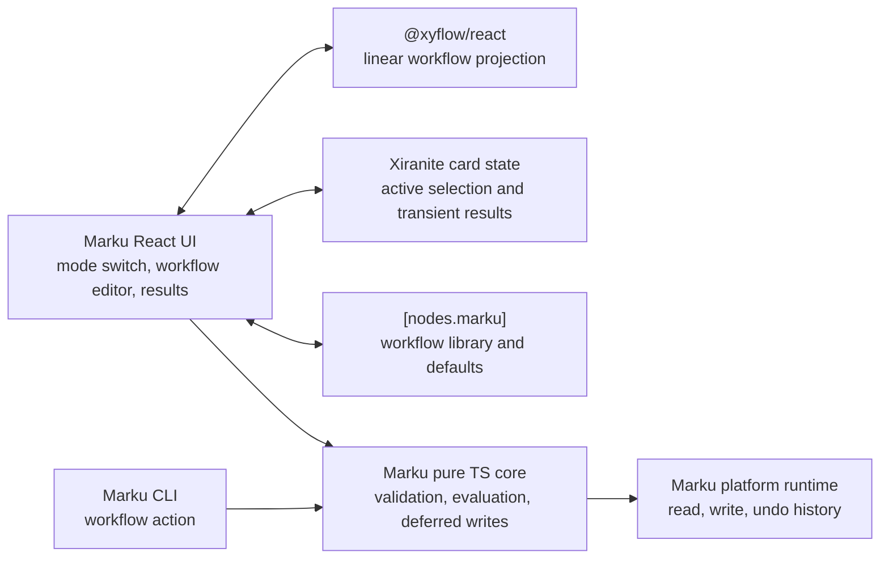

# Marku workflow modes design

**Status:** approved design, implementation pending, 2026-07-28

**Audience:** Marku maintainers and Xiranite node/runtime owners
**Decision record:** [ADR 0056](adr/0056-model-marku-workflows-as-ordered-pipelines.md)

## Problem and scope

Marku currently applies one selected Markdown module to editor text or a set of
Markdown files. Multi-stage cleanup requires manual repetition, and neither a
module configuration nor an intermediate output is retained as a reusable
pipeline.

Marku will provide two persistent modes:

- **Normal mode** retains the current single-module input, preview, apply,
  diff, history, and undo behavior.
- **Workflow mode** owns a named reusable, linear sequence of configured
  Marku modules. Each step receives the preceding step's text output.

The node id, package identity, existing module ids, normal-mode input shape,
diff format, undo history, and `remark` AST boundary remain stable.

### Goals

- Run every current Marku text module as a workflow step.
- Snapshot each step's configuration so saved workflows stay reproducible
  after module defaults change.
- Use the existing maintained `@xyflow/react` 12.11.2 dependency. Do not add
  another graph package or hand-write a graph canvas.
- Persist named workflow definitions in Marku node configuration. Persist the
  active mode, selected workflow and step, input, viewport, and run results in
  component card state.
- Process editor text once or process selected Markdown files independently.
  No intermediate output reaches disk.
- Keep execution pure TypeScript so GUI and CLI call the same contract.

### Non-goals

- Branches, joins, loops, fan-in/fan-out, or general graph scheduling.
- Non-text steps, scripts, external processes, and cross-file aggregation.
- Storing React Flow edges, node positions, viewport, logs, or intermediate
  text in the reusable workflow configuration.
- Replacing the established Normal-mode UI, history, or undo records.
- A workflow editing interface in the current Marku TUI.

## Domain language

| Term | Meaning |
| --- | --- |
| **Workflow** | A named ordered definition of one or more Workflow Steps. It is configuration, not a run result. |
| **Workflow Step** | A stable step id, a Marku module id, and a deep configuration snapshot. |
| **Workflow run** | One execution of one Workflow against editor text or independently processed Markdown files. |
| **Source run** | One editor input or one file processed within a Workflow run. |
| **Step result** | The input text, output text, changed state, and optional error for a step applied to a source. |
| **Evaluation phase** | The in-memory sequence that produces all final outputs without writing files. |
| **Write phase** | The phase after complete evaluation that records undo data and writes changed final file outputs. |
| **Workflow canvas** | A React Flow projection of the ordered steps. It is never a workflow definition. |

## Architecture and ownership



| Boundary | Owner and constraint |
| --- | --- |
| `packages/nodes/marku/src/workflow.ts` | Pure types, normalization, linear evaluation, and result construction. No React, React Flow, host, or filesystem imports. |
| `packages/nodes/marku/src/core.ts` | Public Marku action boundary, source discovery, deferred writes, existing history, and undo integration. |
| `src/nodes/marku/workflow-state.ts` | Pure create/duplicate/rename/delete/select/add/remove/copy/move transitions. No React Flow import. |
| `src/nodes/marku/WorkflowEditor.tsx` | React Flow adapter for visual order, selection, and reorder intent only. |
| `src/nodes/marku/WorkflowInspector.tsx` | Selected step's module and JSON configuration editor. |
| `src/nodes/marku/WorkflowResults.tsx` | Source/step result inspection and copy controls. It cannot execute transforms. |
| `src/nodes/marku/Component.tsx` | Thin card orchestration. The current 605-line component must be split, not enlarged. |

## Core contract

The pure core introduces types equivalent to:

```ts
export interface MarkuWorkflowStep {
  id: string
  module: MarkuModuleId
  config: Record<string, unknown>
}

export interface MarkuWorkflow {
  id: string
  name: string
  steps: MarkuWorkflowStep[]
}

export interface MarkuWorkflowLibrary {
  schemaVersion: 1
  workflows: MarkuWorkflow[]
}

export interface MarkuWorkflowStepResult {
  stepId: string
  module: MarkuModuleId
  inputText: string
  outputText: string
  changed: boolean
}

export interface MarkuWorkflowSourceResult {
  sourceId: string
  sourceLabel: string
  originalText: string
  outputText: string
  steps: MarkuWorkflowStepResult[]
}
```

`normalizeMarkuWorkflow()` deep-clones plain JSON-compatible configuration,
trims names, guarantees unique stable ids, discards malformed saved data, and
rejects an empty workflow at execution. It does not mutate card state or a
saved definition. An unknown module id is a validation failure, never a
silently skipped step.

The core adds a `workflow` action accepting a complete workflow or a resolved
named workflow. Existing `run`, `text`, `history`, and `undo` actions remain
unchanged. Workflow data extends `MarkuData`; it does not change normal-mode
result fields.

## Execution semantics

### Sources and ordering

The existing input precedence remains:

1. Nonempty editor text is one source named `input.md`; path inputs are not
   read in that invocation.
2. Otherwise Marku discovers Markdown files from `paths` and `recursive`.
   Each discovered file is a separate Source run, never concatenated.
3. Missing editor text and Markdown files is a validation failure.

For each source, Marku applies step one to original text, then passes that
output to step two, and continues in declaration order. Sources execute
sequentially for bounded memory and deterministic progress. The workflow is
reused for each source, but sources never feed one another.

An exception, invalid configuration, or unsupported module stops the current
source and the entire workflow immediately. Later steps and sources do not
run. Prior Step Results are retained so the UI can inspect the failure point
and the preceding output.

### Evaluation, write-back, and undo

Evaluation never calls `writeText`. With `dryRun: true`, Marku returns source
results and final per-file diffs without an undo record. With `dryRun: false`,
Marku evaluates every source successfully before it creates an undo record
from original content and writes changed final outputs.

Arbitrary paths cannot form an atomic filesystem transaction. A write failure
after write-back begins returns the exact partial-write error and preserves the
undo record, so the existing undo path can restore all captured originals.
Marku never retries or silently rolls back a partial write.

## Modes and GUI behavior

### Normal mode

Normal mode preserves the current module grid/select, module JSON field,
input controls, preview/apply confirmation, results tabs, history, and undo.
It is the default for old card state. Switching back from Workflow mode never
overwrites workflow definitions or the active workflow.

### Entering workflow mode

When there is no active workflow, switching from Normal to Workflow creates a
one-step draft from the currently selected module and parsed normal-mode JSON
configuration. It is not saved until named or explicitly saved. This lets an
existing single operation become the start of a pipeline without re-entry.

### Named workflow library

Workflow mode must support:

- creating, renaming, duplicating, and deleting workflows;
- adding, deleting, copying, and moving steps;
- selecting a step and independently changing its module or JSON snapshot;
- previewing, then using the existing confirmed final write-back action; and
- viewing/copying every selected source-step input and output plus final diff.

Semantic edits persist the normalized library through the shared configuration
service. JSON text is debounced and validated before persistence. Invalid JSON
stays as an unsaved card-local draft and cannot overwrite the last valid step
snapshot.

### React Flow editor

`WorkflowEditor.tsx` uses `@xyflow/react` with one custom Step Node. A node
shows module identity, compact configuration status, and input/output handles.
Edges are derived from `steps`: `step[n] -> step[n + 1]`.

The canvas has no executable `onConnect` path. Branches, merges, cycles, and
orphan nodes are rejected at the interaction boundary. Horizontal node drag
requests an ordered-step move through pure state transitions; vertical layout
is snapped for readability. React Flow viewport and selection may persist in
card state, but graph positions and edges do not enter the workflow library.
Keyboard-accessible list controls mirror every graph edit.

React Flow and its stylesheet load only after Workflow mode is activated, so
Normal mode does not load the graph editor.

## Persistence and compatibility

`[nodes.marku]` stores a `workflowLibrary` field containing the versioned
`MarkuWorkflowLibrary`. Existing Normal-mode configuration fields remain at
their existing keys.

| Card field | Ownership |
| --- | --- |
| `mode` (`normal` or `workflow`) | Current component state; defaults to `normal`. |
| `activeWorkflowId` | Current component state; references the configured library. |
| `selectedWorkflowStepId` | Current component state for canvas and inspector selection. |
| `workflowViewport` | Current component state; React Flow camera only. |
| `workflowRun` | Current component state; transient Source and Step Results. |
| `workflowLibrary` | Reusable node configuration, never a run result. |

Old cards without workflow fields load in Normal mode with an empty library.
Unknown future library fields are ignored during normalization. Deleting an
active workflow clears the reference and creates a one-step workflow draft,
never a dangling selection.

## CLI and TUI

CLI gains a workflow action that accepts a complete JSON workflow or resolves
a named workflow from Marku node configuration. Its JSON output uses the same
Source and Step Results as GUI requests and never serializes React Flow data.

The current TUI remains single-step and must not suggest that it edits
workflows. A later TUI slice may select and run a saved workflow through the
same pure core contract.

## Implementation and verification

| Area | Planned file and evidence |
| --- | --- |
| Domain | `workflow.ts` unit tests cover normalization, sequential output, snapshot isolation, failure stop, and no write before complete success. |
| Runtime | Core fixture tests cover multi-file final write and existing undo after a successful workflow. |
| Config | Browser Mode lifecycle test edits, saves, remounts, and rehydrates the workflow library. |
| React Flow | Browser Mode mounts Workflow mode, asserts graph nodes/edges, selects a step, and reorders it. |
| Mode migration | Browser Mode switches Normal to Workflow and observes the one-step current module/config draft. |
| CLI | Focused JSON CLI test runs a supplied workflow and asserts Step Results. |
| Compatibility | Existing Marku normal-mode tests remain green without changing normal input assertions. |
| Structure | Source-size, package build, and type checks show all new modules remain below the repository limits. |

Normal Vitest covers pure contracts. React interaction, layout, and graph
behavior use Vitest Browser Mode. On Windows, build, typecheck, normal Vitest,
Browser Mode, and native work run strictly serially with one worker.
