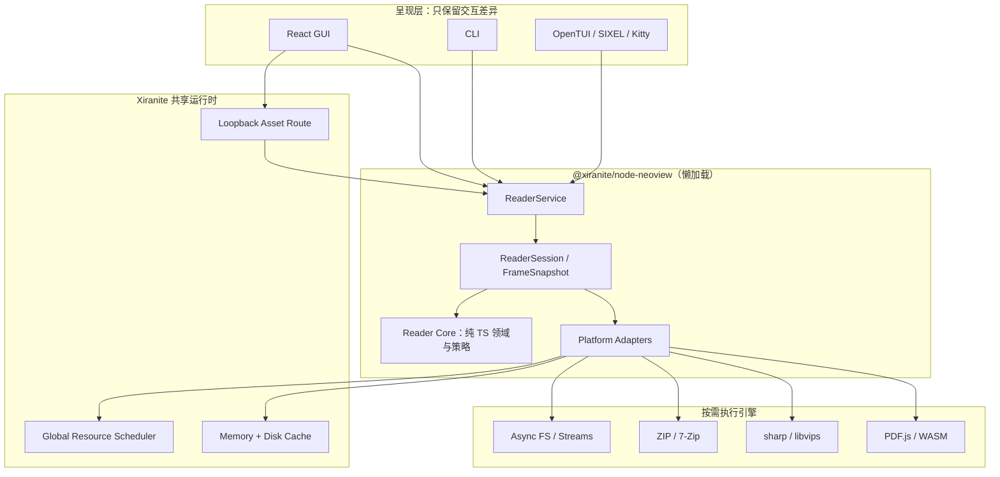
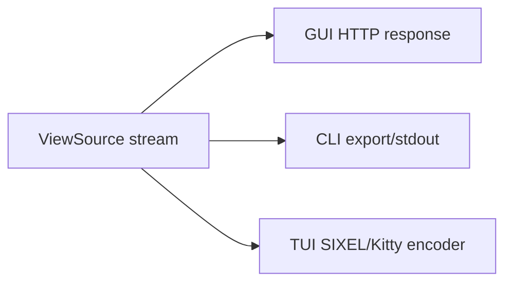
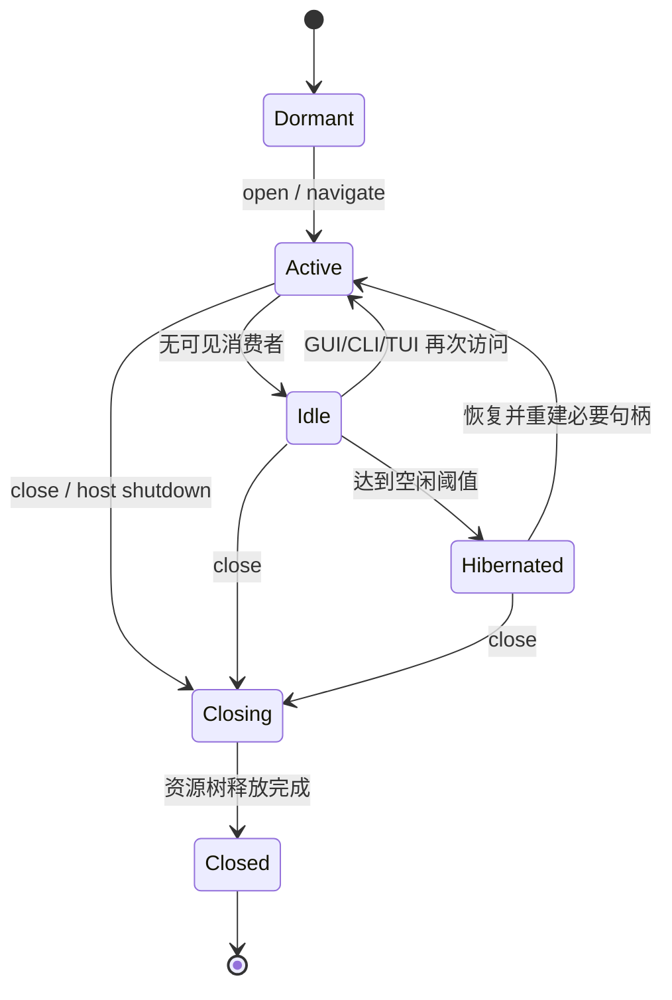

# NeoView 迁移到 Xiranite 的架构设计

> 状态：迁移实施基线（2026-07-14）
>
> 源项目：`D:/1VSCODE/Projects/ImageAll/NeeWaifu/neoview/neoview-tauri`
>
> 参考实现：OpenComic、`neoview/ref/NeeView`
>
> 迁移工具：`packages/tauri-migrate`

## 1. 结论

NeoView 适合迁入 Xiranite，但不能把它当作 319 个 Tauri command 组成的普通轻节点逐个翻译。它应成为一个**懒激活、可休眠、拥有长生命周期 ReaderSession 的重型节点**。

推荐的核心取舍是：

- TypeScript 负责领域模型、会话、调度、缓存策略、契约和 GUI/CLI/TUI 共用逻辑；
- 图片解码、缩放、压缩算法仍交给 `sharp/libvips`、Node zlib、7-Zip、PDF.js 等成熟 native/WASM/系统实现，不用纯 JavaScript 重写底层算法；
- 控制面走 Xiranite 节点操作，图片数据面走 loopback HTTP 流，不走 Base64 或大块 JSON IPC；
- 沿用 Xiranite 已有前后端动态导入，不再发明另一套懒加载；Reader 额外实现资源释放、空闲休眠和全局资源配额；
- GUI、CLI、TUI 共用一套 ReaderService 和平台适配器，只保留呈现层差异；
- 不迁移 NeoView 中新旧并存的多版本系统，在每个阶段完成后立即删除被替代链路。

在这些条件成立时，迁移后的阅读性能不应明显下降，并有机会因减少 IPC 复制、重复解码、重复缓存和无效前端更新而超过当前 NeoView。性能结论必须由第 19 节的基准门槛验证，不能只凭技术栈推断。

## 2. 目标与非目标

### 2.1 目标

- 保住或提升首屏、翻页、连续滚动、缩略图和大压缩包阅读性能；
- 保留当前 NeoView 的全部用户可见功能和可迁移数据，不以架构重写为理由删减能力；
- 兼容导入现有 NeoView 设置、完整导出文件和备份数据，迁移后统一写入 Xiranite TOML；
- 接入 Xiranite 节点系统，但未使用 Reader 时不加载其 UI、核心实现和 native 依赖；
- 支持多个工具同时运行，Reader 不得独占 CPU、I/O、Worker 或内存；
- 完成前后端架构重构，形成唯一资源主链和明确的资源所有权；
- 用高性能 TS 生态适配器替代 NeoView 自维护 Rust 业务后端；
- GUI、CLI、TUI 共用领域逻辑、归档索引、缓存和调度能力；
- 为后续远程书库、插件式格式支持和独立 Reader 窗口保留扩展点。

### 2.2 非目标

- 不把 319 个 Tauri command 一比一翻译为 319 个节点操作；
- 不用纯 TS/JS 重新实现 JPEG、AVIF、RAR、7z 等编解码器；
- 不在第一阶段迁移文件删除、重命名、资源管理器等与阅读热路径无关的能力；
- 不在 Reader 内建立绕过 Xiranite 的私有全局线程池和任务系统；
- 不为了兼容旧代码长期保留两套页面、缩略图、文件系统或缓存主链；
- 不复制 OpenComic 的 GPL 源码或整体模块实现。

## 3. 已确认的迁移清单

按 `packages/tauri-migrate/README.md` 生成基线：

```powershell
bun run migrate:tauri -- generate `
  "D:\1VSCODE\Projects\ImageAll\NeeWaifu\neoview\neoview-tauri" `
  --out "artifacts\tauri-migration\neoview-baseline" `
  --config "migration\neoview\tauri-migration.json"
```

当前清单为：

| 项目 | 数量 |
| --- | ---: |
| Rust 文件 | 185 |
| Tauri command 声明 / 唯一名称 | 319 / 318 |
| 已注册声明 / 唯一名称 | 312 / 311 |
| 原始 AST `typescript-portable` / `native-required` / `manual-review` | 296 / 16 / 7 |
| 人工复核后 `typescript-portable` / `native-required` / `manual-review` | 309 / 10 / 0 |

原始 `native-required` 主要集中在视频/FFmpeg、打开系统程序、Windows 元数据和目录能力，并不证明 Reader 核心必须保留 Rust。人工复核已通过 `migration/neoview/tauri-migration.json` 将文件系统、哈希、AVIF、archive image 和超分保存路径归为 TS portable；剩余 10 个 native 声明仅代表 FFmpeg 或系统 shell capability，仍由 TS platform adapter 调用，不保留 Rust Reader 后端。清单只提供 AST 证据和迁移风险，不决定最终 API 粒度。

319 个命令暴露了当前边界过碎和版本并存的问题。目标公开接口应收敛到约 10～15 个稳定的 reader 操作，其余成为包内服务调用。

### 3.1 AST 迁移工具是开工第一步

真正开始迁移时，第一项动作必须是运行 `packages/tauri-migrate`，而不是先手工创建 React 组件或凭印象重写 Rust。当前已经生成过 `artifacts/tauri-migration/neoview-baseline`，但正式实现前仍要对冻结的 NeoView 源版本重新生成并审计：

```powershell
bun run migrate:tauri -- generate `
  "D:\1VSCODE\Projects\ImageAll\NeeWaifu\neoview\neoview-tauri" `
  --out "artifacts\tauri-migration\neoview-baseline" `
  --config "migration\neoview\tauri-migration.json" `
  --force
```

使用 `--force` 前必须确认目标确实是工具生成目录。Phase 0 同时记录源仓库 commit、dirty diff hash、迁移工具版本和生成时间，保证后续可以判断源项目又新增了哪些 command 或能力。

AST 阶段的交付物用途：

| 产物 | 迁移用途 |
| --- | --- |
| `inventory.json` | 319 个 command、参数、返回值、state、事件、调用和 native evidence 的机器清单 |
| `commands.ts` | 旧 Tauri 边界的 TS 类型草稿，用于兼容 adapter 和测试 fixture，不直接作为最终公开 API |
| `adapter.ts` | 隔离旧 invoke 调用，辅助前端结构迁移和行为对照 |
| `REPORT.md` | 人工审计 native/manual-review、未注册 command、事件和高风险依赖 |

正确顺序是：

1. AST 生成并冻结旧系统事实；
2. 人工审查 `typescript-portable/native-required/manual-review`，补 project override；
3. 将 command、UI、设置和数据模块归并进 `feature-compatibility.json`；
4. 基于旧契约建立 characterization/conformance tests；
5. 把 319 个旧 command 收口为约 10～15 个 ReaderService 操作；
6. 再实现 TS application/platform 和最小 React 纵切。

`applyStructuralRewrites` 只用于同语言的确定性改写，例如前端 Tauri import、调用入口和 API 名称替换。它不负责 Rust 到 TypeScript 的业务语义翻译；自动逐函数翻译会把旧版多主链、重复缓存和 319 个碎 command 一起永久保留下来。

AST inventory 是迁移证据源，架构文档和 feature matrix 是决策源，两者都不能互相替代。当前 v2 inventory 会记录迁移器版本、源 commit、dirty 状态和 dirty diff hash；跨平台 `#[cfg]` 同名实现保留为多条证据，但生成一个联合 TS 契约。Phase 0 资料先放在不参与节点发现的 `migration/neoview/`，避免未完成节点进入运行时；复核后的紧凑基线保存在 `migration/neoview/inventory-baseline.json`。执行 `bun run audit:neoview-inventory` 检查当前生成物；只有审查 REPORT 和 disposition 后才允许用 `--update` 刷新基线。源项目出现新增/删除 command、签名、事件、state、调用证据或 native evidence 变化时，要求同步更新 disposition、feature mapping 和测试，而不是静默漂移。

## 4. Xiranite 现状与约束

Xiranite 当前已经是懒加载架构：

- `src/components/modules/packageModules.generated.ts` 通过动态 `import()` 加载节点 UI 和帮助；
- `packages/runtime/src/node-runner.generated.ts` 分别动态加载节点 `core` 和 `platform`；
- native binding 由相应 TS loader 首次调用时加载并缓存；
- Wails/Bun 后端宿主会启动，但未使用节点的业务实现不会因此全部加载。

因此 Reader 不需要再实现一套“插件加载器”。需要补的是重节点生命周期：

- ESM 模块加载后不能真正卸载，但压缩包句柄、子进程、Worker、流和缓存必须能释放；
- 节点 UI 卸载不一定等于会话立即销毁，生命周期应由 ReaderService 统一管理；
- 后端 asset route 只能依赖轻量的惰性 service provider，不能静态导入整个 Reader；
- Reader native 依赖必须动态导入，且按平台打包，不能进入所有节点的公共启动路径。

### 4.1 后端并发模型

Bun 后端不是“所有任务单线程串行”，但 JS 控制逻辑运行在事件循环上。并发策略应明确分层：

| 工作类型 | 执行位置 | 规则 |
| --- | --- | --- |
| 会话状态、导航、策略计算 | Bun 主事件循环 | 短任务，不做同步重计算或同步大文件 I/O |
| 文件和网络 I/O | 异步 API/stream | 可并发，必须支持 `AbortSignal` 和背压 |
| `sharp` 解码/缩放 | libvips/native worker | 由全局调度器限并发，不能自行吃满 CPU |
| ZIP 解压 | stream/native zlib | 可取消、限制同时打开的 entry 和总缓冲量 |
| RAR/7z | 受控子进程或适配器 | 限制进程数，空闲退出，收集 stderr 和退出码 |
| PDF/特殊格式 | Worker/WASM/native | 懒创建，空闲回收，不能阻塞事件循环 |

并发能力的正确目标不是“无限并发”，而是多个工具共同运行时仍能保证交互任务优先、后台任务有界、取消能及时生效。

## 5. 三个项目分别应该学习什么

### 5.1 从 NeoView 保留能力，不保留历史边界

NeoView 已经具备页面管理、任务、内存池、自定义协议和丰富格式支持等资产，但热路径存在以下结构性问题：

- Thumbnail 旧版、V3、V4 等多版本并存；
- 旧/新/分页/流式文件系统能力重叠；
- Book、Page、PageManager 边界重复；
- Base64、binary、protocol 多条传输路径并存；
- 多套 upscale、预解码、缩略图和缓存系统；
- 前端承担资源预加载、尺寸探测、ready 判定和缓存策略，导致重复工作与大范围状态更新。

迁移时应保留用户能力和可验证行为，将这些历史边界折叠为唯一实现。

### 5.2 从 OpenComic 学工程落地

OpenComic 适合参考其 TypeScript/JavaScript 生态如何组合成熟 native 工具：

- `sharp` 按需加载，避免未使用 Reader 时引入 native 初始化成本；
- 使用 `node-7z` 与随平台分发的 7-Zip 处理复杂归档格式；
- Worker 按 CPU 能力设上限，空闲时终止；
- 缓存已打开压缩包，并以 mtime 失效；
- 根据阅读方向预载，限制反方向预读；
- 使用任务 generation id 丢弃过时渲染结果；
- 使用 `IntersectionObserver` 驱动滚动阅读和缩略图窗口；
- Blob/Object URL 使用完立即 revoke；
- 只读 archive entry 的必要头部字节即可探测图片尺寸；
- 磁盘缓存同时受字节和时间限制，超限后清理到约 80%，避免临界点反复抖动；
- 远程源通过 SMB、S3、FTP、SFTP、WebDAV、OPDS 适配器扩展，而不是侵入 Reader 核心。

不应照搬的部分：

- `reading.js`、`file-manager.js` 等大型单体脚本；
- CommonJS 全局状态、jQuery 命令式 DOM 和热路径同步文件 I/O；
- 一个应用私自占用全部 CPU 的 Worker 池；
- 多套临时 JSON/Zstd 缓存格式；
- 与 Xiranite 节点、调度和生命周期模型不兼容的 Electron 外壳。

OpenComic 为 GPL-3.0。这里只做行为和架构研究，必须 clean-room 重写，不能复制源码。主要研究入口：

- <https://github.com/ollm/OpenComic/blob/master/scripts/image.js>
- <https://github.com/ollm/OpenComic/blob/master/scripts/workers.js>
- <https://github.com/ollm/OpenComic/blob/master/scripts/file-manager.js>
- <https://github.com/ollm/OpenComic/blob/master/scripts/cache.js>
- <https://github.com/ollm/OpenComic/blob/master/scripts/reading/render.js>

### 5.3 从 NeeView 学领域边界和资源模型

NeeView 的价值不是 UI，而是成熟的阅读器领域模型。以下结论来自本地 `neoview/ref/NeeView`：

| NeeView 模型 | 源码证据 | Xiranite 映射 |
| --- | --- | --- |
| 可见页 `View` 与预读 `Ahead` 分队列 | `BookPageLoader/BookPageLoader.cs` | `interactive` 与 `prefetch` 两种任务类别 |
| 最新加载请求替代并取消旧请求 | `BookPageLoader.LoadAsync()` | session generation + `AbortController` |
| 先加载可见页，再“前 1、后 1、前方剩余、后方剩余” | `BookPageLoader.LoadAsync()` | 默认方向感知预读策略 |
| 预读前检查内存预算 | `LoadAheadCoreAsync()` | scheduler admission + byte budget |
| 按当前页、方向、锁定状态决定淘汰顺序 | `Book/BookMemoryService.cs` | direction-aware weighted LRU |
| OOM 时有深度清理路径 | `BookMemoryService.CleanupDeep()` | memory-pressure 紧急回收 |
| Page/Content/Source/ViewSource 分层 | `Page/*`、`ViewSources/*` | 领域身份、内容加载、字节所有权、呈现产物分离 |
| archive entry 流、嵌套归档、预提取 | `Archiver/*` | `ArchiveProvider`/`EntryStream`/`ExtractionLease` |
| Book、Archive、Loader、ViewSourceMap 显式释放 | 多处 `IDisposable` | `ReaderSession.dispose()` 资源树 |

默认预读顺序采用 NeeView 的成熟基线，但应允许策略根据翻页速度、单双页、长图滚动和系统压力动态缩小或扩大窗口。不要把固定页数写死在 UI。

NeeView 使用 MIT License。若直接改写了实质源码，需要保留相应版权和许可；仅借鉴模型时也应在实现说明中保留来源记录。

## 6. 目标架构



### 6.1 分层原则

1. **Reader Core**：纯 TS 类型、排序、阅读方向、布局、预读和淘汰评分，不访问文件系统。
2. **Application**：管理会话、导航、任务 generation、FrameSnapshot、书签和配置。
3. **Platform**：实现文件、归档、图片、PDF、缓存、进程和 HTTP 适配器。
4. **Presentation**：GUI/CLI/TUI 只把输入转换为 application command，并消费相同的快照和事件。
5. **Shared Runtime**：资源调度和进程级缓存属于宿主能力，Reader 只能声明需求，不能无限制自行扩容。

## 7. 推荐包结构

```text
packages/nodes/neoview/
  package.json
  src/
    core/
      book.ts
      page.ts
      frame.ts
      navigation.ts
      layout.ts
      sorting.ts
      preload-policy.ts
      eviction-policy.ts
    application/
      ReaderService.ts
      ReaderSession.ts
      SessionRegistry.ts
      FrameSnapshotBuilder.ts
      contracts.ts
    platform/
      filesystem/
      archives/
      images/
      documents/
      cache/
      asset/
    interaction.ts
    core.ts
    platform.ts
    cli.ts
    Tui.tsx
    help.ts
    index.ts

src/nodes/neoview/
  entry.ts
  Component.tsx
  ReaderView.tsx
  controls.tsx
  stores/
```

与其他节点相同，通过 `generate:node-registries` 接入生成清单，不手改注册表。重节点的差异体现在内部 application/platform 结构和生命周期，不应破坏统一节点契约。

## 8. 领域模型：不要把 ReaderSession 塞进 React store

借鉴 NeeView，将页面拆为四个概念：

```ts
interface Page {
  id: string
  index: number
  bookId: string
  kind: "image" | "animated" | "pdf" | "svg" | "media" | "unknown"
  metadata: PageMetadata
}

interface PageContent {
  load(signal: AbortSignal): Promise<PageSource>
}

interface PageSource extends AsyncDisposable {
  readonly byteLength?: number
  open(signal: AbortSignal): Promise<ReadableStream<Uint8Array>>
}

interface ViewSource extends AsyncDisposable {
  readonly width: number
  readonly height: number
  readonly contentType: string
  open(signal: AbortSignal): Promise<ReadableStream<Uint8Array>>
}
```

- `Page` 是稳定身份和元数据；
- `PageContent` 描述如何加载；
- `PageSource` 对原始字节及其生命周期负责；
- `ViewSource` 是与目标尺寸、格式、色彩空间相关的呈现产物；
- React store 只保存 `sessionId`、当前 `FrameSnapshot`、控件和动画状态，不拥有压缩包句柄与大块二进制。

这能避免“页面状态一变，全 workspace 重渲染”，也防止 GUI、CLI、TUI 各自实现一套页面逻辑。

## 9. ReaderService 与小型公开接口

建议公开操作收敛为：

```text
reader.open
reader.close
reader.getBook
reader.getPages
reader.navigate
reader.reportViewport
reader.prefetch
reader.cancel
reader.getCacheStats
reader.clearCache
reader.updateMetadata
reader.getCapabilities
```

原则：

- `open` 返回 `sessionId`、书籍摘要和首个 frame，不返回全量图片字节；
- `navigate` 返回新的 `FrameSnapshot`，旧 generation 的后台任务立即取消或降级；
- `reportViewport` 是预读提示，不是让前端接管调度；
- 大型页列表必须分页或 cursor 化；
- 高频进度通过事件/订阅传输，避免前端轮询；
- 平台适配器和内部细粒度方法不暴露为节点操作；
- 所有操作接受或内部绑定 `AbortSignal`，close 后不允许旧结果回写。

## 10. 控制面与图片数据面分离

### 10.1 控制面

JSON 仅传递小对象：会话、页码、尺寸、能力、状态、缓存统计和 FrameSnapshot。不要通过节点 IPC 返回 Base64、完整 archive entry 或超大数组。

### 10.2 数据面

GUI 使用 loopback asset URL：

```text
GET /reader/s/{sessionId}/page/{pageId}
    ?width=1920&dpr=2&fit=contain&format=auto&version={contentVersion}
```

route 必须具备：

- 仅监听 loopback，并使用每次宿主启动生成的不可预测 token；
- URL 只包含 opaque id，不暴露和接受任意本地文件路径；
- 支持流式响应、背压、请求取消、`ETag`、`If-None-Match` 和必要的 `Range`；
- MIME、缓存键和内容版本由后端给出；
- 客户端断开时取消解压/缩放任务；
- route 通过惰性 provider 获取 ReaderService，不让 Reader 进入宿主启动热路径。

本地 HTTP 比 Tauri 内置协议多一层轻量 HTTP 解析，但在 loopback 上通常远小于图片解压、解码和 GPU 上传成本。它还能避免 Base64 的约 33% 体积膨胀、多次内存复制和 JS 堆压力。最终是否有净收益，以端到端基准为准。

GUI 使用 HTTP 不代表核心绑定 HTTP。平台层应先提供 `openViewSource()`；HTTP route、CLI 导出、TUI 图像协议只是它的三个消费者：



## 11. 格式与高性能库策略

“用 TS 替换 Rust”指用 TS 统一业务和适配层，不是用 JS 字节循环替换优化过的 native 实现。

| 类型 | 首选实现 | 数据路径 | 说明 |
| --- | --- | --- | --- |
| 目录/普通图片 | Bun/Node 异步 FS | 原文件直出 | 浏览器能显示且无需缩放时零转码 |
| ZIP/CBZ | `yauzl`/`unzipper` + native zlib | 单 entry stream | 缓存 central directory，主链禁止整包或整页 Buffer |
| RAR/7z/CBR | 直接 `Bun.spawn(7zz)`；`node-7z` 辅助 list/落盘提取 | stdout stream 或临时提取 lease | 按 solid/non-solid 分流，进程数有界 |
| 缩略图/缩放/转码 | `sharp/libvips` | stream pipeline | 懒加载，限制 libvips 并发和缓存 |
| PDF | `pdfjs-dist` | Worker/WASM | 按页渲染，缓存尺寸化结果 |
| EPUB | `epubjs` 或 `foliate-js` 适配器 | 文档资源流 | 二期评估，不侵入 Page 核心 |
| 动图/视频 | WebView 原生或 FFmpeg 适配器 | 原文件/分段流 | 非 Reader MVP 阻塞项 |
| JXL 等特殊格式 | 可选 native/WASM adapter | 按需转码 | 作为 capability，不进入基础包启动链 |

具体库在实现前必须用真实书库做兼容性和基准测试。库名是适配器候选，不是绕过验证的既定依赖。

### 11.1 “流式”必须分成三个层级

不能因为 API 类型叫 `Stream` 就声称已经实现流式阅读：

| 层级 | 定义 | 是否满足主链要求 |
| --- | --- | --- |
| Archive 不整体进内存 | 只读取 central directory/index 和所需 entry | 必须满足，但仅此还不够 |
| 单 entry 增量解压 | 解压器按 chunk 产生原图字节 | 必须满足，solid 格式除外 |
| 端到端传输 | entry chunk 不先聚合为完整 Buffer/临时文件，直接经 HTTP 到 WebView | ZIP/CBZ 默认必须满足 |

如果实现内部执行了 `CopyTo(MemoryStream)`、`Buffer.concat(chunks)` 或等待临时文件完整写入后才返回，那么它仍属于“完整物化后传输”。

### 11.2 OpenComic 和 NeeView 的真实实现

本节结论基于 OpenComic `d47203a72670eb558cb21debbc28926fc40fd829` 和本地 `ref/NeeView`。

#### OpenComic

OpenComic 主阅读链使用 `node-7z` 与 `7zip-bin-full`：

1. `read7z()` 通过 `7z list` 的事件读取 entry 索引；
2. `makeAvailable()` 收集当前需要的页面；
3. `extract7z()` 将页面按大小分组，并以 cherry-pick 方式解压到 archive hash 临时目录；
4. 等待文件完整写入磁盘后通知 render；
5. 后续页面显示和尺寸读取复用临时文件。

`scripts/file-manager/compressed-stream-reader.mts` 确实使用 `7z x -so`，但会把 stdout chunk 全部放入数组，再 `Buffer.concat()` 并按 delimiter 拆分。它主要服务批量图片尺寸探测，不是主阅读链的端到端流。

值得借鉴：

- entry 索引和提取结果缓存；
- 只提取需要的页面；
- 按任务大小分组；
- HDD 使用单任务，SSD 才增加并发；
- 页面写完立即通知，而不是等整批完成。

不应照搬：

- 为普通 CBZ 页面先落盘再读取；
- 用 `Buffer.concat()` 聚合大批图片；
- SSD 直接使用全部线程；
- 依赖随机 delimiter 分割多张二进制图片的 stdout；
- 热路径中的同步 FS 调用。

#### NeeView

NeeView 的 ZIP 实现通过 `ZipArchiveEntry.Open()` 得到解压流，但随后将整个 entry `CopyToAsync()` 到 `MemoryStream`，完成后才返回。SevenZipSharp 路径也将单 entry 完整解压到预分配的 `MemoryStream`。

对于 solid 7z/RAR，NeeView 会启动一次 archive pre-extract，并根据条件选择：

- 内存预算允许的普通图片：保存为 `byte[]`；
- 内存不足、大 entry 或嵌套压缩包：保存为临时文件；
- 页面再次访问：直接使用 entry 上已经保存的数据。

NeeView 还使用进程级静态 `AsyncLock` 限制 SevenZipSharp 并行访问，因为多个 archive 同时调用 7-Zip 会出现严重吞吐下降。

值得借鉴：

- solid archive 只顺序展开一次；
- 内存/临时文件混合存储；
- entry、archive、临时目录和缓存具有显式生命周期；
- 当前页面等待自己的 entry 可用，不必等待全部预提取完成；
- 对同一 7-Zip 引擎采用受控串行而不是盲目并发。

不应照搬：

- 普通 ZIP 页面总是完整复制到 `MemoryStream`；
- `ArchiveEntryStreamSource` 默认把非文件 entry 再缓存为完整字节数组；
- 让“避免重复解压”只能依赖长期持有原图大 Buffer。

结论：两者都避免了把整个非 solid archive 读入内存，但主显示路径都没有做到 entry 到 WebView 的端到端流。Xiranite 应保留它们成熟的索引、solid 预提取和生命周期设计，同时减少普通 ZIP 的内存/磁盘中间物化。

### 11.3 ArchiveProvider 契约

核心只依赖统一契约，不感知 `yauzl`、7-Zip 进程或临时文件：

```ts
interface ArchiveEntryInfo {
  id: string
  name: string
  compressedSize?: number
  uncompressedSize: number
  compressionMethod?: number
  encrypted: boolean
}

interface OpenEntryResult {
  stream: ReadableStream<Uint8Array>
  size?: number
  contentType: string
  etag: string
  rangeSupported: boolean
  materialization: "stream" | "memory" | "temp-file"
}

interface ArchiveProvider extends AsyncDisposable {
  readonly kind: "zip" | "seven-zip" | "rar" | "folder" | "nested"
  readonly solid: boolean

  list(signal: AbortSignal): Promise<readonly ArchiveEntryInfo[]>
  openEntry(entryId: string, signal: AbortSignal): Promise<OpenEntryResult>
}
```

约束：

- `entryId` 只能来自已验证索引，asset route 不接收任意 archive 内路径；
- index 缓存键至少包含规范路径、文件大小和 mtime；
- archive handle 使用 ref count，session dispose 后关闭；
- entry stream 必须传播背压和 `AbortSignal`；
- 打开流不等于将 entry 加入内存缓存，缓存由独立策略决定；
- provider 暴露 `solid`、随机访问成本和 materialization 方式，调度器据此选择策略。

### 11.4 CBZ/ZIP：默认端到端流式

CBZ/ZIP 是漫画库最重要、也最适合随机读取的快速路径：

```text
ZIP central directory
  -> 定位 entry
  -> native zlib 增量解压
  -> 可选 sharp transform
  -> loopback HTTP Response
  -> WebView image decoder
```

首选评估 `yauzl`，因为它提供 lazy entry、ZIP64 和明确的 `openReadStream()`；同时用 `unzipper` 做 Bun 兼容性和性能对照。二者的容器控制层是 JS/TS，但 Deflate 由 native zlib 执行。禁止为了“全 TS”把大型 CBZ 交给主事件循环上的纯 JS inflate。

实现要求：

- 打开 archive 时只解析并缓存 central directory，不扫描/解压全部 entry；
- 每次只打开当前可见页和有限预读页的 entry stream；
- Store method 的 JPEG/WebP 等 entry 直接做文件区间流；
- Deflate entry 通过 native zlib stream 解压；
- 浏览器原生支持且无需缩放的图片绕过 `sharp`；
- 未转换的 entry 可使用索引中的 uncompressed size 设置 `Content-Length`；
- 转码结果长度未知时使用 chunked response，不为计算长度先缓存完整输出；
- Deflate entry 不支持任意解压后 Range，不得错误声明 `Accept-Ranges`；Store entry 只有 provider 能正确映射原始 offset 时才支持 Range；
- CRC/完整性错误必须记录，并禁止把失败结果写入持久缓存。

HTTP 主链应接近：

```ts
const source = await archive.openEntry(entryId, request.signal)

return new Response(source.stream, {
  headers: {
    "Content-Type": source.contentType,
    ...(source.size === undefined ? {} : { "Content-Length": String(source.size) }),
    "ETag": source.etag,
    "Cache-Control": "private, max-age=31536000, immutable",
  },
})
```

这条路径禁止出现完整页 `Buffer`、Base64、Object URL IPC 和临时文件。只有兼容库限制、特殊格式转换或明确的缓存策略允许物化，并必须进入指标统计。

### 11.5 RAR/7z 非 solid：stdout 真流式

`node-7z` 适合 list、进度事件和批量落盘提取；单页数据面应直接使用 `Bun.spawn()` 调用平台 `7zz`，把 stdout 作为流返回：

```ts
const child = Bun.spawn(
  [sevenZipPath, "x", "-so", "--", archivePath, indexedEntryName],
  { stdout: "pipe", stderr: "pipe" },
)

signal.addEventListener("abort", () => child.kill(), { once: true })
return child.stdout
```

实现时还必须：

- 使用 `spawn`，禁止使用会缓存完整 stdout 的 `exec`；
- 不执行 `Buffer.concat()`；
- 消费并限制 stderr，记录退出码；
- HTTP 客户端断开时终止子进程，session close 时清理全部子进程；
- 仅允许从已索引 entry 生成参数，并在 archive path 前使用参数终止符；
- 同一个 entry 的并发请求通过 singleflight 合并；
- 为相邻页批量预提取到临时缓存可以减少进程启动，但不能把多张图片无边界拼到同一 stdout；
- 密码不得写入日志；密码输入和进程参数暴露风险需要单独设计。

进程启动存在固定成本，因此“当前页单 entry stdout 流”和“邻近页小批量落盘预提取”应由实测动态选择，而不是强制所有 RAR/7z 都走一种路径。

### 11.6 Solid archive：预提取优于伪随机流

solid 7z/RAR 的多个文件共享压缩块。读取靠后的单页可能必须从 solid block 开头解码；stdout 是流不代表可以快速随机定位。

正确策略借鉴 NeeView：

1. 索引阶段识别 solid 与 block 信息；
2. 当前页请求触发一次有界的顺序 pre-extract；
3. entry 完成后立即发布可用事件，不等待整个 archive 完成；
4. 小 entry 可进入受字节预算控制的内存层；
5. 大 entry、内存压力或嵌套 archive 写入 session temp lease；
6. 后台按阅读方向继续提取；
7. archive fingerprint 未变化时复用完整且校验过的磁盘结果；
8. 改变方向或关闭 session 时取消未需要的后续工作。

同一 solid archive 只允许一个顺序 extractor。为同一包同时启动多个 `7zz x` 通常会重复解码相同 solid block，既浪费 CPU 又增加磁盘争用。

嵌套压缩包通常需要 seek/central directory，应先将内层 archive 物化到临时文件并建立 lease，再由对应 provider 打开。不要为了形式上的流式把整个内层 archive 放进 JS Buffer。

### 11.7 图片处理和尺寸探测也要流式

浏览器原生支持的 JPEG、PNG、WebP、GIF、AVIF 等优先发送原始 entry：

```text
entry stream -> HTTP -> WebView
```

只有目标视口需要缩放、格式不受支持或用户启用处理时才进入：

```text
entry stream -> sharp/libvips -> output stream -> HTTP/cache
```

禁止默认使用：

```text
entry -> full Buffer -> sharp -> full Buffer -> IPC
```

图片尺寸探测只读取足够的解压后头部字节：PNG 通常只需固定头部，JPEG 扫描到 SOF marker，WebP/AVIF 读取必要 chunk/box。设置明确上限（初始可取 256 KiB），得到尺寸后 abort ZIP stream 或终止 `7zz -so`。不能像 OpenComic 当前批量尺寸路径一样，为了尺寸把每张图片完整解压为 Buffer。

### 11.8 并发、缓存和背压

初始并发上限按存储介质和格式区分，再由 benchmark 修订：

| 场景 | 初始上限 | 原因 |
| --- | ---: | --- |
| 同一 HDD 的 archive I/O | 1 | 避免随机寻道互相放大 |
| SSD/NVMe ZIP entry | 每 archive 2～4 | 当前页优先，给预读留少量并发 |
| 非 solid RAR/7z | 每物理磁盘 1～2 个进程 | 控制进程、CPU 和磁盘竞争 |
| 同一 solid archive | 1 | 防止重复解码 solid block |
| sharp transform | 进程级共享上限 | libvips 自身也有线程池和缓存 |

不能直接照搬 OpenComic 的“SSD 使用全部线程”。Reader 与 Xiranite 其他节点共享 CPU、I/O 和内存，全局调度器必须保留交互槽位。

流式主链仍需要缓存，但缓存内容应选择正确：

- 缓存 archive index，而不是每次重新 list；
- 普通 ZIP 原图默认依赖 WebView HTTP cache，不在 JS 堆再存完整副本；
- 缓存昂贵的缩放/转码结果；
- 缓存 solid archive 已预提取的临时/磁盘结果；
- 当前页和下一页可以有小型 byte-budget memory cache；
- 所有缓存用 source fingerprint + entry id + transform 参数失效。

背压必须贯通 `archive/child stdout -> transform -> HTTP response`。禁止无界读取子进程 stdout；客户端取消、切页 generation 失效或 session close 时，整条 pipeline 必须被 abort。

### 11.9 安全和失败边界

- 校验 uncompressed size、压缩比、entry 数和递归深度，防止 zip bomb；
- 规范化 entry name，拒绝绝对路径、`..` 逃逸和设备路径；
- 临时提取使用应用拥有的随机目录和 opaque 文件名；
- 不信任 archive 声明的 MIME，使用扩展名与受限 header probe；
- 加密 archive 的密码只存在 session secret store，不进入 TOML、URL、日志或缓存键；
- 进程异常、CRC 错误和客户端中断不得留下“完成”缓存标记；
- provider dispose 后必须关闭 fd、stream、子进程和 temp lease。

### 11.10 压缩漫画专项基准

Phase 0 必须加入以下固定样本，不能只用普通图片目录代表阅读性能：

- JPEG Store CBZ；
- JPEG Deflate CBZ；
- 大页数/大 central directory CBZ；
- 非 solid CBR/RAR；
- solid CBR/RAR；
- 非 solid CB7/7z；
- solid CB7/7z；
- 嵌套压缩包；
- 单张超大图和损坏/加密 archive。

每个样本记录：index time、当前页 TTFB、frame ready、顺序翻页 p50/p95、随机跳页 p95、解压吞吐、CPU、峰值 RSS、临时写入字节、完整 Buffer 次数、取消延迟和关闭后的残留进程/fd。

专项阻断条件：

- CBZ/ZIP 主阅读链不能出现整包读取、完整页 `Buffer.concat` 或临时文件；
- 第一个 entry 字节可用前不能等待预读任务；
- 快速翻页后旧 stream/7-Zip 进程必须及时终止，旧结果零回写；
- solid archive 不能为相邻页重复从 block 起点解码；
- 相同 archive 热打开必须命中 index cache；
- 多节点并发时不得通过无限增加解压进程换取 Reader 单项成绩。

## 12. 统一缓存设计

只保留一个逻辑缓存系统，内部可有不同层级：

| 层级 | 内容 | 预算/失效 |
| --- | --- | --- |
| L0 元数据 | 文件列表、archive index、图片尺寸 | 小而常驻；路径 + mtime + size 失效 |
| L1 原始页源 | 热点 archive entry/提取 lease | 严格字节预算；关闭 session 后可释放 |
| L2 呈现产物 | 指定尺寸/格式的缩略图和页面 | 内存 weighted LRU；按方向和 pin 调整权重 |
| L3 磁盘缓存 | 可重建的缩放/提取结果 | 内容 hash 键；字节 + 年龄限制；超限清到 80% |
| WebView 缓存 | HTTP 响应 | ETag/Cache-Control；不作为业务真相来源 |

推荐缓存键：

```text
sourceFingerprint + entryId + contentVersion
+ transform(width,height,dpr,fit,format,quality,colorProfile)
+ decoderVersion
```

淘汰评分借鉴 NeeView：

1. 当前可见 frame 和显式 pin 的内容不可普通淘汰；
2. 阅读方向前方页面优先保留；
3. 反方向且距离远的页面最先淘汰；
4. 同等条件下优先淘汰重建成本低、最近访问早的项；
5. 达到软上限时逐步回收，达到硬上限或内存压力时执行 deep cleanup；
6. 缓存记录实际字节数，不用“对象数量”代替内存预算。

前端不再长期保存数百 MB Blob/ImageBitmap。Object URL 若用于短暂兼容路径，必须由同一组件在替换或卸载时 revoke。

## 13. 全局调度与多工具共存

Reader 需要局部队列，但资源配额必须由 Xiranite 进程级调度器统一分配。

建议任务类别：

| 优先级 | 类别 | 示例 |
| ---: | --- | --- |
| P0 | `interactive` | 当前可见页、用户主动导出当前页 |
| P1 | `view` | 即将切换的双页 frame、可视缩略图 |
| P2 | `ahead` | 阅读方向前方预读 |
| P3 | `background` | 反向预读、索引补全、缓存维护 |

调度规则：

- 新导航生成新的 session generation，并取消旧 generation 未开始的任务；
- 已进入不可取消 native 调用的旧任务可以完成，但结果不得写回新 frame；
- 每个 session 设并发上限，进程同时设全局 CPU/I/O/子进程上限；
- 保留至少一个交互槽位，后台队列不得完全占满资源；
- 根据 CPU 数、内存压力和其他节点负载动态调整，不直接使用全部逻辑核心；
- 预读 admission 同时检查内存预算和队列延迟；
- 记录 queue wait、decode、extract、first-byte、cancel latency，便于定位瓶颈；
- Worker 和 7-Zip helper 懒创建，空闲超时后退出。

ReaderService 应支持多个 session，但不能让 session 数量线性乘以 Worker 数和缓存上限。多个 session 共享执行器与内容寻址磁盘缓存，各自拥有取消域和可见页 pin。

## 14. 会话生命周期和休眠



`ReaderSession.dispose()` 必须按资源树释放：

1. 增加 generation 并 abort 全部任务；
2. 停止预读和进度订阅；
3. 关闭 entry stream、archive handle、文件句柄和临时提取 lease；
4. 释放 ViewSource、ImageBitmap/Blob 引用和 session pin；
5. 终止不再共享的 Worker/子进程；
6. 删除由 session 拥有的临时文件；
7. 保留允许跨会话复用且仍在全局预算内的磁盘缓存。

休眠不是卸载 ESM 代码，而是把重资源恢复到接近未打开书籍的状态。默认空闲阈值应可配置，并在基准后确定。

## 15. GUI、CLI、TUI 共用能力

三端只实现 presentation adapter：

- GUI：React 虚拟化、手势、动画、loopback HTTP 图片显示；
- CLI：`inspect`、`list`、`export`、`benchmark`、`cache` 等自动化命令；
- TUI：键盘导航、文本元数据、SIXEL/Kitty 图片输出；不支持图片协议时优雅降级；
- 三端共同调用 ReaderService，不重复实现排序、页面布局、归档索引、预读、缓存、书签和格式能力判断。

CLI 可提供两种模式：

```text
xreader inspect book.cbz
  -> 独立进程内创建 ReaderService，命令结束后 dispose

xreader --connect inspect book.cbz
  -> 连接已运行的 Xiranite 后端，共享 session/index/cache
```

`--connect` 是后续能力，初版不应阻塞本地 CLI，但 application contract 从一开始就不能依赖 React 或 Wails。

### 15.1 超分统一使用 OpenComic TS 调度和系统 CLI

超分主链确定为 `OpenComicAiSystemProvider`。GUI、CLI、TUI 只调用共享的 `SuperResolutionService`，不分别维护模型映射、进程队列或输出处理。目标实现复用 `opencomic-ai-bin` 的 TypeScript 调度思路、模型元数据和 Upscayl daemon 协议，但运行时只调用用户已经安装到系统中的 CLI：

- `upscayl-bin`/`upscayl-bin.exe`；
- `waifu2x-ncnn-vulkan`/`waifu2x-ncnn-vulkan.exe`；
- `realcugan-ncnn-vulkan`/`realcugan-ncnn-vulkan.exe`。

**Xiranite 安装包不嵌入上述 exe，不捆绑 Python，不再把系统 Python `sr-vulkan` 作为目标 Provider。** `opencomic-ai-bin` 的 npm 发布物自身包含 Windows、Linux、macOS 预编译二进制，不能未经裁剪直接进入生产包。接入必须满足以下任一方式：

1. 给上游或本地薄 fork 增加 `binaryResolver`/显式 CLI path，只复用其 TS 产物；
2. 在 Xiranite 内实现兼容其模型清单和 daemon 协议的轻量 TS adapter；
3. 构建时把 `opencomic-ai-bin` 视为开发/源码依赖，并验证发布产物中不存在其 `win/`、`linux/`、`mac/` 和不需要的 `onnxruntime-node`。

仓库接入方式进一步冻结如下：

- `HibernalGlow/opencomic-ai-bin` 作为独立的 system-CLI-only 薄 fork 维护，不作为 Xiranite Git submodule；
- 本地开发克隆放在 `ref/opencomic-ai-system/`，该目录受 Xiranite 的 `ref/*` ignore 规则保护，只用于开发 fork、对照上游和运行 fork 自身测试，不参与 Xiranite 源码解析、workspace 构建或发布；
- 原有 `ref/opencomic-ai-bin/` 继续指向 `ollm/opencomic-ai-bin`，只作为上游行为与差异参考，Xiranite 生产代码不得从任一 `ref/` 目录 import；
- fork 应发布独立包名，例如 `@hibernalglow/opencomic-ai-system`，避免与上游 `opencomic-ai-bin` 的“自带二进制”语义混淆；
- 未发布 npm 版本前，允许使用固定 Git commit dependency；必须锁定完整 commit SHA，禁止依赖浮动的 `main`；稳定后改用语义化版本并由 lockfile 固定解析结果；
- Xiranite 只在共享超分包（预定 `@xiranite/super-resolution`）中声明该依赖，NeoView、GUI、CLI、TUI 均通过共享 service 调用，不各自直接依赖 fork；
- fork 的 `origin` 指向 `https://github.com/HibernalGlow/opencomic-ai-bin.git`，另设只读 `upstream` 指向 `https://github.com/ollm/opencomic-ai-bin.git`；同步上游时先审查模型表、CLI 参数和 daemon 协议差异，再运行兼容与性能测试，不直接覆盖本地 system-only 改造。

预发布依赖示例：

```json
{
  "dependencies": {
    "@hibernalglow/opencomic-ai-system": "github:HibernalGlow/opencomic-ai-bin#<full-commit-sha>"
  }
}
```

正式发布后改为：

```json
{
  "dependencies": {
    "@hibernalglow/opencomic-ai-system": "1.0.0"
  }
}
```

fork 的 `package.json#files` 至少收口为 `dist/`、`README.md`、`LICENSE` 和必要的类型/元数据文件；不得发布 `win/`、`linux/`、`mac/`、模型权重或测试产物。CI 必须执行 `npm pack --dry-run`/等价 pack 检查，并解包扫描 `.exe`、`.dll`、ELF、Mach-O、`.bin` 模型和 Python runtime。仅修改 `.npmignore` 不足以作为发布保证。

不能仅依赖 bundler tree-shaking 猜测 native 文件会被删除；发布审计必须扫描安装包和解包目录，发现 `upscayl-bin`、`waifu2x-ncnn-vulkan`、`realcugan-ncnn-vulkan` 的内嵌副本即失败。

系统 CLI 解析顺序固定为：

```text
TOML 显式绝对路径
  -> PATH/PATHEXT
  -> 已验证的用户级工具目录候选
  -> capability unavailable
```

候选程序必须通过 `--help`/版本探测并缓存其 canonical path、版本、架构和能力；不得在每次翻页时重复搜索 PATH。显式路径失效时返回结构化诊断，不静默切换到同名未知程序。CLI 缺失、版本不兼容或 Vulkan 不可用只关闭超分 capability，不能阻止 Reader 打开和显示原图。

建议 TOML 形状：

```toml
[nodes.neoview.super_resolution]
provider = "opencomic-system"
upscayl_path = ""       # 空字符串表示自动发现
waifu2x_path = ""
realcugan_path = ""
models_directory = ""
max_daemons_per_gpu = 1
daemon_idle_timeout_ms = 300000
```

具体路径由平台 path codec 处理，UI 不自行拼接。旧 NeoView 的超分开关、GPU、模型、scale、noise、tile、TTA 和输出设置必须导入到这套 TOML；旧 `sr-vulkan` 枚举模型映射到等价 OpenComic/NCNN model manifest。不能精确映射时保留原值并生成导入报告，禁止静默改用另一模型。

`upscayl-bin` 使用长驻 daemon，等待 `Ready>` 后才发送首个任务，同一 GPU/模型实例内部串行；不同 GPU 是否并行由全局调度器决定。默认每个 GPU 最多一个 daemon，避免多个 Xiranite 工具争抢显存。`waifu2x` 和 `realcugan` 当前按受控短进程执行，统一纳入取消、超时、进程树终止和空闲回收；未来若其 CLI 提供可靠 daemon，再通过同一 Provider 契约增加 capability，调用方不变。

不能照搬 `opencomic-ai-bin` 当前 wrapper 的所有实现细节。接入前必须修复或覆盖以下边界：

- `-x` TTA 是无值参数，不能按固定 flag/value 两两拆分；
- `Ready>` 需要跨 stderr chunk 缓冲解析；
- 出现 `Error` 后再次进入 `Ready>` 不能被误判为任务成功，必须检查协议状态、退出信息和输出文件；
- daemon 启动失败、处理中退出、取消和 idle quit 都必须 settle 当前 Promise 并清空/转移队列；
- 路径包含空格、引号、Unicode、长路径时不能通过 shell 字符串拼接，必须使用参数数组或经过测试的 daemon quoting；
- stdout/stderr 只承载控制日志和进度，不传输图片字节。

OpenComic 模型表必须扩展为可注册 manifest，而不是只允许包内硬编码联合类型。IllustrationJaNai、MangaJaNai 和用户自定义 NCNN 模型至少记录：模型 id、engine、`.param/.bin` 路径、scale、输入/输出 blob、前后处理、许可和校验 hash。Upscayl 已能直接识别部分 `in0/out0` 模型；不能假定把模型文件重命名成 `sr-vulkan` 固定枚举就等价兼容。

AVIF/JXL 仍由 Reader 的统一图片解码层负责。当前 CLI 只接受文件路径和 JPG/PNG/WebP 时，使用受 lease 管理的无损 PNG 中间文件，不允许旧版 JPEG Q85 中转；任务完成、取消或 session close 后立即清理。将来若系统 CLI 支持 raw pixels/named pipe，可在 Provider 内替换数据面而不改变 `SuperResolutionService`。

2026-07-14 在 RTX 4060 Laptop、GPU 0、tile 200、TTA 关闭、480×638 到 960×1276 PNG 条件下的探索性实测：IllustrationJaNai 2× 的 Upscayl daemon 热任务约 2.28 秒，适配后的 `sr-vulkan` 约 2.32 秒，基本持平；AnimeVideoV3 2× 分别约 159 ms 和 236 ms，Upscayl 热任务约快 32%。IllustrationJaNai 在当前 `sr-vulkan` 中还需要把 `in0/out0` 适配到硬编码的 `data/output`，且输出差异明显，因此不能把它当作无需修改即可支持任意 NCNN 模型的后端。该数据只用于选定方向，正式合并仍须由可重复 benchmark 在多张真实漫画页上报告 cold/ready、warm p50/p95、输出尺寸、像素差异、RSS 和显存。

## 16. 前端性能规则

### 16.1 React 与 Svelte 的取舍

Svelte 在细粒度局部状态更新和少量 DOM 变化的场景中通常有更低的框架开销；React 仍需经过组件执行、调度和 reconciliation。React Compiler 可以减少无效计算和重复渲染，但不会消除 reconciler，也不能自动优化图片解码、过量 DOM、外部 store 粗粒度订阅和逐帧状态写入。

这不意味着迁移到 React 必然降低阅读性能。图片阅读器的主要成本通常依次来自：

1. 文件读取与 archive entry 解压；
2. 图片解码、缩放和 GPU 上传；
3. 同时挂载的图片与 DOM 数量；
4. 前后端重复缓存和二进制复制；
5. React/Svelte 自身的状态更新开销。

只要前四项按本设计收口，并控制 React 参与的更新频率，框架差异不会成为主要瓶颈。最终选择以相同数据面、相同样本和相同交互的端到端基准为准，不以微型组件 benchmark 代替阅读器实测。

### 16.2 使用现有 React Compiler，不再重复建设

Xiranite 当前已经使用 React 19.2，并在 `vite.config.ts` 中通过 `babel-plugin-react-compiler` 默认启用 `compilationMode: "infer"`。Reader 不需要新增另一套编译配置。

但现有节点宿主有一个明确边界：节点入口在 render 中通过 `host.state.getData()` 读取最新 workspace 快照，这类命令式读取不是 Compiler 可追踪的 React 输入。因此：

- `src/nodes/neoview/Component.tsx` 的导出入口必须遵循现有审计规则保留 `"use no memo"`；
- 入口只读取宿主配置、创建/连接 session，并渲染内部组件；
- `ReaderApplication`、`ReaderViewport`、`PageFrame`、`ThumbnailItem` 等拆到独立组件，由 Compiler 正常优化；
- 不得因为入口 opt-out 而给整个 Reader 子树加入 `"use no memo"`；
- 普通派生值和普通回调优先直接书写，不机械添加 `useMemo`、`useCallback` 和 `React.memo`；
- 只有第三方 API 的引用稳定契约、Observer 注册、实测热点或 Compiler 兼容问题才保留手写 memo。

推荐入口形态：

```tsx
export function Component(props: NodeComponentProps) {
  "use no memo"

  const config = props.host.state.getData()
  return <ReaderApplication nodeId={props.nodeId} config={config} />
}
```

需要通过 `bun run audit:react-compiler-boundaries` 保证入口约束，通过 `bun run benchmark:react-compiler` 对比 `annotation` 与 `infer`；后者还需要增加 NeoView 专属阅读场景，现有通用卡片 benchmark 不能代替 Reader 基准。

### 16.3 状态模型与订阅粒度

`ReaderView` 使用独立外部 store，并通过 selector 或 `useSyncExternalStore` 建立 React 可追踪的订阅。禁止把逐帧/逐页状态写入 workspace 全局 store，也禁止每次翻页替换包含全书内容的单一大对象。

推荐规范化存储：

```tsx
const frame = useReaderStore((state) => state.frames[state.currentFrameId])
const page = useReaderStore((state) => state.pages[pageId])
```

- page 组件只订阅自己的 page/view 状态；
- 工具栏只订阅页码、模式、缩放等小型 primitive/derived value；
- 高频事件回调若只需要最新值，应在回调时读取 store，不为此额外订阅组件；
- 后端 ReaderSession 是书籍状态权威来源，React store 只保存呈现快照和交互状态；
- 更新必须保留未变化实体的引用，翻页不能触发整个节点树或 workspace 重渲染。

### 16.4 高频交互绕开 React commit

拖拽、捏合缩放、滚轮缩放、惯性滚动和指针跟随不能每个事件都 `setState`。这些瞬态值使用：

- `ref` 保存最新坐标与缩放；
- `requestAnimationFrame` 合并一帧内的多次输入；
- CSS custom properties 和 `transform: translate3d(...) scale(...)` 更新合成层；
- passive scroll/wheel listener（不需要 `preventDefault` 时）；
- 交互结束或达到低频采样点后，才把最终值提交到 React/store 并请求精确尺寸图片。

`will-change` 只能在交互开始时短暂启用，结束后移除，避免长期占用合成层内存。

### 16.5 唯一图片主渲染链：DOM ``

迁移后的生产 Reader **唯一主渲染链是 DOM ``**。不保留 `img | canvas` 用户选项，不允许单页、双页、宽页拆分或全景模式各自选择渲染器，也不允许普通图片在运行时自动 fallback 到 Canvas。单双页、全景、适应窗口、适应宽/高、原始尺寸、缩放和旋转都是页面布局与视口变换问题，不需要把页面像素合成为 Canvas。

原 NeoView 已提供足够的决策证据：`FrameImage.svelte` 的 `` 已承载单页、双页和全景布局；`CurrentFrameLayer.svelte` 用两个页面元素完成双页、裁剪、旋转和 RTL；`PanoramaFrameLayer.svelte` 用 DOM 序列完成横向/纵向全景；`zoomModeHandler.ts` 的 fit/fill/fitWidth/fitHeight/original 只计算比例。旧 `loadModeStore.svelte.ts` 也已经将历史 `canvas` 配置迁移到 `img`。新架构应完成这个收口，而不是重新建立两套主链。

主显示结构固定为：

```text
ReaderViewport
  FrameScene                 # 统一坐标系，承载缩放、拖动和旋转
    PageImage           # 单页或双页第一张
    PageImage           # 双页第二张，可选
    AnnotationOverlay        # 可选的透明 Canvas/SVG，不替代底图
```

`FrameLayoutEngine` 必须先计算显示项，React 只按快照摆放同一个 `PageImage`，不能在组件中重新猜单双页、RTL 或 fit 规则：

```ts
interface FrameDisplayItem {
  pageId: string
  assetUrl: string
  naturalWidth: number
  naturalHeight: number
  rect: { x: number; y: number; width: number; height: number }
  rotation: 0 | 90 | 180 | 270
  clip?: { x: number; y: number; width: number; height: number }
  zIndex: number
}
```

| 阅读能力 | 固定实现 |
| --- | --- |
| 单页 | 一个 `PageImage ` |
| 双页 | 同一 `FrameScene` 内两个 `PageImage`，由 layout rect 排列 |
| 宽页拆分 | 同一图片 URL 加 clip/overflow/transform，或 core 产生两个逻辑 `ViewItem` |
| 横向/纵向全景 | 有界虚拟化的 DOM 图片序列，不生成整本长 Canvas |
| fit/fill/适应宽/适应高/原始尺寸 | TS layout metrics 加 CSS 尺寸 |
| 缩放与拖动 | `FrameScene` 的 ref、rAF 和 CSS transform |
| 90 度倍数旋转 | CSS transform；layout engine 交换逻辑宽高 |
| 普通滤镜与上色 | CSS filter；昂贵像素处理交给后端 sharp/libvips |
| 动图、视频、SVG | 分别使用 ``、`<video>` 和浏览器原生 SVG 图片管线 |
| PDF/不支持格式 | provider/Worker 生成页面 asset，再交给相同 `PageImage` |

Canvas 只允许作为显式、可懒加载和可释放的能力工具：批注/绘画透明 overlay、缩略尺寸的裁边或颜色检测、视频帧预览、导出拼接、截图/像素采样，以及真实基准证明浏览器不能直接承载时的超大图 tile renderer 或 raw pixel provider。它们必须由具体 feature/capability 触发，独立于普通阅读 bundle；关闭能力或 session 时必须 `dispose`。即使启用批注，页面底图仍是 ``。

选择 `` 是为了保留浏览器的图片缓存、异步/渐进解码、动图和颜色管理能力，并避免 Canvas 路径常见的“完整 Blob + ImageBitmap + 原图尺寸 backing store”三重驻留。`CanvasImage` 那种先 `fetch().blob()`、再解码、再按原图像素创建 Canvas 的实现不得迁移。若 8K/16K 或超过 WebView2 纹理边界的样本确实需要分块，只新增独立的 `TiledPageImage` capability，并以基准和设备能力探测启用，不能把它扩散成第二套常规 Reader。

### 16.6 虚拟化与稳定布局

项目已经依赖 `@tanstack/react-virtual`，Reader 应直接复用：

- 翻页模式只挂载当前 frame、必要的上一 frame 和下一 frame；
- 连续滚动只挂载可视区和有界 overscan，不能把整本书的 `` 留在 DOM；
- 缩略图列表必须完全虚拟化；
- 用 `IntersectionObserver` 报告视口，驱动后端预读提示而非前端私有队列；
- 对远离视口的布局容器使用 `content-visibility: auto` 与合理的 `contain-intrinsic-size`；
- FrameSnapshot 在图片到达前提供宽高和布局，避免 layout shift；
- 新 frame `ready=false` 时保留旧 frame，`ready=true` 后一次切换。

虚拟列表的数据、测量器和第三方配置可能依赖引用恒等性。这些位置不能为了“让 Compiler 全权处理”而盲目删除手写 memo，必须结合实际滚动 benchmark 验证。

### 16.7 React 19 调度只用于非紧急更新

- 当前页导航、点击反馈和当前 frame ready 属于紧急更新；
- 缩略图补全、后台元数据、非关键统计可使用 `startTransition`；
- 搜索、过滤或大列表派生结果可以使用 `useDeferredValue`；
- 不得把当前页显示放入 transition 来掩盖后端延迟；
- 独立异步请求应尽早并行启动，禁止形成“先读书籍信息，再串行读页，再串行取尺寸”的前端 waterfall；
- Suspense 只能作为分块加载和占位边界，不能让页面级 fallback 清空仍可显示的旧 frame。

### 16.8 图片与 bundle 规则

- 图片 URL 稳定且带内容版本，不为同一资源重复创建随机 URL；
- 当前页可设置高请求优先级，邻近预读页保持低优先级；
- 浏览器支持时使用 `HTMLImageElement.decode()` 在切换前确认可显示，但 ready 的业务权威仍在 ReaderService；
- Reader 设置、高级元数据编辑器、PDF/EPUB 特有 UI 等通过动态 `import()` 按能力加载；
- 禁止通过公共 barrel import 意外把所有格式适配 UI 打入 Reader 首块；
- React 只持有 URL、尺寸和小型状态，不持有后端 archive buffer；
- 所有 effect、observer、timer、subscription 和临时 Object URL 必须清理。

### 16.9 最后的兜底：命令式 Viewer Island

如果 Profiler 证明 React commit 或 reconciliation 在虚拟化和细粒度订阅后仍占据显著帧预算，可以采用“React 外壳 + 命令式 Viewer Island”：

- React 继续管理工具栏、设置、书籍信息、session 和可访问性结构；
- 一个独立的 imperative DOM/Web Component viewer 只消费 FrameSnapshot，底图仍使用 ``；
- 拖动、缩放和页面变换由 viewer 自己逐帧处理；
- React 只在 frame、模式和持久化状态变化时同步。

这个兜底仍复用相同 ReaderService，不引入第二套 Svelte runtime 和第二套业务逻辑。只有在真实火焰图证明 React 是瓶颈后才实施，不能作为前期架构复杂化的理由。

### 16.10 React 专属观测指标

除第 19 节端到端指标外，Phase 3 还必须用 React Profiler、Performance API 和浏览器 trace 记录：

- 一次翻页产生的 commit 次数与 p95 commit duration；
- 指针输入到 transform 生效的延迟；
- 连续滚动时挂载的 page/image/DOM 数量；
- 主线程超过 50 ms 的 long task 数量；
- 快速翻页停止后，React 更新与网络请求队列的收敛时间；
- Reader 操作引发的 workspace 非 Reader 组件 commit 数量；
- React Compiler `infer` 相对 `annotation` 的生产构建体积和交互差异。

60 Hz 下每帧总预算只有约 16.7 ms。React commit 不应长期占据主要预算，但具体阈值要在 Phase 0 根据目标硬件和 WebView 测量方差确定。

## 17. 不迁移或必须删除的旧系统

迁移完成后只能存在一个生产主链。以下内容只可作为行为对照，不可继续并存：

- Thumbnail V1/V3/V4 多版本实现；
- 旧 FS、新 FS、paginated FS、stream FS 的重复公开 API；
- 旧 Book/Page/PageManager 重叠模型；
- Base64 图片主链和“IPC binary/HTTP/protocol 自动回退”的多主链；
- 前端 `preDecodeCache`、`renderQueue`、`imagePool`、`bitmapCache` 等独立资源调度体系；
- 多套 upscale、缩略图数据库和缓存格式；
- 前后端分别判断页面 ready、尺寸和背景色；
- 仅为兼容 Tauri command 名称而保留的薄转发层；
- 删除、重命名、批量复制和资源管理器能力可不进入 Reader MVP 热路径，但 Phase 5 必须在 Reader 或 Xiranite 宿主中提供兼容入口。

若短期需要兼容适配器，必须满足：有删除 issue、明确调用方、明确截止阶段、不会进入新热路径。阶段验收不接受“旧系统先留着以后再删”。

## 18. 原功能、设置与数据兼容

### 18.1 全功能兼容是最终完成条件

架构重写允许更换实现、API 和 UI 组织方式，不允许无声删除当前 NeoView 已有的用户能力。第 17 节要求删除的是重复实现和旧技术链，不是删除它们承载的功能。

迁移前必须从 UI、command 清单、设置 schema 和数据模块生成 `feature-compatibility.json`，每项功能只能标记为：

- `preserved`：在 Reader 节点内以新架构保留；
- `host-replaced`：由 Xiranite 已有的等价或更强能力接管；
- `import-only`：旧数据可导入，但运行时由新模型承载；
- `pending`：尚未完成，阻止最终切换；
- `removed-with-approval`：只有用户明确同意后才允许移除。

不能用“没有迁移旧 command”推断功能已经删除，也不能用“有一个类似按钮”推断行为已经兼容。至少要逐项覆盖：

- 目录、归档、PDF/EPUB、动图、视频和特殊图片格式的打开与阅读；
- 单页、双页、宽页拆分、阅读方向、排序、连续滚动、缩放、旋转、放大镜、自动翻页和尾页行为；
- 预读、缩略图、超分、背景效果、信息覆盖层、字幕和播放控制；
- 文件浏览、最近项目、历史、阅读进度、书签、评分和文件夹元数据；
- 键盘、鼠标、触摸和区域绑定；
- EMM/元数据编辑、翻译数据库、文件操作、维护和诊断能力；
- 面板布局、通知、启动行为、导入/导出、备份和已有同步能力；
- CLI/TUI 能合理承载的对应操作。

功能可以分阶段完成，但 Phase 5 结束时 `pending` 必须为零。若某项能力由 Xiranite 接管，兼容表必须记录旧入口、新入口、设置映射和行为差异。

### 18.2 旧设置输入必须全部可识别

设置迁移器独立放在 `packages/nodes/neoview/src/migration/`，使用版本化 codec，不把兼容判断散落在 React 组件中。至少兼容以下输入：

| 旧来源 | 已确认格式/位置 | 处理方式 |
| --- | --- | --- |
| 核心设置 | localStorage `neoview-settings` | 兼容直接对象和带默认值合并后的对象 |
| 单独导出 | `{ format: "NeoView/1.0", config: ... }` JSON | 解析并映射全部 `NeoViewSettings` 字段 |
| 完整导出 | `FullExportPayload` | 解析 `nativeSettings`、`appSettings`、`extendedData` |
| 自动/手动备份 | 基于完整导出 payload 的备份 JSON | 先识别备份版本，再复用同一 codec |
| Gist 同步内容 | JSON 序列化的 `FullExportPayload` | 只复用导入格式；凭据按 Xiranite 安全策略另行处理 |
| 零散扩展数据 | 旧 localStorage/IndexedDB 模块 | 通过迁移页面或旧版导出桥接，不要求新 WebView 直接共享 origin |

需要映射的设置不只包括 `NeoViewSettings` 的 `system/startup/archive/performance/image/view/book/panels/bindings/history/slideshow/subtitle`，还包括现有完整导出中的：快捷键、EMM 配置、文件浏览排序、UI 状态、目录/浏览历史、最近文件、元数据编辑器、缩放设置、卡片配置与布局、全屏状态、文件夹评分和性能设置。

历史 `renderMode: "canvas"` 或等价 load-mode 字段必须被完整识别，但统一映射为新的 DOM `img` 主链，并在 migration report 标记为 `deprecated`/`host-replaced`；它不是未知字段，也不得在新 TOML 中重新保存。`dataSource` 等旧传输选项同样只作为导入输入，按新的 loopback asset 数据面映射，不能借兼容设置复活 Blob/临时文件或 img/canvas 双主链。

导入流程必须：

1. 只读解析并识别源版本；
2. 输出预览，列出将迁移、转换、跳过和无法识别的键；
3. 校验路径、枚举、数值范围和 capability；
4. 创建当前 TOML 的原子备份；
5. 经用户确认后一次性写入；
6. 重新读取 TOML 验证结果并生成 migration report；
7. 支持重复执行而不重复追加数组、历史或绑定。

除第 18.3 节明确排除的主题字段外，未知设置不得静默丢弃。存在未映射键时导入可以继续，但必须在报告中明确展示，并阻止“设置完全兼容”的最终验收。

### 18.3 主题不迁移，阅读画布效果继续保留

NeoView 自己的主题系统不带入 Reader 节点。迁移后统一使用 Xiranite 的主题、设计 token、字体、UI scale 和明暗模式：

- 不迁移 `NeoViewSettings.theme.*`；
- 不迁移 `runtime-theme`、`theme-mode`、`theme-name`；
- 不迁移 `custom-themes` 及其颜色定义；
- Reader 不再维护第二套主题编辑器、CSS 变量根和主题 localStorage；
- 导入报告将这些键标记为 `host-replaced`，而不是错误或未知字段。

必须区分“应用主题”和“阅读画布效果”。`view.backgroundColor`、`backgroundMode`、ambient、aurora、spotlight、面板可见性以及与阅读体验有关的透明度仍属于 NeoView 功能，应保留并映射到 Reader 配置；它们不能因为名称涉及颜色或外观而连同主题一起删除。

### 18.4 设置统一保存到 Xiranite TOML

迁移完成后，NeoView 的人工可编辑设置只有一个权威来源：

```toml
[nodes.neoview]
schema_version = 1

[nodes.neoview.reader]
reading_direction = "right-to-left"
double_page_view = true
default_zoom_mode = "fit"

[nodes.neoview.performance]
cache_memory_size_mb = 1024
preload_pages = 4

[nodes.neoview.paths]
temporary_directory = ""
thumbnail_directory = "D:/temp/neoview"
```

具体 schema 在实现阶段由旧设置清单生成，但必须遵守 Xiranite 现有 TOML 策略：

- 配置保存到 `xiranite.config.toml` 的 `[nodes.neoview]`，GUI 通过 backend config service 原子读写；
- CLI、TUI、GUI 读取同一 TOML 和同一 schema；
- 合并优先级为本次显式输入 > TOML > Reader 包默认值；
- 用户显式保存或导入确认后才写 TOML，组件 mount 不得自动覆盖配置；
- 成功迁移后不再把 `neoview-settings` localStorage 作为真相源，也不双写 JSON/localStorage；
- 运行日志、临时 UI 状态、大型历史、书签明细、缩略图二进制和其他数据库内容不塞入 TOML；
- 历史、进度、书签、评分等运行数据仍进入专用 DB，但必须兼容导入旧数据。

旧字段名和 TOML 字段名之间维护显式 mapping table 与 schema version。删除或改名字段时必须提供 migration function，不能仅靠默认值掩盖导入失败。

### 18.5 缩略图数据库沿用原版位置

缩略图数据库是明确的例外：**不迁到 Xiranite 自己的节点数据目录，也不塞进 TOML**。当前 NeoView 由 Tauri `identifier: "NeoView"` 的 `app_data_dir` 初始化数据库：

```text
<NeoView app_data_dir>/thumbnails.db

Windows:
%APPDATA%\NeoView\thumbnails.db
```

Xiranite Reader 必须通过 `LegacyNeoViewDataLocator` 解析并继续使用这个原版位置。实现约束：

- 默认直接打开原 `thumbnails.db`，不复制、不重命名、不在 Xiranite 目录另建第二个主库；
- 数据库不存在时，也在同一原版路径创建；
- `thumbnails.db-wal`、`thumbnails.db-shm` 是同一 SQLite 数据库的一部分，备份/迁移必须先 checkpoint 并正确处理 sidecar；
- 使用单一 TS SQLite adapter（可基于 `bun:sqlite`）兼容现有 schema、key、category、mtime 和压缩数据；
- 打开前检查 `user_version`/表结构；任何 schema 升级先做可恢复备份，不得启动即破坏性迁移；
- 配置 busy timeout、WAL 和单写者策略，避免旧 NeoView 与 Xiranite 同时运行时发生锁竞争或两个版本同时迁表；
- 旧版程序仍可能运行期间，默认只做兼容读写；需要改 schema 时必须要求旧版退出并取得迁移锁；
- Thumbnail V1/V3/V4 的服务实现仍要收口为一个 adapter，但不能因此丢失原库已有记录；
- 缩略图清理、统计、vacuum、损坏恢复和 EMM 同步等现有数据库能力必须保留。

`system.thumbnailDirectory`/TOML `nodes.neoview.paths.thumbnail_directory` 是用户配置的缩略图、超分或临时产物目录，不等于上述 SQLite 主库路径。导入时应保留这个设置，但它不能把主数据库从 `%APPDATA%\NeoView\thumbnails.db` 悄悄迁走。若检测到历史版本曾在自定义目录创建另一个 `thumbnails.db`，应作为一次性兼容源合并或挂载，并在报告中展示，不能恢复多主库运行模式。

### 18.6 兼容性验收

准备一份包含非默认设置、绑定、历史、评分、元数据和已生成缩略图的真实 NeoView 用户档案，至少验证：

- 旧 JSON/完整备份可导入，除主题外没有静默丢失字段；
- 导入后 GUI、CLI、TUI 解析到相同有效配置；
- 重启 Xiranite 后仅从 TOML 和专用数据库即可恢复；
- 旧主题字段被明确报告为 Xiranite 接管，阅读画布背景仍保持；
- 原 `%APPDATA%\NeoView\thumbnails.db` 命中率、缩略图内容和维护统计与迁移前一致；
- 同一份设置重复导入结果幂等；
- 回滚 TOML 备份后可以恢复导入前状态；
- 功能兼容矩阵没有 `pending` 项。

### 18.7 原项目每项功能必须补齐细致测试

当前 NeoView 的功能数量远多于已有自动化测试。迁移不能把“原项目能运行”当作行为规范，也不能只为新架构的快乐路径补测试。每个原功能在标记为 `preserved` 或 `host-replaced` 前，必须建立以下可追踪链：

```text
legacy source/UI/command
  -> feature id
  -> observable behavior contract
  -> settings/data mapping
  -> unit/conformance/integration/component/e2e test ids
  -> optional performance gate
```

`feature-compatibility.json` 每项至少包含：

```ts
interface FeatureCompatibilityEntry {
  id: string
  title: string
  legacySources: string[]
  legacyCommands: string[]
  settingsKeys: string[]
  dataStores: string[]
  surfaces: Array<"gui" | "cli" | "tui">
  status: "pending" | "preserved" | "host-replaced" | "import-only" | "removed-with-approval"
  behaviorCases: string[]
  testIds: string[]
  benchmarkIds: string[]
  knownDifferences: string[]
}
```

强制规则：

- 原项目已有测试：迁移为等价 contract/golden test，不能只复制测试名称；
- 原项目缺少测试：先从源码、UI 和真实样本建立 characterization test，再实现新版本；
- 无法自动化的行为先记录可重复人工步骤和证据，但最终切换前关键路径必须自动化；
- 旧 command 可以合并，新测试按用户行为而不是按 command 数量组织；
- 一个 feature 没有关联测试 ID 时不能从 `pending` 改为完成；
- 修复迁移中发现的旧 bug 时，先增加能复现旧错误的回归测试，再记录新行为差异；
- 不允许用总体覆盖率掩盖某个功能完全没有测试。

### 18.8 分层测试结构

```text
packages/nodes/neoview/
  src/core/**/*.test.ts
  src/application/**/*.test.ts
  src/platform/**/*.test.ts
  src/platform/archives/archive-provider.conformance.ts
  src/migration/**/*.test.ts
  test/fixtures/
  test/fixture-builders/

src/nodes/neoview/
  Component.test.tsx
  ReaderView.test.tsx
  controls.test.tsx

tests/e2e/neoview/
  open-and-read.spec.ts
  navigation.spec.ts
  settings-migration.spec.ts
  lifecycle.spec.ts

scripts/
  benchmark-neoview.ts
  verify-neoview-feature-matrix.ts
```

| 层级 | 目的 | 主要工具 | 必须验证 |
| --- | --- | --- | --- |
| Characterization | 固定旧行为 | 旧版运行记录、golden fixture | 输入、输出、排序、默认值、错误与边界行为 |
| Core unit | 验证纯领域逻辑 | Vitest/Bun test | 导航、布局、排序、策略、映射，无 FS/React |
| Provider conformance | 所有适配器遵守同一契约 | 共享 test suite | list/open/abort/dispose、错误、安全和资源释放 |
| Application integration | 验证 ReaderService/Session | fake clock + 真实小 fixture | generation、取消、singleflight、缓存、事件顺序 |
| Backend HTTP | 验证数据面 | 启动测试 backend | token、MIME、ETag、背压、取消、Range 和错误码 |
| Component | 验证 React 交互 | Vitest + Testing Library | selector 粒度、控件、键盘、状态切换和清理 |
| E2E | 验证真实用户流程 | Playwright/WebView QA | 打开、阅读、设置、重启恢复和多节点共存 |
| Performance | 阻止性能回归 | benchmark + browser trace | TTFB、frame-ready、RSS、CPU、commit 和资源残留 |

### 18.9 功能测试矩阵最低要求

下表是最低测试集合。实现时继续从 319 个 command、现有 UI、设置 schema 和数据模块扩充，不能把表中大类当作一个测试用例完成。

| 功能域 | 必须覆盖的细致场景 |
| --- | --- |
| Archive 识别与索引 | 目录、Store/Deflate/ZIP64、RAR/7z solid/non-solid、嵌套、加密、空包、损坏包、重复文件名、非 UTF-8/Unicode 名、超大 entry 数 |
| Archive 数据面 | 当前页优先、首 chunk、背压、客户端取消、CRC 错误、singleflight、无整页 Buffer、无意外临时写入、solid 不重复解码 |
| 图片格式 | JPEG/PNG/WebP/GIF/AVIF/JXL/SVG、动画、透明度、ICC/EXIF 方向、超大图、坏图、浏览器直出与 sharp fallback |
| 超分 | 三个系统 CLI 的发现/显式路径/版本不兼容/缺失降级；OpenComic 模型映射、自定义 manifest、Upscayl daemon 握手/排队/取消/崩溃/idle quit；IllustrationJaNai/MangaJaNai/AnimeVideoV3 golden 与冷/热性能；AVIF/JXL 无损中间文件、清理、无 JPEG 中转；发布包无内嵌 exe/Python |
| 图片主渲染链 | 单页/双页/全景共用 `PageImage `；源码和生产构建中普通 Reader 无 Canvas 分支；旧 canvas 设置映射；ready 前保留旧 frame；decode、取消、错误占位和资源释放 |
| 书籍构建与排序 | 自然排序、文件夹层级、压缩包内目录、媒体优先级、排除路径、横页识别、空页与不支持文件 |
| 单/双页布局 | LTR/RTL、封面单页、末页单页、宽页拆分、不同尺寸对齐、旋转后方向、窗口 resize、页数奇偶 |
| 导航 | 上/下一页、首尾页、随机跳转、快速连翻、尾页五种行为、跨书切换、恢复旧 frame、旧 generation 零回写 |
| 连续阅读 | 虚拟窗口、overscan、滚动定位、长图模式、方向改变、快速滚动、图片高度修正、DOM 数不随总页数增长 |
| 缩放与视觉 | fit/fill/宽/高/原始、左右对齐、拖动、滚轮/捏合、放大镜、旋转、背景色、ambient/aurora/spotlight、旧 frame 到 ready frame 过渡 |
| Canvas capability | 批注 overlay 不替代底图；检测/导出/tile 按需动态加载；普通阅读不加载；dispose 后无 bitmap/backing store/Worker 残留 |
| 动图/视频/字幕 | 自动播放、暂停、速度上下限、切页停止、恢复、字幕样式与位置、资源释放、浏览器不支持时降级 |
| 预读与调度 | View/Ahead 优先级、前一/后一顺序、方向切换、内存不足停止预读、其他节点占用 CPU、取消延迟、Worker 空闲退出 |
| 内存/磁盘缓存 | byte budget、pin、方向淘汰、deep cleanup、mtime 失效、ETag、80% hysteresis、损坏缓存恢复、关闭 session 后释放 |
| 缩略图数据库 | 原库只读命中、写入、分类/key/mtime、批量读取、统计、vacuum、损坏恢复、WAL/SHM、EMM 同步、旧 V1/V3/V4 记录兼容 |
| 历史与书籍数据 | 最近文件、目录历史、阅读进度、书签、评分、最后文件/文件夹、自动清理、文件移动/mtime 改变后的匹配 |
| EMM/元数据 | 多数据库、翻译库、评分、标签、缺字段、锁/损坏 DB、批量查询、取消、路径规范化和导入兼容 |
| 文件操作 | 允许/禁止、确认、删除、重命名、复制/移动、冲突、只读、处理中取消、部分失败、恢复/撤销、archive 内能力限制 |
| 设置迁移 | 直接对象、NeoView/1.0、FullExportPayload、备份、Gist、merge/overwrite、旧字段、未知字段、非法值、幂等、TOML 回滚 |
| 主题接管 | 旧主题字段明确跳过、Xiranite 主题生效、Reader 不创建第二套主题状态、阅读画布背景效果仍恢复 |
| 输入绑定 | 键盘、鼠标、滚轮、触摸、区域绑定、冲突、禁用、焦点在输入框时不误触、GUI/TUI 对应命令 |
| 面板与通知 | 左右/底部面板、自动隐藏、透明度/模糊、信息层、toast 类型/时长/位置、窗口 resize 和重启恢复 |
| 启动与生命周期 | 打开上次文件/目录、空启动、懒加载、多个 session、close、hibernate/resume、宿主退出、fd/Worker/子进程/临时文件零泄漏 |
| GUI/CLI/TUI 共用 | 相同输入得到相同排序、页数、FrameSnapshot、设置解析、错误码和导出结果；presentation 不复制业务规则 |
| 安全与失败恢复 | zip bomb、路径逃逸、设备路径、密码泄漏、超大尺寸、OOM 模拟、进程崩溃、磁盘满、权限错误、网络/远程源中断 |

缩略图数据库测试绝不能直接修改用户 `%APPDATA%\NeoView\thumbnails.db`。从脱敏 schema/fixture 创建临时副本，测试 WAL、升级和恢复后删除临时目录。大型性能漫画不提交进 Git；仓库保存可生成的小 fixture、外部 corpus manifest、hash 和生成脚本。

### 18.10 测试完成定义

一个 feature 只有同时满足以下条件才能标记完成：

1. behavior cases 已从旧实现或明确的新产品决策固定；
2. core/application 测试覆盖正常、错误、取消和边界路径；
3. 涉及平台能力时通过 provider/backend integration；
4. 涉及 UI 时通过 Component 和关键 E2E；
5. 涉及设置/数据时通过旧 fixture 导入、重启恢复和幂等测试；
6. 涉及热路径时通过专项 benchmark；
7. 测试没有依赖执行顺序、真实用户目录或未清理的全局状态；
8. `feature-compatibility.json` 中的 test IDs 全部存在并在 CI 执行。

最终 CI 执行 `verify-neoview-feature-matrix.ts`：拒绝不存在的 test ID、完成状态下的空 behavior cases、无批准的 removed feature，以及最终发布阶段残留的 `pending`/skip/todo。

## 19. 迁移阶段与性能门槛

### 开工决策：后端主链先行，按纵切交付

现在具备开始迁移的架构条件，但第一批工作不是 React 视觉重写。顺序为：

1. **AST 工具先行**：冻结源版本，重新生成 inventory、旧 TS contract、adapter 和报告，完成人工 disposition 审计；
2. **测试和契约收口**：由 AST 证据生成 feature matrix、fixture builders 和 characterization tests，再定义小型 ReaderService API；
3. **后端主链先行**：实现 Reader Core、ReaderSession、ZIP provider、asset route、取消和资源生命周期；
4. **最小前端纵切**：只实现“打开一个 CBZ、显示当前页、上一页/下一页、关闭 session”，用于端到端验证；
5. **按功能纵切扩展**：每个 slice 同时完成 core/platform、GUI、CLI/TUI 可用部分、设置映射和测试；
6. **最后完成视觉重构和旧链删除**：避免 UI 先行产生临时 page loader、Blob cache 和第二套状态源。

不是“后端全部完成后才允许写前端”。第一个 CBZ 数据面跑通后立即接最小 React viewer，以便早期暴露 HTTP、WebView decode、取消和生命周期问题；但前端不得先于 application contract 自行发明资源策略。

第一批实现提交应限定为：

- 刷新并审计 `neoview-baseline` AST 产物，记录源 fingerprint；
- 建立 inventory drift 检查和 command -> feature mapping；
- 创建 `@xiranite/node-neoview` 包骨架和测试目录；
- 定义 Page/Frame/ArchiveProvider/ReaderService 契约；
- 建立 `feature-compatibility.json` 与验证脚本；
- 建立可生成的 Store/Deflate CBZ fixture；
- 建立 ArchiveProvider conformance suite；
- 实现只读 ZIP index + entry stream；
- 实现最小 ReaderSession 与受保护 asset route；
- 最后接一个无设计负担的最小 React smoke viewer。

这一纵切通过流式、取消、dispose 和首屏基准后，再开始迁移完整前端。

### Phase 0：AST 迁移与冻结基线

- 冻结 NeoView 源 commit/diff，使用 `packages/tauri-migrate` 重新生成并审计全部产物；
- 复核 296 个 portable、16 个 native、7 个 manual-review disposition，任何变化都要解释；
- 将 AST command、事件和 state 映射到 feature matrix，建立 inventory drift verifier；
- 固定真实样本：图片目录、Store/Deflate CBZ、solid/non-solid RAR/7z、嵌套包、PDF、超长图、动图；
- 记录当前 NeoView 的首屏、连续翻页、随机跳页、缩略图、峰值内存和关闭后残留；
- 记录 archive index、entry TTFB、临时写入量、完整 Buffer 次数和取消延迟；
- 记录 Xiranite 同时运行其他 CPU/I/O 节点时的延迟；
- 建立可重复的 `xreader benchmark` 和结果 JSON 格式。
- 生成全功能矩阵，为原项目缺失覆盖的功能建立 characterization tests；
- 建立小型 fixture generator 与外部大型 corpus manifest。

没有基线，不允许声称迁移“没有性能损失”。

### Phase 1：领域核心和契约

- 建立 Page/Content/Source/ViewSource、ReaderSession 和 FrameSnapshot；
- 实现自然排序、单双页、阅读方向、generation/abort；
- 建立全功能兼容矩阵、旧设置 codec 和 TOML schema mapping；
- 用 fake adapters 完成纯 TS 单元测试和 ReaderSession integration tests；
- 建立 ArchiveProvider conformance suite 和 feature matrix CI verifier；
- 公开 API 先收口，不迁移 UI。

### Phase 2：目录、ZIP 与唯一数据主链

- 对比 `yauzl`/`unzipper` 后实现目录与 CBZ/ZIP provider；
- 打通 `entry stream -> 可选 sharp -> HTTP Response` 端到端背压与取消；
- 接入统一 cache、scheduler 和资源统计；
- 以原 `%APPDATA%\NeoView\thumbnails.db` 接入单一缩略图 adapter；
- 实现 loopback asset route；
- GUI/CLI 使用相同 `openViewSource()`；
- 验证流式读取、背压、取消、ETag、错误恢复和 session close；
- 接入最小 React smoke viewer，完成首条真实 E2E。

### Phase 3：React Reader 重构

- 以 FrameSnapshot 重写显示层；
- 建立唯一 `PageImage ` 主链，以 `FrameLayoutEngine` 统一生成单页、双页、宽页拆分、全景、RTL、旋转和 fit rect；
- 删除 `CanvasImage`、`renderMode: img | canvas` 和普通 Reader 的 Canvas fallback；仅保留独立、动态导入的 Canvas capability；
- 使用“薄 opt-out 节点入口 + Compiler 优化内部子树”；
- 接入细粒度 selector、虚拟化、稳定布局和方向预读；
- 高频拖动/缩放使用 ref、rAF 和 CSS transform，不逐帧提交 React state；
- 删除被替代的前端队列、Blob/Base64 和缓存主链；
- 验证 Reader 操作不会引发 workspace 级重渲染；
- 保存 React Profiler、Compiler 对照和浏览器 trace 基准。
- 每个交互功能同时提交 Component test 和关键 E2E，不接受 UI-only 提交。

### Phase 4：复杂格式与 TUI

- 实现非 solid RAR/7z stdout stream 和 solid archive 顺序预提取；
- 基于真实兼容性测试选择 7-Zip、PDF、EPUB、特殊图片适配器；
- 覆盖嵌套、加密、损坏和 zip bomb 安全边界；
- 增加 TUI 和 CLI 输出，但不复制 application 逻辑；
- 实现平台 capability 和缺失依赖的明确错误；
- 按平台拆分可选二进制依赖。

### Phase 5：功能迁移与切换

- 完成兼容矩阵中的全部原有功能，不允许残留 `pending`；
- 完成所有旧设置、完整导出、备份、历史和元数据导入；
- Reader 设置统一写入 `[nodes.neoview]`，移除 localStorage/JSON 双写；
- 主题改由 Xiranite 接管，阅读画布效果保持兼容；
- 对照用户行为而不是旧 command 名称验收；
- 删除全部旧版本和临时兼容层；
- feature matrix 中所有 test ID 在 CI 存在并通过，不允许残留 skip/todo；
- 更新文档、许可证、安装包和故障诊断。

### 19.1 阻断式性能门槛

每阶段都保存相同机器、相同样本、相同冷/热状态的原始数据：

| 场景 | 主要指标 | 合并门槛 |
| --- | --- | --- |
| 未打开 Reader | XR 启动时间、idle RSS、加载模块 | 不加载 Reader chunk/native 库；整体回归不超过测量噪声或 5% |
| 冷打开 | 首个可见 frame ready、首字节 | 不慢于 NeoView 5%；目标提升 10% |
| 热翻页 | p50/p95 frame ready、掉帧 | p95 不慢于 NeoView 5%，无持续主线程长任务 |
| React 更新 | commit 次数/p95 duration、非 Reader commit | 更新局限在 Reader 必要子树，不能触发 workspace 级提交 |
| 连续滚动/缩放 | DOM 数、输入延迟、长任务 | DOM 数随虚拟窗口而非总页数增长；逐帧交互不依赖 React state |
| 快速连续翻页 | 取消延迟、过时任务数 | 旧结果零回写；队列能在用户停止后快速收敛 |
| 大压缩包 | 峰值 RSS、整包读取量 | 禁止整包进内存；峰值不高于 NeoView 基线 |
| CBZ/ZIP 数据面 | entry TTFB、完整 Buffer/临时写入 | 原图主链端到端流式；完整页 Buffer 和临时写入均为零 |
| 非 solid RAR/7z | stdout TTFB、进程数、取消延迟 | 不聚合 stdout；进程有界且请求取消后及时退出 |
| solid RAR/7z | 重复解码量、entry-ready 时间 | 同一包单顺序 extractor；相邻页不重复解码 solid block |
| 多节点并发 | Reader p95、其他节点 p95 | 任一方相对单独运行退化超过 10% 时必须分析和限流 |
| 关闭/休眠 | 句柄、Worker、子进程、session 内存 | 无泄漏；重资源回到预定空闲预算 |
| 图片传输 | 编码、复制、JS heap | 主链无 Base64；HTTP 支持流与取消 |
| 图片主渲染链 | ``/旧 Canvas 同样本首帧、双页切换 p95、全景掉帧、8K/16K 峰值 RSS/GPU、缩放输入延迟、切页后释放 | DOM `` 为生产基线；不得出现 Blob + ImageBitmap + Canvas backing store 三重驻留；超过 WebView2 texture/Canvas 边界时由实测决定是否启用 tile capability |
| 超分 | CLI 探测、daemon ready、首张完成、warm p50/p95、RSS/显存、取消回收、输出像素差异 | 未启用时零进程且不扫描热路径；同模型 warm 性能不慢于迁移基线 5%；默认每 GPU 一个 daemon；缺失 CLI 不影响原图阅读；发布物中无超分 exe/Python |

5%/10% 是初始工程门槛，Phase 0 根据测量方差修订。绝对值应按图片尺寸、存储介质和机器级别分组，不能混在一个平均数里。

### 19.2 功能测试阻断门槛

- feature matrix 对原功能、设置键和数据模块的追踪覆盖率必须为 100%；
- `preserved`/`host-replaced` 功能必须至少有一项自动化行为测试，关键功能必须覆盖多层；
- Core、Application、Migration 的关键分支必须有正常、失败、取消和 dispose 测试；
- ArchiveProvider 每个实现必须通过同一 conformance suite；
- GUI 入口必须有 Component test，主阅读流程必须有真实 backend E2E；
- 设置/数据库迁移必须使用不可变旧 fixture，并验证原文件未被测试修改；
- 性能敏感 feature 没有关联 benchmark ID 时不能标记完成；
- 最终发布不允许 NeoView 测试中存在未批准的 `.skip`、`.todo`、`test.only` 或仅人工验证的关键路径；
- 新增或修复任何行为 bug 必须附带能在修复前失败的回归测试。

## 20. 取舍与风险

| 得到 | 付出/风险 | 缓解方式 |
| --- | --- | --- |
| GUI/CLI/TUI 一套核心 | application contract 需要先设计 | 先做无 UI core 测试和小型 API |
| 去除 Rust 业务维护成本 | native npm/系统工具仍有平台差异 | adapter + capability + 按平台 CI |
| HTTP 流避免 IPC/Base64 | 比 Tauri 协议多一层本地 HTTP | loopback、keep-alive、stream、ETag 和实测 |
| 节点懒加载 | ESM 代码加载后不能卸载 | 显式 dispose/hibernate 重资源 |
| 共享调度提高多工具稳定性 | 单节点峰值吞吐可能低于独占全部 CPU | 交互优先、动态配额、benchmark profile |
| 删除多版本降低复杂度 | 切换阶段回退空间更小 | 每阶段基准、行为测试、短生命周期 feature flag |
| 7-Zip 提高格式兼容性 | 子进程启动和打包体积 | 只在对应格式时启动、平台可选包、空闲退出 |
| `sharp` 高性能缩放 | libvips 有独立线程/缓存策略 | 明确并发和缓存预算，纳入全局观测 |
| 系统 OpenComic CLI 免安装包膨胀 | 用户环境可能缺失、版本漂移或 PATH 冲突 | TOML 显式路径优先、版本/capability 探测、结构化诊断、缺失时仅禁用超分 |

TS 源文件本身不会导致严重膨胀；真正的体积来源是 `sharp/libvips`、7-Zip、FFmpeg、PDF/WASM、各平台预编译包和可能重复的 native runtime。应通过动态 import、平台拆包、可选 capability 和依赖去重控制，而不是为了减小 TS bundle 牺牲架构边界。

## 21. 许可与来源约束

- OpenComic：GPL-3.0，仅研究行为与架构，禁止复制源文件或实质实现；
- `opencomic-ai-bin`：MIT，与 GPL-3.0 的 OpenComic 阅读器仓库分开登记；若复用或 fork 其 TS 调度代码，保留许可证和版权声明。其所调用 CLI、模型和模型权重仍分别登记各自许可证；本方案不再分发包内预编译 exe；
- NeeView：MIT，可依法参考或复用，但直接复制/改写实质代码时必须保留许可和版权；
- `sharp/libvips`、7-Zip、PDF.js、EPUB、FFmpeg 和所有 transitive native 依赖在选型时逐项登记许可；
- 新增二进制必须记录来源、版本、平台、hash、更新方式和是否允许再分发；
- migration inventory 不等同于许可证清单。

## 22. 完成验收标准

只有同时满足以下条件，才算迁移完成：

- NeoView 作为标准节点通过生成注册表接入，未使用时保持懒加载；
- 原有用户功能全部保留或由已记录的 Xiranite 等价能力接管，兼容矩阵无 `pending`；
- 除主题外的旧设置、完整导出与备份均可导入，且没有静默丢失字段；
- NeoView 设置以 `[nodes.neoview]` TOML 为唯一配置真相源，GUI/CLI/TUI 共用；
- 应用主题由 Xiranite 接管，阅读画布背景和视觉效果继续兼容；
- 缩略图数据库继续使用原 `%APPDATA%\NeoView\thumbnails.db` 且兼容原有记录；
- 公开 reader API 收敛到小而稳定的会话接口；
- GUI、CLI、TUI 共用 ReaderService、归档 provider、缓存和调度策略；
- GUI、CLI、TUI 共用 `SuperResolutionService`；超分只调用经验证的系统 OpenComic CLI，发布包不含超分 exe、Python runtime 或 `sr-vulkan`；
- 图片主链不经过 Base64 或大块 JSON IPC；
- 可见页、预读和后台任务有全局优先级与有界并发；
- 新导航能取消旧 generation，旧结果绝不回写；
- 内存缓存按真实字节预算、方向和 pin 淘汰；
- session close/hibernate 能释放归档句柄、Worker、进程、临时文件和大对象；
- 目录、ZIP、RAR/7z、PDF 等已承诺格式通过真实样本兼容性测试；
- CBZ/ZIP 原图实现 entry 到 HTTP 的端到端流式，主链没有完整页 Buffer 或临时落盘；
- RAR/7z 能识别 solid 并选择 stdout stream 或单任务预提取，取消后无残留子进程；
- 旧 Page/FS/Thumbnail/cache/transfer 多版本实现已删除，而非隐藏；
- GUI 热路径没有 workspace 级重渲染和重复缓存；
- 单页、双页和全景共用 DOM `` 主链，旧 Canvas 设置可导入但不会生成第二套配置或代码路径；
- 普通翻页没有完整 Blob、ImageBitmap 与 Canvas backing store 三重驻留，Canvas capability 未启用时不进入首块且关闭后资源归零；
- 第 19 节所有阻断式基准通过并保留可复现报告；
- OpenComic/NeeView 及第三方依赖许可记录完整。

## 23. 实施决策摘要

实施时如发生分歧，按以下优先级裁决：

1. 一条可测量、可取消、可释放的资源主链；
2. 当前可见内容优先于预读，用户交互优先于后台吞吐；
3. 共享 application/core，呈现层不得复制业务；
4. TS 负责可维护边界，native/WASM/系统工具负责适合它们的底层计算；
5. 字节流走数据面，小对象走控制面；
6. 删除被替代实现，拒绝长期多版本并存；
7. 保留全部原有用户能力和可迁移数据，主题统一由 Xiranite 接管；
8. Reader 设置统一进入 Xiranite TOML，缩略图数据库沿用原版路径；
9. 普通页面统一以 DOM `` 显示，Canvas 只作为可懒加载的 overlay/离屏/tile capability；
10. 以真实数据和多工具并发基准决定优化，而不是以“Rust/TS/IPC”标签决定性能；
11. 超分采用 OpenComic TS 调度 + 系统 `upscayl-bin`/`waifu2x`/`realcugan` CLI；不嵌入 exe、不捆 Python，缺失时只降级该 capability。
