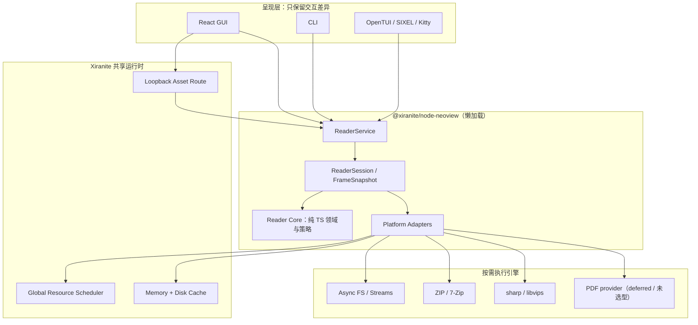
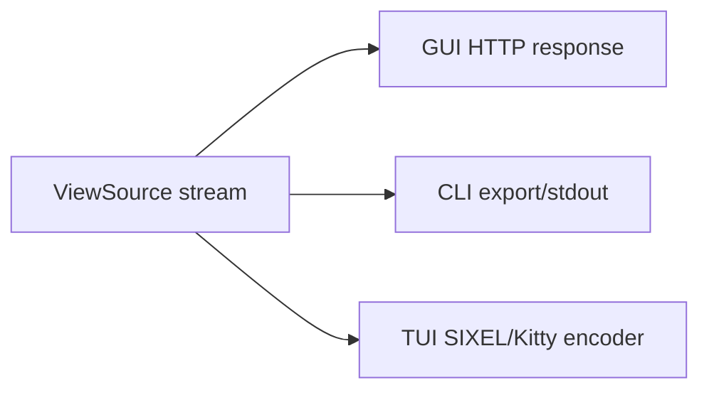
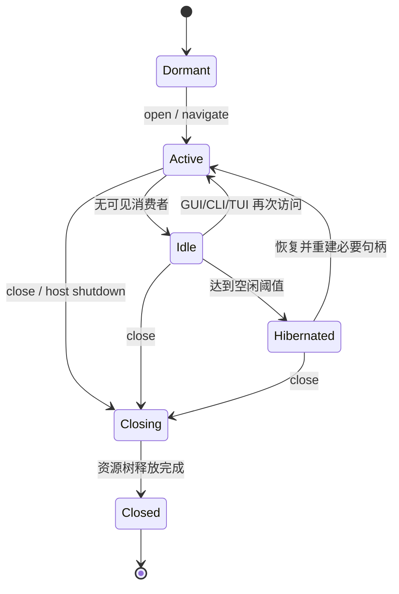

# NeoView 迁移到 Xiranite 的架构设计

> 状态：迁移实施基线（2026-07-14）
>
> 源项目：`D:/1VSCODE/Projects/ImageAll/NeeWaifu/neoview/neoview-tauri`
>
> 参考实现：OpenComic、`neoview/ref/NeeView`
>
> 迁移工具：`packages/tauri-migrate`

## 1. 结论

NeoView 适合迁入 Xiranite，但不能把它当作 319 个 Tauri command 组成的普通轻节点逐个翻译。它应成为一个**懒激活、可休眠、拥有长生命周期 ReaderSession 的重型节点**。

推荐的核心取舍是：

- 正式 GUI 只使用 Xiranite 现有的 React 19 + TSX；Svelte 仅作为旧 NeoView 的 AST 输入，不进入生产源码、运行时依赖或最终安装包；
- TypeScript 负责领域模型、会话、调度、缓存策略、契约和 GUI/CLI/TUI 共用逻辑；
- 图片解码、缩放、压缩算法仍交给 `sharp/libvips`、Node zlib、7-Zip 等成熟 native/WASM/系统实现，不用纯 JavaScript 重写底层算法；PDF 当前不引入实现依赖；
- 控制面走 Xiranite 节点操作，图片数据面走 loopback HTTP 流，不走 Base64 或大块 JSON IPC；
- 沿用 Xiranite 已有前后端动态导入，不再发明另一套懒加载；Reader 额外实现资源释放、空闲休眠和全局资源配额；
- GUI、CLI、TUI 共用一套 ReaderService 和平台适配器，只保留呈现层差异；
- 不迁移 NeoView 中新旧并存的多版本系统，在每个阶段完成后立即删除被替代链路。

在这些条件成立时，迁移后的阅读性能不应明显下降，并有机会因减少 IPC 复制、重复解码、重复缓存和无效前端更新而超过当前 NeoView。性能结论必须由第 19 节的基准门槛验证，不能只凭技术栈推断。

### 1.1 当前实施进度（实时维护）

旧版 `src/lib/cards/registry.ts` 中的 77 张 Card 已冻结到 `migration/neoview/card-compatibility.json`，并由 `bun run audit:neoview-cards` 校验 source hash、逐项 feature 映射和当前 manifest 对应关系；发布阶段使用 `--require-complete` 禁止任何 Card 保持 `pending/partial`。当前 manifest 为 11 张 Card：11 张均为 `partial`，剩余 66 张待迁移。实现顺序明确以核心阅读 Card 为先：`folderMain`、`pageListMain`、`bookInfo/imageInfo/storage/time`、`historyList`、`bookmarkList`、`preloadStatus`，slideshow overlay、动画和其余设置 Card 延后。

77 张 Card 统一执行“清单先于实现”的完成门禁。`migration/neoview/card-functional-scopes.json` 已为 77/77 张 Card 冻结最低用户功能范围，`folderMain` 的 74 条源码级细项及 19 组逐控件 UI 库存继续由 `migration/neoview/folder-main-compatibility.json` 管理；机器验收维度固定在 `migration/neoview/card-acceptance-contract.json`，完整可读文档固定在 `docs/neoview-card-functional-checklist.md`。基础审计执行 `bun run audit:neoview-card-checklists`，发布门禁追加 `--require-complete`。每张 Card 开工前必须先逐个枚举旧版控件、菜单项、选项值、可见字段、快捷键和状态，并映射到源码级验收项；随后覆盖设置/默认值/优先级、GUI/CLI/TUI 共用数据契约、加载/休眠/释放生命周期、性能预算、测试 ID 和有意偏离。仅有功能标题、后端 API、一个 smoke control、三条能力摘要或一条 happy path 均不能标记 `complete`；没有源码证据、自动化测试和视觉/几何证据的项保持 `pending/partial`。

上述三份 JSON、逐控件 UI 库存、生成文档和审计脚本是 NeoView 迁移的跨任务持久项目记忆，优先级高于聊天摘要。后续模型或任务不得依赖对话记忆补遗漏，也不得绕过清单先写实现；UI 默认保持旧版层级、控件、图标语义、标签、信息密度、交互状态和响应式几何，只有写入 `deviations` 且说明替代契约后才允许有意改变。文档漂移时运行 `bun run generate:neoview-card-checklist`，源码 Card 映射漂移时运行 `bun run generate:neoview-card-sources` 后人工审查差异。Windows 内存约束同样属于持久门禁：NeoView 的 build、typecheck、Vitest、Playwright、性能审计和原生构建严格串行，Vitest 固定 `--maxWorkers=1`。

Card 源码映射现已逐一冻结：77 个 registry 条目中有 76 个可追溯到具体 Svelte Card 组件；`protocolTest` 只有 registry 登记但不在旧 `CardRenderer` 中，明确记录为 `registry-only`。它不得被静默忽略，也不要求伪造旧 UI；迁移到该项时必须基于旧协议诊断需求决定补齐新 Card 或写明替代能力和视觉契约。

`folderMain` 的目录、排序、搜索、监听和树节点后端纵切已经收口到 GUI/CLI/TUI 可复用的唯一 `ReaderFileTreeService`，旧 `CoreReaderDirectoryBrowser` 已删除。单层浏览使用可取消的原生 `opendir()`；八字段排序与偏好在分页前统一处理；递归搜索使用唯一 `readdirp` stream adapter，并把 glob 与 gitignore 语义分别交给 `picomatch` 和 `ignore`。NDJSON 每次 Web Stream pull 只推进一个事件，consumer cancel、Request abort、session DELETE 和 service dispose 都关闭同一搜索 handle；scanner 全程持有宿主 `reader.file-tree.scan` I/O lease。`@parcel/watcher` 只在显式 `watch:true` 的 session 动态加载，并使目录快照及受影响树节点缓存失效。持久排除规则已经统一应用到树与搜索，请求级 exclusion 仍只影响单次搜索。

当前目录 listing 使用分级退化而不是新增第二套目录缓存：正常状态由 browser session 保留稳定快照；内存压力下，超过每 session 默认 1 MiB payload 预算且没有导航、排序或 watcher refresh 的空闲 listing 只释放 `entries`，继续保留 `path/parentPath/generation/back/forward`、排序偏好、watcher 和 session 身份。下一次 list、long-poll、sort、sort preference 或 directory-size 请求通过现有 provider → preference → metadata hydrate → sort 管线重建，并由 session owner 的单个 Promise 合并并发请求；某个 HTTP caller 取消只退出自己的等待，不会取消其他 waiter。导航可直接使用保留路径，不先回读旧目录；watch refresh 可以覆盖 released 状态。诊断快照报告 `releasedListings`，pressure 结果报告释放的 entry 数和估算 payload 字节。该机制完全驻留内存，不新增 SQLite 表、不写 `xiranite.db`、不修改 `%APPDATA%/NeoView/thumbnails.db`，也不改变 GUI/CLI/TUI 的共享 service 边界。

排序偏好继续执行“临时规则 > 文件夹记忆 > 标签默认 > 全局默认”：全局/标签默认和最多 1000 项文件夹记忆写入原 NeoView Reader SQLite 的独立 `xr_reader_*` 表，临时规则只存在 browser session。搜索历史的 `folder/file/bookmark/history` 四个 scope 统一由 `ReaderSearchHistoryService` 管理，相同 query 去重置顶、累计使用次数且每 scope 默认最多 20 项；运行数据非破坏性写入原 `%APPDATA%/NeoView/thumbnails.db` 的 `xr_reader_search_history`，不修改旧表、旧索引、`metadata.version`、`user_version` 或 journal mode。HTTP 与 Headless/CLI/TUI 复用这一 service，独立文件树控制器仅在首次历史操作时打开 SQLite；`LegacySearchHistoryCodec` 使用 `zod` 兼容完整导出和四个 raw localStorage key，`search-history-inspect/import` 提供显式确认的 merge/overwrite 导入。GUI 历史下拉仍待完成。React `FolderMainCard` 保持独立 lazy chunk 和有界稀疏 catalog。整体仍为 `partial`：树 GUI、搜索历史 GUI、EMM 标签搜索、穿透 single/all、其余 CLI/TUI feature 命令、完整多选/键盘导航、上下文文件操作、目录大小结果的前端重排/滚动锚点和原版视觉验收仍待迁移。

目录递归大小后端纵切已从首次 listing/stat hydration 中拆开，避免打开目录或请求 details 时同步递归阻塞。`ReaderFileTreeService.directorySizes()` 只接受当前 session、当前 generation、当前 listing 的最多 64 个直接子目录，使用成熟的 `p-map@4` 默认并发 2；每个目录由 `PlatformReaderDirectorySizeProvider` 通过 `readdirp@5` `lstat + alwaysStat` 常量内存流式累计，不手写递归 walker，也不为每个文件再调用一次 `stat`。adapter 正确处理 readdirp 的 BigInt Stats，单目录默认最多 1,000,000 个文件，字节总数必须保持在 `Number.MAX_SAFE_INTEGER` 内；遍历 warning 不会静默产出低估值，而是返回该目录逐项失败。扫描取得宿主 background I/O lease；导航、排序、watch refresh、session close、请求取消都会终止旧 generation 扫描。鉴权 `POST /reader/browser/s/{id}/directory-sizes` 与 Headless controller 复用同一 service，返回 generation 和逐目录 `bytes/fileCount/status`；前端合并后重排、保持选择身份与滚动锚点仍待完成，因此 FolderMain 对应项不能标记 complete。

文件树后端已增加第五条纵切：`ReaderFileTreeIndex` 复用 `lru-cache`，只读取显式展开节点的一层直接子目录，不预扫整棵磁盘树；缓存默认最多 512 个节点、TTL 5 分钟，并由显式 refresh、cache clear 和现有 Parcel watcher 共同失效。鉴权 HTTP 暴露 session-scoped tree、cache 和 exclusion 路由，CLI/TUI 可直接复用同一 `ReaderFileTreeService` 方法。持久排除目录先通过平台 `realpath/stat` 规范化，再原子写入 `[nodes.neoview.folder.tree].excluded_paths`；同一规则同时过滤树节点并转换为 `ignore` 模式剪枝 `readdirp` 搜索，请求级 exclusion 仍只对单次搜索生效。

共享无头端现已补齐：`ReaderFileTreeHeadlessController` 隐藏 browser session ID，并统一管理打开、替换、搜索 handle 与 dispose 生命周期。`xneoview folder-tree/folder-search/folder-exclude/folder-include/folder-tree-cache-clear` 只负责参数和输出适配；文本搜索逐条输出，JSON 仍受 10,000 项硬上限。`folder-search-history/folder-search-history-delete/folder-search-history-clear` 与 `folder-ui` 的 history 操作复用相同 controller，删除和清空必须经过 `--yes` 或 TUI dangerous confirmation；普通搜索的历史记录为 best-effort，不因旧库临时 busy 而推翻已完成的扫描结果。`xneoview folder-ui` 直接使用 cli-runtime 的通用 OpenTUI 表单、进度和危险操作确认，不维护第二套终端目录逻辑。HTTP 与 headless composition 共用唯一 `commitNeoviewFileTreeExclusions`，不会分叉 TOML 写入语义。

数据边界保持不变：上述 `xr_reader_*` 表只能位于 `%APPDATA%/NeoView/thumbnails.db`；文件树排除属于节点设置，只写 `xiranite.config.toml` 的 `[nodes.neoview.folder.tree]`，不写 `xiranite.db`、不写 `%APPDATA%/NeoView/thumbnails.db`、不新增第二个 NeoView 主库。其余节点设置仍只写 `xiranite.config.toml` 的 `[nodes.neoview]`。

第五条纵切现已补齐：details 作为二级 lazy chunk 复用 Niko/TanStack 的稀疏虚拟体、列显隐、dnd-kit 顺序、pinning 和 column sizing；拖动结束通过 TanStack `getResizeHandler` 只提交一次既有串行 PATCH，宽度以 `48..800px` 规范化写入 `[nodes.neoview.folder.details.column_widths]`，双击分隔线恢复列默认值。六种 `view_mode`、4/9/16 `preview_count` 与十列布局统一写入 `[nodes.neoview.folder]`，失败回滚且不使用 localStorage。当前仍未完成原版四模式视觉、其余 folder 设置导入和真实 Chromium 10K/100K 大目录验收，因此 `folderMain` 继续保持 `partial`。

#### `folderMain` 与统一文件树重构决策（2026-07-16）

文件浏览器是核心能力，不按普通轻 Card 处理，也不允许为了快速展示而维护 GUI 专用目录树。GUI、CLI、TUI 和后续 EMM 统一依赖一个 `ReaderFileTreeService` 应用边界；单层 `opendir` provider、递归 `readdirp` scanner 和按需 Parcel watcher 已由该 service 统一编排，不再暴露旧 `CoreReaderDirectoryBrowser` 实现。前后端只共享 DTO、稳定 entry ID、generation、分页 cursor 和取消语义，不共享 React/Virtuoso 状态。

前端采用以下唯一渲染主链：

- `react-virtuoso` 作为 `folderMain` 专用懒 chunk 的窗口化引擎；`Virtuoso` 承担 compact、单封面列表和四图列表，`VirtuosoGrid` 承担固定尺寸 cover/mosaic Card Grid；详细信息模式优先扩展仓库现有 Niko Table，不再引入第二套数据表；
- `react-window` 只保留为其他既有依赖或极小固定列表的可选底层，不作为 `folderMain` 主引擎，因为状态快照、响应式 Grid、可见范围协调和恢复定位仍需大量自建；
- 禁止使用 `react-infinite-scroller`：它只触发追加加载，不会卸载已加载 DOM，长目录会持续增加节点和内存；禁止把 Cubone/Chonky 一类成品文件管理器作为数据核心，它们不能满足稀疏页、10 万项虚拟化和现有 Reader 数据面契约；
- `@svar-ui/react-filemanager` 2.6.0 仅作为功能与交互参考，不进入生产主链：其 Card Panel 对当前目录 `_files` 直接完整 `map()`，所谓 dynamic directory loading 是按目录加载而不是目录内稀疏分页；主包同时引入自有 DataStore/event bus/Grid/menu/uploader/theme，内部 Card/Tree 也没有稳定的独立导出。直接采用会形成第二套状态/主题/表格系统，替换其 Panel 又等同维护 fork；
- 六种显示模式 `compact`、`cover-list`、`mosaic-list`、`details`、`cover-grid`、`mosaic-grid` 必须共享同一 catalog、selection、focus、sort/filter 和 EMM hydration；切换模式只替换 renderer，不复制目录数组或建立各自 store；
- 目录 catalog 使用 `total + generation + Map<pageCursor, entries>`，不得从第 0 项一路 append。前端最多保留 8～16 个 128 项批次；远端索引直接请求对应 cursor，淘汰离可见窗口最远的批次；
- 离开目录前保存逻辑状态 `{ focusedId, selectedIds, anchorId, anchorIndex, offsetPx, viewMode }`，Virtuoso snapshot 仅作为同尺寸快速恢复。返回时先按稳定 ID/服务端建议索引加载目标批次，再 `scrollToIndex`；响应式 Grid 列数变化时不能盲目复用旧像素 scrollTop；
- 缩略图只为可见窗口和 1～2 行 overscan 注册，每批最多 64 项。`cover` 每项一个 opaque URL；`mosaic4` 由后端合成单张 WebP，前端仍只挂一个 ``，禁止四倍 HTTP/DOM/解码；
- stat、媒体尺寸/时长、EMM、评分、标签和 AI 翻译按可见批次一次查询，禁止每行 `stat` 或 SQLite query。所有响应携带 session generation，目录切换、快速滚动或 Card 关闭立即取消。

后端采用成熟库而不是自行实现文件树基础设施：

- 单层目录浏览使用 Node/Bun 原生 `opendir()` + `Dirent`，保留逐项取消和 10 万项硬上限；这里最终仍需收齐当前层，再由唯一共享排序服务实现 `name/date/size/type/random/rating/path/collectTagCount`、目录优先、稳定兜底和“临时目录规则 > 文件夹记忆 > 标签默认 > 全局默认”，不能收缩成自然排序，也不能为了“用了库”额外包一层递归 walker。真正的递归索引/搜索统一使用 `readdirp` 的 stream/async iterator、背压和显式 destroy 取消；普通列表不逐项 `stat`，size/time/media/EMM 走可见批次 hydration；
- `@nodelib/fs.walk` 和 `fast-glob` 都是成熟候选，但前者偏底层遍历、后者偏一次性 glob 查询，均不承担可导航树状态；只有搜索 Card 落地 glob 规则时才引入 `fast-glob`/`tinyglobby`，不能为未来能力提前常驻依赖；
- `@parcel/watcher` 是活动树根的唯一增量事件源，Windows 使用 `ReadDirectoryChangesW`；它必须通过 platform adapter 动态导入，只在文件树/索引会话明确请求 watch 时订阅，最后一个消费者关闭后立即 unsubscribe。普通阅读、原图翻页和未展开 `folderMain` 时不得加载其 native binding；
- watcher 只输出规范化的 create/update/delete 批次，由 `ReaderFileTreeService` 更新 generation、失效受影响目录页并向订阅者发布；UI 不直接依赖 Parcel 类型。需要全量搜索时使用 `readdirp` 流，不能靠 watcher 启动时发出的全树 add 事件构建索引；
- glob、排除和 `.gitignore` 语义分别交给 `picomatch`/`ignore`，不得自行解析；自然排序继续使用唯一共享 comparator；路径 canonicalization、符号链接/重解析点策略、根目录权限和 EMM identity 由 platform adapter 统一处理；
- watcher、递归索引、缩略图、stat/media 和 EMM hydration 都必须接入同一 generation/cancel 生命周期与宿主 ResourceScheduler。禁止每个展开节点创建 watcher，禁止在 XR 启动时扫描图库，禁止无界 Map 保存整棵树。
- Everything 只允许作为 Windows 可选 `FileSearchProvider`：检测到服务/SDK 后可加速跨库名称查询，其他平台和未安装场景仍走同一递归搜索契约；它不能成为目录导航、watcher generation 或 EMM identity 的唯一真相源。Rust N-API 扫描器也只在真实百万文件 corpus 证明原生 fs/readdirp 无法达到预算后替换同一 port，不提前保留 TS/Rust 双实现。

验收门槛按真实 10K/100K 文件目录执行：首批 128 项不等待递归索引；mounted item 始终等于可见窗口加 overscan；前进/后退恢复不得从第 0 页重放或扫描 DOM；切换六种视图不复制完整 catalog；连续滚动后前端仍不超过 16 个目录批次；关闭 Card 后 browser session、thumbnail context、watcher、流和请求全部归零。测试、typecheck、build、Playwright 与性能审计遵守 Windows 内存门禁严格串行，Vitest 固定 `--maxWorkers=1`。

本轮聚焦证据：排序偏好纵切之后又接入可选 EMM 批量 metadata port；后端 browser/EMM setting/stat provider/SQLite/route/sort 6 文件 19 项通过，前端 client/catalog/Card 3 文件 13 项通过。首批与可见稀疏页只批量 hydration 当前页，评分/收藏数排序才覆盖完整目录；SQLite 每批 256 项并定期 `scheduler.yield()`，没有逐行查询。兼容 `thumbs.rating_data/emm_json` 时开放两个字段，缺少旧表/列时保持原六字段并优雅降级。NeoView package build、根 `typecheck:app` 与清单审计通过；此前 `@parcel/watcher` Windows/Bun 实机 create/unsubscribe 探针保持通过。尚未运行生产 chunk、10K/100K EMM corpus、Playwright 和完整性能审计，因此不得据此宣称 `folderMain` 完成。

#### `folderMain` 完整兼容清单（2026-07-16）

权威机器清单为 `migration/neoview/folder-main-compatibility.json`，共 74 项：`partial=29`、`pending=45`、`complete=0`；同文件另有 19 组逐控件 UI 库存，覆盖整体结构、导航、面包屑、标签、视图、details、预览、排序、选择/键盘、搜索/筛选、树、虚拟源、文件操作、缩略图操作、EMM、穿透、迁移、更多设置和状态/性能。每个源码控件库存组必须提供旧文件证据并映射到 74 项中的一个或多个验收 ID；每个验收项固定包含 `sourceEvidence`、`targetContract`、`surfaces`、`status`、`testIds` 和 `notes`。本文表格只是索引，完整控件名单由生成文档展示；发生冲突时以旧源码证据与 JSON 契约为准。`complete` 必须同时满足逐控件功能、原版 UI、设置、快捷键、异常态、生命周期、自动化测试和适用的 GUI/CLI/TUI 共用契约。

| 类别 | 数量 | 功能清单 |
| --- | ---: | --- |
| architecture | 5 | 有界目录浏览会话；任意 cursor 分页与稳定快照；单层与递归扫描分层；文件树增量监听；取消、释放与休眠 |
| navigation | 7 | 路径输入与直接跳转；前进、后退与导航历史；返回上级并定位原目录；主页/设为主页/刷新；FolderStack 分层浏览；空白单击/双击动作；列表底部返回按钮 |
| tabs | 6 | 多标签创建/切换/关闭；关闭其他/左侧/右侧；固定与复制；最近关闭 10 项与恢复；标签切换历史；标签栏/工具栏/面包屑布局 |
| view/preview | 7 | 原版 list/content/banner/thumbnail；详细信息列；缩略图宽度；横幅列宽；Hover 预览与 200/500/800/1200ms 延迟；文件夹单封面及 4/9/16 图；可见范围缩略图管线 |
| performance | 2 | React Virtuoso/VirtuosoGrid 有界虚拟化；10K/100K 目录延迟、DOM、heap/RSS、取消和关闭回收门禁 |
| sorting | 9 | name/date/size/type/random/rating/path/collectTagCount；数字感知名称和稳定兜底；目录优先与虚拟源例外；目录大小异步 hydration；稳定随机种子；EMM 评分/收藏标签数；四级规则优先级；文件夹记忆与清除；History/Bookmark 独立日期语义 |
| selection/keyboard | 6 | 单选与 Ctrl/Meta toggle；Shift 范围和链式选择；全选/反选/取消与选择栏；导航恢复和自动定位；方向/Home/End/Page 键；Enter/Backspace/F5/Delete/Ctrl+A/Ctrl+F/Escape |
| search/filtering | 4 | 当前目录名称/路径搜索与搜索历史；包含子目录的可取消流式搜索；EMM/收藏/随机标签搜索；全部/压缩包/文件夹/视频筛选 |
| tree | 4 | 文件树按需展开/折叠；left/right/top/bottom、尺寸与 pin；主视图内联树；缓存清理、排除目录与取消排除 |
| virtual-sources | 2 | Folder/Bookmark/History/Search 统一虚拟源；无效书签/历史清理、单项删除、清空和文件夹同步 |
| operations | 10 | 打开/浏览/新标签/作为书籍；系统默认程序与 Explorer 定位；复制/剪切/粘贴；复制路径/名称；重命名；回收站/永久/批量删除；撤销删除；书签；缩略图重生成/预热/取消/进度；完整右键菜单 |
| EMM | 3 | 可见批次评分/标签/收藏数 hydration；多视图信息显示与默认评分；单项/批量编辑并驱动搜索排序一致 |
| penetration | 3 | 递归显示与 single/all；最大 1/2/3/5/10/无限层；内部文件 none/penetrate/always 与纯媒体文件夹直接打开 |
| migration | 1 | 迁移栏显隐、来源/目标、队列、执行、取消、进度、错误和迁移管理 |
| UI/settings | 5 | 原版结构/密度/图标/顺序/视觉状态；侧栏与窄视口几何；空/加载/权限/部分失败/重试；语义与可访问性；全部设置单一规范版本和旧数据导入 |

关键验收解释：

- 原版显示模式名以 `list/content/banner/thumbnail` 为事实来源；目标内部可拆成 `compact/cover-list/mosaic-list/details/cover-grid/mosaic-grid` renderer，但必须逐项映射，不能用当前两个 smoke mode 冒充四种原版视图完成。
- 排序绝不是自然顺序：八个字段、升降序、目录优先例外、异步目录大小、稳定随机、EMM 默认评分、收藏标签数、稳定同值兜底以及四级规则优先级必须全部覆盖。
- 文件浏览器 UI 以原 `FolderPanel + FolderTabBar + BreadcrumbBar + FolderToolbar + FolderStack/Tree/List + SelectionBar + MigrationBar + ContextMenu` 结构为 characterization；允许改用 XR token 和成熟 React primitives，但不得无记录删控件、改交互或把完整子应用压成一个通用列表 Card。
- 原版 ArrowUp/ArrowDown 尚有未完成标记，但它仍进入目标清单：迁移的目标是完成用户需要的键盘导航，不是复制旧缺陷。
- `folderMain` 只有逐控件 UI 库存全部有实现/替代证据且 74 项全部 `complete` 后，才能把 `migration/neoview/card-compatibility.json` 中对应 Card 从 `partial` 改为完成；其余 76 张 Card 已在 `migration/neoview/card-functional-scopes.json` 冻结逐卡最低功能范围并生成到 `docs/neoview-card-functional-checklist.md`。这些范围可防止整张 Card 被遗漏，但仍不是完成证据；每张 Card 开工前必须按 `card-acceptance-contract.json` 建立与 `folderMain` 同规格的逐控件 UI 库存和源码级细项，不能把三条范围摘要或 Card 索引行当作完成清单。

`pageListMain` 已在原 `page-navigation` Card ID 上升级为完整页面列表纵切，不保留第二套 Card：列表、带图列表、三列缩略图网格均使用 `@tanstack/react-virtual`，只加载可视窗口对齐的 64 页批次；搜索通过 ReaderSession 内的 `/pages?query=` 服务端分页完成，切换搜索或视图会取消旧批次；纯文本列表发送 `thumbnails=0`，不触发无意义缩略图预热，带图模式才对可见批次预热；当前页跟随、页码输入与提交式 Slider 跳转均复用 `onGoTo`。仍标记 `partial`，剩余旧右键删除、超分状态标记和 `pageListFollowProgress` 设置持久化。

`bookInfo/imageInfo/storage/time` 已拆为四张独立 lazy Card，同时复用唯一的 session metadata 请求：普通 session DTO 继续不包含真实路径，Info Card 首次挂载时才调用鉴权 `/metadata`；共享 `useSyncExternalStore` 条目按 `sessionId + frame generation` 去重，当前页变化自动换代，最后一张 Card 卸载即取消请求并删除缓存。后端并行读取书籍源与当前页最多两个 `stat`，返回类型、路径、页码进度、尺寸、MIME、大小与创建/修改时间。四张仍为 `partial`，剩余视频时长/帧率/码率/编码、归档 entry 独立时间和 EMM 翻译标题。

`historyList/bookmarkList` 已接入统一 Reader library：两张 Card 各自保持独立 lazy loader，列表共同复用 100 项分页、`@tanstack/react-virtual` 可视窗口与 AbortController 生命周期；历史项可恢复原 source 并删除，书签支持 `all/default/favorites` 与自定义列表筛选、当前书籍添加、收藏切换、列表创建/删除。GUI 只通过鉴权 `/reader/library/*` 控制路由读写元数据，CLI 与通用 OpenTUI `library-ui` 复用 `ReaderLibraryHeadlessController`，不维护第二套 store。旧 `neoview-history`、`neoview-unified-history`、`neoview-bookmarks`、`neoview-bookmark-lists-v2` 的 backup/full-export/localStorage 三种 JSON 包装已可用 `reader-data-inspect/import` 预览并迁入；无效来源清理由共享 service 有界执行，权限/离线卷错误不会误删。两张 Card 仍为 `partial`，剩余批量选择/上下文文件操作、缩略图/评分呈现、GUI 首次清理触发和数据洞察。

> 最后更新：2026-07-16；最近已提交基线：`897886a`（原图阅读/预解码/虚拟缩略图）、`880ccff`（复杂 Shell/Card AST scaffold）、`1e4f70c`（懒加载四边 Shell 与首批 Panel/Card）、`5064b82`（只读 Shell 配置链）、`444bdbc`（React Compiler 友好的侧栏 resize/drag 与 TOML PATCH 原子持久化）、`532b304`（旧 panel layout 兼容读取）、`f9467c4`（旧 v14 Card 状态导入与折叠原子持久化）。本节必须随每个 NeoView 实现提交同步更新；代码、feature matrix 和测试证据优先于文字。

整体结论：**基础架构和高性能阅读纵切已经跑通，但完整功能迁移远未完成。** `feature-compatibility.json` 的 30 项 feature 当前全部保持 `pending`，因为每一项都包含旧 NeoView 的多组行为，不能用“一条 happy path 已运行”提前标记完成。

| 阶段 | 当前状态 | 已有证据 | 主要剩余工作 |
| --- | --- | --- | --- |
| Phase 0：AST 与冻结基线 | 已完成基线，持续防漂移 | 319 command；551 Svelte component、447 module、142 store；前端 29 个 TSX scaffold；inventory/frontend/feature verifier | 源 NeoView 更新时重新冻结并解释 drift |
| Phase 1：领域核心与契约 | 进行中（核心纵切可用） | Page/Frame/ReaderSession、自然排序、单双页基础、generation/cancel、统一 ReaderService、共享阅读进度恢复/异步合并写/关闭刷盘；ReaderLibrary 复用进度表提供最近阅读；书签/自定义列表、旧 reader data codec、单事务导入与 CLI inspect/import 可用 | 完整 layout、历史/书签其余旧行为、TUI 数据命令、统计和所有错误恢复 |
| Phase 2：目录/归档/唯一数据链 | 进行中（主阅读链较完整） | 目录/单图、ZIP、EPUB 图片资源、non-solid/solid 7z/RAR、嵌套包、AES ZIP、7-Zip stdin 密码、真实 header-encrypted RAR/CBR、loopback HTTP stream、ETag/Range/cancel、图片探测、惰性 sharp、L2/L3 cache、缩略图生成/批写/失败退避/在线维护 | 缩略图旧版本迁移、更多 RAR 版本/损坏包及真实 EPUB 语料；PDF 明确 deferred |
| Phase 3：React Reader | 进行中（当前主线） | 原始 asset URL ``、相邻页 `Image.decode()`、64 页批次虚拟缩略图；四边 EdgeShell、Panel/Card、fit/zoom/rotation、单双页实时切换与首批 TopToolbar 控制 | 完整 TopToolbar、左右全部 panel/card、全景/连续长图、拖拽/捏合手势、窗口/tab |
| Phase 4：复杂格式与 CLI/TUI | 进行中（图片阅读原型可用） | EPUB/7z/RAR/nested provider；共享 HeadlessController；`xneoview` inspect/pages/frame/extract/diagnostics 与持久 TUI 均支持本地或 `--connect` 常驻后端；TUI 通过共享 `TerminalImagePreview` 流式显示单/双页 frame | 真实 EPUB 语料、SIXEL/Kitty 终端验收、缩略图 gallery、完整设置/feature 命令、平台能力诊断；PDF 不计入当前阶段验收 |
| Phase 5：全功能切换 | 未开始 | 完成标准与 30 项矩阵已冻结 | 30 项无 `pending`、全旧设置/数据导入、删除全部旧/临时链、发布验收 |

#### PDF 暂缓决策（2026-07-15）

PDF 后端 provider 当前由项目所有者明确后置，并于 2026-07-16 再次确认暂不处理，不进入近期核心迁移范围。路径检测仍将 `.pdf` 规范化为 `{ kind: "document", format: "pdf" }`，文件树可以列出该文件并显示明确的不支持状态，但 `PlatformReaderBookLoader` 必须返回 document capability unavailable。当前不得打开、分页、预取或渲染 PDF，也不得向 `%APPDATA%/NeoView/thumbnails.db` 写入 PDF 页面缩略图、封面缩略图或失败黑名单；不得为“看起来支持”而把 PDF 原文件当图片直出，也不得保留未完成的 PDF.js/canvas 依赖、固定尺寸预栅格化链或 GUI 专用实现。

恢复 PDF 工作前需要重新通过以下决策门：

- 图片/归档主阅读、历史/书签、跨书导航和资源生命周期等更高优先核心能力已达到对应验收门槛，或项目所有者重新调整优先级；
- 重新比较 `pdfjs-dist` 等候选的许可、Windows 安装体积、冷启动、按页渲染 P95、峰值 RSS、取消与损坏文档行为；AGPL 实现不能成为默认依赖；
- 目标尺寸必须从 HTTP asset 请求直接下推到 renderer，禁止“固定大 PNG/WebP -> sharp 二次缩放”；
- PDF 页必须继续实现统一 `ReaderBook/PageContent` 契约，让 GUI、CLI、TUI 共用同一 provider，并保持动态导入和 session close 资源归零；
- 使用真实 PDF 语料补齐加密、字体、ICC、透明度、旋转、超大页、损坏文件和并发取消测试后，才能从 deferred 改回进行中。

#### EPUB 图片资源 provider（2026-07-16）

旧 NeoView 的 EPUB 行为不是 HTML/CSS 重排阅读：它读取 EPUB ZIP 中的 `META-INF/container.xml` 和 OPF manifest，选择全部 `image/*` 资源，按归档路径排序后作为普通 Reader 页面。因此 XR 保留这一可验证行为，不引入 `epubjs`、浏览器 DOM 或第二套文档渲染状态机。

- 复用现有 `@zip.js/zip.js` provider，并用成熟的 `fast-xml-parser` 解析 container/OPF；两者均在打开 `.epub` 后动态加载；
- container XML 限制为 1 MiB，OPF 限制为 4 MiB；所有 href 经过 URL decode、相对 OPF 路径解析和 archive path escape 校验；
- MIME 声明为 `image/*` 的无扩展名资源同样可成为页面；缺失资源跳过，重复 href 去重，页面顺序保持旧实现的路径字典序；
- 页面继续使用统一 `ReaderBook`、`ArchivePageContent` 和 loopback asset route，图片字节不经过 JSON/Base64，GUI/CLI/TUI 无需各自实现 EPUB；
- session close、取消和解析失败都会关闭 ZIP provider；EPUB 不新增 SQLite 表，其页面缩略图沿用 `%APPDATA%/NeoView/thumbnails.db` 的现有兼容键和统一生成链；
- 当前范围只覆盖旧版的图片资源阅读语义，不承诺 XHTML reflow、目录导航、字体、脚注或 DRM。扩大 EPUB 产品语义时必须作为新 capability 另行设计。

EPUB 与 PDF 仍是两个独立 capability；EPUB provider 落地不改变 PDF deferred 决策。

后端/共享核心的当前真实状态：

| 子系统 | 状态 | 当前实现 | 未完成边界 |
| --- | --- | --- | --- |
| Reader domain/application | 可用但未全兼容 | `packages/nodes/neoview/src/domain` 与 `application`；GUI/CLI/TUI 共用 session/controller；显式页码优先、默认恢复上次进度，翻页写入不阻塞主链且关闭强制刷盘；共享 `ReaderLibraryService` 提供最近阅读、书签和列表契约，CLI/OpenTUI 已覆盖分页、添加、删除、列表、按时间清理和无效来源有界清理 | 完整阅读模式、历史/书签剩余 GUI 批量交互、文件夹变化同步、统计/播放列表和全部错误恢复 |
| Archive provider | ZIP/7z/RAR 主纵切可用 | Store/Deflate ZIP、stdout non-solid、单进程 solid materializer、嵌套 lease、CRC/预算/取消、header/non-solid/solid stdin 密码、真实 encrypted RAR/CBR | 更多 RAR 版本及损坏/超大真实包；文档格式不属于 archive provider |
| HTTP 图片数据面 | 主链可用 | opaque token、GET/HEAD、ETag/304、文件 Range、ZIP 流、背压和断开取消；默认原图不进 sharp | 格式 fallback 策略、远程源、更多 Range/代理兼容 |
| Probe/transform/cache/scheduler | 部分完成 | 有界尺寸探测、惰性 sharp、singleflight、weighted LRU、`cacache` 内容寻址 L3、request-bound 内存压力 admission/回收、宿主 CPU lease；non-solid 归档流与 sharp/WIC 复用单一 CPU lease | frame pin、方向权重、所有重节点共享配额 |
| 旧缩略图数据库 | 主运行纵切可用、迁移未完成 | 沿用 `%APPDATA%/NeoView/thumbnails.db`；惰性单 writer、批量命中、Page/file/folder/video/归档内视频生成与持久化、失败退避、统计与有界在线清理；SQLite 原生一致性备份、显式离线 checkpoint/optimize/vacuum、验证备份恢复与原 DB/WAL/SHM 隔离；XR writer/维护进程锁；`data_version` 外部 writer epoch；V1/V3/V4 行为收口到单一有界优先 Coordinator | 真实大规模基准 |
| 设置与数据迁移 | 部分完成 | LegacySettingsCodec、共享 ReaderSettingsMigrationService、CLI 与鉴权 HTTP legacy inspect/import；当前 `[nodes.neoview]` 的 Xiranite/NeoViewConfig v1 portable 导出/回读；Xiranite/NeoViewBackup v1 配置+原 thumbnails.db 在线一致目录 bundle；bundle manifest/哈希/portable/SQLite 只读检查；带配置回滚与旧数据库隔离的 offline restore；确认/备份/跨进程锁/原子写入 | GUI/TUI 确认界面、自动备份调度、Gist transport |
| 超分 | provider/CLI 路线已定，功能未完成 | 系统 OpenComic CLI capability，不嵌入 Python/exe | Windows daemon 实测、取消/显存/模型兼容和 GUI/Card |

前端当前真实状态：

| 子系统 | 状态 | 当前实现 | 未完成边界 |
| --- | --- | --- | --- |
| Svelte → React AST | Shell 底稿已覆盖 | 10 个确定性 scaffold + 19 个 review/partial scaffold；MainLayout、HoverWrapper、Top/Bottom、左右 Sidebar、Panel/Card、card-window 均带 hash/unsupported | 逐文件消除 rune/store/Tauri/RenderTag/BindDirective，生产代码不得 import generated |
| 图片显示与热翻页 | presentation 默认值、单双页和首批按书覆盖纵切可用且已过硬门槛 | 唯一 DOM ``；共享 TS presentation geometry；适应窗口/填满/宽/高/原始大小、0.1～8 倍手动缩放、90° 旋转；单双页通过共享 session layout 实时切换；兼容旧 `defaultZoomMode/doublePageView` 并规范化到 TOML；`xr_reader_book_settings` 保存 revisioned 方向/单双页/宽页策略并在开书时恢复；稳定 wrapper、完整 scroll extent、零重复 asset 请求；相邻页有界预解码 | 全景/连续模式、拖拽/捏合、旧 per-book localStorage 导入、完整 GUI/CLI/TUI 控件、8K/16K/GPU 长测 |
| 缩略图 | 显示、生成与在线维护纵切可用 | 64 页 cursor 批次、横向 ThumbnailStrip 与纵向 PageList 虚拟窗口、PageList 服务端搜索、按视图跳过/启用预热、旧库批量预热、Page/file/folder/video 生成、WebP BLOB 单库持久化；共享 maintenance service 统一 stats、空 Blob、过期 file、无效路径和失败记录清理；GUI HTTP request abort 贯穿 service/lazy store/SQLite 扫描并保持取消批次游标可重试 | 区域筛选、备份/checkpoint/vacuum 离线编排与旧版本迁移 |
| 四边 Shell | 进行中（读写布局与 pin 纵切完成） | AST provenance 的 top/right/bottom/left slot；trigger、显隐、pinned、延迟、透明度、模糊、左右宽度/高度/垂直对齐/水平偏移均从 Xiranite TOML 的规范化 DTO 读取；左右图标轨已迁入 Pin/PinOff 控件，单次 sidebar PATCH 原子写入 `pinned`，解除固定后恢复 hide delay 与零 DOM；resize/drag 的 pointermove 仅改 DOM style，pointerup 单次 PATCH；IME/浮层、Escape、零挂载；配置异步到达不重挂活动 `` | 空白点击策略、open 的显式用户控制、完整旧 sidebar lock-state 导入、更多布局预设/独立窗口行为 |
| Panel/Card | 兼容布局、折叠、Card 高度与设置态管理纵切 | Panel/Card 默认值、`requiresSession/settingsSectionId` 和能力约束已收口为节点包纯 TS manifest，后端默认配置/校验、设置窗口 host 与 React sidebar lazy loader 共用；设置窗口按 section 二级动态加载 Card；显式停靠的设置 Card 无需先打开书籍，业务 Card 在无 session 时不会产生 Panel/DOM；全量 board 携带 `expectedRevision`，后端串行写队列以 `409` 拒绝陈旧快照；固定 Card 不能隐藏，未实现 host 不能接收已知 Card；Card 高度拖动仅用 ref/DOM style，pointerup 单次 PATCH | 其余全部业务卡片、Panel 高级组件设置、独立 card window/tab |
| 完整阅读工具与设置 UI | 设置浮窗、三张共享设置 Card 与首批视图/幻灯片工具可用 | 路径打开、前后/页码/关闭；fit mode 菜单、单双页 segmented control、缩放、旋转、reset 及 `+/-/R/0` 快捷键；fit/page mode 默认值写入 Xiranite TOML 并立即作用于当前视图与同进程后续书籍；工具栏、设置窗与停靠 Card 共用单一串行写队列，按服务端确认快照处理失败回滚；共享 TS `ReaderSlideshow` 以单个 deadline timeout 提供播放/暂停、1～60 秒间隔、循环、随机、剩余时间与慢导航串行化；`interval/loop/random/fadeTransition` 兼容旧 `reader.slideshow` 与 `book.autoPageTurnInterval`，统一规范化到 `[nodes.neoview.slideshow]`，工具栏经同一后端/前端串行写队列持久化并按确认快照回滚；按 `setting.png` 建立独立设置浮窗，“视图默认值”“边栏管理”和“卡片管理”由同一 Card registry 按 section 二级动态加载，也可显式停靠到侧栏 | slideshow 完整 overlay、淡入淡出实际渲染与 TUI、原 TopToolbar 其余功能、阅读方向/尾页等尚无严格写入契约的视图设置、其余设置分类业务卡、文件浏览、历史/书签、超分、AI、benchmark、完整快捷操作 |

当前验证证据（数值随复跑波动，以预算和原始输出为准）：

- 前端 NeoView 上一轮完整基线为 14 个测试文件、46 项 component/hook/registry/shell/config/resize/card/settings/presentation 测试通过；本轮 slideshow 配置解析 13 项、HTTP/TOML 组合 2 文件 14 项、共享运行时 3 项、前端 client/toolbar/ReaderApp 4 文件 14 项通过，输入清空会在 PATCH 前规范化到 1 秒；NeoView package build、根 typecheck 与 React Compiler boundary audit 均通过；所有验证严格串行且 Vitest 使用 `--maxWorkers=1`；
- Reader pipeline 最近复跑：backend startup `16.14 ms`、open `77.08 ms`、navigation p95 `7.13 ms`、response headers p95 `3.08 ms`、first byte p95 `3.19 ms`、full stream p50 `34.99 ms`、throughput p50 `81.14 MiB/s`、RSS delta `0.23 MiB`；全部通过预算，视图默认值与单双页控制不进入图片 HTTP 数据处理链；
- 上一轮真实 Chromium 综合路径已覆盖桌面与 `420×360`：旧 `default_zoom_mode = "fitHeight"` 被规范化为 `fit-height`，fit 与单双页修改分别单次写入 TOML，session 切换成功后才更新默认值，后续新书无需重启 backend 即使用新默认；原始大小、reset、旋转、缩放和单双页切换保持同一个 `` 与同一原始 asset URL；热翻页为 desktop `58.6/83.9 ms`、card `56.2/76.9 ms`（navigation/decode），低于 `150/200 ms` 门槛；独立 desktop pin E2E 覆盖 pin/unpin 与零 DOM；本轮 slideshow desktop E2E 45.6 秒通过，真实恢复 `7s/random/fade=false`，间隔和循环各产生一次 PATCH 并写回 canonical TOML；Vite E2E 新增环境变量 cacheDir 隔离能力，避免多 server 共用 optimize-deps 缓存，Card 项目本轮未重复运行；
- 本轮生产构建报告：NeoView entry `25,176 bytes`，ReaderFrame `2,274 bytes`，ReaderViewToolbar `5,916 bytes`，ReaderSidebar `9,173 bytes`，registry `2,909 bytes`，设置浮窗 `3,512 bytes`，SidebarManagementSettingsCard `5,838 bytes`，PanelLayoutEditor `4,293 bytes`，Dice UI Kanban/dnd-kit runtime `58,547 bytes`；slideshow 控件继续位于延迟 ReaderViewToolbar chunk，初始 chunk NeoView module `0`、前端 zip.js module `0`。本轮同时存在其他迁移改动，不能把 chunk 数值变化单独归因于 slideshow。

日常进度核验入口：

Windows 开发机上以下重任务必须严格串行，前一个进程完全退出后才能启动下一个；Vitest 固定 `--maxWorkers=1`。不得把 build、typecheck、测试、Playwright、性能审计或原生编译放进并行 tool call，系统中已有其他迁移编译进程时也不得启动综合门禁。

```powershell
bun run audit:neoview-inventory
bun run audit:neoview-frontend
bun run audit:neoview-features
bun run audit:neoview-cards
bun run audit:node-architecture -- --node neoview
bun run audit:neoview-performance
bun run typecheck
```

`audit:neoview-performance` 会先构建 `packages/nodes/neoview` 的 dist，再运行 Reader pipeline、真实 Chromium 桌面/卡片 E2E 和生产 chunk 审计，避免源码已更新但后端仍加载旧 dist 的假阳性。React 组件实现默认遵循 Compiler `infer` 模式；节点宿主入口保留 `use no memo` 边界，Reader 内部禁止用手写 memo 代替稳定的 ref/事件/CSS 更新。

## 2. 目标与非目标

### 2.1 目标

- 保住或提升首屏、翻页、连续滚动、缩略图和大压缩包阅读性能；
- 保留当前 NeoView 的全部用户可见功能和可迁移数据，不以架构重写为理由删减能力；
- 兼容导入现有 NeoView 设置、完整导出文件和备份数据，迁移后统一写入 Xiranite TOML；
- 接入 Xiranite 节点系统，但未使用 Reader 时不加载其 UI、核心实现和 native 依赖；
- 支持多个工具同时运行，Reader 不得独占 CPU、I/O、Worker 或内存；
- 完成前后端架构重构，形成唯一资源主链和明确的资源所有权；
- 用高性能 TS 生态适配器替代 NeoView 自维护 Rust 业务后端；
- GUI、CLI、TUI 共用领域逻辑、归档索引、缓存和调度能力；
- 为后续远程书库、插件式格式支持和独立 Reader 窗口保留扩展点。

### 2.2 非目标

- 不把 319 个 Tauri command 一比一翻译为 319 个节点操作；
- 不用纯 TS/JS 重新实现 JPEG、AVIF、RAR、7z 等编解码器；
- 不在第一阶段迁移文件删除、重命名、资源管理器等与阅读热路径无关的能力；
- 不在 Reader 内建立绕过 Xiranite 的私有全局线程池和任务系统；
- 不为了兼容旧代码长期保留两套页面、缩略图、文件系统或缓存主链；
- 不复制 OpenComic 的 GPL 源码或整体模块实现。

## 3. 已确认的迁移清单

按 `packages/tauri-migrate/README.md` 生成基线：

```powershell
bun run migrate:tauri -- generate `
  "D:\1VSCODE\Projects\ImageAll\NeeWaifu\neoview\neoview-tauri" `
  --out "artifacts\tauri-migration\neoview-baseline" `
  --config "migration\neoview\tauri-migration.json"
```

当前清单为：

| 项目 | 数量 |
| --- | ---: |
| Rust 文件 | 185 |
| Tauri command 声明 / 唯一名称 | 319 / 318 |
| 已注册声明 / 唯一名称 | 312 / 311 |
| 原始 AST `typescript-portable` / `native-required` / `manual-review` | 296 / 16 / 7 |
| 人工复核后 `typescript-portable` / `native-required` / `manual-review` | 309 / 10 / 0 |

原始 `native-required` 主要集中在视频/FFmpeg、打开系统程序、Windows 元数据和目录能力，并不证明 Reader 核心必须保留 Rust。人工复核已通过 `migration/neoview/tauri-migration.json` 将文件系统、哈希、AVIF、archive image 和超分保存路径归为 TS portable；剩余 10 个 native 声明仅代表 FFmpeg 或系统 shell capability，仍由 TS platform adapter 调用，不保留 Rust Reader 后端。清单只提供 AST 证据和迁移风险，不决定最终 API 粒度。

319 个命令暴露了当前边界过碎和版本并存的问题。目标公开接口应收敛到约 10～15 个稳定的 reader 操作，其余成为包内服务调用。

### 3.1 AST 迁移工具是开工第一步

真正开始迁移时，第一组动作必须是分别运行后端 Tauri AST 工具和旧 Svelte 源到 React 的 AST 工具，而不是先手工创建 React 组件或凭印象重写 Rust/Svelte。当前已经生成过 `artifacts/tauri-migration/neoview-baseline`，但正式实现前仍要对冻结的 NeoView 源版本重新生成并审计：

```powershell
bun run migrate:tauri -- generate `
  "D:\1VSCODE\Projects\ImageAll\NeeWaifu\neoview\neoview-tauri" `
  --out "artifacts\tauri-migration\neoview-baseline" `
  --config "migration\neoview\tauri-migration.json" `
  --force
```

使用 `--force` 前必须确认目标确实是工具生成目录。Phase 0 同时记录源仓库 commit、dirty diff hash、迁移工具版本和生成时间，保证后续可以判断源项目又新增了哪些 command 或能力。

AST 阶段的交付物用途：

| 产物 | 迁移用途 |
| --- | --- |
| `inventory.json` | 319 个 command、参数、返回值、state、事件、调用和 native evidence 的机器清单 |
| `commands.ts` | 旧 Tauri 边界的 TS 类型草稿，用于兼容 adapter 和测试 fixture，不直接作为最终公开 API |
| `adapter.ts` | 隔离旧 invoke 调用，辅助前端结构迁移和行为对照 |
| `REPORT.md` | 人工审计 native/manual-review、未注册 command、事件和高风险依赖 |

正确顺序是：

1. AST 生成并冻结旧系统事实；
2. 人工审查 `typescript-portable/native-required/manual-review`，补 project override；
3. 将 command、UI、设置和数据模块归并进 `feature-compatibility.json`；
4. 基于旧契约建立 characterization/conformance tests；
5. 把 319 个旧 command 收口为约 10～15 个 ReaderService 操作；
6. 读取旧 Svelte AST 并生成可追踪的 React scaffold，再实现 TS application/platform 和最小 React 纵切。

`applyStructuralRewrites` 只用于同语言的确定性改写，例如前端 Tauri import、调用入口和 API 名称替换。它不负责 Rust 到 TypeScript 的业务语义翻译；自动逐函数翻译会把旧版多主链、重复缓存和 319 个碎 command 一起永久保留下来。

AST inventory 是迁移证据源，架构文档和 feature matrix 是决策源，两者都不能互相替代。当前 v2 inventory 会记录迁移器版本、源 commit、dirty 状态和 dirty diff hash；跨平台 `#[cfg]` 同名实现保留为多条证据，但生成一个联合 TS 契约。Phase 0 资料先放在不参与节点发现的 `migration/neoview/`，避免未完成节点进入运行时；复核后的紧凑基线保存在 `migration/neoview/inventory-baseline.json`。执行 `bun run audit:neoview-inventory` 检查当前生成物；只有审查 REPORT 和 disposition 后才允许用 `--update` 刷新基线。源项目出现新增/删除 command、签名、事件、state、调用证据或 native evidence 变化时，要求同步更新 disposition、feature mapping 和测试，而不是静默漂移。

### 3.2 旧 Svelte 前端必须经 AST 辅助迁移到 React，不允许全部手写

前端迁移工具与 `packages/tauri-migrate` 地位相同。可以扩展现有迁移包，也可以建立独立的 `packages/svelte-migrate`，但必须使用 `svelte/compiler` 读取 Svelte 5 AST，并用 OXC/TypeScript AST 处理 `<script lang="ts">`；禁止用正则替换冒充结构化转换。工具先扫描最新冻结 HEAD 的全部 `.svelte`、`.svelte.ts` 和相关 TS 模块，再生成 React scaffold 与人工审计报告。

前端 AST 产物至少包括：

| 产物 | 迁移用途 |
| --- | --- |
| `component-inventory.json` | 组件、props、事件、snippet/slot、context、action、transition、样式和源码 hash |
| `module-inventory.json` | 普通 TS/JS API、worker、action、utility 的 import/export、浏览器/存储/状态与迁移分类，防止只迁组件而漏掉数据链 |
| `store-inventory.json` | `$state/$derived/$effect`、Svelte store 订阅、localStorage key 和跨组件写入关系 |
| `component-graph.json` | 同步/动态组件依赖、入口 chunk、面板/卡片注册和循环依赖 |
| `tauri-usage.json` | `invoke`、Tauri event/plugin、`convertFileSrc` 和旧数据面调用位置 |
| `tsx-scaffold/` | 可重复生成的 React TSX/TS 草稿，不直接视为完成实现 |
| `REPORT.md` | 自动转换、需要 adapter、必须人工重构、被新架构替代和阻塞项 |

每个生成文件必须带来源追踪，至少记录原文件、源 hash、关联 feature id、迁移器版本和状态：

```ts
/**
 * @migrated-from src/lib/components/layout/MainLayout.svelte
 * @source-hash sha256:...
 * @features panels-toolbar-shell,page-layout-modes
 * @source-disposition manual
 * @migration-status partial-scaffold
 * @unsupported attribute BindDirective; template node RenderTag
 */
```

转换分级固定为：

- `converted`：静态 markup、props、普通 TypeScript、`{#if}`/`{#each}`、基础事件、class 和简单 `bind:value` 可确定性生成 TSX；
- `adapter-needed`：Tauri 调用、host capability、store 订阅和跨窗口事件必须接到新 contract/provider；
- `manual`：Svelte runes 的复杂响应图、action、transition、gesture、drag/drop、context、snippet/slot 和命令式 DOM 由人审查收口；
- `replaced`：旧 Blob/Base64/IPC 图片链、多套 loader/cache、普通 Reader Canvas、旧主题状态和 PyO3/sr-vulkan 控制链只记录行为，不生成等价旧实现；
- `blocked`：依赖 ReaderService/ArchiveProvider/asset route 等尚未完成契约的组件只生成 typed shell，禁止自行发明临时数据主链。

AST 的目标是减少机械手写，同时保留新架构边界，不是逐行翻译旧技术债。纯展示组件、设置卡片、工具栏、面板和类型/工具模块应优先批量转换；核心 Viewer、store、IPC、拖拽和手势允许生成 scaffold，但必须按新 Reader Core 重构。人工修改生成结果后，要么移出 generated 区并记录 provenance，要么通过受控 override/patch 层保留；禁止直接编辑可再生成目录后失去差异。

前后端迁移都必须有 drift verifier：源 hash、组件/command 数量、依赖图、Tauri 使用或分类发生变化时 CI 失败，并要求同步更新 feature matrix、adapter 和测试。大规模手写实现如果没有对应 AST evidence、source mapping 和 characterization test，不得合并；人工编码只负责 AST 无法可靠决定的业务语义、架构收口、性能优化和视觉设计。

`packages/svelte-migrate` 的名称表示“迁移 Svelte 源”，不是在 Xiranite 中引入第二套前端。它是只在开发期运行的 **Svelte-to-React AST 工具**：`svelte/compiler` 和 OXC 只读取冻结的旧源码，生产目标始终是 React/TSX。`src/nodes/neoview`、`packages/nodes/neoview` 和最终安装包不得依赖 `svelte`；生产源码也不得 import `migration/neoview/frontend/tsx-scaffold`。

当前冻结基线由 `bun run generate:neoview-frontend-inventory` 生成，并由 `bun run audit:neoview-frontend` 重跑 AST 后逐文件校验：

- 998 个有效前端源码，其中 551 个 Svelte 组件、447 个 TS/JS 模块、142 个 store/rune 模块；
- 766 条同步/动态组件依赖边（含 barrel re-export 解析），包含入口与 3 组循环依赖证据；
- 107 个直接使用 Tauri 的文件、389 个 AST 调用位置；
- 全部组件、模块和 Tauri 调用均映射到 30 项功能矩阵，0 个 AST parse failure；
- 组件审计结果为 `converted=10`、`adapter-needed=3`、`manual=247`、`replaced=282`、`blocked=9`；模块审计结果为 `converted=214`、`adapter-needed=39`、`manual=113`、`replaced=77`、`blocked=4`。这些状态是 React 迁移路由，不代表功能已经完成；保守分类会把 store 自动订阅/依赖、rune 状态、样式作用域、snippet、directive 和 Svelte runtime 依赖降级到人工/adapter 队列；
- 当前生成 29 个 React TSX scaffold：10 个可确定性转换的 `scaffold`，以及由 `scaffoldPatterns` 强制覆盖四边 Shell/卡片骨架的 19 个 `review-scaffold`/`partial-scaffold`。重点底稿已经包含 `MainLayout`、`HoverWrapper`、TopToolbar 全组、`BottomThumbnailBar`、左右 Sidebar、Panel/Tab bar、`PanelContainer`、`CardRenderer`、`CollapsibleCard` 和 card-window tab/content。每个文件带源路径、SHA-256、feature ID、原 disposition、迁移状态和 AST 无法转换项；29 个文件全部通过 OXC TSX 语法检查。只有确定性 `scaffold` 执行“无 Svelte import/rune”门禁，review/partial 文件允许保留 rune/store/Tauri 作为显式 adapter 待办，且绝不能直接进入生产目录。

在生成 TSX 前还必须完成功能 ID 映射和 disposition 人工复核；codemod 默认只把 `converted` 组件生成可直接审查的 React scaffold，对 `scaffoldPatterns` 中复杂但必须保形迁移的 Shell 文件额外生成 review/partial 底稿。`adapter-needed/manual/replaced/blocked` 仍分别进入 adapter、人工收口、宿主替代或 typed shell 流程；强制生成底稿不会改变原 disposition，也不代表允许照搬旧数据链。旧 `.svelte` 文件不会复制到生产目录，也不会形成 Svelte/React 双版本运行。

## 4. Xiranite 现状与约束

Xiranite 当前已经是懒加载架构：

- `src/components/modules/packageModules.generated.ts` 通过动态 `import()` 加载节点 UI 和帮助；
- `packages/runtime/src/node-runner.generated.ts` 分别动态加载节点 `core` 和 `platform`；
- native binding 由相应 TS loader 首次调用时加载并缓存；
- Wails/Bun 后端宿主会启动，但未使用节点的业务实现不会因此全部加载。

因此 Reader 不需要再实现一套“插件加载器”。需要补的是重节点生命周期：

- ESM 模块加载后不能真正卸载，但压缩包句柄、子进程、Worker、流和缓存必须能释放；
- 节点 UI 卸载不一定等于会话立即销毁，生命周期应由 ReaderService 统一管理；
- 后端 asset route 只能依赖轻量的惰性 service provider，不能静态导入整个 Reader；
- Reader native 依赖必须动态导入，且按平台打包，不能进入所有节点的公共启动路径。

### 4.1 后端并发模型

Bun 后端不是“所有任务单线程串行”，但 JS 控制逻辑运行在事件循环上。并发策略应明确分层：

| 工作类型 | 执行位置 | 规则 |
| --- | --- | --- |
| 会话状态、导航、策略计算 | Bun 主事件循环 | 短任务，不做同步重计算或同步大文件 I/O |
| 文件和网络 I/O | 异步 API/stream | 可并发，必须支持 `AbortSignal` 和背压 |
| `sharp` 解码/缩放 | libvips/native worker | 由全局调度器限并发，不能自行吃满 CPU |
| ZIP 解压 | stream/native zlib | 可取消、限制同时打开的 entry 和总缓冲量 |
| RAR/7z | 受控子进程或适配器 | 限制进程数，空闲退出，收集 stderr 和退出码 |
| 特殊格式（PDF 当前 deferred） | Worker/WASM/native | 只在 capability 恢复并通过决策门后懒创建；空闲回收，不能阻塞事件循环 |

并发能力的正确目标不是“无限并发”，而是多个工具共同运行时仍能保证交互任务优先、后台任务有界、取消能及时生效。

## 5. 三个项目分别应该学习什么

### 5.1 从 NeoView 保留能力，不保留历史边界

NeoView 已经具备页面管理、任务、内存池、自定义协议和丰富格式支持等资产，但热路径存在以下结构性问题：

- Thumbnail 旧版、V3、V4 等多版本并存；
- 旧/新/分页/流式文件系统能力重叠；
- Book、Page、PageManager 边界重复；
- Base64、binary、protocol 多条传输路径并存；
- 多套 upscale、预解码、缩略图和缓存系统；
- 前端承担资源预加载、尺寸探测、ready 判定和缓存策略，导致重复工作与大范围状态更新。

迁移时应保留用户能力和可验证行为，将这些历史边界折叠为唯一实现。

### 5.2 从 OpenComic 学工程落地

OpenComic 适合参考其 TypeScript/JavaScript 生态如何组合成熟 native 工具：

- `sharp` 按需加载，避免未使用 Reader 时引入 native 初始化成本；
- 使用 `node-7z` 与随平台分发的 7-Zip 处理复杂归档格式；
- Worker 按 CPU 能力设上限，空闲时终止；
- 缓存已打开压缩包，并以 mtime 失效；
- 根据阅读方向预载，限制反方向预读；
- 使用任务 generation id 丢弃过时渲染结果；
- 使用 `IntersectionObserver` 驱动滚动阅读和缩略图窗口；
- Blob/Object URL 使用完立即 revoke；
- 只读 archive entry 的必要头部字节即可探测图片尺寸；
- 磁盘缓存同时受字节和时间限制，超限后清理到约 80%，避免临界点反复抖动；
- 远程源通过 SMB、S3、FTP、SFTP、WebDAV、OPDS 适配器扩展，而不是侵入 Reader 核心。

不应照搬的部分：

- `reading.js`、`file-manager.js` 等大型单体脚本；
- CommonJS 全局状态、jQuery 命令式 DOM 和热路径同步文件 I/O；
- 一个应用私自占用全部 CPU 的 Worker 池；
- 多套临时 JSON/Zstd 缓存格式；
- 与 Xiranite 节点、调度和生命周期模型不兼容的 Electron 外壳。

OpenComic 为 GPL-3.0。这里只做行为和架构研究，必须 clean-room 重写，不能复制源码。主要研究入口：

- <https://github.com/ollm/OpenComic/blob/master/scripts/image.js>
- <https://github.com/ollm/OpenComic/blob/master/scripts/workers.js>
- <https://github.com/ollm/OpenComic/blob/master/scripts/file-manager.js>
- <https://github.com/ollm/OpenComic/blob/master/scripts/cache.js>
- <https://github.com/ollm/OpenComic/blob/master/scripts/reading/render.js>

### 5.3 从 NeeView 学领域边界和资源模型

NeeView 的价值不是 UI，而是成熟的阅读器领域模型。以下结论来自本地 `neoview/ref/NeeView`：

| NeeView 模型 | 源码证据 | Xiranite 映射 |
| --- | --- | --- |
| 可见页 `View` 与预读 `Ahead` 分队列 | `BookPageLoader/BookPageLoader.cs` | `interactive`、`view` 与 `ahead` 分级任务 |
| 最新加载请求替代并取消旧请求 | `BookPageLoader.LoadAsync()` | session generation + `AbortController` |
| 先加载可见页，再“前 1、后 1、前方剩余、后方剩余” | `BookPageLoader.LoadAsync()` | 默认方向感知预读策略 |
| 预读前检查内存预算 | `LoadAheadCoreAsync()` | scheduler admission + byte budget |
| 按当前页、方向、锁定状态决定淘汰顺序 | `Book/BookMemoryService.cs` | direction-aware weighted LRU |
| OOM 时有深度清理路径 | `BookMemoryService.CleanupDeep()` | memory-pressure 紧急回收 |
| Page/Content/Source/ViewSource 分层 | `Page/*`、`ViewSources/*` | 领域身份、内容加载、字节所有权、呈现产物分离 |
| archive entry 流、嵌套归档、预提取 | `Archiver/*` | `ArchiveProvider`/`EntryStream`/`ExtractionLease` |
| Book、Archive、Loader、ViewSourceMap 显式释放 | 多处 `IDisposable` | `ReaderSession.dispose()` 资源树 |

默认预读顺序采用 NeeView 的成熟基线，但应允许策略根据翻页速度、单双页、长图滚动和系统压力动态缩小或扩大窗口。不要把固定页数写死在 UI。

NeeView 使用 MIT License。若直接改写了实质源码，需要保留相应版权和许可；仅借鉴模型时也应在实现说明中保留来源记录。

## 6. 目标架构



### 6.1 分层原则

1. **Reader Core**：纯 TS 类型、排序、阅读方向、布局、预读和淘汰评分，不访问文件系统。
2. **Application**：管理会话、导航、任务 generation、FrameSnapshot、书签和配置。
3. **Platform**：实现文件、归档、图片、缓存、进程和 HTTP 适配器；PDF 仅保留未来 provider 边界，当前不实现。
4. **Presentation**：GUI/CLI/TUI 只把输入转换为 application command，并消费相同的快照和事件。
5. **Shared Runtime**：资源调度和进程级缓存属于宿主能力，Reader 只能声明需求，不能无限制自行扩容。

## 7. 推荐包结构

NeoView 不采用普通轻节点的内部平铺结构。只有节点发现、公共 facade 和 presentation 入口保持在约定位置；领域、用例、端口、平台实现和前端 feature 必须进入子目录。不能为了和小节点“看起来一致”把数百个文件堆在 `src/` 或 `src/nodes/neoview/` 根目录。

```text
packages/nodes/neoview/
  package.json
  src/
    index.ts                   # 节点元数据与 package entry，只做组装/re-export
    core.ts                    # 稳定的公共 core facade，不放业务实现
    platform.ts                # runtime composition root，不放具体 provider
    cli.ts                     # CLI 入口
    Tui.tsx                    # TUI 入口
    help.ts                    # 三端共用帮助元数据

    domain/                    # 纯 TS 领域规则，不访问 FS/React/Node/Wails
      book/
        book.ts
        media-priority.ts
      page/
        page.ts
        page-content.ts
      frame/
        frame.ts
        layout.ts
        frame-builder.ts
      navigation/
        navigation.ts
        tail-overflow.ts
      sorting/
        natural-sort.ts
        page-order.ts
      policies/
        preload-policy.ts
        eviction-policy.ts

    application/               # 用例、会话、任务 generation 与生命周期
      headless/
        ReaderHeadlessController.ts # GUI 之外的共享 session/导航/页面流门面
      reader/
        ReaderService.ts
        ReaderSession.ts
        SessionRegistry.ts
      frames/
        FrameSnapshotBuilder.ts
      preloading/
        PreloadCoordinator.ts
      settings/
        ReaderSettings.ts
        LegacySettingsCodec.ts
      history/
        ReadingProgressService.ts
      contracts.ts

    ports/                     # application 所依赖的抽象能力
      ArchiveProvider.ts
      ImageDecoder.ts
      DocumentProvider.ts
      ThumbnailRepository.ts
      SuperResolutionProvider.ts
      ReaderCache.ts
      AssetPublisher.ts
      ResourceScheduler.ts

    platform/                  # ports 的具体实现；按 capability 懒加载
      filesystem/
        DirectoryBookLoader.ts
      archives/
        zip/
          ZipArchiveProvider.ts
        sevenzip/
          SevenZipArchiveProvider.ts
        nested/
          NestedArchiveProvider.ts
      images/
        browser/
        sharp/
        wic/
      documents/
        # PDF deferred；通过决策门后才新增 provider
        epub/
      thumbnails/
        ThumbnailDatabase.ts
      super-resolution/
        opencomic-system/
          OpenComicSystemProvider.ts
          CliResolver.ts
          UpscaylDaemon.ts
      persistence/
        settings/
        history/
      cache/
      scheduler/
      asset-route/

    presentation/
      cli/
      tui/

    testing/                   # fake、fixture 与所有 provider 共用 conformance
      MemoryArchiveProvider.ts
      FakeReaderCache.ts
      fixtures/
      conformance/
        archive-provider.conformance.ts
        image-decoder.conformance.ts

src/nodes/neoview/
  entry.ts                     # AppNodeEntry，保持薄
  Component.tsx               # 节点壳与懒加载边界，保持薄

  app/
    ReaderApp.tsx
    ReaderProviders.tsx
    routes.ts

  features/                   # 按用户能力纵切，不按“所有组件/所有 hooks”横切
    reader/
      ReaderView.tsx
      PageImage.tsx
      ContinuousReader.tsx
      controls/
    library/
      FileBrowser.tsx
      FolderTree.tsx
    history/
    bookmarks/
    metadata/
    thumbnails/
    upscale/
    settings/
    panels/

  shell/
    ReaderToolbar.tsx
    ReaderSidebar.tsx
    ReaderStatusBar.tsx
    PanelRegistry.ts

  state/                       # 只保存 UI 状态，不拥有句柄或图片字节
    reader-ui-store.ts
    panel-store.ts

  adapters/
    reader-client.ts
    host-capabilities.ts

  shared/                      # 仅 NeoView 内复用；不能变成无边界杂物区
    components/
    hooks/
    styles/

migration/neoview/frontend/
  component-inventory.json
  store-inventory.json
  component-graph.json
  tauri-usage.json
  tsx-scaffold/               # AST 可再生成草稿，生产代码不得直接 import
  REPORT.md
```

### 7.1 必须保持平铺的固定入口

以下文件由 Xiranite 节点发现、动态 import 或公共 package export 使用，保留在固定位置并限制为薄 facade：

- `packages/nodes/neoview/src/index.ts`；
- `packages/nodes/neoview/src/core.ts`；
- `packages/nodes/neoview/src/platform.ts`；
- `packages/nodes/neoview/src/cli.ts`、`Tui.tsx`、`help.ts`；
- `src/nodes/neoview/entry.ts`、`Component.tsx`。

这些入口只允许组合、动态加载和 re-export，不能逐渐堆入 ReaderSession、ZIP、缓存或 React 页面实现。与其他节点相同，通过 `generate:node-registries` 接入，不手改生成注册表。重节点的内部层次可以更深，但不能破坏统一 `NodeDef`/runtime/app entry 契约。

### 7.2 后端依赖方向

```text
domain <- application <- presentation
            ^
            |
           ports <- platform
```

强制规则：

- `domain` 不得导入 Node 内置模块、文件系统、数据库、React、Wails 或具体 provider；
- `application` 只能依赖 `domain`、`ports` 和宿主无关的小型共享 contract；
- `ports` 只定义能力和生命周期，不包含平台探测或业务流程；
- `platform` 实现 `ports`，不得反向定义排序、导航、单双页等领域规则；
- `core.ts` 不得 re-export platform 实现，防止 GUI/CLI/TUI 绕过 application；
- GUI、CLI、TUI 调用同一个 `ReaderService`，不能分别直接调用 ZIP、Sharp、SQLite 或系统 CLI；
- provider 的测试与实现就近放置，所有实现还必须通过 `testing/conformance` 的共享测试。

### 7.3 前端依赖方向

```text
entry/Component -> app -> features -> shell/shared
                         |
                         -> adapters -> ReaderService/host contract
```

- `Component.tsx` 只负责节点生命周期、lazy boundary 和宿主 props；
- `app` 组合 feature 和 provider，不持有具体 ZIP/图片/数据库实现；
- `features` 按 `feature-compatibility.json` 的用户能力纵切，组件、hook、测试和 feature 内状态就近放置；
- `state` 只能保存 `sessionId`、`FrameSnapshot`、控件、选中项和动画状态，不保存 archive handle、Buffer、Blob、ImageBitmap 或大块 Base64；
- `adapters` 是 React 到 ReaderService/host capability 的唯一桥，不允许组件散落调用 backend API；
- `shared` 只放至少两个 NeoView feature 真正复用且语义稳定的代码，禁止建立通用 `utils.ts`、`types.ts`、`hooks.ts` 垃圾场；
- 跨节点真正通用的组件或能力移到 Xiranite 共享包，不能藏在 NeoView `shared` 中供外部反向引用。

### 7.4 AST scaffold 的进入生产流程

`migration/neoview/frontend/tsx-scaffold` 是可删除、可再生成的迁移产物，不属于生产源码。处理步骤固定为：

1. Svelte AST 生成 scaffold、source hash、feature id 和分类；
2. 人工审查 `converted/adapter-needed/manual/replaced/blocked`；
3. 将确认后的代码迁入对应 `features/`、`shell/` 或 `shared/`；
4. 保留文件头 provenance 和关联 characterization/component test；
5. 生产目录禁止 import scaffold；CI 扫描发现直接依赖即失败。

生成目录不能直接手改。需要保留的人工差异通过 codemod override/patch 输入表达，或迁出 generated 目录后由正常源码维护。

### 7.5 当前启动骨架的归位计划

当前少量平铺文件只是 Phase 1 启动骨架，应在继续增加实现前归位：

| 当前文件 | 目标位置 |
| --- | --- |
| `frame.ts` | `domain/frame/frame.ts` 与 `frame-builder.ts` |
| `session.ts` | `application/reader/ReaderSession.ts`、`ReaderService.ts` |
| `archive.ts` 中的接口 | `ports/ArchiveProvider.ts` |
| `MemoryArchiveProvider` | `testing/MemoryArchiveProvider.ts` |
| `archive.test.ts` 的公共行为 | `testing/conformance/archive-provider.conformance.ts` |

迁移期间允许 `core.ts`/兼容 subpath 暂时 re-export 新位置，但最终稳定公开面只保留小型 facade。不能长期保留“新目录实现 + 根目录旧实现”两份代码。

### 7.6 package exports 与可见性

目录拆分不是把所有文件都变成可被任意调用的 subpath。`package.json#exports` 同时承担架构边界，最终只保留下面四类入口：

| 导出 | 使用者 | 允许内容 | 禁止内容 |
| --- | --- | --- | --- |
| `@xiranite/node-neoview` | 节点注册器 | `def`、默认 `HeadlessNodePackage`、稳定 core re-export | provider、测试 fake、React UI |
| `@xiranite/node-neoview/ui-core` | React GUI 与其他浏览器/WebView 宿主 | browser-safe domain value/type、presentation、slideshow、Panel/Card manifest | `node:*`、ReaderService 实现、Sharp/ZIP/SQLite/子进程 |
| `@xiranite/node-neoview/core` | CLI/TUI、节点运行器和 Node/Bun 受控宿主 | ReaderService contract/实现、application command/result/event、浏览器会话与排序 | Sharp/ZIP/SQLite provider、React UI；不得再被前端 import |
| `@xiranite/node-neoview/platform` | runtime composition root | `createNodeNeoviewRuntime()`、显式 capability 装配函数 | 具体实现的深层 re-export、模块加载时探测系统 |
| `@xiranite/node-neoview/testing` | 测试和外部 provider conformance | fake、fixture builder、conformance suite | 被生产代码 import |

早期 `./archive`、`./frame`、`./session` 只作为启动期兼容导出；完成本节归位并确认仓库没有消费者后一次性删除。内部源码禁止通过 package 自引用或深层相对路径绕过边界，例如 application 不得 import `../../platform/archives/zip/...`。同层目录只通过明确文件导入，不能为每层建立会隐藏循环依赖的全量 barrel。

公共 contract 的兼容规则：

1. 稳定导出的 type、event 和错误码采用语义化版本管理；内部目录移动不构成公共 API；
2. `core.ts` 是经过审查的白名单 facade，不使用 `export *` 把整个内部树意外公开；
3. platform provider 默认 internal；只有第三方实现确有需求时，才新增窄的 `ports/*` 导出，不公开内置实现；
4. `testing` 必须是独立入口，生产构建通过 lint/architecture audit 禁止依赖它；
5. CLI/TUI 不能依赖 GUI 包；三端只共享 `core` contract、application service 和无 UI 的帮助/命令元数据。

### 7.7 feature 目录的内部模板

前端以用户能力为纵切单元，不要求每个 feature 创建所有子目录。文件达到 5 个以上或同时包含视图、状态和适配逻辑时，按需采用：

```text
features/reader/
  index.ts                    # 仅导出本 feature 给 app 使用的表面
  ReaderView.tsx
  components/
    PageImage.tsx
    ReaderControls.tsx
  model/
    reader-view-model.ts      # UI 派生状态，不复制 ReaderSession
  hooks/
    use-reader-session.ts
  adapters/
    image-element-adapter.ts  # 仅当前 feature 使用的浏览器适配
  reader.feature.test.tsx
```

归属判断按以下顺序执行：

1. 不依赖 IO/UI 的阅读规则进入 `domain`；
2. 编排多个规则或端口、具有生命周期的用例进入 `application`；
3. application 需要但不应知道实现的能力进入 `ports`；
4. 文件系统、数据库、解码器、HTTP route、Worker 或系统程序实现进入 package `platform`；
5. 只服务一个用户能力的 React 代码进入对应 `features/<feature>`；
6. 负责多个 feature 的工作区框架进入 `shell`；
7. 只有在两个以上 feature 已实际复用后才进入 `shared`，不能因“以后可能复用”提前抽象。

feature 之间不得互相深层 import。确需协作时由 `app` 组合，或把稳定的纯规则下沉到 domain/application。`features/settings` 只负责编辑体验，设置 schema、默认值、校验、旧版导入和持久化仍属于 application/port/platform，不能只存在于表单组件中。

### 7.8 懒加载边界与重节点隔离

子目录本身不会自动减少启动成本，真正的隔离以 import graph 和运行时生命周期为准。NeoView 拆成以下加载组：

| 加载组 | 触发时机 | 可包含 | 不得包含 |
| --- | --- | --- | --- |
| registry | Xiranite 节点清单生成/启动 | `def`、图标名、轻量 contract | React viewer、Sharp、ZIP、SQLite、系统探测 |
| shell | 用户首次打开 NeoView 节点 | React 壳、空状态、命令入口 | 归档索引、解码器初始化、缩略图数据库连接 |
| reader core | 首次打开书籍或 headless command | domain/application、选中的 provider factory | 未被当前书籍需要的格式实现 |
| capability | 检测到对应格式或操作 | ZIP、7z/RAR、WIC、超分等当前单项 adapter；PDF 只保留 unavailable descriptor | 其他 capability 的聚合 barrel |
| session resource | session 实际运行期间 | fd、Worker、缓存租约、daemon lease | 无 owner 的全局常驻资源 |

要求：

- `entry.ts` 与 `Component.tsx` 使用动态 import 进入 shell/reader，不静态 import `platform` 聚合实现；
- provider registry 保存轻量 descriptor 和异步 factory，不能在模块顶层 `import sharp`、打开 SQLite、执行 CLI 探测或启动 Worker；
- `platform.ts` 只组装所需 factory；禁止创建一个导入全部 provider 的 `platform/index.ts` 大桶；
- session close/hibernate 按 owner 释放文件句柄、流、临时文件、Worker 和 daemon lease；进程级共享缓存通过宿主 scheduler 引用计数；
- 构建审计记录 registry/shell 初始 chunk 及可选 capability chunk，防止一次目录调整把重依赖重新拉回启动链。

这意味着“节点独立”只是第一层；还必须做到 capability 独立和 session 资源独立，才能保证 NeoView 不拖慢未使用它的其他工具。

### 7.9 测试、fixture 与源码就近规则

- 纯规则和 application 单元测试与源码同目录命名为 `*.test.ts`；
- React feature 测试与 feature 同目录，不在节点根目录建立巨型 `components.test.tsx`；
- provider 自身的特例测试与实现就近，共同行为由 `testing/conformance/*.conformance.ts` 导出测试工厂；
- 可生成的小样本放在 `packages/nodes/neoview/test/fixtures`，生成器放在 `test/fixture-builders`；大漫画只登记 manifest/hash，不提交仓库；
- 跨 package 的 GUI/CLI/TUI 行为放入 `tests/integration/neoview`，真实用户流程放入 `tests/e2e/neoview`；
- benchmark 独立于正确性测试，输出环境、样本 hash、冷/热缓存状态和资源峰值，不能只记录单次耗时。

`testing` 可以依赖 domain、application 和 ports，也可以为 platform 测试提供 fake；生产层不得依赖 `testing`。conformance suite 接收 provider factory，而不是反向 import 某个具体 provider，因此 ZIP、7z、RAR 和未来实现可以复用同一组取消、range、路径安全和 dispose 测试。

### 7.10 四边栏与卡片系统是 Reader Shell 硬契约

旧 NeoView 不是普通的“顶部工具栏 + 单侧 sidebar”。冻结源码的 `MainLayout.svelte`、`sidebarConfig.svelte.ts`、`HoverWrapper.svelte`、`TopToolbar`、`BottomThumbnailBar` 与 `PanelContainer.svelte` 共同定义了四边 Reader Shell：

`migration/neoview/image.png` 固定为这一 Shell 的视觉 characterization fixture。图中必须保留的不是具体主题色，而是布局关系：顶部为覆盖画布的多层标题/阅读工具区；底部为模式工具条加横向缩略图轨道；左右各自包含窄 panel tab rail、可滚动 panel 和 panel 内卡片栈；中央 `ReaderViewport` 独立于四边内容。四边展开、全部收起和单边 hover 三种状态都必须进入截图/几何回归。主题、字体和通用按钮外观由 Xiranite design token 接管。

| 边缘 | 旧实现职责 | React 迁移要求 |
| --- | --- | --- |
| top | 标题栏、阅读工具栏、下拉控制 | 独立 `TopEdgeBar`，可固定/隐藏/hover 唤出，不把全部控制永久占据画布 |
| bottom | 缩略图、进度、页码 | 独立 `BottomEdgeBar`，可固定/隐藏/hover 唤出；缩略图保持虚拟化 |
| left | 文件夹、历史、书签、页面列表、播放列表、设置等 panel | 独立 `LeftEdgeSidebar`，支持固定/浮动、宽度、高度、对齐、panel tab 与 card 容器 |
| right | 信息、属性、超分、洞察、控制、AI、benchmark 等 panel | 独立 `RightEdgeSidebar`，能力与左侧对称，panel 可以跨左右移动 |

四边默认 trigger 尺寸均为 32 px，并兼容 `hoverAreas.topTriggerHeight/bottomTriggerHeight/leftTriggerWidth/rightTriggerWidth` 与 `autoHideTiming.showDelaySec/hideDelaySec`。左右侧栏还必须兼容独立 open/pinned、200～600 px 宽度、全高/2/3/半高/1/3/自定义高度、垂直对齐、水平偏移、空白区收起和 resize/drag handle。hover 状态机必须保留输入法/文本输入保护、浮层/菜单保护、移向栏体时不误收起和延迟取消；不得用单个 CSS `:hover` 冒充完整行为。

Panel 与 Card 是两层注册系统：`PanelRegistry` 决定 panel 的位置、显隐、顺序、图标、能否移动/隐藏以及是否支持 cards；`CardRegistry` 决定 panel 内卡片的动态加载、显隐、折叠、排序、跨 panel 移动、未知旧配置兼容和独立 card window/tab。关闭的边栏不得挂载 panel 内容，未激活 panel 不得导入其重 feature；打开空 Reader 时也不得一次加载全部 cards。GUI shell 只保存布局和交互状态，业务数据继续来自 ReaderService/feature adapters。

当前已从 AST 生成的 `MainLayout`/`HoverWrapper` 底稿收口第一条生产纵切：`ReaderEdgeShell` 提供 top/right/bottom/left 四个独立 slot、32 px trigger、显示/隐藏延迟、pinned、输入/IME/浮层保护和不提交 React state 的物理指针判定；关闭 slot 时不调用 `render()`，内容 DOM 为零。原常驻路径栏已迁入 top slot，导航与虚拟缩略图已迁入 bottom slot，中央 `ReaderViewport` 保持绝对铺满。相邻页发现/预解码已从 `ThumbnailStrip` 生命周期解耦，因此底栏卸载不会让热翻页退化。

左右 slot 已接入第一版两级 registry：Panel registry 固定保留旧 `folder/history/bookmark/pageList/playlist/settings/info/properties/upscale/insights/control/ai/benchmark/cardwindow` 身份、默认位置/顺序/显隐/移动能力和未知旧配置；Card registry 只保存轻量 metadata 与动态 loader。当前左栏提供 FolderMain 与完整虚拟 PageList，右栏提供“信息 → 书籍信息”卡；`ReaderSidebar` 与每张 card 都在第一次侧边 hover 后才动态 import，关闭时 sidebar/panel/card DOM 为零。窄卡片视口允许对侧触发，并以 `Escape` 一次收起全部未固定 edge。

这仍**不构成 `panels-toolbar-shell` 或 `card-windows-tabs` 的完整兼容实现**：其余 panel/card 的业务内容、显隐/排序/跨 panel、宽高/位置拖拽、折叠状态持久化和独立窗口/tab 尚未迁入，TopToolbar 的完整阅读控制也未完成。下一步继续以已生成的 `LeftSidebar`、`RightSidebar`、`PanelContainer`、`CardRenderer`、`CollapsibleCard` 和 card-window scaffold 逐项消除 adapter/unsupported 标记；完成前两个 feature 一律保持 `pending`。

四边 Shell 的测试和性能门槛至少包括：四边 trigger hover/延迟/固定/收起、输入与 popover 不误收、左右 resize/position、panel 排序和跨栏、card 折叠/显隐/恢复、桌面与卡片视口可用性，以及对 `migration/neoview/image.png` 的结构化几何/截图回归；四边均关闭时 panel/card DOM 为零、重 panel chunk 为零，pointer move 不逐事件提交 React state，空壳和仅 Viewer 模式的 commit/内存不得随注册 card 总数线性增长。侧栏仅以 CSS 隐藏、保留重卡片 DOM 或预加载全部 registry module 都视为性能失败。

Panel/Card 拖拽固定采用“设置态 Kanban、阅读态静态渲染”的双层呈现，而不是让 ReaderSidebar 常驻 DnD：

- `migration/neoview/setting.png` 固定为独立设置浮窗的结构 characterization fixture：大尺寸浮窗、左侧设置分类导航、右侧分类工作区；“边栏管理”和“卡片管理”是两个独立设置页，不能塞回 Reader 的 settings Panel；
- 设置浮窗不是第二套组件体系：每个设置模块本身也是共享 Card，必须进入统一 Card registry；设置浮窗是默认宿主，用户也可在“卡片管理”把设置 Card 从“隐藏/未停靠”列拖到任意侧栏 Panel，Reader 随后仍按静态 Card 布局渲染；
- 复用仓库已有的 Dice UI `src/components/ui/kanban.tsx`；KanbanColumn 表示逻辑 Panel，KanbanItem 表示 Card；
- Kanban 只允许在“NeoView 独立设置浮窗 → 卡片管理”中动态加载，用于显隐、排序和跨 Panel/左右栏移动；设置浮窗默认打开“边栏管理”，不得因此提前加载 DnD；Kanban 必须包含“隐藏/未停靠”列，设置 Card 默认位于该列而不是自动占用阅读侧栏；
- 普通 Reader 继续由 `ReaderSidebar + CollapsibleReaderCard` 按规范化 TOML 快照静态渲染，不挂载 DndContext、sensor、collision detection 或 DragOverlay；
- 编辑过程只维护设置页草稿，保存时把完整布局压缩为一次批量 PATCH 和一次 TOML 原子写入，不在 drag over/pointer move 中写配置；
- Card 标题栏使用独立 drag handle，折叠、输入、滚动、resize 和上下文菜单不得成为拖拽触发区；
- `dnd-kit`/Kanban 模块不得进入初始 chunk、NeoView entry 或普通 ReaderSidebar chunk，只能进入 PanelLayoutEditor 的二级延迟 chunk；关闭设置编辑器后必须卸载 DnD Context。

### 7.11 归位执行顺序与完成条件

当前骨架必须一次只移动一种职责，并保持公共测试持续通过：

1. 先移动 frame/book/page/navigation 纯类型与算法到 `domain`，由 `core.ts` 白名单 re-export；
2. 再拆分 `ReaderSession`、`ReaderService` 与 loader contract，确保 application 不导入具体 provider；
3. 将 `ArchiveProvider` 移到 `ports`，将 `MemoryArchiveProvider` 和 conformance 移到 `testing`；
4. 建立 `platform` composition root，但此阶段不为了目录完整创建空 provider 或占位 barrel；
5. 更新 package exports、feature verifier 和仓库消费者，确认后删除旧 `archive.ts`、`frame.ts`、`session.ts` 及旧 subpath；
6. 运行 feature/inventory audit、package test/build、node architecture audit、全仓 typecheck 和 `git diff --check`；
7. 单独提交目录归位，再开始 Svelte AST 工具和真实 ZIP provider，避免结构迁移与行为实现混在同一 diff。

完成条件不是“文件已经移动”，而是同时满足：根目录只剩固定薄入口；不存在旧/新双实现；公共 facade 无 platform 泄漏；生产代码不依赖 testing/generated；所有 provider 可懒加载且通过 conformance；GUI/CLI/TUI 通过同一 ReaderService；节点未打开时不加载重依赖、不创建线程/进程、不开数据库和文件句柄。

## 8. 领域模型：不要把 ReaderSession 塞进 React store

借鉴 NeeView，将页面拆为四个概念：

```ts
interface Page {
  id: string
  index: number
  bookId: string
  kind: "image" | "animated" | "document" | "svg" | "media" | "unknown"
  metadata: PageMetadata
}

interface PageContent {
  load(signal: AbortSignal): Promise<PageSource>
}

interface PageSource extends AsyncDisposable {
  readonly byteLength?: number
  open(signal: AbortSignal): Promise<ReadableStream<Uint8Array>>
}

interface ViewSource extends AsyncDisposable {
  readonly width: number
  readonly height: number
  readonly contentType: string
  open(signal: AbortSignal): Promise<ReadableStream<Uint8Array>>
}
```

- `Page` 是稳定身份和元数据；
- `PageContent` 描述如何加载；
- `PageSource` 对原始字节及其生命周期负责；
- `ViewSource` 是与目标尺寸、格式、色彩空间相关的呈现产物；
- React store 只保存 `sessionId`、当前 `FrameSnapshot`、控件和动画状态，不拥有压缩包句柄与大块二进制。

当前第一条实现已落在 `domain/page/page-content.ts` 与 `platform/books|filesystem|archives|content`：统一 `{ kind: "path" }` 入口会自动识别目录、独立图片、独立视频和 ZIP/CBZ；目录仅索引直接子项并以 32 路有界 metadata 并发自然排序，AVIF/JXL 与旧版图片/视频扩展进入同一 `ReaderPage` 契约。`ReaderBook` 是资源所有者：session close/dispose 必须等待 book close，archive book 再关闭 provider 和活动 entry stream；取消若发生在 loader 返回之后、session 注册之前，也必须立即释放刚加载的 book。目录与单文件页通过 64 KiB 位置式 chunk 读取，ZIP 页复用同一 `PageContent -> PageSource` 数据入口，GUI/CLI/TUI 不再各自扫描或读取文件。

这能避免“页面状态一变，全 workspace 重渲染”，也防止 GUI、CLI、TUI 各自实现一套页面逻辑。

## 9. ReaderService 与小型公开接口

建议公开操作收敛为：

```text
reader.open
reader.close
reader.getBook
reader.getPages
reader.navigate
reader.reportViewport
reader.prefetch
reader.cancel
reader.getCacheStats
reader.clearCache
reader.updateMetadata
reader.getCapabilities
```

原则：

- `open` 返回 `sessionId`、书籍摘要和首个 frame，不返回全量图片字节；
- `navigate` 返回新的 `FrameSnapshot`，旧 generation 的后台任务立即取消或降级；
- `reportViewport` 是预读提示，不是让前端接管调度；
- 大型页列表必须分页或 cursor 化；
- 高频进度通过事件/订阅传输，避免前端轮询；
- 平台适配器和内部细粒度方法不暴露为节点操作；
- 所有操作接受或内部绑定 `AbortSignal`，close 后不允许旧结果回写。

## 10. 控制面与图片数据面分离

### 10.1 控制面

JSON 仅传递小对象：会话、页码、尺寸、能力、状态、缓存统计和 FrameSnapshot。不要通过节点 IPC 返回 Base64、完整 archive entry 或超大数组。

### 10.2 数据面

GUI 使用 loopback asset URL：

```text
GET /reader/s/{sessionId}/page/{pageId}?version={contentVersion}
```

这是普通阅读的唯一默认 URL：浏览器直接通过 `` 拉取原始图片字节。尺寸化、格式 fallback 与导出使用显式 transform capability；不得由 viewer 根据视口自动给普通翻页追加 `width`、`format` 等参数。

route 必须具备：

- 仅监听 loopback，并使用每次宿主启动生成的不可预测 token；
- URL 只包含 opaque id，不暴露和接受任意本地文件路径；
- 支持流式响应、背压、请求取消、`ETag`、`If-None-Match` 和必要的 `Range`；
- MIME、缓存键和内容版本由后端给出；
- 客户端断开时取消解压/缩放任务；
- route 通过惰性 provider 获取 ReaderService，不让 Reader 进入宿主启动热路径。

当前 loopback 纵切已实现为 `ReaderHttpController + ReaderAssetRoute`，挂载到 Xiranite 已有 backend server，不另起 NeoView 常驻端口：

- backend 只通过 runtime 的生成节点注册表动态加载 `neoview/platform`；启动、健康检查和其他节点请求都不会 import Reader/ZIP；
- 首次 `/reader/` 请求才创建 ReaderService，`POST /reader/sessions`、分页 pages、navigate、DELETE 与图片 GET 共用同一 session；
- backend 启动 token 已改用 32-byte CSPRNG，`` URL 带 token、session/page opaque id 与 content version，不包含本地路径或 archive entry path；
- 文件页支持 HEAD、单 Range、206/416、ETag/304；Deflate ZIP 不错误声明解压后 Range，仍以 200 完整流响应；
- HTTP writer 尊重 `drain` 背压，客户端断开会 abort Request 并 cancel Response body，继续传播到文件句柄或 ZIP extraction；
- control DTO 只返回 book 摘要、FrameSnapshot、安全页字段和 asset URL；完整页表通过 cursor/limit 分页，默认 100、上限 500。

最小 React 纵切已接入 `src/nodes/neoview` 的 app/feature/adapter 边界：节点 `entry.ts` 与 `Component.tsx` 保持薄，`ReaderApp` 只持有 session/frame/交互小状态，HTTP client adapter 负责控制面；主显示链使用原始 asset URL 的 DOM ``，相邻页只通过浏览器 `Image.decode()` 做有界预解码，不引入 Svelte runtime、Canvas、Blob、Base64 或默认 sharp 转换。缩略图列表按 64 页批次拉取并虚拟化，1000 页时只挂载可见窗口。真实 CBZ Playwright E2E 会启动独立 loopback backend，在桌面与 `420×360` 卡片视口中验证图片解码、热翻页、有限缩略图 DOM、零 Canvas 和关闭后 session 释放。鉴权 `POST /reader/s/{sessionId}/reload` 现提供 GUI 可直接消费的原子替换控制面：先完整打开 replacement session，再按原 page source identity 恢复锚点，最后释放旧 session 的进度、临时物化、页面信息、asset retention、metadata load 和书籍资源；打开、定位或取消失败时关闭 replacement 并保持旧 session/画面有效。加密包仍只接受现有 password DTO，不在后端持久保存密码。GUI 重载命令与文件变化触发尚未接线，因此打开/关闭/reload feature 继续保持 `pending`。

`XIRANITE_CHUNK_REPORT=1 vite build && bun run audit:neoview-build` 的 2026-07-15 最新隔离/主工作区一致生产构建证据为：包含原图预解码、虚拟缩略图和四边状态机的 NeoView entry chunk `31,740 bytes`；ReaderSidebar `5,244 bytes`、PageNavigationCard `2,132 bytes`、BookInformationCard `2,020 bytes` 均为首次侧边 hover 后才请求的独立 chunk。初始 chunk 中 NeoView 实现模块为 `0`，前端 `zip.js` 模块为 `0`；同次初始产物为 `529,591 bytes`，仍高于全仓通用 520,000 bytes 门槛，但模块报告证明超额不是 NeoView 实现泄漏。NeoView 专属门禁限制 entry 不超过 40 KiB、每个延迟 Panel/Card chunk 不超过 32 KiB，并禁止 Reader/zip.js/Panel/Card 泄漏到首屏或 Reader entry。sharp 只存在于 backend 二级动态 import，不参与前端构建。

本地 HTTP 比 Tauri 内置协议多一层轻量 HTTP 解析，但在 loopback 上通常远小于图片解压、解码和 GPU 上传成本。它还能避免 Base64 的约 33% 体积膨胀、多次内存复制和 JS 堆压力。最终是否有净收益，以端到端基准为准。

GUI 使用 HTTP 不代表核心绑定 HTTP。平台层应先提供 `openViewSource()`；HTTP route、CLI 导出、TUI 图像协议只是它的三个消费者：



## 11. 格式与高性能库策略

“用 TS 替换 Rust”指用 TS 统一业务和适配层，不是用 JS 字节循环替换优化过的 native 实现。

| 类型 | 首选实现 | 数据路径 | 说明 |
| --- | --- | --- | --- |
| 目录/普通图片 | Bun/Node 异步 FS | 原文件直出 | 浏览器能显示且无需缩放时零转码 |
| ZIP/CBZ | `@zip.js/zip.js/index-native.js` + native `DecompressionStream` | 随机文件 Reader + 单 entry Web Stream | 缓存 central directory，支持 ZIP64/CRC/取消，主链禁止整包或整页 Buffer |
| RAR/7z/CBR | 直接 `Bun.spawn(7zz)`；`node-7z` 辅助 list/落盘提取 | stdout stream 或临时提取 lease | 按 solid/non-solid 分流，进程数有界 |
| 缩略图/缩放/转码 | `sharp/libvips` | stream pipeline | 懒加载，限制 libvips 并发和缓存 |
| PDF | 未选型（deferred） | 当前无运行时数据链 | 只识别为 document 并明确返回 capability unavailable；通过第 2 节 PDF 决策门后重新选型 |
| EPUB | `@zip.js/zip.js` + `fast-xml-parser` | manifest 图片 entry 的单页 Web Stream | 已复现旧版图片资源模型；统一 `ReaderBook/PageContent`，无 DOM/reflow runtime、Base64 或第二页面链 |
| 动图/视频 | WebView 原生或 FFmpeg 适配器 | 原文件/分段流 | 非 Reader MVP 阻塞项 |
| JXL | custom `sharp/libvips/libjxl` + `image-size` JXL header parser | 原图流按需转码；裸 codestream 有界探测 | sharp 二级懒加载；container probe 暂不整包读取 |

具体库在实现前必须用真实书库做兼容性和基准测试。库名是适配器候选，不是绕过验证的既定依赖。

### 11.1 “流式”必须分成三个层级

不能因为 API 类型叫 `Stream` 就声称已经实现流式阅读：

| 层级 | 定义 | 是否满足主链要求 |
| --- | --- | --- |
| Archive 不整体进内存 | 只读取 central directory/index 和所需 entry | 必须满足，但仅此还不够 |
| 单 entry 增量解压 | 解压器按 chunk 产生原图字节 | 必须满足，solid 格式除外 |
| 端到端传输 | entry chunk 不先聚合为完整 Buffer/临时文件，直接经 HTTP 到 WebView | ZIP/CBZ 默认必须满足 |

如果实现内部执行了 `CopyTo(MemoryStream)`、`Buffer.concat(chunks)` 或等待临时文件完整写入后才返回，那么它仍属于“完整物化后传输”。

### 11.2 OpenComic 和 NeeView 的真实实现

本节结论基于 OpenComic `d47203a72670eb558cb21debbc28926fc40fd829` 和本地 `ref/NeeView`。

#### OpenComic

OpenComic 主阅读链使用 `node-7z` 与 `7zip-bin-full`：

1. `read7z()` 通过 `7z list` 的事件读取 entry 索引；
2. `makeAvailable()` 收集当前需要的页面；
3. `extract7z()` 将页面按大小分组，并以 cherry-pick 方式解压到 archive hash 临时目录；
4. 等待文件完整写入磁盘后通知 render；
5. 后续页面显示和尺寸读取复用临时文件。

`scripts/file-manager/compressed-stream-reader.mts` 确实使用 `7z x -so`，但会把 stdout chunk 全部放入数组，再 `Buffer.concat()` 并按 delimiter 拆分。它主要服务批量图片尺寸探测，不是主阅读链的端到端流。

值得借鉴：

- entry 索引和提取结果缓存；
- 只提取需要的页面；
- 按任务大小分组；
- HDD 使用单任务，SSD 才增加并发；
- 页面写完立即通知，而不是等整批完成。

不应照搬：

- 为普通 CBZ 页面先落盘再读取；
- 用 `Buffer.concat()` 聚合大批图片；
- SSD 直接使用全部线程；
- 依赖随机 delimiter 分割多张二进制图片的 stdout；
- 热路径中的同步 FS 调用。

#### NeeView

NeeView 的 ZIP 实现通过 `ZipArchiveEntry.Open()` 得到解压流，但随后将整个 entry `CopyToAsync()` 到 `MemoryStream`，完成后才返回。SevenZipSharp 路径也将单 entry 完整解压到预分配的 `MemoryStream`。

对于 solid 7z/RAR，NeeView 会启动一次 archive pre-extract，并根据条件选择：

- 内存预算允许的普通图片：保存为 `byte[]`；
- 内存不足、大 entry 或嵌套压缩包：保存为临时文件；
- 页面再次访问：直接使用 entry 上已经保存的数据。

NeeView 还使用进程级静态 `AsyncLock` 限制 SevenZipSharp 并行访问，因为多个 archive 同时调用 7-Zip 会出现严重吞吐下降。

值得借鉴：

- solid archive 只顺序展开一次；
- 内存/临时文件混合存储；
- entry、archive、临时目录和缓存具有显式生命周期；
- 当前页面等待自己的 entry 可用，不必等待全部预提取完成；
- 对同一 7-Zip 引擎采用受控串行而不是盲目并发。

不应照搬：

- 普通 ZIP 页面总是完整复制到 `MemoryStream`；
- `ArchiveEntryStreamSource` 默认把非文件 entry 再缓存为完整字节数组；
- 让“避免重复解压”只能依赖长期持有原图大 Buffer。

结论：两者都避免了把整个非 solid archive 读入内存，但主显示路径都没有做到 entry 到 WebView 的端到端流。Xiranite 应保留它们成熟的索引、solid 预提取和生命周期设计，同时减少普通 ZIP 的内存/磁盘中间物化。

### 11.3 ArchiveProvider 契约

核心只依赖统一契约，不感知 `zip.js`、7-Zip 进程或临时文件：

```ts
interface ArchiveEntryInfo {
  id: string
  name: string
  compressedSize?: number
  uncompressedSize: number
  compressionMethod?: number
  encrypted: boolean
}

interface OpenEntryResult {
  stream: ReadableStream<Uint8Array>
  size?: number
  contentType: string
  etag: string
  rangeSupported: boolean
  materialization: "stream" | "memory" | "temp-file"
}

interface ArchiveProvider extends AsyncDisposable {
  readonly kind: "zip" | "seven-zip" | "rar" | "folder" | "nested"
  readonly solid: boolean

  list(signal: AbortSignal): Promise<readonly ArchiveEntryInfo[]>
  openEntry(entryId: string, signal: AbortSignal): Promise<OpenEntryResult>
}
```

约束：

- `entryId` 只能来自已验证索引，asset route 不接收任意 archive 内路径；
- index 缓存键至少包含规范路径、文件大小和 mtime；
- archive handle 使用 ref count，session dispose 后关闭；
- entry stream 必须传播背压和 `AbortSignal`；
- 打开流不等于将 entry 加入内存缓存，缓存由独立策略决定；
- provider 暴露 `solid`、随机访问成本和 materialization 方式，调度器据此选择策略。

### 11.4 CBZ/ZIP：默认端到端流式

CBZ/ZIP 是漫画库最重要、也最适合随机读取的快速路径：

```text
ZIP central directory
  -> 定位 entry
  -> native zlib 增量解压
  -> 可选 sharp transform
  -> loopback HTTP Response
  -> WebView image decoder
```

实测后选定 `@zip.js/zip.js/index-native.js`：它允许自定义随机读取 `Reader`，central directory 不要求整包载入，entry 可直接写入 Web `WritableStream`，并覆盖 Store、Deflate、ZIP64、CRC、加密元数据和 `AbortSignal`。解压使用 Bun/Node 原生 `DecompressionStream`，关闭 web worker，避免额外 worker/wasm 启动和打包链；容器调度保持 TS，但不使用主线程纯 JS 字节循环替代 native inflate。`yauzl`/`unzipper` 不再进入生产依赖，后续只有真实语料回归证明 zip.js 存在不可接受兼容问题时才重新评估。

实现要求：

- 打开 archive 时只解析并缓存 central directory，不扫描/解压全部 entry；
- 每次只打开当前可见页和有限预读页的 entry stream；
- Store method 的 JPEG/WebP 等 entry 直接做文件区间流；
- Deflate entry 通过 native zlib stream 解压；
- 浏览器原生支持且无需缩放的图片绕过 `sharp`；
- 未转换的 entry 可使用索引中的 uncompressed size 设置 `Content-Length`；
- 转码结果长度未知时使用 chunked response，不为计算长度先缓存完整输出；
- Deflate entry 不支持任意解压后 Range，不得错误声明 `Accept-Ranges`；Store entry 只有 provider 能正确映射原始 offset 时才支持 Range；
- CRC/完整性错误必须记录，并禁止把失败结果写入持久缓存。

当前实现位于 `packages/nodes/neoview/src/platform/archives/zip/`：

- `NodeFileReader` 使用单一 `FileHandle.read(buffer, offset, length, position)` 提供并发安全的随机读取，不建立整包 `Blob`/`Buffer`；
- `ZipArchiveProvider` 懒解析 central directory，按稳定 entry ID 打开流，Deflate/Store 都直接产生 `ReadableStream<Uint8Array>`；
- 解压后任意 Range 明确标记为不支持；未来只有 Store entry 能证明 local data offset 映射正确时才单独开放；
- session/provider close 会 abort 并取消所有活动流，等待解压任务落定后关闭 ZIP reader 和文件句柄；
- conformance 与专项 fixture 已覆盖 Store、Deflate、强制 ZIP64、CRC 损坏、traversal、预取消、活动取消、close 释放和大 entry 首块读取。

`bun run benchmark:neoview-zip` 的 2026-07-15 本机基线（Bun 1.4.0，32 MiB Store + 16 MiB Deflate 可生成 fixture）为：central directory 约 `4 ms`、读取 `0.23 KiB`；Store 首块低于 `2 ms`、完整约 `400 MiB/s`；Deflate 首块约 `1 ms`、完整约 `360 MiB/s`。脚本输出运行时、平台、样本/archive SHA-256、缓存说明和底层读取次数；这是开发机回归基线而非跨机器承诺，CI/发布比较仍必须记录磁盘类型与明确的冷/热缓存状态，基准不得与 typecheck/build 等高负载任务并行执行。

HTTP 主链应接近：

```ts
const source = await archive.openEntry(entryId, request.signal)

return new Response(source.stream, {
  headers: {
    "Content-Type": source.contentType,
    ...(source.size === undefined ? {} : { "Content-Length": String(source.size) }),
    "ETag": source.etag,
    "Cache-Control": "private, max-age=31536000, immutable",
  },
})
```

这条路径禁止出现完整页 `Buffer`、Base64、Object URL IPC 和临时文件。只有兼容库限制、特殊格式转换或明确的缓存策略允许物化，并必须进入指标统计。

### 11.5 RAR/7z 非 solid：stdout 真流式

`node-7z` 适合 list、进度事件和批量落盘提取；单页数据面直接使用 `node:child_process.spawn()` 调用系统 7-Zip，把 stdout 作为 Web `ReadableStream` 返回。这里采用 Node/Bun 都支持的标准 API，使 GUI backend、CLI 和 TUI 共用同一 provider，不维护 Bun 专属实现：

```ts
const child = spawn(sevenZipPath, [
  "x", "-so", "-bd", "-bb0", "-sccUTF-8", "-spd", "--",
  archivePath, indexedEntryName,
], { shell: false, windowsHide: true, stdio: ["ignore", "pipe", "pipe"] })

signal.addEventListener("abort", () => child.kill(), { once: true })
return Readable.toWeb(child.stdout)
```

实现时还必须：

- 使用 `spawn`，禁止使用会缓存完整 stdout 的 `exec`；
- 不执行 `Buffer.concat()`；
- 消费并限制 stderr，记录退出码；
- HTTP 客户端断开时终止子进程，session close 时清理全部子进程；
- 仅允许从已索引 entry 生成参数，并在 archive path 前使用参数终止符；
- 同一个 entry 的并发请求通过 singleflight 合并；
- 为相邻页批量预提取到临时缓存可以减少进程启动，但不能把多张图片无边界拼到同一 stdout；
- 密码不得写入日志；密码输入和进程参数暴露风险需要单独设计。

进程启动存在固定成本，因此“当前页单 entry stdout 流”和“邻近页小批量落盘预提取”应由实测动态选择，而不是强制所有 RAR/7z 都走一种路径。

当前实现位于 `packages/nodes/neoview/src/platform/archives/sevenzip/`，已具备：

- `resolveSevenZipExecutable()` 按显式路径、`XIRANITE_7ZIP_PATH`、PATH 候选顺序发现系统 `7z`/`7zz`，解析版本 banner；缺失或版本无效会返回明确 capability 错误，不捆绑额外可执行文件；
- `7z l -slt -sccUTF-8 -spd --` 的有界结构化索引，解析 Unicode 路径、大小、packed size、CRC、method、加密与 solid block，并拒绝 traversal、绝对路径、重复条目、控制字符和异常大小；
- 非 solid RAR/CBR/7z/CB7 使用 `7z x -so` 单 entry 真流式读取，不经过 shell、整页 `Buffer`、Base64 或临时文件；stderr 上限为 256 KiB，退出码和 spawn 错误会传回调用方；
- list 从宿主全局 I/O 池取得 `neoview.archive-index` lease，提取从 CPU 池取得 `neoview.archive-extract` lease；成功、失败、主动取消和 provider close 都释放 lease；独立 CLI/TUI 使用相同 port 的本地有界 scheduler fallback；
- 客户端取消、尺寸探测提前结束和 session/provider close 会取消 stdout reader 并终止子进程；真实 8 MiB entry 测试验证活动取消，close 可幂等执行；
- 真实系统 CB7 集成测试覆盖来源识别、自然排序、过滤非图片、PNG 尺寸探测、asset route MIME 与原始字节响应；系统没有 7-Zip 时显式 skip，不以 mock 冒充系统兼容性。

AES ZIP/CBZ 与 RAR/7z 现在共用 session credential scope，但底层传输不同。系统 7-Zip 26.02 复验确认：传空 `-p` 会被解释为空密码；完全省略 `-p` 时，7-Zip 会从 stdin 读取一行密码。provider 因而不再生成任何密码参数，只给需要凭据的子进程写入最多 4096 UTF-8 字节的短寿命 Buffer，写入完成即覆零；NUL/CR/LF 因无法安全按行分帧而在 spawn 前拒绝。constructor 持有的 header-index session 副本在 provider close 时覆零，请求副本在写入后立即覆零。密码只存在于 session 内存，不写 `xiranite.db`、`%APPDATA%/NeoView/thumbnails.db`、TOML、URL、日志或 cache key。WinRAR 7.22 临时夹具现已覆盖 header-encrypted non-solid RAR provider 和 header-encrypted solid CBR 的 Reader Core/asset route；更多 RAR 版本与损坏/超大语料仍需扩充。方向改变后的选择性停止仍属于后续 Phase 4。

2026-07-16 对成熟库候选的复核仍不允许放宽该边界：

- `7z-wasm@1.2.0` 基于 7-Zip 24.09，解包约 1.83 MB，Bun 源码运行可实例化；但默认要求同目录 `7zz.wasm`，Bun 单文件 bundle 运行时会因缺少该资产失败。它还需要独立 Worker 才能避免同步 `callMain()` 阻塞后端事件循环，并带 LGPL + unRAR restriction 分发义务；当前接入将迫使 XR 自维护 WASM 内嵌 loader、Worker bootstrap 和许可证资产，因此不采用。
- `libarchive.js@2.0.2` 有密码 API，但正式数据链依赖独立 worker bundle；`libarchive-wasm@1.2.0` 的低层 API以完整 `Int8Array` 为输入且未提供本方案需要的有界文件/密码 port，不能替换当前 stdout/solid 分流主链。
- `node-unrar-js@2.0.2` 只覆盖 RAR，文件模式使用同步文件系统且仍要求独立 `unrar.wasm`；它不能解决 encrypted 7z，也不能直接提供按页流和及时取消。
- 当前没有找到维护中、提供预编译 Node-API 包并暴露安全密码 callback 的 7-Zip binding。Koffi 无法直接消费 7-Zip 的 C++ COM 风格接口；为此自写 C/Rust shim 等同于维护新的归档后端，不符合“成熟库优先”。

encrypted RAR/7z adapter 继续遵守原安全门槛：密码不进入 OS argv、URL、日志或缓存键；7-Zip 只在归档请求时惰性解析；子进程和 stream 支持 `AbortSignal`；归档不进入 JS 整包 Buffer。header-encrypted technical listing、non-solid stdout、solid 顺序 materializer、Reader Core 真实 CB7 和 WinRAR 生成的真实 RAR5/CBR 已自动化覆盖。加密 solid 解密产物只在当前 provider/session 的临时目录存活，明确绕过宿主级跨 session `SolidArchiveCache`；错误密码会关闭并删除失败 materializer，允许同一 provider 使用正确密码重试。

### 11.6 Solid archive：预提取优于伪随机流

solid 7z/RAR 的多个文件共享压缩块。读取靠后的单页可能必须从 solid block 开头解码；stdout 是流不代表可以快速随机定位。

正确策略借鉴 NeeView：

1. 索引阶段识别 solid 与 block 信息；
2. 当前页请求触发一次有界的顺序 pre-extract；
3. entry 完成后立即发布可用事件，不等待整个 archive 完成；
4. 小 entry 可进入受字节预算控制的内存层；
5. 大 entry、内存压力或嵌套 archive 写入 session temp lease；
6. 后台按阅读方向继续提取；
7. archive fingerprint 未变化时复用完整且校验过的磁盘结果；
8. 改变方向或关闭 session 时取消未需要的后续工作。

同一 solid archive 只允许一个顺序 extractor。为同一包同时启动多个 `7zz x` 通常会重复解码相同 solid block，既浪费 CPU 又增加磁盘争用。

当前 `SolidArchiveMaterializer` 已实现这一主链：

- 首个 solid entry 请求只启动一个 `7z x -so`，其余页等待同一任务；不会为相邻页重复启动进程或从 block 起点重复解码；
- 按已经安全校验的技术索引顺序和 `uncompressedSize` 拆分 stdout，一次只持有当前 chunk，不把整个 archive 或整页放入 JS `Buffer`；
- 每个 entry 写入随机 session 临时目录中的 opaque 文件名，不把归档内部路径交给文件系统；零字节 entry 与跨 entry chunk 均有真实系统测试；
- 有 CRC 的 entry 使用 Bun native 增量 CRC32 校验后立即发布；Node/测试环境保留等价增量 fallback。索引没有 CRC 的 entry 只有在 7-Zip 成功退出后才发布；
- 最大物化字节数可配置，默认硬上限与 archive 安全索引的 64 GiB 总解压上限一致，超预算在启动提取子进程前拒绝；后续由 `performance.archiveTempfileThresholdMB` 和磁盘余量策略进一步收紧；
- 整个 solid extractor 持有一个宿主 CPU lease；启动取消、CRC 错误、子进程失败和 provider close 都会拒绝未完成等待者并释放 lease；
- provider close 先中止所有 materialized file reader，再删除随机临时根；测试验证关闭后没有临时子目录残留；
- 真实 solid CB7 已通过 `path -> Reader Core -> StreamingImageMetadataProbe -> ReaderAssetRoute`，与 non-solid 使用相同页面契约。
- ZIP 与 7-Zip provider 现在通过同一可选 `ArchiveProvider.snapshot()` 报告 initialized、index entry 数、逻辑 descriptor payload bytes 和 active extraction 数；payload 只精确累计实际 UTF-8 字符串与定宽数字/布尔字段，不执行 JSON 序列化、不触发索引初始化，也不冒充无法稳定测量的 V8 对象总 heap。`ArchiveBookLoader` 将嵌套 provider owner 聚合为 `ReaderBook.runtimeResources()`，`CoreReaderService` 再汇总全部活跃 session，`ReaderDiagnosticsService` 和 CLI 直接消费同一可选 DTO；book/session close 后计数归零。常驻 GUI Controller 的一行 source 注入需等待并行 metadata 改动提交后完成，期间禁止复制计数器或在 route 重扫 entry。
- `SolidArchiveCache` 由 ReaderHttpController/headless controller 按宿主生命周期创建，默认使用 2 GiB 实际解压字节预算和 LRU；多个 ReaderSession 不各自创建缓存，宿主关闭统一释放全部结果；
- 缓存键包含 canonical path、源文件 size/纳秒 mtime/ctime/inode、7-Zip 版本及全部 file entry 的 id/path/size/CRC。相同路径发生变化时旧 fingerprint 立即标记失效，活动租约结束后删除；
- 只有完整读完 stdout、退出码成功且所有可用 CRC 通过的 materializer 才能在最后一个 provider 释放后保留。未完成、失败、显式失效或单项超过缓存预算都会关闭 extractor 并删除随机临时根；
- 缓存仍复用同一个 `SolidArchiveMaterializer` 和 opaque entry 文件，不复制第二份磁盘数据。共享结果有引用计数，活动 provider 不会被 LRU 驱逐；嵌套 archive 仍通过原有 lease 借用同一文件。

尚未完成的是内存/磁盘混合层，以及阅读方向改变后按预读需求停止未需要的后半段。方向信息必须由后续 PreloadCoordinator 通过明确契约传入，provider 不能根据单次 `openEntry` 猜测；这些优化仍必须建立在当前唯一顺序 extractor 上，不能再引入第二条解压主链。

`bun run benchmark:neoview-sevenzip` 会生成 3 页、48 MiB 的固定 solid CB7，并分别测量“首条后相邻页”“直接请求末页”和“关闭后跨 session 命中”。2026-07-15 本机两次独占运行基线（Bun 1.4.0、Windows x64、系统 7-Zip 26.02、临时文件系统、OS cache 状态未指定）为：索引约 `47～51 ms`，第一页 entry-ready 约 `71 ms`，随后相邻页 `0.24～0.27 ms`，新 provider 直接请求末页 `77.94～80.35 ms`；跨 session 场景冷请求末页 `73.14～82.30 ms`，第二个 provider 命中第一页 `0.29～0.37 ms`，两个 session 合计只有一个 solid extractor CPU lease，并保留 `50,331,648` bytes。关闭宿主 cache 后临时目录残留为零。脚本禁用 archive 时间戳以保持 fixture hash 可重复，并输出运行时、7-Zip 路径/版本、样本与 archive SHA-256、payload/archive 大小和全部调度请求；这些数值是开发机回归基线，不是跨设备性能承诺，基准不得与测试或构建并行执行。

嵌套压缩包通常需要 seek/central directory，当前已经通过 `MaterializedEntryLease` 落地：

- `ViewSource.archive` 保留旧单层 `entryPath` 兼容入口，正式路径栈使用 `entryPaths: readonly string[]`，对应旧 NeoView 的 `pathStack`，历史导入时不丢失嵌套定位；
- loader 逐层校验规范化 entry path 与 archive 扩展名，再物化为随机临时文件；ZIP/non-solid 走有背压的通用 stream-to-file，solid SevenZip 直接借用已校验的物化文件，不做第二次磁盘复制；
- 默认最大嵌套深度为 4，可配置范围为 0～16；entry chain 的累计物化字节受 `maxArchiveMaterializedBytes` 硬预算约束，non-solid 层计算目标 entry，solid 层按该层全部 file entry 的实际物化量计费，不能用小 inner entry 绕过磁盘上限；声明长度不符、超预算和取消都会删除部分文件；
- 通用物化取得宿主 `neoview.archive-materialize` I/O lease，solid 继续复用唯一 CPU extractor lease；
- 资源栈严格按 `inner provider -> inner lease -> outer provider` 逆序释放，初始化失败同时保留原始错误和 cleanup 错误；
- `PlatformReaderBookLoaderOptions` 作为 GUI backend、CLI 和 TUI 共用配置，统一暴露临时根、深度和物化预算；loopback `POST /reader/sessions` 接受 `entryPaths`/兼容 `entryPath`，响应与 asset URL 不暴露物化路径；
- 自动化测试覆盖两层 `CBZ -> CBZ -> image`、真实 `solid CB7 -> CBZ -> PNG`、旧 `entryPath` 兼容、自然排序、预算、深度、活动取消、幂等 release 和关闭后零临时残留。

嵌套 archive 不会为了形式上的流式进入 JS Buffer。AES ZIP 与 RAR/7z 均使用同一嵌套 password scope；7-Zip adapter 完全省略 `-p` 并通过 stdin 传递，不向同机进程列表暴露凭据。未加密 solid archive 继续按 fingerprint 跨 session 复用；加密 solid archive 为避免共享解密产物而只在 session/provider 内复用。历史 path stack codec 与 UI 的进入/返回导航仍待完成。

### 11.7 图片处理和尺寸探测也要流式

浏览器原生支持的 JPEG、PNG、WebP、GIF、AVIF 等优先发送原始 entry：

```text
entry stream -> HTTP -> WebView
```

只有目标视口需要缩放、格式不受支持或用户启用处理时才进入：

```text
entry stream -> sharp/libvips -> output stream -> HTTP/cache
```

禁止默认使用：

```text
entry -> full Buffer -> sharp -> full Buffer -> IPC
```

图片尺寸探测只读取足够的解压后头部字节：PNG 通常只需固定头部，JPEG 扫描到 SOF marker，WebP/AVIF 读取必要 chunk/box。不能像 OpenComic 当前批量尺寸路径一样，为了尺寸把每张图片完整解压为 Buffer。

当前已实现纯 TS `StreamingImageMetadataProbe`，并接入 `ReaderSession` 的打开、跳页与布局选项更新链：

- 采用固定的 256 KiB header budget 和预分配 `Uint8Array`，不使用 `Buffer.concat()`；
- 支持 PNG、GIF、JPEG、WebP（VP8/VP8L/VP8X）、BMP、TIFF 与 AVIF `ispe` 尺寸；
- JPEG/TIFF 读取 EXIF orientation，方向为 5～8 时在布局前交换宽高；
- 普通文件只请求头部 Range；ZIP/CBZ 即使 entry 不支持解压后 Range，也会在找到尺寸后立刻取消 entry stream，因此 Store 大图不会继续被完整读取；
- 解析错误通过 session recoverable error 上报，不阻止原图继续显示；同一页的并发探测使用 singleflight 去重；
- 单页模式只探测当前页，双页模式探测当前页与候选相邻页，真实尺寸直接参与宽页单独成帧判断；
- 测试覆盖格式、方向、损坏输入、预算、取消、fallback、真实 archive entry 与布局行为。

JXL 解码与转码已由带 libjxl 的 custom sharp 提供；尺寸探测对裸 codestream 使用成熟 `image-size@2.0.2` 的 `JXLStream` 子模块，真实 4K 样本只读取前 8 bytes 即得到 `3840×2160`，不加载 sharp/WIC。JXL container 当前仍返回 unknown：该库的 container parser 要求完整 `jxlc` box，实测 sharp stream `metadata()` 也必须消费完整 4,526,290-byte 样本才返回，接入首帧会造成重复全文件读取，因此不能作为 fallback；恢复 container probe 必须采用成熟的增量 libjxl API，不手写 BMFF/JXL bit parser。AVIF 已有有界 BMFF box 遍历与 `ispe` 支持，但 `irot`/`imir` 等 item property 关联和色彩/解码能力仍由后续转换 fallback 收口。RAR/7z 接入后同一 probe 必须把成功后的取消继续传递到 `7zz -so` 子进程。

可选 sharp 变换现已接入同一 asset route。无变换参数时仍走原始 `PageSource`、Range、原始 `Content-Length` 和原图 ETag，且不会加载 sharp；只有 URL 明确携带有界的 `width`/`height`/`dpr`/`fit`/`format`/`quality` 时，才动态导入 `SharpImageTransformer`。参数先规范化并进入变体 ETag，重复参数、非法组合、超限尺寸在打开 page source 和 native 模块前返回 400。变换链为 `PageSource stream -> sharp Duplex -> Web ReadableStream -> HTTP`，不调用 `toBuffer()`，转换响应不谎报 Range 或预先物化以计算 `Content-Length`。当前支持 JPEG、PNG、WebP、AVIF 输出，默认缩放结果为 `inside` WebP，并通过 `AbortSignal` 将客户端断开传到输入流与 sharp pipeline。

`sharp@0.35.3` 已被 CLI runtime 与 NeoView 共用，lockfile 仍只有一个版本；Windows x64 平台包通过根级 flat override 固定为 OpenComic 同一维护者发布、带 npm provenance 的 `@img-custom/sharp-win32-x64@0.35.3`，真实编解码测试要求 `sharp.format.jxl.input/output.buffer` 均为 `true`。模块与 libvips 初始化保持二级懒加载。backend 现已拥有单例 `ResourceSchedulerService`，按 CPU/I/O/GPU 分池，并支持 interactive/view/ahead/background 优先级、交互保留槽、排队取消和状态快照；它通过 `ResourceScheduler` contract 注入懒加载的 NeoView controller，真实 loopback 转码测试会验证 sharp 从宿主 CPU 池取得 lease。Reader 原图变换、page/file/folder 缩略图、Windows Shell/WIC 和 ffmpeg adapter 已复用该宿主实例，独立 `createReaderAssetRoute()` 工厂也接受同一 contract；真实 CB7 缩略图测试冻结 archive stream 与 sharp 共用宿主 lease 的路径。独立 CLI/TUI 没有 backend 时使用相同 port 后面的本地 `PriorityResourceScheduler` fallback。宿主总配额基础设施已经唯一，但其他高负载节点、完整归档物化和超分仍需逐个改为取得宿主 lease，接入完成前不能声称所有工具已受全局配额约束。

归档页面变换不得先由 non-solid 7-Zip stdout 流持有 CPU lease，再由 sharp/WIC 申请同池 lease；在默认两槽并发下，这会形成两个请求各占一槽并永久等待第二槽的死锁。`PageSource`、`ArchiveProvider` 与 `ImageTransformer` 现通过显式 execution context 传递同一个外部 lease，`transformPageSource()` 是 HTTP 页面和 page/file/folder 单封面缩略图的唯一编排入口。最外层在输出流正常结束、取消、异常或 HTTP body 断开时幂等释放一次；7-Zip、sharp 与 WIC 复用外部 lease 时不得自行释放。solid provider 不声明 streaming resource，仍由完成物化后返回的文件流及其 materializer 独立管理 lease。单 CPU 槽、双并发、真实 non-solid 7-Zip 和 HTTP 取消均有回归测试。

### 11.8 并发、缓存和背压

初始并发上限按存储介质和格式区分，再由 benchmark 修订：

| 场景 | 初始上限 | 原因 |
| --- | ---: | --- |
| 同一 HDD 的 archive I/O | 1 | 避免随机寻道互相放大 |
| SSD/NVMe ZIP entry | 每 archive 2～4 | 当前页优先，给预读留少量并发 |
| 非 solid RAR/7z | 每物理磁盘 1～2 个进程 | 控制进程、CPU 和磁盘竞争 |
| 同一 solid archive | 1 | 防止重复解码 solid block |
| sharp transform | 进程级共享上限 | libvips 自身也有线程池和缓存 |

不能直接照搬 OpenComic 的“SSD 使用全部线程”。Reader 与 Xiranite 其他节点共享 CPU、I/O 和内存，全局调度器必须保留交互槽位。

流式主链仍需要缓存，但缓存内容应选择正确：

- 缓存 archive index，而不是每次重新 list；
- 普通 ZIP 原图默认依赖 WebView HTTP cache，不在 JS 堆再存完整副本；
- 缓存昂贵的缩放/转码结果；
- 缓存 solid archive 已预提取的临时/磁盘结果；
- 当前页和下一页可以有小型 byte-budget memory cache；
- 所有缓存用 source fingerprint + entry id + transform 参数失效。

背压必须贯通 `archive/child stdout -> transform -> HTTP response`。禁止无界读取子进程 stdout；客户端取消、切页 generation 失效或 session close 时，整条 pipeline 必须被 abort。

#### 11.8.1 文件系统、路径身份与临时物化

OpenComic 的 `file-manager`、归档临时目录和基于修改时间的打开文件缓存说明：文件系统不是一个可由前端路径字符串直接访问的工具函数集合，而是 Reader 的能力边界。Xiranite 需要用自己的 clean-room `ReaderFileSystem` port 表达这一点；`ReaderSession`、React 和 HTTP URL 都不得持有可重新解释的真实路径。

```ts
interface ReaderFileSystem {
  resolveSource(input: ReaderOpenInput, signal: AbortSignal): Promise<ResolvedSource>
  listDirectory(source: DirectorySource, cursor: string | undefined, signal: AbortSignal): Promise<DirectoryPage>
  openReadable(source: FileSource, range: ByteRange | undefined, signal: AbortSignal): Promise<PageSource>
  createTempLease(input: TempLeaseRequest, signal: AbortSignal): Promise<TempLease>
}

interface ResolvedSource {
  displayPath: string             // 仅用于 UI/诊断，已脱敏时可省略
  canonicalIdentity: string       // 平台 adapter 产生，不进入 URL
  revision: SourceRevision        // size/mtime/ctime/文件 ID 等可用事实
  kind: "file" | "directory" | "archive"
}
```

`resolveSource()` 是唯一把用户输入转换为可读 source 的位置。它必须在授权根内规范化路径、再解析 `realpath`/Windows reparse point，并以解析后的结果重新检查授权边界，避免 `..`、junction、symlink 或 TOCTOU 把 Reader 带出用户批准的目录。展示路径保留用户输入的大小写与分隔符；缓存、session 和访问控制使用 canonical identity，二者不能混用。普通本地目录允许按页枚举直接子项，使用受限 metadata 并发并自然排序，绝不为首屏递归扫描整棵目录树；文件系统通知只作为“可能变更”的失效提示，收到事件后仍须 `stat`/重建受影响索引，不能把 watcher 当作可靠的版本真相。

source revision 至少包含规范身份、size、mtime；平台能安全提供时再加入 ctime、POSIX inode/dev 或 Windows volume/file index。打开文件后也要在关闭前验证关键 revision：变化时当前已打开的流可完成或报一致的 `source-changed`，但其结果不得发布到新 revision 的缓存。不存在、无权限、目录被替换、网络卷短暂失联和 removable volume 拔出是可恢复 source 错误，不得被错误地归因为图片解码失败。路径、archive entry、密码和用户目录名均不得出现在 telemetry、异常聚合标签或 asset URL 中。

文件句柄和目录句柄只在 `PageSource`/索引 lease 的有效期内拥有。不能为了“缓存打开文件”长期保留每本书或每页的 fd；进程级 archive index 可以缓存解析结果，但其底层 handle 必须可重新打开。每次 stream 的 `cancel`、consumer close、session generation 失效与 `ReaderBook.close()` 都关闭它自己的 handle。实现需要对打开/关闭计数、活动 fd、失败清理和异常路径做测试，Windows 上还要覆盖关闭前不能 rename/delete 的真实行为。

临时物化只服务四种已证明不能直接流式消费的场景：solid archive 顺序提取、嵌套 archive 需要 seek 的内层载荷、压缩包内视频为 WebView `<video>` 提供标准 Range seek，以及明确要求文件路径的外部 capability。它不属于 L3 可重建缓存，也不接受调用方指定的文件名：

压缩包内视频沿用同一 `ReaderPageMaterializer` 和 `FilePageContent`，没有新增第二套 HTTP/文件读取实现。首次 GUI `HEAD/GET` 按需物化，后续请求复用一个 `ReaderSeekableMediaCache` lease 并返回 `Accept-Ranges: bytes`/`206 Content-Range`；普通目录视频继续直接读取原文件，压缩包图片继续端到端流式且不得伪报 decompressed Range。物化按单项 2 GiB、总量 4 GiB 默认预算准入，相同 page/contentVersion singleflight；单个请求取消只退出该 waiter，全部 waiter 离开才中止归档落盘。生命周期不再粗放地延长到整本书：现有 current/near `retainSessionPages()` 每次 frame 更新都会释放窗口外的 inactive video materialization，连续浏览多个视频不会累积到总预算；仍有响应引用时延迟删除，用户在 body 结束前快速返回则撤销 eviction 并复用。session close 继续释放全部剩余临时目录，路径和密码均不进入 GUI DTO、asset URL、SQLite 或 TOML。

1. 宿主在专用父目录内用 `mkdtemp("xiranite-neoview-")` 创建随机 session/cache root；每个 entry 用随机 opaque 名称和排他创建，archive 内路径永不落入文件系统；
2. 写入到同目录 partial 文件，逐块计量预算并校验长度/CRC；只有 producer 成功、文件句柄关闭且所有校验完成后才能原子 rename 为 ready 文件；取消、失败、超预算和 CRC 不匹配必须删除 partial，绝不留下可命中的半成品；
3. `TempLease` 持有 owner、实际字节、source fingerprint 与引用计数。session 临时项在最后一个 lease 释放或 session close 时删除；可跨 session 复用的 solid 结果只能交给已有 `SolidArchiveCache`，并继续受全局字节预算、LRU 和验证完成状态约束；
4. 创建前检查可用空间、单 entry/嵌套链/全局临时预算和同卷 I/O lease；清理使用受控 root 内的目录句柄/规范路径，绝不对 archive 或 UI 提供的字符串递归删除；启动恢复只能清理由本应用命名前缀和过期 lease journal 证明归属的孤儿目录。

这套边界吸收 OpenComic “短期解压结果和 cache purge”的工程经验，但不沿用其让 renderer 持有路径、Object URL 与临时缓存所有权的做法。普通 ZIP 原图仍应直接 `PageSource -> HTTP`；因为“已经有临时目录”就落盘，是性能和安全回退。

### 11.9 安全和失败边界

- 校验 uncompressed size、压缩比、entry 数和递归深度，防止 zip bomb；
- 规范化 entry name，拒绝绝对路径、`..` 逃逸和设备路径；
- 临时提取使用应用拥有的随机目录和 opaque 文件名；
- 不信任 archive 声明的 MIME，使用扩展名与受限 header probe；
- 加密 archive 的密码只存在 session secret store，不进入 TOML、URL、日志或缓存键；
- `ArchiveCredentialStore` 按 archive `entryPaths` scope 保存 UTF-8/raw bytes，构造时复制输入，最多 16 个 scope、单密码最多 4096 bytes；重复、空值、unsafe path 和 string/raw 双写全部拒绝；
- loopback 控制面只在 `POST /reader/sessions` JSON body 接受根级 `password` 简写或分层 `archivePasswords[]`，session DTO、asset URL、ETag、错误和配置均不回显；
- ReaderService 只把密码交给 BookLoader，不把含密钥的 options 传入 ReaderSession；Book 资源栈关闭时覆零 store，每次 provider 调用使用独立副本，并在流完成、失败、取消或 PageSource close 后覆零；
- AES ZIP/CBZ 已覆盖根 archive、encrypted outer entry、嵌套 encrypted CBZ 和 metadata probe/asset route；encrypted 7z 已覆盖 stdin-only argv 隔离、header technical listing、non-solid stream/materialize、solid 错误密码重试及 Reader Core asset route；
- 进程异常、CRC 错误和客户端中断不得留下“完成”缓存标记；
- provider dispose 后必须关闭 fd、stream、子进程和 temp lease。

### 11.10 压缩漫画专项基准

Phase 0 必须加入以下固定样本，不能只用普通图片目录代表阅读性能：

- JPEG Store CBZ；
- JPEG Deflate CBZ；
- 大页数/大 central directory CBZ；
- 非 solid CBR/RAR；
- solid CBR/RAR；
- 非 solid CB7/7z；
- solid CB7/7z；
- 嵌套压缩包；
- 单张超大图和损坏/加密 archive。

每个样本记录：index time、当前页 TTFB、frame ready、顺序翻页 p50/p95、随机跳页 p95、解压吞吐、CPU、峰值 RSS、临时写入字节、完整 Buffer 次数、取消延迟和关闭后的残留进程/fd。

专项阻断条件：

- CBZ/ZIP 主阅读链不能出现整包读取、完整页 `Buffer.concat` 或临时文件；
- 第一个 entry 字节可用前不能等待预读任务；
- 快速翻页后旧 stream/7-Zip 进程必须及时终止，旧结果零回写；
- solid archive 不能为相邻页重复从 block 起点解码；
- 相同 archive 热打开必须命中 index cache；
- 多节点并发时不得通过无限增加解压进程换取 Reader 单项成绩。

## 12. 统一缓存设计

只保留一个逻辑缓存系统，内部可有不同层级：

| 层级 | 内容 | 预算/失效 |
| --- | --- | --- |
| L0 元数据 | 文件列表、archive index、图片尺寸 | 小而常驻；路径 + mtime + size 失效 |
| L1 原始页源 | 热点 archive entry/提取 lease | 严格字节预算；关闭 session 后可释放 |
| L2 呈现产物 | 指定尺寸/格式的缩略图和页面 | 内存 weighted LRU；按方向和 pin 调整权重 |
| L3 磁盘缓存 | 可重建的缩放/提取结果 | 内容 hash 键；字节 + 年龄限制；超限清到 80% |
| WebView 缓存 | HTTP 响应 | ETag/Cache-Control；不作为业务真相来源 |

推荐缓存键：

```text
sourceFingerprint + entryId + contentVersion
+ transform(width,height,dpr,fit,format,quality,colorProfile)
+ decoderVersion
```

淘汰评分借鉴 NeeView：

1. 当前可见 frame 和显式 pin 的内容不可普通淘汰；
2. 阅读方向前方页面优先保留；
3. 反方向且距离远的页面最先淘汰；
4. 同等条件下优先淘汰重建成本低、最近访问早的项；
5. 达到软上限时逐步回收，达到硬上限或内存压力时执行 deep cleanup；
6. 缓存记录实际字节数，不用“对象数量”代替内存预算。

当前已实现 L2 变换产物的 `WeightedLruPresentationCache` 和 transform singleflight。L2 不再手写 `Map` 淘汰器，内部复用成熟的 `lru-cache@11` `maxSize/sizeCalculation/dispose` 维护 recency、真实字节计费和淘汰统计；adapter 只保留 NeoView 特有的“首次超过硬上限后继续回收到 soft target”策略：

- 只缓存经过 sharp 生成的昂贵呈现产物，原图/ZIP entry 继续直接依赖流与 WebView HTTP cache；
- 首个冷请求通过 `ReadableStream.tee()` 一路立即返回 HTTP、一路有界收集，不等待完整转码后才开始响应；
- 相同 `page id + contentVersion + transform + decoderVersion` 的并发请求等待同一个 flight，等待者取消不会中止生产者或其他等待者；
- 默认总预算 96 MiB、单条 24 MiB，按最终 `Uint8Array.byteLength` 计费；超过单条预算时继续排空旁路以维持 singleflight，但不保留字节；
- 超过硬预算后按 LRU 淘汰到 80% 软目标，命中会触摸条目；替换、清空、命中、未命中和淘汰都有精确计数；
- 缓存命中直接以 64 KiB 分块流返回，并提供已知 `Content-Length`；冷变换仍不为了长度先物化；
- controller dispose 会清空内存层，源文件或 archive 的 size/mtime/CRC 变化会改变 `contentVersion`，旧条目不会被新请求命中。

L3 呈现缓存现已使用成熟的 `cacache@20.0.1`，不维护自研磁盘索引或文件格式。20.x 已移除 18.x 中引发高危审计结果的 `tar` 链；其动态导入的 ESM `p-map@7` 会迫使 Bun 为 backend 生成额外 chunk，因此根清单以 override 固定 API 兼容、审计为零的 CJS `p-map@4.0.0`，保持当前只分发一个 `xiranite-backend.js` 的硬约束。独立探针必须同时通过生产依赖审计、真实 put/get/verify 和 Bun 单文件构建，禁止通过忽略 advisory 或回退 18.x 解决。typed key v1 将 `cacheKind/source identity/source revision/entry identity/producer version/transform profile` 一次性哈希为不可逆 opaque key，metadata 只保存 schema、MIME 和写入时间，不保存源路径、密码、HTTP token 或 session ID。`cacache` 负责 SHA-256 内容寻址、跨 key 去重、临时写入与原子发布、并发索引和 `verify()` 完整性/孤儿回收；XR adapter 只负责 2 GiB 默认字节预算、24 MiB 单项预算、30 天年龄、80% hysteresis、512 MiB 低磁盘 admission、active lease、singleflight 与统计。

L3 只接收已经完成且通过 L2 单项上限的变换产物。冷请求仍由 `ReadableStream.tee()` 立即向 HTTP 返回首字节；有界旁路收集完成后先发布 L2，再异步发布 L3。L3 命中使用 `cacache.get()` 完整校验后提升到 L2，避免一边校验一边向 WebView 泄漏损坏字节。hibernate 只清空 L2 并停止当前工作，不删除跨 session 的 L3；controller dispose 等待在途发布但保留 ready 内容。源 revision、transform 或 WIC/sharp producer version 变化会同时改变 opaque key、ETag 和实际 asset URL query。

缓存维护统一由纯 application `ReaderCacheService` 暴露，HTTP controller 与 CLI 不直接拼装第二套 snapshot/cleanup/clear 语义。鉴权维护面为 `GET /reader/cache/presentation`、`POST /reader/cache/presentation/cleanup` 和 `DELETE /reader/cache/presentation`；CLI 为 `presentation-cache-stats`、`presentation-cache-cleanup` 和 `presentation-cache-clear`，修改命令必须显式 `--yes`，三者读取同一 TOML 和同一 cache root。清理与 `%APPDATA%/NeoView/thumbnails.db` 维护完全分离；active lease 中的条目先变为不可新命中，最后 lease 释放后再删索引并运行 mutation-version 串行的 `cacache.verify()`。Windows 文件占用导致删除失败时，该 key 保持 blocked，后续维护重试成功前不得重新命中。故障测试覆盖中途取消、发布/rename 失败、SHA-256 损坏、同键并发、revision 换键、active lease、Windows 文件占用、低磁盘、年龄回收与字节预算；PDF 不参与本层当前验收。

内存压力治理现由 `ReaderMemoryPressureMonitor` 在 asset request/prewarm 边界使用 Node/Bun 原生 `process.availableMemory()` 采样，不创建 timer、Worker 或第二监控线程。默认 512 MiB 进入 elevated、256 MiB 进入 critical、恢复到 768 MiB 才回 normal；采样最多每秒一次，持续压力最多每 5 秒执行一次回收。elevated 将 `lru-cache` L2 按真实字节淘汰到预算 25% 并释放 Reader thumbnail L1，critical 清空 L2；两级都拒绝后台 thumbnail prewarm、跳过 L3 完整 acquire、L2 singleflight 收集和 L3 publish，但当前原图或即时 transform 仍直接流式响应，不为回收中断 P0。同一 monitor 由 `ReaderHttpController` 注入 asset route，并异步要求 `SolidArchiveCache.trimTo()` 将零 lease 的 verified materialization 收到 25%/0；active lease 始终跳过，当前页不等待 L0 文件关闭。它同时调用唯一 `ReaderFileTreeService.releaseMemoryPressure()`，清空可重建 tree index、取消后台目录大小批次并清理随机排序种子，但保留当前 listing、navigation generation、watcher 和用户搜索流。压力 level、available bytes、回收次数和 admission rejection 已进入现有 diagnostics asset snapshot，solid cache 回收结果由原有 cache snapshot 反映。平台无法提供有效 available-memory 指标时保守保持 normal，不以 RSS 猜测硬限制。

L2 presentation cache 现已在既有 `lru-cache` adapter 上提供引用计数 lease：cache-hit HTTP response 从开始传输到正常结束、取消或异常期间把该 entry 暂时移出可淘汰 LRU；重复消费者共享 bytes 但各自 release。压力 clear/trim 不破坏活跃响应，最后一个 lease 释放后按压力决策回到同一 LRU 或丢弃，快照公开 pinned entries/bytes 与 active leases。它没有另建缓存、timer 或后台 owner，也不延长原图 JS Buffer 生命周期。

`ReaderFileTreeService` 也已在 owner 内公开 current listing、back/forward navigation path 与 random seed 的逻辑 payload 快照：字符串按 UTF-8 bytes，数字/布尔按定宽字段累计，不 JSON 序列化、不遍历文件系统、不把结果冒充 V8 对象总 heap。内存压力仍保留 current listing 以保证首屏和选择身份，同时释放可重建 tree index、目录大小任务和 random seed；session close 后所有计数归零。`ReaderDirectoryBrowserRoute.memorySnapshot()` 只透传该 owner 快照，常驻 Controller 将它作为 `ReaderDiagnosticsService` 的可选 source 聚合到 `reader.browserMemory`；route 和 diagnostics 均不复制计数器或重扫目录。

L2 presentation 的跨响应保留继续复用 `WeightedLruPresentationCache.pin()`，没有新增 cache、Buffer 副本或自定义淘汰器。Controller 从唯一 frame/preload plan 提取当前 frame 与 `near` candidate 的 opaque page ID，每 session 最多声明 8 个 desired page；AssetRoute 仅在这些页面的 transformed presentation 已经因真实请求进入 L2 后，为每页最近一次实际 cache key 持有一个现有引用计数 lease，因此不需要 GUI 猜测 transform profile，也不会为 retention 打开 PageContent、读取 archive、调用 sharp/WIC 或预解码邻页。导航、layout/context generation 变化会释放离开 current/near 集合的 lease，关书和 hibernate 删除整个 session desired set；critical pressure 与显式 cache clear 先释放 retention lease 再清 L2，正在向客户端传输的 response lease 仍按 Web Stream close/cancel 生命周期释放。diagnostics 的 `assets.presentationRetention` 只报告 session、desired page 和实际 retained presentation 三个计数，不保存 page ID、cache key 或路径。

`ReaderDiagnosticsService` 现在对同一次请求中的 L1/L2/L3/solid owner 快照做纯派生，新增 `cache.memory/cache.disk/cache.leases` 统一视图：memory 分开报告 presentation 与 thumbnail bytes，disk 分开报告 `cacache` presentation 与 solid materialization bytes，lease 分开报告 L2 response/retention、L3 acquire、solid references 与 thumbnail demands 并给出总数。`SolidArchiveCache.snapshot()` 直接遍历既有 entry `references` 计算 active entries/leases，不维护第二套计数；聚合器每个 owner 只读取一次，旧 `assets/presentationDiskCache/solidArchiveCache` 字段继续保留，远程旧后端缺少 `cache` 时 CLI 明确显示 unavailable。

L3 跨实例协调复用项目已有的 `proper-lockfile@4.1.2`，不实现自研锁文件协议。`CacachePresentationDiskCache` 对 opaque key 再做 SHA-256 文件名映射，在 cache root 的 `.xr-entry-locks` 下建立 per-key 短锁：`cacache.get()` 完整读 Buffer、同键原子 publish 和 entry remove 只在磁盘临界区持锁，不跨 HTTP response 持锁；这是因为 L3 lease 返回后 bytes 已在进程内，不再依赖磁盘文件句柄。普通 get/put 遇到另一实例持锁时非阻塞 miss/reject，避免延迟 P0；批量 cleanup/clear 跳过 locked key 并保留给下一轮，显式失效删除使用最多约 250 ms 的成熟 retry/backoff。锁名不包含 source path、cache key、token 或 session ID，30 秒 stale/10 秒 update 负责崩溃恢复。双实例测试在 A 的真实 `cacache.get()` 暂停期间运行 B 的 clear，证明首次维护零删除且 A bytes 完整，A 离开读临界区后 B 下一轮才删除；既有预算、取消发布、Windows EPERM 和 close 测试保持通过。

这仍不是第 12 节的全部完成状态：current listing 的预算降级策略，以及更多格式、尺寸和并发压力 corpus 下的 retention 校准尚待实现。缓存产物物化是受字节预算约束的明确例外，禁止把同一机制扩展为“所有原图默认进 JS 堆”。

`bun run benchmark:neoview-cache` 复用同一个 `WeightedLruPresentationCache` runner，输出 `cache-memory-budget` 与 `presentation-retention` 两个 benchmark ID。2026-07-17 本机 Bun 1.4.0 / `lru-cache@11` 以 32 MiB 预算连续写入 64 个 1 MiB 已触碰字节条目，最终严格保留 32 MiB、淘汰 32 条；本轮写入约 `2911 MiB/s`，20,000 次普通热命中无 miss，平均约 `0.38 µs/次`。随后从热集合 pin 8 个 1 MiB presentation，再灌入完整 32 MiB 冷数据：8 MiB pinned bytes 和 8 个 active lease 全部存活，总量仍严格为 32 MiB，20,000 次 retained 热读平均约 `0.06 µs/次`，全部 release 后 active lease/pinned entry 均归零。脚本支持 `NEOVIEW_CACHE_BENCH_MIB>=2` 调整预算，并在异常淘汰、越界或 lease 泄漏时直接失败。该 corpus 使用确定尺寸字节项验证缓存与 lease 算法，不冒充真实 JPEG/WebP 解码、网络或 GPU 性能。

`benchmark:neoview-reader --assert` 在既有真实 loopback runner 中追加 `presentation-retention-real-image`，复用同一份 sharp 生成的确定性 1600×2400 JPEG、CBZ、Reader HTTP、Web Streams、sharp transformer、L2 cache 和 diagnostics，不另建测试服务。2026-07-17 本机输出 800 px WebP 为 505,836 bytes（约 0.48 MiB）：冷 transform `357.35 ms`，同 session pinned 热命中 `11.18 ms`，导航到书尾确认 retention lease 归零后返回原页再次 L2 命中 `5.68 ms`；L2 hits 从 0 增至 2/4，导航与关书后 cache lease/内存均归零，包含原始流式翻页在内的 RSS 峰值增量为 `15.49 MiB`。该场景以 diagnostics 状态和字节 SHA-256 断言命中、内容一致与释放，不用耗时猜测缓存路径；数字用于同机回归，不作为跨硬件承诺。更多格式、尺寸组合、GPU 路径和并发内存压力 corpus 仍需继续校准。

`bun run benchmark:neoview-disk-cache` 提供可重复的 `cacache-presentation-l3` JSON。缓存依赖或 override 变化后必须重新生成基线，不沿用 18.x 数值。2026-07-16 本机 Bun 1.4.0/Windows x64、`cacache@20.0.1`、64 MiB 预算样本中，首次含惰性 import 的写入为 `104.68 ms`，64 个唯一 1 MiB 产物写入为 `72.16 MiB/s`，128 次完整 SHA-256 校验读取为 `404.39 MiB/s`；随后 16 个同键并发写只形成一个 adapter flight。加入第 65 个产物时按 80% 目标淘汰 13 项，最终保留 `53,739,520` bytes、0 miss、0 rejected write。报告至少包含首次惰性加载、唯一内容写入吞吐、完整校验读取、同键 singleflight、预算淘汰、miss 和 rejected write；该基线包含本机文件系统缓存状态，只用于同机回归。

前端不再长期保存数百 MB Blob/ImageBitmap。Object URL 若用于短暂兼容路径，必须由同一组件在替换或卸载时 revoke。

### 12.1 缓存记录不是裸字节：范围、发布与失效

第 12 节的“统一”指一个协调契约，不表示把所有介质塞进同一个 Map 或数据库。缩略图继续遵循第 18.5 节的兼容 SQLite 约束；页面 transform、solid materialization、archive index 和目录 metadata 分别由适合其介质的 store 保存，但全部通过 `ReaderCache` 报告预算、lease、命中和失效。任何新的 store 都必须先声明以下矩阵，不能只实现 `get/set`：

| 记录 | owner / 作用域 | ready 条件 | 失效或释放 | 禁止项 |
| --- | --- | --- | --- | --- |
| directory/archive index | 宿主 L0 | 完整、受限解析成功 | source revision、parser/index schema 改变；内存压力 | 用路径字符串跨 revision 命中 |
| 原始 `PageSource` / file handle | request 或 session lease | consumer 仍存在 | cancel、generation/会话结束 | 以完整 JS Buffer 作为“缓存” |
| solid materialization | 宿主 `SolidArchiveCache` | stdout 成功、长度/CRC 校验、原子发布 | fingerprint 改变、最后 lease 后 LRU、宿主关闭 | 缓存 partial 或复制第二份 payload |
| presentation transform | 宿主 L2 | transform 成功且未超单项预算 | source/transform/decoder version 改变、byte LRU | 未验证输出进入热缓存 |
| thumbnail BLOB | 兼容 SQLite + L1 | profile 编码成功且符合数据库规则 | 第 18.5 节 generation fingerprint | 以 `INSERT OR REPLACE` 清空业务列 |
| L3 可重建文件 | 宿主 cache root | 完整写入、校验并原子 rename | 内容版本、年龄/字节预算、显式清理 | 存放密码、真实路径或 session secret |

所有持久或跨 session 的键都必须由 typed key builder 创建，至少编码 `cacheKind`、key schema version、source identity/revision、entry identity、producer/decoder version 和变换 profile；不同 byte 表示（原图、orientation 修正结果、WebP thumbnail、不同色彩空间）不得共享同一键。哈希用于防冲突或内容寻址，不取代 source revision：目录扫描和正常翻页先用已取得的 metadata，只有 L3 去重、外部导入或风险升级才读取全量内容 hash。缓存 key、HTTP token、日志 correlation id 必须是不同命名空间，不能用一个可反推路径的 hash 兼任三者。

写入实行两阶段发布：producer 在私有临时位置写完，计数/校验/关闭后由 store 在单一临界区发布 metadata 与 ready 文件；读取只接受 ready 记录。删除和换代同样先使旧 fingerprint 不可被新请求命中，再等待其 lease 降为零后回收，避免 Windows 上 active file delete/rename 失败。singleflight 的 producer 有独立 abort domain：一个等待者取消只释放自己的 lease；最后一个等待者、session close 或宿主 shutdown 才取消仍可取消的 producer。失败、取消、CRC 错误、磁盘满和 decoder 超限不产生 ready 记录；失败退避仅保存脱敏元数据，且不能阻止用户在 source revision 改变后重试。

L3 的清理与缩略图库维护分离。OpenComic 的“超过上限清到 80%”可以保留为 hysteresis，但必须使用实际已分配字节、按小批事务/目录批次执行，并跳过 active lease、最近发布项和当前 visible frame。触及硬预算、磁盘低水位或宿主内存压力时，顺序为：停止 P2/P3 admission、释放反方向 warm L1/L2、淘汰无 lease L3、再拒绝新的非交互物化；不能为了完成 background prefetch 淘汰当前页。维护 worker 只在空闲或显式命令触发，和读取/写入走同一 scheduler，输出命中率、保留/删除字节、active lease、按原因的拒绝数与执行时长；不得扫用户目录来“猜测”缓存孤儿。

缓存测试需要以故障注入证明发布协议：写到一半取消、rename 前断电模拟、CRC 失败、并发同 key、同路径 revision 变化、active lease 中失效、Windows 文件占用、低磁盘、L3 与 thumbnail SQLite 同时维护。每例都断言下次读取不会返回半成品、不会误命中新 revision，也不会遗留 session 临时文件。

## 13. 全局调度与多工具共存

Reader 需要局部队列，但资源配额必须由 Xiranite 进程级调度器统一分配。

建议任务类别：

| 优先级 | 类别 | 示例 |
| ---: | --- | --- |
| P0 | `interactive` | 当前可见页、用户主动导出当前页 |
| P1 | `view` | 即将切换的双页 frame、可视缩略图 |
| P2 | `ahead` | 阅读方向前方预读 |
| P3 | `background` | 反向预读、索引补全、缓存维护 |

调度规则：

- 新导航生成新的 session generation，并取消旧 generation 未开始的任务；
- 已进入不可取消 native 调用的旧任务可以完成，但结果不得写回新 frame；
- 每个 session 设并发上限，进程同时设全局 CPU/I/O/子进程上限；
- 保留至少一个交互槽位，后台队列不得完全占满资源；
- 根据 CPU 数、内存压力和其他节点负载动态调整，不直接使用全部逻辑核心；
- 预读 admission 同时检查内存预算和队列延迟；
- 记录 queue wait、decode、extract、first-byte、cancel latency，便于定位瓶颈；
- Worker 和 7-Zip helper 懒创建，空闲超时后退出。

ReaderService 应支持多个 session，但不能让 session 数量线性乘以 Worker 数和缓存上限。多个 session 共享执行器与内容寻址磁盘缓存，各自拥有取消域和可见页 pin。

当前宿主实现位于 `packages/services/src/resourceScheduler.ts`，契约位于 `@xiranite/contract`。backend 为每个进程只创建一个实例并注入 NeoView；CPU 默认 2、I/O 默认 4、GPU 默认 1 个并发槽，各池可独立配置。默认值只是安全起点，后续必须由 `scheduler-contention` 基准按硬件修订。服务快照公开 active、queued、各优先级排队数，以及累计 granted/released/cancelled、queue-wait 样本/总时长/最大时长和当前最老 queued task 的即时等待时长；计时使用注入式单调时钟，snapshot 只检查四个队列的队首，不保存 task、owner 或路径。预读 admission 必须使用即时 `oldestQueuedWaitMs`，不能拿历史 max 造成一次拥塞后永久暂停；累计值只用于 diagnostics/benchmark。节点不得另建不可观测的全局队列或复制 lease 计数器。

`ReaderDiagnosticsService` 现已把上述宿主 scheduler snapshot 与 Reader 自有的 session/preload telemetry、archive provider runtime resources、FileTree listing/navigation/random-seed 逻辑 payload、transform singleflight、L2 字节 LRU、thumbnail coordinator、内存压力/admission、L3 `cacache`、solid archive cache 和 Node 原生进程指标聚合成 schema v1 DTO。archive/browser 数据直接读取各 owner 的无副作用快照，会话关闭后归零，不为诊断重扫目录或压缩包。它不创建采样线程、不自行测 CPU 百分比、不写 benchmark report、SQLite 或 TOML，也不包含 source path、HTTP token、cache key、page ID 或密码。跨进程消费统一经过 core 导出的 `ReaderDiagnosticsWireSchema` / `parseReaderDiagnosticsSnapshot()`：复用现有 Zod，对 CLI/TUI 实际读取的嵌套计数、字节、耗时、scheduler、cache 和 pressure 字段做 finite/non-negative 验证；所有对象 passthrough 保留未来字段，旧 v1 缺少新增可选 `cache` 或 solid lease 字段仍兼容，畸形嵌套值以统一错误拒绝且不回显 payload。鉴权 `GET /reader/diagnostics` 读取常驻 GUI backend 的真实状态；`xneoview diagnostics [--json]` 不带连接参数时复用同一 application service并显示独立 CLI 进程，带 `--connect <loopback-url>` 时直接读取常驻 GUI backend 的真实 session/cache/scheduler/process DTO，且不会初始化本地 Reader、SQLite、cache 或 scheduler。快照使用 `process.memoryUsage()`、`process.cpuUsage()`、`availableMemory()` 和 `constrainedMemory()`，scheduler/preload/thumbnail/cache/pressure 则直接复用各 owner 的成熟 `snapshot()`，禁止复制计数器。React Storage Card 当前仍消费自己的窄 diagnostics DTO，切换到共享 parser 后才能声明 GUI/CLI/TUI wire 校验完全统一。GPU 实际利用率、时间序列、pipeline latency、算法对照和报告导出仍待迁移，所以 performance feature 保持 `pending`。

### 13.1 `PreloadCoordinator`：按 frame 和方向管理猜测，不按页号盲跑

OpenComic 的 renderer 会围绕当前索引排入前后 render queue，并在重新渲染时清掉旧队列；这一点值得保留。它的局限也必须避开：预读范围、Blob/Object URL、解码与 DOM 生命周期混在 renderer 中，快速拖动或切书时很难审计谁仍拥有工作。Xiranite 的 `PreloadCoordinator` 放在 application 层，只输出带 lease 的需求，绝不返回 `Buffer`、`Blob` 或 DOM 节点。

每次 `FrameSnapshot` 可见范围、导航意图、阅读方向、缩放/旋转影响的 layout、滚动速度或 source revision 变化，都生成单调递增的 `preloadGeneration`。候选以逻辑 frame 而不是裸 page 编号计算：双页将配对页作为一个候选，RTL/漫画方向先映射到阅读顺序，连续滚动以 viewport 交集和滚动方向计算。候选分为以下层级，前一层未 admission 不得由后一层抢占：

| 层 | 需求 | 默认范围 | 允许的工作 | 何时取消 |
| --- | --- | --- | --- | --- |
| P0 `visible` | 当前 frame | 0 | asset response、必要 metadata probe、当前变换 | 仅在 frame 替换/关闭 |
| P1 `near` | 下一 frame；稳定时可含前一 frame | 单页 1 个 frame，双页 1 个 frame | 相邻 ``/`Image.decode()`、已有 transform/L1 命中 | 新 generation、反向导航、内存压力 |
| P2 `ahead` | 预计方向上的后续 frame | 默认最多 2 个 frame，滚动视图最多约 1.5 viewport | metadata、archive index 命中、solid 顺序 extractor 的后续 entry、低优先级 transform/thumbnail demand | 150 ms 内方向反转、queue wait、预算/磁盘压力 |
| P3 `warm` | 反方向最近 frame、书末/下章节提示 | 最多 1 个 frame | 仅 metadata 或已存在缓存 touch | 任意 P0/P1/P2 需求 |

范围是起始保守值，不是固定用户可见承诺。跳转超过相邻阈值、快速 scrub、触屏惯性反复反向或窗口失焦时，coordinator 先取消 P1-P3、保留 P0；只有导航稳定约 120--150 ms 后才重新 admission。无论预读是否命中，当前页的 archive stream、HTTP first byte、CPU lease 和 transform 槽始终优先于 P1-P3。低内存、GPU decode 错误、全局 queue wait 超阈值、磁盘低水位或其他节点取得交互 lease 时，将窗口收缩到 P0，进入冷却后再逐级恢复，不能由每个 session 独自猜测机器还剩多少资源。

预加载的“完成”按介质区分：目录/ZIP 通常只需预热 metadata 与让 WebView 持有相邻原图 HTTP/decoder cache，禁止读入 JS 堆；non-solid 7z/RAR 可以为 P1 准备一个受取消控制的相邻 entry stream 或小批临时提取；solid archive 则把 P2 交给同一个顺序 `SolidArchiveMaterializer`，沿阅读方向发布下一个 verified entry，绝不为每页新起 extractor。对于超过 decoded-pixel 或 encoded-byte 门槛的相邻原图，P1 只做 metadata，不调用 `Image.decode()`；阈值由浏览器实测和 L1/L2 预算给出，不能把“预解码”变成隐藏的显存泄漏。

当前已完成 application 计划层与 GUI HTTP 控制面：`ReaderPreloadCoordinator` 复用唯一的 `buildFrameSnapshot`，按逻辑 frame 生成 near/view、ahead/ahead 和反向 background 三层候选；单双页、首尾单页、宽图单页和 RTL 不另写配对算法。ReaderSession 初始化、导航和 layout 变更各生成一次单调 `preloadGeneration`，计划包含 frame generation、方向、置信度、opaque page ID/索引和现有 `ResourcePriority`，通过 GUI HTTP DTO 与 HeadlessController 共用；它不打开 PageContent、不读取 archive、不创建队列/Worker/Buffer，也不取得 scheduler lease。鉴权 `PATCH /reader/s/{sessionId}/preload-context` 只接受 paged/continuous/scrub、pages/s 速度、稳定时长和焦点四类 viewport 事实；queue wait 与 memory pressure 不接受客户端值，而由 Controller 将宿主 scheduler 当前最大 `oldestQueuedWaitMs` 和 asset owner 的 memory-pressure snapshot 合并后调用 `ReaderSession.updatePreloadContext()`。未聚焦、scrub、稳定不足 120 ms、连续滚动超过 4 pages/s、elevated/critical pressure或 queue wait 超过默认 100 ms 时暂停 speculative candidates；稳定的中速连续滚动只保留 near + 1 ahead 且取消反向保留，150 ms 后的慢速状态恢复配置窗口。viewport 更新只增加 preload generation，不伪造 frame generation，后续导航沿用最后 context；默认不传 context 时保持旧行为。`ReaderPreloadTelemetry` 随 session 维护 current generation、三层候选计数、active/started/ready/failed/cancelled/evicted，以及 stale/rejected/duplicate reports；鉴权 `POST /reader/s/{sessionId}/preload-events` 每批接受 1..64 个事件及可选有界 `ttfbMs/decodeMs/retainedBytes/activeLeases`，先完整结构校验再写入，非法 NaN、负值、超限或未知字段使整批 HTTP 请求以 400 拒绝且不产生部分统计。telemetry 只累计 sample、total/max，不自行计时，也不保留 page ID、URL、路径或 bytes。当前仍是 partial：React `PerformanceResourceTiming`/`Image.decode()` 实时采集、viewport 上报和 preload plan 消费尚未接入；在这些完成前，后端不得为“预热”主动吞读相邻原图。

`PreloadCoordinator` 必须公开可观测快照：generation、direction confidence、每层候选/active/取消数、admission 拒绝原因、命中后 P0 节省的 TTFB/decode 时间、保留字节和 active leases。自动化至少覆盖单页/双页/RTL/连续滚动、快进快退、切书、缩放后 frame 重算、solid/non-solid archive、内存压力和宿主资源竞争；断言旧 generation 零回写、P0 无需等待 speculative work、最终 lease/queue/临时文件数归零。基准分别报告冷启动、稳定顺读、随机跳转和方向反转，不能只用顺读平均值掩盖过度预读。

## 14. 会话生命周期和休眠



`ReaderSession.dispose()` 必须按资源树释放：

1. 增加 generation 并 abort 全部任务；
2. 停止预读和进度订阅；
3. 关闭 entry stream、archive handle、文件句柄和临时提取 lease；
4. 释放 ViewSource、ImageBitmap/Blob 引用和 session pin；
5. 终止不再共享的 Worker/子进程；
6. 删除由 session 拥有的临时文件；
7. 保留允许跨会话复用且仍在全局预算内的磁盘缓存。

休眠不是卸载 ESM 代码，而是把重资源恢复到接近未打开书籍的状态。默认空闲阈值应可配置，并在基准后确定。

## 15. GUI、CLI、TUI 共用能力

三端只实现 presentation adapter：

- GUI：React 虚拟化、手势、动画、loopback HTTP 图片显示；
- CLI：当前提供 `inspect`、`pages`、`frame`、`extract-page`、设置/Reader 数据/缩略图库维护，以及通过共享 `ReaderCacheService` 执行的 L3 stats/cleanup/clear；后续继续增加 benchmark 和其余 feature 自动化命令；
- TUI：键盘导航、文本元数据、SIXEL/Kitty 图片输出；不支持图片协议时优雅降级；
- 三端共同调用 ReaderService，不重复实现排序、页面布局、归档索引、预读、缓存、书签和格式能力判断。

当前本地 CLI 已接入节点注册表，独立 bin 为 `xneoview`，也可以通过 `xiranite neoview` 调用：

```text
xneoview inspect book.cbz --json
  -> 独立进程内创建 ReaderService，命令结束后 dispose

xneoview extract-page book.cbz --index 4 --output -
  -> 原始页面以 ReadableStream 写入二进制 stdout，不混入日志

xneoview inspect book.cbz --connect http://127.0.0.1:41000 --json
  -> 从 XIRANITE_BACKEND_TOKEN 读取鉴权，连接已运行的 Xiranite 后端并复用 index/cache/scheduler
```

`inspect/pages/frame/extract-page` 现可通过 `--connect <loopback-url>` 使用 `RemoteReaderHeadlessController` 复用常驻 XR 的唯一 Reader HTTP controller；`diagnostics` 通过相同鉴权 transport 读取常驻快照。adapter 仅持有自己创建的 opaque session，分页固定 `thumbnails=0`，原图直接消费受保护 asset stream，命令结束必发 DELETE；diagnostics 不创建 session。两者都不会在 CLI 进程中再次打开 `thumbnails.db`、L3 cache、archive provider 或 scheduler。远程 diagnostics 已删除手写的顶层 truthy/cast 校验，直接调用 application/core 的 Zod wire parser；自动化覆盖真实 service snapshot round-trip、旧 v1 可选字段、未来未知字段 passthrough 和嵌套负数拒绝。URL 当前硬限制为 loopback，token 只从 `XIRANITE_BACKEND_TOKEN` 或 `--token-env` 指定的环境变量进入 `x-xiranite-token` header，不提供明文 argv/query 参数。配置、数据库维护、导入和文件操作尚未声明远程契约，带 `--connect` 时必须明确拒绝，不能静默回退本地执行。

现有 `ReaderHeadlessController` 位于 application 层，只依赖 `ReaderService`，由 `platform.ts` 延迟装配目录、ZIP、7-Zip 和流式元数据探测；本地 CLI 与 OpenTUI React 工作台调用这个 controller，不直接访问 provider。`ui --connect` 通过同一 `RemoteReaderHeadlessController` 注入异步 TUI port，页面列表、导航和原图流不另写 transport；退出仍关闭该 TUI 创建的远程 session。TUI 已支持路径打开、关闭、100 页有界页面列表、当前单/双页 frame、上一页、下一页和页码跳转；当前页面以可取消的 `HeadlessPageStream` 进入共享 `TerminalImagePreview`，原型默认使用 SIXEL，并保留 Kitty、auto 和 truecolor half-block 可注入后端，替换/退出时关闭 stream/source。终端解码现统一由 `TerminalImageDecodeService` 管理：使用 `lru-cache` 按 RGBA 与 PNG 的实际字节计费，CLI runtime 默认上限 64 MiB，NeoView TUI session 上限 32 MiB；使用 `p-queue` 有界并发，NeoView 默认 2 个 decode task，并以 `terminal.image.decode` / `view` 请求宿主 `ResourceScheduler` 的 CPU lease。字符串路径和带 `cacheKey` 的 stream source 可复用解码结果，`Uint8Array` 不做隐式缓存；关闭书籍、退出或卸载会取消 source 并清空 session cache。自动化已覆盖异步远程 port 注入、字节预算、排队取消、scheduler lease、fake session 前后翻页命中与关闭失效、资源归零、真实目录图片、真实 Deflate CBZ，以及真实 header-encrypted solid CBR 的 half-block 像素显示；archive 测试只向默认 controller 传 source path 和共享密码 DTO，不包含 TUI 专属归档分支。真实 SIXEL/Kitty 终端、更多 7z/RAR 语料、缩略图 gallery、设置与更多 feature 命令仍属于后续能力，不能把当前原型描述成完整 TUI。

CLI 与 `ui` 的密码参数只接受 `--password-env VAR` 或 `--archive-password-env entry.cbz::nested.cbz=VAR`，不提供明文 `--password`。TUI 在解析时将 credential flags 与 renderer flags 分离，本地和 `--connect` 模式都把同一 archive password DTO 交给 `ReaderHeadlessController.open()`；退出后主动覆零临时字节。本地模式不经过 HTTP；连接模式只在鉴权 loopback POST body 中短暂传递密码，不进入 URL、argv、日志、响应 DTO、SQLite 或 TOML。`RemoteReaderHeadlessController` 使用 Zod 在 fetch 前验证 1～16 个 scope、每项恰好一种密码表示和 4096 UTF-8 字节上限；string 原样传递，raw bytes 只接受 `TextDecoder({ fatal: true })` 可逆解码的 UTF-8，禁止以替换字符静默改变密码。环境变量值会复制为每次 open 独立的 `Uint8Array`，命令临时字节在结束时主动覆零。JSON 输出不包含本地 source path、临时物化路径、backend token 或密码。`extract-page --output -` 的 stdout 专用于二进制数据；写文件默认使用排他创建，只有显式 `--force` 才覆盖。

### 15.1 TUI 图片阅读：复用共享能力，TUI 只做终端适配

TUI 不是第二个 Reader，也不是把 GUI 的 DOM 图片链改写为 ANSI。它只能把终端 viewport、输入和图形协议翻译为共享 Reader 的 presentation request；排序、目录/归档读取、页面/frame、双页/RTL 顺序、尺寸探测、缩放、预读、缓存、调度、密码和资源释放均继续由 domain/application/platform 承担。目标是令 `packages/nodes/neoview/src/Tui.tsx` 保持为薄的 OpenTUI screen，而非累积 archive、sharp、chafa、缩略图和缓存实现。

当前仓库已有可复用的终端图像能力，不得另起协议实现：

| 目标 | 必须复用 | 参考路径 | NeoView 的接入方式 |
| --- | --- | --- | --- |
| 图像协议、像素尺寸、SIXEL/Kitty/half-block fallback、清理 | `TerminalImagePreview`、`resolveTerminalImageBackend`、`eraseTerminalGraphicsRect` | `packages/cli-runtime/src/tui/opentui/image-preview.tsx` | Reader frame 的受控 presentation asset 交给共享 component；不在 NeoView 重新编码 SIXEL/Kitty |
| 滚动图集的可见区绘制/擦除 | EngineV gallery 的 pause、debounce、slot 计算 | `packages/nodes/enginev/src/Tui.tsx` 的 `EngineVGallery`、`resolveSixelImageSlots()`；`packages/nodes/enginev/src/Tui.bun.test.tsx` | Page strip/file gallery 只绘制 viewport 内 thumbnail，滚动中暂停绘制，稳定后重画且只擦除自身 slot |
| 终端阅读模式与降级产品语义 | 像素协议与 cell reader 分层 | `ref/manga-tui/komado/src/app.js` 的 `openReader()`、`ref/manga-tui/komado/src/components/screens/ReaderScreen.js` | 有图像协议时显示像素 Reader；没有时明确显示 half-block/cell preview，不把低保真结果说成原图阅读 |
| 图片协议严格能力选择 | 可探测 protocol widget，而非猜测终端类型 | `ref/manga-tui/manga-tui/src/view/pages/reader.rs`；`ref/manga-tui/manga-tui/Cargo.toml` | 只以 OpenTUI renderer capability 决定 SIXEL/Kitty；不支持时走共享 half-block fallback |

`ref/manga-tui` 和 EngineV 只用于 clean-room 行为研究；Xiranite 生产代码不得从 `ref/` import，也不得复制其 GPL/第三方实现。

为让 archive page、嵌套 archive 和目录 page 使用同一入口，后续在 application/ports 新增通用 presentation contract，而不是让 TUI 向 `ReaderHeadlessController.openPageStream()` 后自行读完原图：

```ts
interface ReaderPresentationRequest {
  frame: FrameSnapshot
  viewport: { columns: number; rows: number; pixelWidth?: number; pixelHeight?: number }
  fit: "contain" | "cover"
  output: "png-rgba"
  priority: "visible" | "near"
  signal: AbortSignal
}

interface ReaderPresentationAsset extends AsyncDisposable {
  id: string
  contentVersion: string
  width: number
  height: number
  bytes: Uint8Array // 只允许终端目标尺寸后的有界结果
}
```

contract 由 `ReaderHeadlessController` 暴露、由 platform 的 `ReaderPresentationRenderer` port 实现：`PageSource stream -> shared ImageTransformer -> bounded PNG/RGBA`。它继承当前 frame generation、`AbortSignal`、singleflight、`ResourceScheduler` 和 content version。TUI 只把返回 asset 传给共享 `TerminalImagePreview`；后者应演进为接受 `{ cacheKey, contentVersion, bytes | load(signal) }`，而非只接受本地文件路径。这样 ZIP/7z/RAR/嵌套包、单文件和未来远程页都无需在 TUI 内另写 loader，也不需要为了 `sharp`/Chafa 创建临时原图文件。

共享层和 TUI 层的硬边界如下：

| 必须在共享 TS 中 | 只允许在 TUI 中 |
| --- | --- |
| `ReaderSession`、`FrameSnapshot`、阅读方向、单双页组合、页码跳转、历史和书签 | 快捷键、焦点、OpenTUI box/scrollbox 布局、状态文本 |
| `ReaderBookLoader`、目录/ZIP/7z/RAR/nested provider、密码 scope、`PageSource` 关闭 | terminal cell/pixel viewport 测量和 resize 事件 |
| ImageTransformer、目标像素限制、presentation/thumbnail singleflight、预读 admission、缓存与全局 CPU/I/O lease | `TerminalImagePreview` 的放置、协议图形擦除、滚动暂停/重画 |
| Page/file/folder thumbnail source、批量命中和失效 | 列数、tile 大小、选择态、可见窗口 cursor |

禁止 TUI import `node:fs`、`node:child_process`、sharp、archive provider、SQLite store 或缩略图库路径；禁止维护独立 `Map<page, Buffer>`、独立 worker queue 或第二套页面预读逻辑。旧 `TerminalImagePreview` 的全局 160 项 `Map` 和固定 3 槽手写队列已经删除，现由可注入的 `TerminalImageDecodeService` 使用 `lru-cache`、`p-queue`、实际字节预算、AbortSignal 和宿主 `ResourceScheduler`；NeoView 只负责为 session 设置更小预算，并在 Close/Exit/unmount 释放。后续 gallery 必须继续复用该 service，不能重新引入按页数计费或绕过宿主配额的队列。

Chafa 不作为 NeoView 的默认或 SIXEL/Kitty 主路径。现有 shared component 已可直接输出这些协议；为主阅读器另起 `chafa` 子进程会增加启动、stdout placement、取消和图形残留风险。它最多作为用户显式选择的 `chafa-symbols` cell fallback：由一个共享 terminal-image adapter 以有界目标尺寸数据喂给 stdin、取得 host CPU/process lease，并在 abort/exit 时终止。Chafa 不得接收 archive path、密码、原始 4K/8K 页面，也不得写入单独的临时/磁盘缓存。默认 fallback 仍为现有 zero-install truecolor half-block，UI 必须显示实际 backend。

TUI 交付顺序固定为：

1. 先将单页/双页的 current `FrameSnapshot` 接到共享 terminal image surface，验证翻页、切书、终端 resize、退出均取消旧 asset 并只擦除自己的图形 placement；
2. 接 P1 相邻 frame 的同 profile presentation prefetch，受第 13.1 节 coordinator 和全局 scheduler 控制；不预取原始 page Buffer；
3. 接书内 Page strip：先窗口化的页号/名称/尺寸列表，`ThumbnailCoordinator` 可用后才增加 EngineV 式 thumbnail tile；
4. 接目录/多图文件 gallery，它是独立的 FileBrowser/Library contract，不得为每个 tile 打开 ReaderSession；file/folder cover 统一走 thumbnail service；
5. 最后才评估可选 `chafa-symbols`，并在真实终端上比较 SIXEL、Kitty、half-block 与 Chafa 的可读性、first-frame、RSS、取消延迟和滚动残影。

最低验收包括：SIXEL/Kitty/half-block 三种 capability；目录、CBZ、non-solid/solid 7z/RAR 和嵌套 archive；单页、双页、RTL、快进快退、resize、快速滚动 gallery、切书与 TUI exit。测试必须复用 EngineV 的“只擦除 viewport 内 slot”断言，并新增断言：所有旧 generation 的 `ReaderPresentationAsset`、`PageSource`、scheduler lease 和终端 placement 最终为零；任何 TUI 图像任务都不能阻塞可见 page first byte。若 TUI 实现无法只依赖上述 shared contracts，则应先扩展 contract，不能在 `Tui.tsx` 引入临时旁路。

### 15.2 超分统一使用 OpenComic TS 调度和系统 CLI

超分主链确定为 `OpenComicAiSystemProvider`。GUI、CLI、TUI 只调用共享的 `SuperResolutionService`，不分别维护模型映射、进程队列或输出处理。目标实现复用 `opencomic-ai-bin` 的 TypeScript 调度思路、模型元数据和 Upscayl daemon 协议，但运行时只调用用户已经安装到系统中的 CLI：

- `upscayl-bin`/`upscayl-bin.exe`；
- `waifu2x-ncnn-vulkan`/`waifu2x-ncnn-vulkan.exe`；
- `realcugan-ncnn-vulkan`/`realcugan-ncnn-vulkan.exe`。

**Xiranite 安装包不嵌入上述 exe，不捆绑 Python，不再把系统 Python `sr-vulkan` 作为目标 Provider。** `opencomic-ai-bin` 的 npm 发布物自身包含 Windows、Linux、macOS 预编译二进制，不能未经裁剪直接进入生产包。接入必须满足以下任一方式：

1. 给上游或本地薄 fork 增加 `binaryResolver`/显式 CLI path，只复用其 TS 产物；
2. 在 Xiranite 内实现兼容其模型清单和 daemon 协议的轻量 TS adapter；
3. 构建时把 `opencomic-ai-bin` 视为开发/源码依赖，并验证发布产物中不存在其 `win/`、`linux/`、`mac/` 和不需要的 `onnxruntime-node`。

仓库接入方式进一步冻结如下：

- `HibernalGlow/opencomic-ai-bin` 作为独立的 system-CLI-only 薄 fork 维护，不作为 Xiranite Git submodule；
- 本地开发克隆放在 `ref/opencomic-ai-system/`，该目录受 Xiranite 的 `ref/*` ignore 规则保护，只用于开发 fork、对照上游和运行 fork 自身测试，不参与 Xiranite 源码解析、workspace 构建或发布；
- 原有 `ref/opencomic-ai-bin/` 继续指向 `ollm/opencomic-ai-bin`，只作为上游行为与差异参考，Xiranite 生产代码不得从任一 `ref/` 目录 import；
- fork 应发布独立包名，例如 `@hibernalglow/opencomic-ai-system`，避免与上游 `opencomic-ai-bin` 的“自带二进制”语义混淆；
- 未发布 npm 版本前，允许使用固定 Git commit dependency；必须锁定完整 commit SHA，禁止依赖浮动的 `main`；稳定后改用语义化版本并由 lockfile 固定解析结果；
- Xiranite 只在共享超分包（预定 `@xiranite/super-resolution`）中声明该依赖，NeoView、GUI、CLI、TUI 均通过共享 service 调用，不各自直接依赖 fork；
- fork 的 `origin` 指向 `https://github.com/HibernalGlow/opencomic-ai-bin.git`，另设只读 `upstream` 指向 `https://github.com/ollm/opencomic-ai-bin.git`；同步上游时先审查模型表、CLI 参数和 daemon 协议差异，再运行兼容与性能测试，不直接覆盖本地 system-only 改造。

预发布依赖示例：

```json
{
  "dependencies": {
    "@hibernalglow/opencomic-ai-system": "github:HibernalGlow/opencomic-ai-bin#<full-commit-sha>"
  }
}
```

正式发布后改为：

```json
{
  "dependencies": {
    "@hibernalglow/opencomic-ai-system": "1.0.0"
  }
}
```

fork 的 `package.json#files` 至少收口为 `dist/`、`README.md`、`LICENSE` 和必要的类型/元数据文件；不得发布 `win/`、`linux/`、`mac/`、模型权重或测试产物。CI 必须执行 `npm pack --dry-run`/等价 pack 检查，并解包扫描 `.exe`、`.dll`、ELF、Mach-O、`.bin` 模型和 Python runtime。仅修改 `.npmignore` 不足以作为发布保证。

不能仅依赖 bundler tree-shaking 猜测 native 文件会被删除；发布审计必须扫描安装包和解包目录，发现 `upscayl-bin`、`waifu2x-ncnn-vulkan`、`realcugan-ncnn-vulkan` 的内嵌副本即失败。

系统 CLI 解析顺序固定为：

```text
TOML 显式绝对路径
  -> PATH/PATHEXT
  -> 已验证的用户级工具目录候选
  -> capability unavailable
```

候选程序必须通过 `--help`/版本探测并缓存其 canonical path、版本、架构和能力；不得在每次翻页时重复搜索 PATH。显式路径失效时返回结构化诊断，不静默切换到同名未知程序。CLI 缺失、版本不兼容或 Vulkan 不可用只关闭超分 capability，不能阻止 Reader 打开和显示原图。

建议 TOML 形状：

```toml
[nodes.neoview.super_resolution]
provider = "opencomic-system"
upscayl_path = ""       # 空字符串表示自动发现
waifu2x_path = ""
realcugan_path = ""
models_directory = ""
max_daemons_per_gpu = 1
daemon_idle_timeout_ms = 300000
```

具体路径由平台 path codec 处理，UI 不自行拼接。旧 NeoView 的超分开关、GPU、模型、scale、noise、tile、TTA 和输出设置必须导入到这套 TOML；旧 `sr-vulkan` 枚举模型映射到等价 OpenComic/NCNN model manifest。不能精确映射时保留原值并生成导入报告，禁止静默改用另一模型。

`upscayl-bin` 使用长驻 daemon，等待 `Ready>` 后才发送首个任务，同一 GPU/模型实例内部串行；不同 GPU 是否并行由全局调度器决定。默认每个 GPU 最多一个 daemon，避免多个 Xiranite 工具争抢显存。`waifu2x` 和 `realcugan` 当前按受控短进程执行，统一纳入取消、超时、进程树终止和空闲回收；未来若其 CLI 提供可靠 daemon，再通过同一 Provider 契约增加 capability，调用方不变。

不能照搬 `opencomic-ai-bin` 当前 wrapper 的所有实现细节。接入前必须修复或覆盖以下边界：

- `-x` TTA 是无值参数，不能按固定 flag/value 两两拆分；
- `Ready>` 需要跨 stderr chunk 缓冲解析；
- 出现 `Error` 后再次进入 `Ready>` 不能被误判为任务成功，必须检查协议状态、退出信息和输出文件；
- daemon 启动失败、处理中退出、取消和 idle quit 都必须 settle 当前 Promise 并清空/转移队列；
- 路径包含空格、引号、Unicode、长路径时不能通过 shell 字符串拼接，必须使用参数数组或经过测试的 daemon quoting；
- stdout/stderr 只承载控制日志和进度，不传输图片字节。

OpenComic 模型表必须扩展为可注册 manifest，而不是只允许包内硬编码联合类型。IllustrationJaNai、MangaJaNai 和用户自定义 NCNN 模型至少记录：模型 id、engine、`.param/.bin` 路径、scale、输入/输出 blob、前后处理、许可和校验 hash。Upscayl 已能直接识别部分 `in0/out0` 模型；不能假定把模型文件重命名成 `sr-vulkan` 固定枚举就等价兼容。

AVIF/JXL 仍由 Reader 的统一图片解码层负责。当前 CLI 只接受文件路径和 JPG/PNG/WebP 时，使用受 lease 管理的无损 PNG 中间文件，不允许旧版 JPEG Q85 中转；任务完成、取消或 session close 后立即清理。将来若系统 CLI 支持 raw pixels/named pipe，可在 Provider 内替换数据面而不改变 `SuperResolutionService`。

2026-07-14 在 RTX 4060 Laptop、GPU 0、tile 200、TTA 关闭、480×638 到 960×1276 PNG 条件下的探索性实测：IllustrationJaNai 2× 的 Upscayl daemon 热任务约 2.28 秒，适配后的 `sr-vulkan` 约 2.32 秒，基本持平；AnimeVideoV3 2× 分别约 159 ms 和 236 ms，Upscayl 热任务约快 32%。IllustrationJaNai 在当前 `sr-vulkan` 中还需要把 `in0/out0` 适配到硬编码的 `data/output`，且输出差异明显，因此不能把它当作无需修改即可支持任意 NCNN 模型的后端。该数据只用于选定方向，正式合并仍须由可重复 benchmark 在多张真实漫画页上报告 cold/ready、warm p50/p95、输出尺寸、像素差异、RSS 和显存。

## 16. 前端性能规则

### 16.1 React 与 Svelte 的取舍

Svelte 在细粒度局部状态更新和少量 DOM 变化的场景中通常有更低的框架开销；React 仍需经过组件执行、调度和 reconciliation。React Compiler 可以减少无效计算和重复渲染，但不会消除 reconciler，也不能自动优化图片解码、过量 DOM、外部 store 粗粒度订阅和逐帧状态写入。

这不意味着迁移到 React 必然降低阅读性能。图片阅读器的主要成本通常依次来自：

1. 文件读取与 archive entry 解压；
2. 图片解码、缩放和 GPU 上传；
3. 同时挂载的图片与 DOM 数量；
4. 前后端重复缓存和二进制复制；
5. React/Svelte 自身的状态更新开销。

只要前四项按本设计收口，并控制 React 参与的更新频率，框架差异不会成为主要瓶颈。最终选择以相同数据面、相同样本和相同交互的端到端基准为准，不以微型组件 benchmark 代替阅读器实测。

### 16.2 使用现有 React Compiler，不再重复建设

Xiranite 当前已经使用 React 19.2，并在 `vite.config.ts` 中通过 `babel-plugin-react-compiler` 默认启用 `compilationMode: "infer"`。Reader 不需要新增另一套编译配置。

但现有节点宿主有一个明确边界：节点入口在 render 中通过 `host.state.getData()` 读取最新 workspace 快照，这类命令式读取不是 Compiler 可追踪的 React 输入。因此：

- `src/nodes/neoview/Component.tsx` 的导出入口必须遵循现有审计规则保留 `"use no memo"`；
- 入口只读取宿主配置、创建/连接 session，并渲染内部组件；
- `ReaderApplication`、`ReaderViewport`、`PageFrame`、`ThumbnailItem` 等拆到独立组件，由 Compiler 正常优化；
- 不得因为入口 opt-out 而给整个 Reader 子树加入 `"use no memo"`；
- 普通派生值和普通回调优先直接书写，不机械添加 `useMemo`、`useCallback` 和 `React.memo`；
- 只有第三方 API 的引用稳定契约、Observer 注册、实测热点或 Compiler 兼容问题才保留手写 memo。

推荐入口形态：

```tsx
export function Component(props: NodeComponentProps) {
  "use no memo"

  const config = props.host.state.getData()
  return <ReaderApplication nodeId={props.nodeId} config={config} />
}
```

需要通过 `bun run audit:react-compiler-boundaries` 保证入口约束，通过 `bun run benchmark:react-compiler` 对比 `annotation` 与 `infer`；后者还需要增加 NeoView 专属阅读场景，现有通用卡片 benchmark 不能代替 Reader 基准。

### 16.3 状态模型与订阅粒度

`ReaderView` 使用独立外部 store，并通过 selector 或 `useSyncExternalStore` 建立 React 可追踪的订阅。禁止把逐帧/逐页状态写入 workspace 全局 store，也禁止每次翻页替换包含全书内容的单一大对象。

#### 16.3.1 三类控制面读取统一到 TanStack Query

项目已经提供根级 `QueryClient` 和 `@tanstack/react-query`。NeoView 不得继续为
metadata、列表分页和缩略图窗口分别维护 `WeakMap`、引用计数、`AbortController`、
loading/error state 与请求去重；这些是同一种“可取消的控制面读取”，统一交给
TanStack Query。`ReaderHttpClient` 仍是唯一的鉴权 HTTP adapter，query function 必须
使用 Query 传入的 `signal`，不得绕过它直接 `fetch`。

| 读取类别 | Query 形式与 key | 生命周期与组件职责 |
| --- | --- | --- |
| 当前书籍/页面 metadata | `useQuery(["neoview", sessionId, "metadata", frameGeneration])` | 只在信息 Card 可见时 `enabled`；generation 改变即换 key；`gcTime: 0`，Card 卸载后 Query 自动 abort 并释放条目。现有 `useReaderMetadata` 的外部 store 是过渡实现，迁移后删除。 |
| History、Bookmark 与目录/页列表 cursor 分页 | `useInfiniteQuery(["neoview", "library", kind, filters])` 或 `useInfiniteQuery(["neoview", sessionId, "pages", query, thumbnails])` | `getNextPageParam` 只传 backend cursor；`@tanstack/react-virtual` 仍只负责可见行和触底触发，不保存独立 pages/loading/abort state。书签写入、删除、筛选切换和 session close 必须精确 invalidate/remove 对应 key。 |
| 缩略图条的可视批次 | `useQuery(["neoview", sessionId, "thumbnail-window", cursor, limit, contentVersion])`，按 viewport 派生有限批次 | `ResizeObserver`、窗口计算、预热优先级和 `` 渲染保留在 `ThumbnailStrip`；只删除批次 `Map<cursor, AbortController>`、请求去重和结果缓存。当前页窗口变化或 session close 要取消/移除离屏 batch。 |

Query cache 只保存 DTO、cursor、缩略图 URL 与小型控制面状态；禁止缓存原图
`Blob`、`ArrayBuffer`、`ImageBitmap`、SIXEL payload 或 archive entry bytes。页面主链继续
使用稳定的原始 `assetUrl` 和浏览器 `` cache，Reader 的 archive/source/cache/lease
仍是后端权威。Reader application 在成功 close/replace session 后调用
`queryClient.removeQueries({ queryKey: ["neoview", sessionId] })`，避免 session token、路径
摘要或旧 frame DTO 在前端长期存活。

迁移顺序固定为：先以 metadata 验证 `signal`、`gcTime: 0` 和 lazy Card 卸载取消；再将
History/Bookmark/PageList 收敛到共享 cursor hook；最后迁移 `ThumbnailStrip` 的请求层，
并保留其窗口与预热基准。每一步使用测试专属 `QueryClient`，关闭 retry；自动化必须断言
同 key 只发一个请求、切换 generation/筛选会 abort 旧请求、最后 observer 卸载后无缓存
entry，且热翻页不因 Query 引入 Blob/Canvas/额外图片解码。

当前 React viewer 的 `PageImage` 保持唯一 DOM `` 主链，`src` 始终是后端返回的原始 `assetUrl`。`domain/presentation` 已提供 GUI/CLI/TUI 可共用的纯 TS 几何：五种 fit mode、双页 frame 尺寸、90° 旋转、manual scale 归一化；`ReaderFrame` 用 `ResizeObserver` 获取视口，只改变稳定 wrapper 与 `` 的 CSS 尺寸/transform。首次测量、fit 切换、缩放和旋转都不重挂活动图片，不构造 transform URL，不经 sharp 解码再编码；原始大小或 fill 超出视口时，`h-max/w-max` 内容层保留完整滚动范围。双页模式继续只消费 backend `FrameSnapshot` 给出的可见页，全景与连续模式后续仍复用这条 DOM 主链。

`ReaderFrame/PageImage` 与 `ReaderViewToolbar` 是打开书籍时才加载的两个独立 chunk；动态 import 与 backend `open` 同时开始，不形成串行 waterfall。UI chunk 失败时关闭已经创建的 session，组件卸载后迟到的 open 结果也会立即回收。fit mode 与单双页默认值已从旧 `defaultZoomMode/doublePageView` 兼容读取，统一经 `/reader/config` 严格 PATCH 写回 Xiranite TOML；`/reader/s/{sessionId}/options` 仅保留临时 session 更新。持久的本书覆盖统一走 `/reader/s/{sessionId}/book-settings`：GET 返回 version/revision/overrides/effective/inherited，PATCH 使用 expectedRevision 拒绝陈旧写入，方向、单双页和横版本子策略立即重建当前 frame，持久化失败则恢复最后确认 frame。`CoreReaderService` 在开书时按规范 book id 读取同一 store，显式 open options 仍优先于持久覆盖，覆盖再优先于全局 TOML 默认。favorite/rating 只写元数据，不重建活动媒体。旧 `neoview-book-settings` 已通过鉴权 `/reader/book-settings/migration/inspect|import` 建立一次性迁移纵切；manual scale/rotation 仍是每次成功打开书籍后重置的 presentation 会话态，最近视图记忆后续仍须走统一契约，不能用 localStorage 再建立第二套状态。

旧 `horizontalBook` 在冻结源码中只有 localStorage 写入和两个 Switch，没有任何布局消费者。XR 将其记录为有意修复而不是保留 no-op：显式 true/false 映射到唯一 `ReaderLayout.treatWidePageAsSingle`，null 恢复全局布局默认；继续复用现有 frame builder 的宽页判定，不创建第二套页面配对算法。

方向预读当前由独立 `useReaderImagePreloader` 完成：使用浏览器 `Image` 加载相邻页原始 URL并调用 `decode()`，重复 URL 去重，最多保留 4 张，session 切换或卸载时释放引用，并写入 `neoview-reader-prefetch-ready` mark。它不创建隐藏 React 页面树，不生成 Blob/Base64，不调用 sharp。真实 `2000×3000` 高熵 JPEG CBZ 的 Chromium E2E 同时验证 asset URL 不含 transform 参数、热翻页 decode 门槛、桌面/卡片视口和零 Canvas；显式 transform route 只保留给浏览器不支持格式、用户主动转换和导出。该 hook 下一纵切必须改为消费 ReaderSession 的 preload plan，并在 generation 变化时撤销旧 URL；在此之前固定 4 张只是受控旧策略，不是完整 coordinator executor。

推荐规范化存储：

```tsx
const frame = useReaderStore((state) => state.frames[state.currentFrameId])
const page = useReaderStore((state) => state.pages[pageId])
```

- page 组件只订阅自己的 page/view 状态；
- 工具栏只订阅页码、模式、缩放等小型 primitive/derived value；
- 高频事件回调若只需要最新值，应在回调时读取 store，不为此额外订阅组件；
- 后端 ReaderSession 是书籍状态权威来源，React store 只保存呈现快照和交互状态；
- 更新必须保留未变化实体的引用，翻页不能触发整个节点树或 workspace 重渲染。

### 16.4 高频交互绕开 React commit

拖拽、捏合缩放、滚轮缩放、惯性滚动和指针跟随不能每个事件都 `setState`。这些瞬态值使用：

- `ref` 保存最新坐标与缩放；
- `requestAnimationFrame` 合并一帧内的多次输入；
- CSS custom properties 和 `transform: translate3d(...) scale(...)` 更新合成层；
- passive scroll/wheel listener（不需要 `preventDefault` 时）；
- 交互结束或达到低频采样点后，才把最终值提交到 React/store 并请求精确尺寸图片。

`will-change` 只能在交互开始时短暂启用，结束后移除，避免长期占用合成层内存。

### 16.5 唯一图片主渲染链：DOM ``

迁移后的生产 Reader **唯一主渲染链是 DOM ``**。不保留 `img | canvas` 用户选项，不允许单页、双页、宽页拆分或全景模式各自选择渲染器，也不允许普通图片在运行时自动 fallback 到 Canvas。单双页、全景、适应窗口、适应宽/高、原始尺寸、缩放和旋转都是页面布局与视口变换问题，不需要把页面像素合成为 Canvas。

原 NeoView 已提供足够的决策证据：`FrameImage.svelte` 的 `` 已承载单页、双页和全景布局；`CurrentFrameLayer.svelte` 用两个页面元素完成双页、裁剪、旋转和 RTL；`PanoramaFrameLayer.svelte` 用 DOM 序列完成横向/纵向全景；`zoomModeHandler.ts` 的 fit/fill/fitWidth/fitHeight/original 只计算比例。旧 `loadModeStore.svelte.ts` 也已经将历史 `canvas` 配置迁移到 `img`。新架构应完成这个收口，而不是重新建立两套主链。

主显示结构固定为：

```text
ReaderViewport
  FrameScene                 # 统一坐标系，承载缩放、拖动和旋转
    PageImage           # 单页或双页第一张
    PageImage           # 双页第二张，可选
    AnnotationOverlay        # 可选的透明 Canvas/SVG，不替代底图
```

`FrameLayoutEngine` 必须先计算显示项，React 只按快照摆放同一个 `PageImage`，不能在组件中重新猜单双页、RTL 或 fit 规则：

```ts
interface FrameDisplayItem {
  pageId: string
  assetUrl: string
  naturalWidth: number
  naturalHeight: number
  rect: { x: number; y: number; width: number; height: number }
  rotation: 0 | 90 | 180 | 270
  clip?: { x: number; y: number; width: number; height: number }
  zIndex: number
}
```

| 阅读能力 | 固定实现 |
| --- | --- |
| 单页 | 一个 `PageImage ` |
| 双页 | 同一 `FrameScene` 内两个 `PageImage`，由 layout rect 排列 |
| 宽页拆分 | 同一图片 URL 加 clip/overflow/transform，或 core 产生两个逻辑 `ViewItem` |
| 横向/纵向全景 | 有界虚拟化的 DOM 图片序列，不生成整本长 Canvas |
| fit/fill/适应宽/适应高/原始尺寸 | TS layout metrics 加 CSS 尺寸 |
| 缩放与拖动 | `FrameScene` 的 ref、rAF 和 CSS transform |
| 90 度倍数旋转 | CSS transform；layout engine 交换逻辑宽高 |
| 普通滤镜与上色 | CSS filter；昂贵像素处理交给后端 sharp/libvips |
| 动图、视频、SVG | 分别使用 ``、`<video>` 和浏览器原生 SVG 图片管线 |
| 未来 PDF provider | 恢复该能力后由 provider/Worker 生成页面 asset，再交给相同 `PageImage`；当前明确返回不支持 |

Canvas 只允许作为显式、可懒加载和可释放的能力工具：批注/绘画透明 overlay、缩略尺寸的裁边或颜色检测、视频帧预览、导出拼接、截图/像素采样，以及真实基准证明浏览器不能直接承载时的超大图 tile renderer 或 raw pixel provider。它们必须由具体 feature/capability 触发，独立于普通阅读 bundle；关闭能力或 session 时必须 `dispose`。即使启用批注，页面底图仍是 ``。

选择 `` 是为了保留浏览器的图片缓存、异步/渐进解码、动图和颜色管理能力，并避免 Canvas 路径常见的“完整 Blob + ImageBitmap + 原图尺寸 backing store”三重驻留。`CanvasImage` 那种先 `fetch().blob()`、再解码、再按原图像素创建 Canvas 的实现不得迁移。若 8K/16K 或超过 WebView2 纹理边界的样本确实需要分块，只新增独立的 `TiledPageImage` capability，并以基准和设备能力探测启用，不能把它扩散成第二套常规 Reader。

### 16.6 虚拟化与稳定布局

项目已经依赖 `@tanstack/react-virtual`，Reader 应直接复用：

- 翻页模式只挂载当前 frame、必要的上一 frame 和下一 frame；
- 连续滚动只挂载可视区和有界 overscan，不能把整本书的 `` 留在 DOM；
- 缩略图列表必须完全虚拟化；
- 用 `IntersectionObserver` 报告视口，驱动后端预读提示而非前端私有队列；
- 对远离视口的布局容器使用 `content-visibility: auto` 与合理的 `contain-intrinsic-size`；
- FrameSnapshot 在图片到达前提供宽高和布局，避免 layout shift；
- 新 frame `ready=false` 时保留旧 frame，`ready=true` 后一次切换。

虚拟列表的数据、测量器和第三方配置可能依赖引用恒等性。这些位置不能为了“让 Compiler 全权处理”而盲目删除手写 memo，必须结合实际滚动 benchmark 验证。

### 16.7 React 19 调度只用于非紧急更新

- 当前页导航、点击反馈和当前 frame ready 属于紧急更新；
- 缩略图补全、后台元数据、非关键统计可使用 `startTransition`；
- 搜索、过滤或大列表派生结果可以使用 `useDeferredValue`；
- 不得把当前页显示放入 transition 来掩盖后端延迟；
- 独立异步请求应尽早并行启动，禁止形成“先读书籍信息，再串行读页，再串行取尺寸”的前端 waterfall；
- Suspense 只能作为分块加载和占位边界，不能让页面级 fallback 清空仍可显示的旧 frame。

### 16.8 图片与 bundle 规则

- 图片 URL 稳定且带内容版本，不为同一资源重复创建随机 URL；
- 当前页可设置高请求优先级，邻近预读页保持低优先级；
- 浏览器支持时使用 `HTMLImageElement.decode()` 在切换前确认可显示，但 ready 的业务权威仍在 ReaderService；
- Reader 设置、高级元数据编辑器和 EPUB 等可用 capability 的特有 UI 通过动态 `import()` 按能力加载；PDF 当前不提供 UI chunk；
- 禁止通过公共 barrel import 意外把所有格式适配 UI 打入 Reader 首块；
- React 只持有 URL、尺寸和小型状态，不持有后端 archive buffer；
- 所有 effect、observer、timer、subscription 和临时 Object URL 必须清理。

### 16.9 最后的兜底：命令式 Viewer Island

如果 Profiler 证明 React commit 或 reconciliation 在虚拟化和细粒度订阅后仍占据显著帧预算，可以采用“React 外壳 + 命令式 Viewer Island”：

- React 继续管理工具栏、设置、书籍信息、session 和可访问性结构；
- 一个独立的 imperative DOM/Web Component viewer 只消费 FrameSnapshot，底图仍使用 ``；
- 拖动、缩放和页面变换由 viewer 自己逐帧处理；
- React 只在 frame、模式和持久化状态变化时同步。

这个兜底仍复用相同 ReaderService，不引入第二套 Svelte runtime 和第二套业务逻辑。只有在真实火焰图证明 React 是瓶颈后才实施，不能作为前期架构复杂化的理由。

### 16.10 React 专属观测指标

除第 19 节端到端指标外，Phase 3 还必须用 React Profiler、Performance API 和浏览器 trace 记录：

- 一次翻页产生的 commit 次数与 p95 commit duration；
- 指针输入到 transform 生效的延迟；
- 连续滚动时挂载的 page/image/DOM 数量；
- 主线程超过 50 ms 的 long task 数量；
- 快速翻页停止后，React 更新与网络请求队列的收敛时间；
- Reader 操作引发的 workspace 非 Reader 组件 commit 数量；
- React Compiler `infer` 相对 `annotation` 的生产构建体积和交互差异。

60 Hz 下每帧总预算只有约 16.7 ms。React commit 不应长期占据主要预算，但具体阈值要在 Phase 0 根据目标硬件和 WebView 测量方差确定。

## 17. 不迁移或必须删除的旧系统

迁移完成后只能存在一个生产主链。以下内容只可作为行为对照，不可继续并存：

- Thumbnail V1/V3/V4 多版本实现；
- 旧 FS、新 FS、paginated FS、stream FS 的重复公开 API；
- 旧 Book/Page/PageManager 重叠模型；
- Base64 图片主链和“IPC binary/HTTP/protocol 自动回退”的多主链；
- 前端 `preDecodeCache`、`renderQueue`、`imagePool`、`bitmapCache` 等独立资源调度体系；
- 多套 upscale、缩略图数据库和缓存格式；
- 前后端分别判断页面 ready、尺寸和背景色；
- 仅为兼容 Tauri command 名称而保留的薄转发层；
- 删除、重命名、批量复制和资源管理器能力可不进入 Reader MVP 热路径，但 Phase 5 必须在 Reader 或 Xiranite 宿主中提供兼容入口。

若短期需要兼容适配器，必须满足：有删除 issue、明确调用方、明确截止阶段、不会进入新热路径。阶段验收不接受“旧系统先留着以后再删”。

## 18. 原功能、设置与数据兼容

### 18.1 全功能兼容是最终完成条件

架构重写允许更换实现、API 和 UI 组织方式，不允许无声删除当前 NeoView 已有的用户能力。第 17 节要求删除的是重复实现和旧技术链，不是删除它们承载的功能。

迁移前必须从 UI、command 清单、设置 schema 和数据模块生成 `feature-compatibility.json`，每项功能只能标记为：

- `preserved`：在 Reader 节点内以新架构保留；
- `host-replaced`：由 Xiranite 已有的等价或更强能力接管；
- `import-only`：旧数据可导入，但运行时由新模型承载；
- `pending`：尚未完成，阻止最终切换；
- `removed-with-approval`：只有用户明确同意后才允许移除。

不能用“没有迁移旧 command”推断功能已经删除，也不能用“有一个类似按钮”推断行为已经兼容。至少要逐项覆盖：

- 目录、归档、EPUB、动图、视频和特殊图片格式的打开与阅读；PDF 在 deferred 期间只验收稳定识别与明确 unavailable 错误，不计为迁移缺口；
- 单页、双页、宽页拆分、阅读方向、排序、连续滚动、缩放、旋转、放大镜、自动翻页和尾页行为；
- 预读、缩略图、超分、背景效果、信息覆盖层、字幕和播放控制；
- 文件浏览、最近项目、历史、阅读进度、书签、评分和文件夹元数据；
- 键盘、鼠标、触摸和区域绑定；
- EMM/元数据编辑、翻译数据库、文件操作、维护和诊断能力；
- 面板布局、通知、启动行为、导入/导出、备份和已有同步能力；
- CLI/TUI 能合理承载的对应操作。

功能可以分阶段完成，但 Phase 5 结束时 `pending` 必须为零。若某项能力由 Xiranite 接管，兼容表必须记录旧入口、新入口、设置映射和行为差异。

### 18.2 旧设置输入必须全部可识别

设置迁移器独立放在 `packages/nodes/neoview/src/migration/`，使用版本化 codec，不把兼容判断散落在 React 组件中。至少兼容以下输入：

| 旧来源 | 已确认格式/位置 | 处理方式 |
| --- | --- | --- |
| 核心设置 | localStorage `neoview-settings` | 兼容直接对象和带默认值合并后的对象 |
| 单独导出 | `{ format: "NeoView/1.0", config: ... }` JSON | 解析并映射全部 `NeoViewSettings` 字段 |
| 完整导出 | `FullExportPayload` | 解析 `nativeSettings`、`appSettings`、`extendedData` |
| 自动/手动备份 | 基于完整导出 payload 的备份 JSON | 先识别备份版本，再复用同一 codec |
| Gist 同步内容 | JSON 序列化的 `FullExportPayload` | 只复用导入格式；凭据按 Xiranite 安全策略另行处理 |
| 零散扩展数据 | 旧 localStorage/IndexedDB 模块 | 通过迁移页面或旧版导出桥接，不要求新 WebView 直接共享 origin |

需要映射的设置不只包括 `NeoViewSettings` 的 `system/startup/archive/performance/image/view/book/panels/bindings/history/slideshow/subtitle`，还包括现有完整导出中的：快捷键、EMM 配置、文件浏览排序、UI 状态、目录/浏览历史、最近文件、元数据编辑器、缩放设置、卡片配置与布局、全屏状态、文件夹评分和性能设置。

历史 `renderMode: "canvas"` 或等价 load-mode 字段必须被完整识别，但统一映射为新的 DOM `img` 主链，并在 migration report 标记为 `deprecated`/`host-replaced`；它不是未知字段，也不得在新 TOML 中重新保存。`dataSource` 等旧传输选项同样只作为导入输入，按新的 loopback asset 数据面映射，不能借兼容设置复活 Blob/临时文件或 img/canvas 双主链。

导入流程必须：

1. 只读解析并识别源版本；
2. 输出预览，列出将迁移、转换、跳过和无法识别的键；
3. 校验路径、枚举、数值范围和 capability；
4. 创建当前 TOML 的原子备份；
5. 经用户确认后一次性写入；
6. 重新读取 TOML 验证结果并生成 migration report；
7. 支持重复执行而不重复追加数组、历史或绑定。

除第 18.3 节明确排除的主题字段外，未知设置不得静默丢弃。存在未映射键时导入可以继续，但必须在报告中明确展示，并阻止“设置完全兼容”的最终验收。

### 18.3 主题不迁移，阅读画布效果继续保留

NeoView 自己的主题系统不带入 Reader 节点。迁移后统一使用 Xiranite 的主题、设计 token、字体、UI scale 和明暗模式：

- 不迁移 `NeoViewSettings.theme.*`；
- 不迁移 `runtime-theme`、`theme-mode`、`theme-name`；
- 不迁移 `custom-themes` 及其颜色定义；
- Reader 不再维护第二套主题编辑器、CSS 变量根和主题 localStorage；
- 导入报告将这些键标记为 `host-replaced`，而不是错误或未知字段。

必须区分“应用主题”和“阅读画布效果”。`view.backgroundColor`、`backgroundMode`、ambient、aurora、spotlight、面板可见性以及与阅读体验有关的透明度仍属于 NeoView 功能，应保留并映射到 Reader 配置；它们不能因为名称涉及颜色或外观而连同主题一起删除。

### 18.4 设置统一保存到 Xiranite TOML

迁移完成后，NeoView 的人工可编辑设置只有一个权威来源：

```toml
[nodes.neoview]
schema_version = 1

[nodes.neoview.reader]
reading_direction = "right-to-left"
double_page_view = true
default_zoom_mode = "fit"

[nodes.neoview.performance]
cache_memory_size_mb = 1024
preload_pages = 4

[nodes.neoview.performance.presentation_disk_cache]
enabled = true
max_size_mb = 2048
max_entry_size_mb = 24
max_age_days = 30
trim_ratio = 0.8
min_free_space_mb = 512
# directory = "D:/cache/neoview" # 可选；默认位于 Xiranite data dir/cache/neoview/presentation-v1

[nodes.neoview.paths]
temporary_directory = ""
thumbnail_directory = "D:/temp/neoview"
```

具体 schema 在实现阶段由旧设置清单生成，但必须遵守 Xiranite 现有 TOML 策略：

- 配置保存到 `xiranite.config.toml` 的 `[nodes.neoview]`，GUI 通过 backend config service 原子读写；
- CLI、TUI、GUI 读取同一 TOML 和同一 schema；
- 合并优先级为本次显式输入 > TOML > Reader 包默认值；
- 用户显式保存或导入确认后才写 TOML，组件 mount 不得自动覆盖配置；
- 成功迁移后不再把 `neoview-settings` localStorage 作为真相源，也不双写 JSON/localStorage；
- 运行日志、临时 UI 状态、大型历史、书签明细、缩略图二进制和其他数据库内容不塞入 TOML；
- 历史、进度、书签、评分等运行数据仍进入专用 DB，但必须兼容导入旧数据。

旧字段名和 TOML 字段名之间维护显式 mapping table 与 schema version。删除或改名字段时必须提供 migration function，不能仅靠默认值掩盖导入失败。

当前已完成设置迁移的第一条可执行纵切：`packages/nodes/neoview/src/migration/LegacySettingsCodec.ts` 识别直接对象、`NeoView/1.0`、`FullExportPayload`、完整备份和 Gist 共用 JSON 格式，将冻结版 `NeoViewSettings` 的非主题字段显式映射到 schema v1，并把映射表固定到前端 AST inventory 中 `src/lib/settings/types.ts` 的 SHA-256；源类型漂移后测试会要求同步更新 codec。旧 Canvas/IPC 选项记为 `host-replaced`，主题交给 Xiranite，书签/历史/评分等数据库数据记为 `pending-data`，凭据容器直接拒绝且不解析值。`ReaderSettingsMigrationService` 现在成为 GUI/CLI 共用 application 边界：统一执行 UTF-8 字节预算、模块白名单/去重、只读 decode、显式确认和 merge/overwrite；CLI 不再自行编排 codec 与 TOML commit。鉴权 `POST /reader/settings/migration/inspect` 只返回脱敏 report/config patch 且零写入，`POST /reader/settings/migration/import` 要求 `confirmed=true`，通过 Reader 现有 config queue 串行调用同一个 `commitNeoviewConfig()`，继续执行备份、原子替换、回读验证、未知 TOML 字段保留和幂等导入；响应只报告 `backupCreated`，不泄露配置或备份路径。

当前配置导出不反向手写旧 Svelte/localStorage schema，而使用版本化 `Xiranite/NeoViewConfig` v1 portable envelope 保存唯一 `[nodes.neoview]` 原始对象。`ReaderSettingsPortableCodec` 复用 Zod 固定 format/version，并以 32 层、100,000 value 和 256 个敏感路径为硬边界；导出递归剔除 password/token/secret/credential/API key 等字段并报告被省略路径，导入若 payload 自带敏感键则直接拒绝。未知未来字段、数组和嵌套对象可无损 round-trip。鉴权 `GET /reader/settings/portable` 返回 `no-store`、`nosniff` 的下载 JSON，POST 支持只读 inspect 或显式确认后的 merge/overwrite；CLI 的 `settings-export`、`settings-portable-inspect`、`settings-portable-import` 调用同一 service，文件导出默认 `wx` 排他创建，仅 `--force` 覆盖。portable 只包含配置，不包含 `%APPDATA%/NeoView/thumbnails.db` 的进度、历史、书签或缩略图，因此不冒充完整 Reader 数据备份。

完整 Reader 手动备份现使用 `Xiranite/NeoViewBackup` v1 目录 bundle，不创建第二个主库，也不把可能为数 GiB 的 SQLite 再压入内存 ZIP。`ReaderBackupBundleService` 直接组合上述 portable service 与既有 `SqliteLegacyThumbnailDatabaseMaintenance.backup()`：后者使用 SQLite 原生 `VACUUM INTO` 在旧 NeoView/XR writer 仍打开时生成包含已提交 WAL 内容的一致快照，并执行兼容检查和 `PRAGMA quick_check`，不修改源表、索引、`metadata.version`、`user_version` 或 journal mode。bundle 在目标同卷隐藏 staging 目录生成 `settings.json`、`thumbnails.db` 和 Zod 校验的 `manifest.json`；manifest 对两项记录实际字节与流式 SHA-256，全部成功并回读验证后才原子 rename 发布，失败或取消会递归删除 staging，既有目标始终拒绝覆盖。鉴权 `POST /reader/settings/backup` 与 CLI `settings-backup <directory> --yes` 调用同一惰性 service，响应只返回 manifest/摘要，不泄露数据库源路径。真实 WAL writer 集成测试证明源 TOML、源库和 journal mode 保持不变。

bundle 检查与恢复也复用同一 application/platform 组合：`inspect()` 固定读取 `manifest.json`、`settings.json`、`thumbnails.db`，先以 Zod 验证版本和字面文件名，再重算实际字节与流式 SHA-256，解析 portable 设置并核对敏感字段报告，最后用只读连接执行旧库兼容检查与 `PRAGMA quick_check`；检查过程不修改 journal 或旧 schema。GUI 运行态只开放鉴权 `POST /reader/settings/backup/inspect`，可在设置界面展示可恢复性，但不开放 restore，因为当前 backend 可能持有该库的 writer。恢复仅允许 `settings-backup-restore <bundle> --offline --yes --quarantine <path>`：完整检查在任何 mutation 前完成，配置以 overwrite 恢复后再通过既有数据库 maintenance lock 替换主库，替换前的 DB/WAL/SHM 保存在显式 quarantine 路径；数据库恢复失败时回滚 portable 设置，最终 swap 失败时数据库 maintenance 自身回滚原库。真实集成测试覆盖 WAL 快照、后续源配置/源库变更、恢复快照、隔离变更库、敏感键不回流和恢复后 quick-check。自动调度、保留数量策略、GUI 确认界面和 Gist transport 仍未完成，因此 feature 继续保持 `pending`。

`commitNeoviewConfig()` 同时成为全部 GUI/CLI/TUI NeoView 配置 mutation 的唯一跨进程临界区：复用现有 `proper-lockfile`，在短锁内重新读取、merge/overwrite、备份、原子替换并回读验证；锁使用有界随机退避和 stale heartbeat，超时或租约 compromised 会明确失败且不继续写入。12 路并发不同字段的真实 TOML 测试证明不会因进程间 read-modify-write 竞争丢更新。该机制只创建同目录临时 lock，不新增数据库、不写 `xiranite.db`，也不改变 `[nodes.neoview]` 边界。service 和 store 均保持惰性加载，普通 Reader 启动/翻页不会加载迁移 codec。该 feature 仍保持 `pending`，直到 GUI/TUI 确认界面、自动备份、Reader SQLite 业务数据联合备份和 Gist transport 全部完成。

搜索历史已经从上述 `pending-data` 建立专用导入纵切，但仍不写 TOML：`LegacySearchHistoryCodec` 复用 `LegacySettingsCodec` 的 envelope 识别，并用 `zod` 逐条解析 `extended.searchHistory` 和 `neoview-{folder,file,bookmark,history}-search-history`；兼容旧 `string[]` 与新 `{ query, timestamp }[]`，坏记录进入 issue 报告而不拖掉同 scope 的有效条目。`search-history-inspect` 只读预览，`search-history-import --yes [--strategy merge|overwrite] [--database path]` 写入原 NeoView 主库；merge 不覆盖更新记录，overwrite 只清空成功解析的 scope，损坏 JSON 不会触发清空。普通 Reader 启动不静态加载 codec/importer。

schema v1 的运行时读取也已接入共享 composition root：GUI backend 在第一次 `/reader/` 请求懒创建 `ReaderHttpController` 时读取同一 config path，CLI/TUI 在第一次创建 `ReaderHeadlessController` 时读取同一 `[nodes.neoview]`；两条路径最终都把默认值注入 `CoreReaderService`。当前 Core 已实际消费 `reader.reading_direction`、`reader.double_page_view` 和 `reader.tail_overflow_behavior`，显式 open/session 参数优先于 TOML，TOML 优先于 Core 默认值；真实目录 E2E 覆盖 RTL 双页视觉顺序。缩放、预读、面板等尚未完成的设置仍保留在 TOML 和兼容报告中，但在对应功能纵切完成前不标记为已生效。

### 18.5 缩略图数据库沿用原版位置

数据所有权是硬边界，三类数据不能混用：NeoView 节点设置沿用其他节点的配置机制，经 `NeoviewConfigStore` 原子合并到 `xiranite.config.toml` 的 `[nodes.neoview]`；`xiranite.db` 只属于 Xiranite 项目本身，用于工作区和 XR 运行数据，NeoView 迁移不得因为可以拿到 `databasePath` 就向其中追加 Reader 业务表；NeoView 的缩略图、阅读进度、历史、书签、评分、标签及兼容元数据统一沿用原 `%APPDATA%/NeoView/thumbnails.db`，以 `xr_` 命名空间独立表和带备份、可回滚的 schema migration 扩展。扩展必须是向后兼容且非破坏性的：不得修改旧 `thumbs`、`failed_thumbnails`、`metadata` 表及其索引，不得改写 `metadata.version`、`PRAGMA user_version` 或 journal 设置；旧 NeoView 应忽略新增表并可与 XR 同时读写，XR 遇到 busy/locked 只能有界退避或跳过本次进度写入，不能通过 checkpoint、vacuum 或强制迁移干扰旧进程。这里的“统一”表示一个 NeoView 主库，不表示把所有数据塞进旧 `thumbs` 表；同时禁止在 Xiranite 数据目录再创建第二个 NeoView SQLite 主库。

本书覆盖遵守同一边界：`xr_reader_book_settings` 只在原 NeoView 主库中非破坏性 `CREATE TABLE IF NOT EXISTS`，以规范 `book_id` 保存 nullable favorite/rating/direction/page_mode/horizontal_book、单调 revision 和 updated_at。nullable 列表示继承，空覆盖仍保留 revision tombstone，避免 reset 后产生 ABA 陈旧写；短 `BEGIN IMMEDIATE` CAS 与既有 busy retry 共用同一 `SqliteReaderDataStore`。真实数据库测试证明旧 `metadata.version=2.4`、`user_version`、WAL 和旧表保持不变。

旧 `neoview-book-settings` localStorage 迁移复用 `LegacySettingsCodec` 的 backup/full-export envelope 识别，并由 `LegacyBookSettingsCodec` 用 Zod 逐字段校验直接 map 或 rawLocalStorage JSON；最多 10,000 本，坏字段单独计数，未知字段报告但不写入。`LegacyBookSettingsImporter` 使用现有 `resolveLegacyReaderSource()` 进行 realpath/格式识别和 `stableOpaqueId`，通过 `p-map@4` 并发 8 解析，缺失路径只记为 best-effort identity；别名解析到同一 book id 时确定性保留最后一项。所有身份解析成功后才调用一次 `SqliteReaderDataStore.importBookSettings()`：merge 保留现有显式覆盖并补入旧字段，overwrite 替换整条 overrides，未变化记录不递增 revision。鉴权 inspect/import 响应只返回计数、未解析数、重复 identity 数和写入统计，不回传旧路径；import 必须 `confirmed=true`，请求取消发生在事务前。共享 codec/importer/service 已从 core 导出，GUI 后端纵切完成，显式 CLI/TUI 命令入口仍待补齐。

历史/书签纵切已遵守该边界：最近阅读不复制第二张 history 表，而是按 `xr_reader_progress.updated_at` 倒序分页；书签写入 `xr_reader_bookmarks`，自定义列表写入 `xr_reader_bookmark_lists`，多对多关系写入 `xr_reader_bookmark_memberships`。进度恢复和 ReaderLibrary 不再各自打开一条可写连接或维护重复 schema，默认 GUI composition 只创建一个 `SqliteReaderDataStore`，由它同时实现 `ReaderProgressStore`、`ReaderLibraryStore` 与 `ReaderMediaProgressStore`；CLI/TUI 的独立 composition 也复用同一 adapter。`all/default/favorites` 是应用层合成的系统视图，不写入 list 表；`default` membership 仍显式保存在关系表中，因此旧书签可以同时属于默认和自定义列表；`favorites` 同时匹配 bookmark 的 `starred` 和 `is_favorite` 自定义列表成员，保持旧版行为。书签和成员关系的复合更新使用短 `BEGIN IMMEDIATE` 事务及最多三次有界 busy retry，清理历史使用带 limit 的小批删除。旧 JSON payload 使用 `zod` schema 校验，而不是维护一套手写 JSON validator；数据导入以一个短事务写入这些表。嵌套 path stack 和视频位置分别保存在 `xr_reader_path_stacks`、`xr_reader_media_progress`；merge 只接受较新的记录，重复导入零变更，overwrite 只清理 `xr_` Reader 表且 CLI 必须显式 `--yes`。运行时视频位置现在由共享 `ReaderMediaProgressService` 恢复与写回：Zod 在排队前拒绝非有限值和 position 超 duration，现有页面进度的 latest-per-book write-behind 已抽成唯一协调器，500 ms 内更新合并，`flush: true`、关书、切书和 controller dispose 会强制落盘；鉴权 `GET/PATCH /reader/s/{id}/media-progress` 与 `ReaderHeadlessController.get/updateMediaProgress()` 复用同一 service，不复制 GUI/CLI/TUI 逻辑。GUI 数据面也已为压缩包视频提供 session-scoped seekable materialization 和标准 HTTP Range，播放器不需要 Base64、Blob IPC 或前端整文件缓存。字幕不再由 renderer 读取整文件、手写解析并创建 Blob URL：`ReaderBook.subtitleAssets` 只保留目录、单视频相邻文件和 archive index 中的 SRT/ASS/SSA/VTT auxiliary asset，同目录同 stem 及 `video.zh-CN.srt` 由共享 service 匹配；首次 GET 才惰性加载无依赖 MIT `subsrt` 转成 WebVTT，原 VTT 直通。每书最多 512 个 auxiliary asset、每视频最多 16 条、源 2 MiB/输出 4 MiB，取消会关闭同一 `PageSource`；opaque track URL 带版本、ETag、304 和 `nosniff`，不泄露路径或密码。播放器运行设置也已进入唯一 TOML 真相源：自动播放、倍速 `0.05..64`、步进 `0.01..4` 写入 `[nodes.neoview.image]`，字幕字号 `0.5..3em`、安全十六进制颜色、背景透明度 `0..1`、底部距离 `0..30%` 写入 `[nodes.neoview.reader.subtitle]`；默认值保持旧版 `true/0.25/16/0.25` 与 `1/#ffffff/0.7/5`。HTTP PATCH 复用全局 config queue，并在实际提交时按最新 snapshot 校验 min/max；真实 TOML 测试证明未知字段非破坏性保留，数据不写入 `xiranite.db` 或 SQLite。旧 `videoFormats` 自定义扩展仍需和 loader MIME/格式 registry 同时迁移，不能只保存一个无效字符串列表。`reader-data-inspect` 只输出计数、迁移报告与 `[nodes.neoview.history]` TOML patch，不泄露路径；`reader-data-import` 支持原版 2.0 backup、1.0 full export 和直接 localStorage key object。HTTP 控制面仍仅传 JSON 元数据，不进入页面 asset/翻页热路径。播放器控件、音量、字幕选择、切页播放资源治理、TUI 数据管理入口和更多历史/书签旧交互尚未完成，因此相关 feature 继续保持 partial/pending。

重复添加书签时，store 使用 SQLite JSON1 在 `source_json.path` 上做规范化查询，application service 复用旧 `id/createdAt` 并合并列表与 `starred`，不新增路径镜像表或第二套索引。`ReaderLibraryHeadlessController` 仅将路径交给既有 `detectViewSource(realpath/stat)` 后调用相同 service；`library-*` CLI 和通用 `library-ui` OpenTUI 覆盖最近记录、书签、自定义列表及 destructive confirmation，不加载图片、Sharp 或归档运行链。无效来源清理复用 `p-map@4` 的有限并发，每个 `stat` 通过 `PlatformReaderPathStatusProvider` 取得宿主 background I/O lease；只有 `ENOENT/ENOTDIR` 判定 missing，权限、离线卷和瞬时错误返回 unknown 并保留，扫描数、删除数、并发和取消均有硬边界。FolderMain 虚拟路径 UI 的首次非阻塞触发、批量清空、文件夹变化同步和统计仍待完成。

文件操作采用同样的 presentation-neutral service/port 边界。`ReaderFileOperationService` 对最多 256 项的批次提供逐项成功、失败与取消结果，默认并发 4、最大 8；每项 platform mutation 都取得宿主 interactive I/O lease。Node 内建 `fs.cp/rm/mkdir` 承担复制、永久删除和建目录，维护中的 `move-file@4` 承担跨卷文件/目录移动与同目录 rename，`trash@10` 承担回收站适配；默认 `overwrite=false`，目录复制也先明确检查目标冲突。统一鉴权路由 `POST /reader/files/operations` 在首次调用时才加载 platform adapter，delete/trash 必须显式 `confirmed=true`。`file-copy/move/rename/delete/trash`、`directory-create` CLI 和通用 `file-ui` OpenTUI 只构造相同 mutation 并复用该 service，删除操作在两端都需显式确认。

可逆 copy/move/rename/create-directory 会由 platform 返回带 `dev/ino/size/type/mtime/ctime` 的 receipt，service 维护最多 50 个 transaction 并严格逆序撤销；目标在操作后发生变化时返回 `ESTALE`，不会盲删或覆盖。部分撤销失败只移除已成功 receipt，失败项与尚未执行项保留待重试；显式 discard 可以移除阻塞后续事务的陈旧记录而不改变文件。`GET /reader/files/operations` 暴露 capability/state，`POST /reader/files/undo`、discard、`file-undo*` CLI 与 `file-ui` 都要求显式确认；永久 delete、覆盖既有目标及 trash 因无法可靠恢复而不生成 receipt。

跨进程 journal 非破坏性写入原 `%APPDATA%/NeoView/thumbnails.db` 的 `xr_reader_file_undo_transactions`，每行保存一个 Zod 校验的版本化 receipt JSON，并在同一短事务内裁剪到 50 条。GUI 复用唯一 `SqliteReaderDataStore`，CLI/TUI 独立进程打开同一个主库并明确关闭自有连接；SQLite busy/locked 继续使用现有三次有界 retry。journal 暂时不可写时，已完成的文件操作仍按真实结果返回，内存 receipt 保留且 capability 暴露 persistence error。该纵切不写 `xiranite.db`，不修改旧表、旧索引、`metadata.version`、`user_version` 或 journal mode，新旧 NeoView 可同时使用主库。trash restore 仍待完成，feature 继续保持 `pending`。

系统打开与文件管理器定位不再拼接平台 CLI：维护中的 `open@11` 负责默认应用打开，`reveal-file@0.1.2` 负责 Explorer/Finder/Linux file manager 定位。两者藏在 `ReaderSystemIntegrationProvider` 后并按首次调用动态加载，路径先校验为绝对路径并确认存在，再取得宿主 interactive I/O lease；鉴权 `/reader/files/open|reveal` 与 `file-open/file-reveal` CLI 复用同一 service。

剪贴板不在 NeoView 后端建立第二套实现。文本与图片继续使用 XR `NodeClipboardCapability` 的 WebView Clipboard API，普通文件继续调用宿主唯一的鉴权 `/local-files/clipboard`（Windows CF_HDROP）能力；Reader 只负责把归档 entry 转换成宿主可接受的本机路径。`ReaderClipboardMaterializationService` 与 `ReaderPageMaterializer` 是 GUI/CLI/TUI 可共用的 application/port 契约，platform adapter 将 `PageContent` 直接流式写入保留原页文件名和扩展名的随机临时目录，不经过 Base64/JSON，也不依赖 archive provider 私有类型。默认单项 512 MiB、总计 2 GiB、最多 16 个租约、TTL 60 分钟；每次写入取得宿主 interactive I/O lease。鉴权 `POST /reader/s/{sessionId}/clipboard-materializations` 只返回不透明 token、本机路径、字节数和过期时间，GUI 随后调用现有 `host.clipboard.writeFiles([path])`；`DELETE` 显式释放。session close、租约超时和 controller dispose 都会删除临时目录，取消或长度/预算校验失败不会留下半文件。该临时数据不写 SQLite、`xiranite.db` 或 TOML。

旧 NeoView 的 cut 标记只是进程内 `localCutState`，不是 Windows 剪贴板的真实 cut effect，因此迁移为 Reader UI/session 状态，不进入全局后端。文件剪贴板反向读取、clear clipboard、快捷方式解析、Explorer 右键注册及 trash restore 仍待完成；feature 保持 `pending`。

缩略图数据库是明确的例外：**不迁到 Xiranite 自己的节点数据目录，也不塞进 TOML**。当前 NeoView 由 Tauri `identifier: "NeoView"` 的 `app_data_dir` 初始化数据库：

```text
<NeoView app_data_dir>/thumbnails.db

Windows:
%APPDATA%\NeoView\thumbnails.db
```

Xiranite Reader 必须通过 `LegacyNeoViewDataLocator` 解析并继续使用这个原版位置。实现约束：

- 默认直接打开原 `thumbnails.db`，不复制、不重命名、不在 Xiranite 目录另建第二个主库；
- 数据库不存在时，也在同一原版路径创建；
- `thumbnails.db-wal`、`thumbnails.db-shm` 是同一 SQLite 数据库的一部分，备份/迁移必须先 checkpoint 并正确处理 sidecar；
- 使用单一 TS SQLite adapter（可基于 `bun:sqlite`）兼容现有 schema、key、category、mtime 和压缩数据；
- 打开前检查 `user_version`/表结构；任何 schema 升级先做可恢复备份，不得启动即破坏性迁移；
- 只配置 connection-local busy timeout/synchronous，保留原库当前 journal mode；XR writer 与离线维护使用单一进程锁，避免两个 XR 实例并发写入或维护；
- 旧版程序仍可能运行期间，默认只做兼容读写；需要改 schema 时必须要求旧版退出并取得迁移锁；
- Thumbnail V1/V3/V4 只作为 lane、generation、dedup、中心窗口和 worker 上限的行为证据；生产实现必须收口为一个 Coordinator 和一个旧库 adapter，不能迁入三套请求/协议服务，也不能因此丢失原库已有记录；
- 缩略图清理、统计、vacuum、损坏恢复和 EMM 同步等现有数据库能力必须保留。

`LegacyNeoViewDataLocator` 在 Windows 固定解析 `%APPDATA%\NeoView\thumbnails.db`，并显式返回同目录 WAL/SHM；macOS/Linux 使用对应 Tauri app-data 约定，绝不读取 TOML 的 `paths.thumbnail_directory` 作为主库。`LegacyThumbnailDatabaseInspector` 先以只读/query-only 模式检查文件、sidecar、`user_version`、`journal_mode`、表、列、索引和 `metadata.version`，按 `current`、`legacy-upgrade-required`、`newer-read-only`、`incompatible` 分类；只有 `current` 才允许 `WritableLegacyThumbnailStore` 取得单 writer。fixture 覆盖冻结的 2.4 schema、活动 WAL/SHM、旧版缺列、较新版本、无关 SQLite 和损坏文件；当前机器的真实原版库也已只读验证为 2.4/current。该 feature 仍保持 `pending`，直到真实大规模语料与跨磁盘性能验收完成。

离线维护不复用在线 HTTP cleanup，也不手工复制 `.db/.wal/.shm`。`SqliteLegacyThumbnailDatabaseMaintenance` 使用 SQLite 自带 `VACUUM INTO ?` 创建包含已提交 WAL 内容的一致逻辑快照，再对目标运行 `quick_check` 和完整 schema compatibility 检查；目标已存在、源与目标相同、源不兼容或验证失败都会拒绝，失败产生的目标文件会删除。`thumbnail-db-backup --output <path> --yes` 只创建并验证快照，可在另一个旧 NeoView 连接保持打开时执行；`thumbnail-db-optimize --output <backup> --yes --offline [--vacuum]` 必须先完成备份，随后仅在 current schema 上执行 WAL `TRUNCATE` checkpoint、`PRAGMA optimize` 和可选 `VACUUM`，checkpoint busy 时停止。操作结束重新验证 `metadata.version`、`user_version` 与 journal mode 均未改变。该能力只暴露给共享 CLI/platform port，不加入在线 Reader HTTP 路由，避免大库维护阻塞 Wails 后端事件循环。

损坏恢复固定为显式 `thumbnail-db-recover [path] --from <verified-backup.db> --output <quarantine.db> --yes --offline`，不提供 HTTP mutation，也不在 Reader 启动时自动替换。恢复源必须是 current 2.4 且 `quick_check=ok`；先再次通过 SQLite `VACUUM INTO` 在主库同目录生成规范化 staging，再把原 `.db/.wal/.shm` 逐项 rename 到用户指定的同目录 quarantine，安装 staging 后重新检查 schema 与 `quick_check`。进入 rename 阶段后不响应取消，只能完整成功或回滚；最终 swap、验证或 sidecar 移动失败时删除派生 staging/恢复副本并按逆序移回原组件。成功后 quarantine 永不自动删除，备份源也保持不变。该能力是“从已验证备份恢复”，不声称用 TypeScript 手写 SQLite 页级 salvage；没有合格备份时保持不可写，并交给 SQLite 官方 `.recover` 等外部工具人工处理。

XR 进程间互斥使用成熟 MIT `proper-lockfile`，锁路径固定为主库旁的 `thumbnails.db.xr-write.lock` 临时目录，依赖原子 `mkdir`、10 秒 heartbeat 和 30 分钟 stale 回收，不手写 PID/mtime 竞争算法。stale 窗口必须覆盖同步 SQLite `VACUUM` 可能阻塞 Bun 事件循环的时长，不能用几十秒超时让另一个进程在大库维护中误抢锁。`WritableLegacyThumbnailStore.open()` 在打开可写 SQLite 连接前取得锁并持有到 flush/close 完成；离线 optimize/vacuum 在创建备份前取得同一把锁，任何失败路径都释放。只读 inspector、只读 store 和在线 `VACUUM INTO` 备份不持锁。该目录不写入 `thumbnails.db` schema、`user_version`、metadata 或 `xiranite.db`，旧 NeoView 会忽略它；也正因为旧程序不参与此协议，锁只能阻止 XR 与 XR 互撞，`--offline` 仍要求旧 NeoView 退出，WAL checkpoint busy 仍必须中止。

新旧 NeoView 同时运行时不使用文件 watcher 猜测 `.db/.wal/.shm` 状态。只读/可写 store 通过 SQLite 原生 `PRAGMA data_version` 以 100 ms 有界轮询检测“其他连接已提交”，本连接批写不会误增 epoch；Lazy store 未实际打开数据库时 revision 固定为零，不破坏节点懒启动。外部 epoch 进入 page/library ThumbnailCoordinator cache key 的 profile 前缀，旧 L1 仍受原字节预算回收，但后续请求会使用新 key 重新查询数据库；数据库批量预热也捕获单次稳定 epoch。真实第二连接提交、重复轮询、本连接写入和 Coordinator 绕过旧生成 L1 均有回归测试。

读写 adapter 已接入同一 `platform` 懒工厂：连接生命周期内缓存 statement，提供严格的 `key + category` 单条查询和最多 512 key 的去重批量查询，不为普通命中逐次更新日期；原始 blob 零额外复制返回，`LZ4\0 + lz4_flex size-prepended block` 通过可单文件打包的 `lz4js` raw-block decoder 解压并在解压前校验声明长度。此前 `lz4-napi` 会令 Bun backend 构建额外 `.node` 文件，而 Wails 只嵌入单个 `xiranite-backend.js`，因此不能作为生产依赖；替换必须继续以真实库基准约束，不能只以构建通过为标准。2026-07-16 本机 256 KiB incompressible size-prepended block、1000 次独占解码中，`lz4js` 为 `0.1693 ms/次`（`1476 MiB/s`），`lz4-napi` 为 `0.0465 ms/次`；纯 JS 慢约 3.6 倍，但绝对开销仍低于 0.2 ms，且当前 754,855,936-byte 主库中 file 样本与独立压缩查询均无 LZ4 记录，因此它只影响旧数据兼容路径。writer 以 50 ms/32 项阈值合并、`BEGIN IMMEDIATE`、busy 指数退避和只更新缩略图列的 UPSERT 持久化规范 WebP，不清空 EMM/评分/AI/标签；成功写入同时删除对应失败记录。连接只设置 connection-local 的 `busy_timeout` 与 `synchronous`，不执行持久化 `PRAGMA journal_mode`；DELETE-mode 兼容库的真实打开、写入、关闭回归证明 XR 不会把旧库强制改成 WAL。`bun run benchmark:neoview-thumbnails -- --iterations 1000 --batch 100` 现在同时报告普通样本和 LZ4 专项样本；替换后真实主库单条为 `0.0653～0.0739 ms`，100 条批量为 `6.37～6.88 ms/批`（`0.0637～0.0688 ms/条`）。

命中、生成和持久化已贯通 loopback HTTP 数据面。目录和单图使用 `realpath` 后的绝对路径作为旧库 key；根 ZIP/CBZ/RAR/7z 保留 provider 的原始条目序号，在自然排序后仍按旧版 `archivePath::innerPath#entryIndex` 构造 key。控制面 DTO 只返回 opaque `thumbnailUrl`，数据路由支持 GET/HEAD、ETag、304、取消、类型校验和 `nosniff`。`ThumbnailCoordinator` 对相同 fingerprint singleflight、按真实编码字节限制 L1、按 context generation 取消过期需求，并用成熟 MIT `p-queue` 在 resolver 打开文件、归档句柄或进入解码链前执行有界 lane admission；visible 窗口先 `getMany()` 批量预热。默认 composition 使用 `LazyReaderThumbnailStore`：`/reader/config`、开书和原图请求不打开 SQLite，首个缩略图或维护请求才 singleflight 打开唯一主库；打开失败时普通阅读降级为无持久缓存，显式维护返回不可用，controller 关闭会等待并释放已经创建的 writer。外部注入 store 的所有权仍由显式 disposer 决定。

这仍不是完整 thumbnail feature：横向 React 列表已消费 `thumbnailUrl`，Page/file/folder/video/归档内视频生成、失败退避、单 writer 批写、统计、清空空 BLOB、保留 folder 的过期清理、无效路径清理和失败黑名单清理已完成。五类维护统一经过纯 application `ReaderThumbnailMaintenanceService`，HTTP 与 CLI 不再各自计算 cutoff 或直接编排 store；无效路径每批最多删除 500 项、最多扫描 2000 项，暂时离线或不可访问的卷必须保留。维护 port 使用标准 `AbortSignal`，GUI 断开或主动取消会贯穿 HTTP、application、lazy adapter 和 SQLite store；无效路径扫描在每次异步状态探测后及删除事务前检查取消，取消不删除记录、也不推进批次游标，前端可用每批 `scanned/deleted/unavailableVolumeRowsPreserved/wrapped` 累计进度，无需后端再维护第二套 job registry。SQLite 原生一致性备份、XR writer/维护进程锁、显式离线 checkpoint/optimize/vacuum、验证备份恢复与 V1/V3/V4 调度行为收口已经完成；剩余核心项是真实大规模性能验收。这些离线操作不得混入活动 Reader 的在线维护 API。

`system.thumbnailDirectory`/TOML `nodes.neoview.paths.thumbnail_directory` 是用户配置的缩略图、超分或临时产物目录，不等于上述 SQLite 主库路径。导入时应保留这个设置，但它不能把主数据库从 `%APPDATA%\NeoView\thumbnails.db` 悄悄迁走。若检测到历史版本曾在自定义目录创建另一个 `thumbnails.db`，应作为一次性兼容源合并或挂载，并在报告中展示，不能恢复多主库运行模式。

#### 18.5.1 完整缩略图目标架构

缩略图不能继续被实现成一个只有 `get/put` 的同质缓存。冻结 NeoView V4 已经证明来源至少包含 `File`、`ArchiveEntry`、`DirectoryCover` 和 `BookPage`，NeeView 则证明 Page 与 Book/Library 缩略图需要独立寿命池；OpenComic 的 Worker、懒生成和容量清理说明生成任务必须与 UI 生命周期隔离。目标实现吸收三者优点，但只保留一个后端服务和一个持久数据库：

```text
Reader page strip / file browser / folder browser
                      ↓ acquire lease
             ThumbnailDemandRegistry
                      ↓ 合并、排序、取消
              ThumbnailCoordinator
          ┌───────────┼────────────┐
     weighted L1   Legacy SQLite   Generator
         memory    thumbnails.db   sharp/ffmpeg
          └───────────┼────────────┘
                      ↓
            opaque loopback HTTP URL
```

`ThumbnailCoordinator` 属于 Xiranite 宿主级后端服务，负责需求、singleflight、有界 admission、内存预算、失败退避和观测；NeoView 提供 Page/Archive/Folder source adapter 以及旧库兼容 adapter。共享服务不得反向依赖 NeoView schema。普通 Reader、CLI、TUI 和其他节点通过同一 contract 请求缩略图，不分别维护生成器和队列。Coordinator 的 `activeFlights` 表示 queued + running singleflight 数，`queuedFlights`/`runningFlights` 分别直接报告 admission 队列状态；后端诊断不再用任务总数猜测实际并发。

#### 18.5.2 Page、file、folder 是三个逻辑产品

三者共享底层生成和存储，但来源、失效与优先级必须分开：

| 逻辑类型 | 来源 | 主要消费者 | 失效依据 | 持久 category |
| --- | --- | --- | --- | --- |
| `PageThumbnail` | `ReaderSession -> PageSource`，包括目录页和归档 entry | 阅读器底部缩略图、页面列表 | 页面文件或 archive/entry fingerprint + profile | `file` |
| `FileCover` | 图片本身、视频代表帧、archive 首个有效页面 | 文件浏览、最近书籍、历史/书签 | 文件 size/mtime + cover policy + profile | `file` |
| `FolderCover` | 文件索引选出的稳定 representative | 目录浏览、文件夹卡片 | representative fingerprint + folder policy | `folder` |

物理数据库仍兼容旧 schema，因此 Page 不新增 `page` category：

- 目录/独立图片 Page 使用 `realpath` 后的绝对页面路径，`category=file`；
- 根归档 Page 使用 `archivePath::innerPath#entryIndex`，`category=file`；
- file/archive/video 封面使用绝对文件路径，`category=file`；
- folder 封面使用绝对目录路径，`category=folder`；
- 嵌套归档在旧 key 语义没有事实证据前，不用临时物化路径构造持久 key；可以使用 session L1，不能污染旧库。

同一图片同时作为 Page 与 FileCover 时，应按规范化 `sourceFingerprint + profile` singleflight 并复用同一生成结果；不能因入口不同重复解码。FolderCover 优先复用已有子项缩略图，不重新打开原始图片。Folder representative 由共享目录索引确定，不允许每次请求临时递归扫描 12 层，也不在生成完成后无界复制给所有父目录；父目录更新应作为有界、可取消的独立需求。

#### 18.5.3 需求驱动、lease 与优先级

API 以“当前仍有消费者”为中心，而不是把任务丢进不可撤销队列：

```ts
interface ThumbnailDemand {
  source: ThumbnailSource
  profile: ThumbnailProfile
  lane: "reader-visible" | "library-visible" | "prefetch" | "folder-preview" | "background"
  contextId: string
  generation: number
  signal: AbortSignal
}

interface ThumbnailLease extends AsyncDisposable {
  assetUrl: string
  state: "ready" | "pending"
}
```

多个消费者请求同一 fingerprint 时只允许一个生成 flight；每个消费者持有独立 lease。页面离开虚拟窗口、切书、目录切换、Panel 卸载或宿主关闭时释放 lease。最后一个消费者释放后，未开始任务直接移除，活动 PageSource/archive stream/sharp/ffmpeg 任务收到取消。旧 generation 的未开始任务必须丢弃，不能在用户快速滚动后继续生成过期窗口。

默认优先级：

```text
reader-visible
→ library-visible
→ prefetch
→ folder-preview
→ background
```

Coordinator 使用 `p-queue` 的稳定 priority/id/signal API 实现这一顺序：默认最多 admission 8 个不同 cache key，未开始的同键 background flight 后续被 `reader-visible` 消费者复用时会原位提升优先级；最后一个 lease 释放、context generation 前进或服务 dispose 会通过同一个 `AbortSignal` 把排队任务移除。旧 V4 的最多 6 worker 只作为历史行为证据，不照抄为 XR 常量；默认 8 必须继续由 HDD/SATA SSD/NVMe 与真实 page/file/folder corpus 的 queue-wait、句柄数、RSS 和吞吐 benchmark 校准。admission 只限制进入 resolver 的任务数，进入后仍必须取得宿主 `ResourceScheduler` 的 CPU/I/O/GPU lease，因此它不创建第二套资源预算。

所有生成任务接入宿主 `ResourceScheduler`：当前可见项取得交互 CPU/I/O lease；同一 HDD 默认一个 archive/thumbnail I/O，SSD/NVMe 再根据 benchmark 放宽；同一 solid archive 只允许一个顺序 extractor；sharp 生成槽初始为全局 1～2 个；视频缩略图使用独立 ffmpeg 进程槽。不得照搬 OpenComic “按全部 CPU 核心创建 Worker”的策略，也不得修改全局 sharp concurrency 影响其他节点。

生产组合层必须把同一个宿主 scheduler 同时传给 `PlatformThumbnailPipeline` 和实际 transformer/provider，不能只注入外层 controller。否则声明 `transformResource` 的 CB7/RAR/7z 页面会在 `transformPageSource()` 中悄悄回退到本地两槽 scheduler，绕过 XR 的全局预算。benchmark 也显式注入 `ResourceSchedulerService`，并把 dispose 后 CPU/I/O/GPU 的 active/queued 全归零列为断言。

#### 18.5.4 生成管线与 WebP BLOB

默认持久格式继续使用 WebP 编码字节直接写 SQLite BLOB。这是缩略图实时链在体积、编码速度、WebView 解码和透明度支持之间最稳的选择：

| profile | 初始最大边 | WebP quality | effort | 用途 |
| --- | ---: | ---: | ---: | --- |
| `page-strip-v1` | 320 px | 78 | 1～2 | PageThumbnail |
| `library-cover-v1` | 384～448 px | 82 | 2 | FileCover/FolderCover |

数值是初始 profile，最终由真实漫画 corpus benchmark 调整；profile id 必须进入 generation fingerprint。生成时应用 EXIF orientation、转换到 sRGB、限制输入像素、只缩小不放大，并默认取动图/视频的稳定代表帧。图片 PageSource 和 archive entry 直接以 stream 输入惰性加载的 `sharp/libvips`，不能先完整 `Buffer.concat()`、写临时 PNG 或转 JPEG Q85。视频 archive entry 则由同一个 `PageSource` Web `ReadableStream` 经 Node 内置 `Readable.fromWeb()` 送入既有 `fluent-ffmpeg` `image2pipe` provider；不拼第二套 CLI、不把 entry 完整读进 JS Buffer，也不物化临时视频文件。Page 与 library cover 共用此路径，lease/generation 取消会杀死 ffmpeg、取消归档流并关闭 PageSource。真实 MP4-in-CBZ 纵切已覆盖 `PlatformReaderBookLoader -> ZipArchiveProvider -> ArchivePageContent -> fluent-ffmpeg -> WebP`。

允许一个受严格限制的响应快速路径：来源已经是浏览器支持的 JPEG/PNG/WebP，尺寸不超过目标且编码字节低于例如 256 KiB 时，可直接作为当前 HTTP asset 返回，不启动 sharp。持久化仍以规范化 WebP 为默认，避免数据库长期混入不可控的超大原图。FolderCover 复用已有 WebP blob 时不重新编码。

Windows 生成链在同一个 `PlatformThumbnailPipeline` 中增加两级按需快速路径，不创建第二套缓存或服务：

1. file、folder、video 和非 archive-entry page 先调用 Rust `windows` crate adapter，以 `SIIGBF_INCACHEONLY | SIIGBF_THUMBNAILONLY` 只读取 Windows Shell 已有缓存；命中后把 RGBA 编码为规范 WebP，未命中或 handler 不支持则无错误回退到现有生成器。archive entry 不能直接交给 Shell；根 archive 只有系统已安装对应 thumbnail handler 时才可能命中。
2. 原始图片进入唯一 `ImageTransformer`。JPEG/PNG/WebP 等常规格式走 sharp；Windows AVIF/JXL 根据文件签名优先走 WIC 解码，解码后的 RGBA 仍由 sharp 完成尺寸适配和 WebP/JPEG/PNG/AVIF 输出。AVIF/JXL 的 WIC codec 缺失、失败或请求尺寸超过 WIC 上限时，都在释放 WIC 的 scheduler lease 后回退带 libjxl 的 custom sharp；JPEG/WebP 不进入 WIC 热路径。

2026-07-15 在当前 Windows/Bun 环境的实测选择如下：

| 能力 | 候选 | 结果与决策 |
| --- | --- | --- |
| Windows Shell cache | Rust `windows` crate | 100 次约 503.53 ms，event-loop 最大 gap 13.6 ms；保留 |
| Windows Shell cache | Koffi | 100 次约 491 ms，但同步 FFI 令 event-loop 最大 gap 491.76 ms；删除 |
| Windows Shell cache | `shell-image-win` | Bun 1.4 加载 native binding 即崩溃，且包长期未维护；删除 |
| 4K JPEG → 416 WebP | sharp custom | p95 139.71 ms，RSS 峰值增量 197.75 MiB；优先 |
| 4K JPEG → 416 WebP | WIC + sharp | p95 389.20 ms，RSS 峰值增量 10.73 MiB；不使用 |
| 4K WebP → 416 WebP | sharp custom | p95 248.54 ms，RSS 峰值增量 5.29 MiB；优先 |
| 4K WebP → 416 WebP | WIC + sharp | p95 369.92 ms，RSS 峰值增量 19.88 MiB；不使用 |
| 4K AVIF → 416 WebP | sharp custom | p95 518.96 ms，RSS 峰值增量 227.82 MiB；仅作 WIC 回退 |
| 4K AVIF → 416 WebP | WIC + sharp | p95 148.09 ms，RSS 峰值增量 23.46 MiB；Windows 优先 |
| 4K JXL → 416 WebP | sharp custom | p95 477.89 ms，RSS 峰值增量 183.67 MiB；WIC 回退/非 Windows |
| 4K JXL → 416 WebP | WIC + sharp | p95 501.72 ms，RSS 峰值增量 20.16 MiB；Windows 缩略图优先 |

上述 2026-07-15 数据由 `bun run benchmark:neoview-codecs -- --iterations 10 --warmup 3` 产生。脚本生成同一张确定性 4K 高细节图，分别编码为 JPEG/WebP/AVIF/JXL；每个“格式 × 引擎”在独立 Bun 进程中预热并测试，统一输出 416 px、quality 82 的 WebP，避免 libvips/WIC cache 和 RSS 互相污染。单张合成图只能用于 adapter 选路基线，发布门禁仍需真实漫画 corpus 的多图冷/热数据。

OpenComic 能读取 JXL 不是官方 sharp Windows 包的默认能力。其 `package.json` 将平台包 override 到 `ollm/sharp-custom` 发布的 `@img-custom/*`；该项目从上游 sharp/sharp-libvips 可复现构建并静态加入 JXL、JP2。XR 采用相同的公开预编译包而不复制 GPL OpenComic 源码：Windows x64 包压缩约 9.47 MiB、解压约 21.49 MiB，与官方单体 runtime 同一量级，避免 full dynamic libvips runtime 的插件部署和约 44 MiB DLL 集。依赖必须精确锁版本、保留 npm integrity/provenance，并由真实 JXL round-trip 测试防止 Bun lockfile 或 override 回退到官方无 JXL 包。

Rust adapter、WIC binding、sharp 与 ffmpeg provider 全部在首次实际请求对应能力时动态加载。Shell cache miss 不进入失败黑名单；只有 WIC 与 sharp 最终生成都失败才按统一规则记录。WIC 输入设 256 MiB 上限、解码尺寸和 RGBA allocation 上限，N-API 工作在异步 worker，不能用同步 FFI 阻塞 Bun 后端事件循环。custom sharp 为跨平台能力和 Windows fallback，不意味着所有格式一律走 sharp；格式路由以隔离 benchmark 为准。未来官方 sharp 预构建若稳定启用 libjxl，可移除 override，但必须先用同一语料验证延迟、RSS、包体和维护性。

禁止以下持久格式和中间链：

- 不把 WebP 再用 LZ4 压缩；旧 LZ4 记录只保留兼容读取，已压缩图片通常不会因此有效缩小；
- 不保存 Base64，避免约 33% 体积膨胀和额外编解码；
- 不保存 BGRA/RGBA 原始像素；
- 不以 AVIF/JXL 作为实时默认输出，二者编码成本或 WebView 支持不适合可见缩略图热路径；
- 不创建成千上万个独立磁盘缩略图文件；现阶段没有第二个 CAS、临时文件缓存或新 SQLite 主库。

生成输出对首个消费者采用“流式响应 + 有界旁路收集”：首个 HTTP 响应不等待 SQLite 事务完成；旁路仅在编码结果小于单条硬上限时收集并进入写队列。建议普通目标为 20～100 KiB，单条持久化硬上限初始为 512 KiB；超限结果可以完成当前显示，但不写入持久缓存。

#### 18.5.5 单数据库、指纹和写入规则

当前阶段不新增 SQLite 数据库、不新增 SQLite npm/native binding，也不修改旧 2.4 schema。运行时继续动态选择 `bun:sqlite` 或 `node:sqlite`：

```text
%APPDATA%/NeoView/thumbnails.db
├─ thumbs
├─ failed_thumbnails
└─ metadata
```

DemandRegistry、singleflight、活动 lease、优先级队列和 L1 全部只存在内存。`thumbs.size/date/ghash/category/value` 足以承载首阶段的来源校验：

- file/page 快速指纹使用规范化路径、source size、mtime 与 profile version；
- archive page 使用 archive size/mtime、entry index、entry size、可用 CRC 与 profile version；
- folder 使用 representative key/fingerprint 与 folder policy version；
- 只有快速指纹冲突、元数据异常或外部语料要求时才计算完整内容 hash，不能为了扫描目录先读取所有文件内容；
- `ghash` 存放稳定、有版本的生成指纹，`date` 记录成功生成/有界 touch 时间，`size` 记录来源大小。

XR 内只允许一个 writable store 实例，读取继续使用独立 read-only/query-only 连接。写入按 key 合并，最多等待 200～500 ms 或累计 32～64 项后执行一次 `BEGIN IMMEDIATE` 批量事务；SQLite busy 时按有界退避重试。访问命中不逐次更新 `date`，最多按天采样 touch，避免滚动缩略图条持续写 WAL。

写入必须使用 `INSERT ... ON CONFLICT DO UPDATE`，并且只更新 `size/date/ghash/category/value`。禁止 `INSERT OR REPLACE` 删除再插入，因为同一行还包含 `emm_json`、`rating_data`、`ai_translation` 和 `manual_tags`，缩略图更新不得清空这些业务数据。XR 与旧 NeoView 可能同时运行时，依赖 SQLite WAL/busy timeout 保持事务安全；此时禁止自动 schema migration、checkpoint truncate 和 vacuum。较新、较旧或不兼容 schema 继续只读，必须先备份并显式迁移才能获得写权限。

如果未来真实规模证明需要内容寻址去重、多尺寸版本或持久任务队列，优先在同一个 `thumbnails.db` 中进行带备份、可回滚的 schema 升级；不得未经数据和性能证据创建第二个数据库或维持两套运行实现。

#### 18.5.6 L1、批量命中与 HTTP

缩略图只保留三层缓存：

1. WebView HTTP/解码缓存；
2. 按实际编码字节计费的宿主 L1 weighted LRU；
3. 原版 SQLite 持久缓存。

L1 初始硬预算为 32～64 MiB，可见项 pinned，刚离开视口的项进入 warm 区，background 结果不自动晋升为热缓存。淘汰权重综合实际字节、最后访问 lane 和重新生成成本；不能像 NeeView 仅按 Page 100、Book 200 的对象数量计费。

页面列表和文件浏览器以 32～64 项对齐窗口提交 demand。后端先通过一次 `getMany()`/SQLite `IN` 查询把命中项预热到 L1，只给缺失项排生成任务；随后单个 `` 的 opaque URL 主要命中内存，不能为 64 个可见项重复执行 64 次 statement 查询。

Page 继续使用 session-scoped URL；library 使用独立 capability/opaque asset id，二者都不得包含真实路径、archive entry 或数据库 key。响应包含准确 `Content-Type`、`ETag`、`nosniff` 和取消传播。稳定记录优先使用带 `recordFingerprint` 的版本化 URL和 `private, immutable`；为兼容旧 NeoView 外部写 WAL，后端监听数据库/WAL 变化并使受影响批次或 epoch 失效。无法可靠检测外部更新时回退到当前 `private, no-cache` 条件重验证，不能用永久旧图换性能。

#### 18.5.7 失败、清理和维护

生成失败写入 `failed_thumbnails`，按规范化原因分类，例如 `unsupported-format`、`decode-error`、`archive-error`、`password-required`、`source-missing`、`cancelled`。用户取消和 generation 过期不计为可重试失败。真正失败记录包含 retry count、上次尝试和有上限的脱敏错误信息，采用指数退避；用户显式“重新生成”可以绕过退避但仍受 scheduler 限制。

维护能力必须包括：

- 按 source fingerprint 删除失效记录；
- 按日期有界批次清理，不能一次事务删除整库；
- orphan/failed 统计、按原因清除和重试；
- WAL/SHM 状态、数据库大小、命中率、生成率、取消率和队列快照；
- 手动/空闲时 checkpoint 与 vacuum，执行前确认没有外部 NeoView writer，并创建可验证备份；
- 关闭宿主时停止接收 demand、取消可取消生成、等待当前批写事务、关闭 writer，再关闭 read-only 连接；
- 严禁测试直接修改用户真实 `%APPDATA%/NeoView/thumbnails.db`。

#### 18.5.8 完整测试与性能门槛

实现必须覆盖三条独立语料链，而不是只用一张 PNG 证明 CRUD：

| 测试域 | 最低真实样本与行为 |
| --- | --- |
| Page | 目录图片、Store/Deflate CBZ、non-solid/solid 7z、嵌套 archive、AES ZIP；可见窗口、快速滚动取消、切书、原始 entry index 与旧 key |
| file | JPEG/PNG/WebP/AVIF/JXL、动图、视频、ZIP/RAR/7z 封面；小图快速路径、mtime/size 失效、错误恢复 |
| folder | 空目录、超大目录、深层目录、代表图变化、子项删除/重命名、复用已有 file thumbnail、无界父目录传播防护 |

SQLite fixture 覆盖 current 2.4、活动 WAL/SHM、旧版、较新版、损坏库、并发 reader/writer、批写中止、busy timeout、EMM/评分/AI/标签不被 upsert 清空、失败退避和维护备份恢复。真实用户库测试只允许只读聚合 benchmark，不输出 key 或 blob。

初始阻断指标：

- cache hit loopback first-byte p95 目标不高于 15 ms；
- 无资源竞争时 visible demand queue wait p95 目标不高于 10 ms；
- 4K JPEG PageThumbnail 的冷生成 p95 初始目标不高于 250 ms，AVIF/JXL、视频和 solid archive 分开报告，不能混合稀释；
- 1,000 页快速滚动后，过期 generation 不得继续增长后台任务，取消延迟和活动任务数必须有硬上限；
- L1 永远不超过配置字节预算，关闭最后一个消费者后 pinned/lease/flight 数归零；
- 单次可见窗口最多一次批量 SQLite 查询，相同 fingerprint 同时请求只生成一次；
- 批写事务频率、WAL 增量、命中率、生成 p50/p95、source read、sharp decode/resize/encode、HTTP first-byte 和 RSS 均进入 benchmark 输出；
- 普通 Reader 冷启动和原图翻页不加载 sharp、ffmpeg 或 writable thumbnail store，缩略图能力仍需保持 capability 级懒加载。

#### 18.5.9 实施顺序

1. 在宿主服务层建立 `ThumbnailSource/Profile/Demand/Lease`、generation 取消与 singleflight，不接 UI；
2. 接 Page 可见窗口：旧库批量命中 → L1 → opaque URL，miss 才走 `PageSource -> sharp -> WebP`；
3. 接 file/image/archive/video cover，并验证与 Page 相同来源的生成复用；
4. 接 folder representative、子项缩略图复用和有界父目录失效；
5. 接当前 2.4 schema 的单 writer 批处理、failed queue 和只更新缩略图列的 upsert；
6. 接 WAL 变化失效、版本化 immutable URL、统计、checkpoint/backup/vacuum；
7. 将旧 Thumbnail V1/V3/V4 的 lane、generation、dedup 和 worker 上限行为收口到使用 `p-queue` 的单一有界 Coordinator；不迁移旧三套服务，只保留一个 legacy store adapter；
8. 在真实 1,000 页漫画、10,000 文件目录、视频目录、HDD/SATA SSD/NVMe 上通过上述正确性、内存和性能门槛后，才能把 `thumbnail-system` 从 `pending` 改为完成。

### 18.6 兼容性验收

准备一份包含非默认设置、绑定、历史、评分、元数据和已生成缩略图的真实 NeoView 用户档案，至少验证：

- 旧 JSON/完整备份可导入，除主题外没有静默丢失字段；
- 导入后 GUI、CLI、TUI 解析到相同有效配置；
- 重启 Xiranite 后仅从 TOML 和专用数据库即可恢复；
- 旧主题字段被明确报告为 Xiranite 接管，阅读画布背景仍保持；
- 原 `%APPDATA%\NeoView\thumbnails.db` 命中率、缩略图内容和维护统计与迁移前一致；
- 同一份设置重复导入结果幂等；
- 回滚 TOML 备份后可以恢复导入前状态；
- 功能兼容矩阵没有 `pending` 项。

### 18.7 原项目每项功能必须补齐细致测试

当前 NeoView 的功能数量远多于已有自动化测试。迁移不能把“原项目能运行”当作行为规范，也不能只为新架构的快乐路径补测试。每个原功能在标记为 `preserved` 或 `host-replaced` 前，必须建立以下可追踪链：

```text
legacy source/UI/command
  -> feature id
  -> observable behavior contract
  -> settings/data mapping
  -> unit/conformance/integration/component/e2e test ids
  -> optional performance gate
```

`feature-compatibility.json` 每项至少包含：

```ts
interface FeatureCompatibilityEntry {
  id: string
  title: string
  legacySources: string[]
  legacyCommands: string[]
  settingsKeys: string[]
  dataStores: string[]
  surfaces: Array<"gui" | "cli" | "tui">
  status: "pending" | "preserved" | "host-replaced" | "import-only" | "removed-with-approval"
  behaviorCases: string[]
  testIds: string[]
  benchmarkIds: string[]
  knownDifferences: string[]
}
```

强制规则：

- 原项目已有测试：迁移为等价 contract/golden test，不能只复制测试名称；
- 原项目缺少测试：先从源码、UI 和真实样本建立 characterization test，再实现新版本；
- 无法自动化的行为先记录可重复人工步骤和证据，但最终切换前关键路径必须自动化；
- 旧 command 可以合并，新测试按用户行为而不是按 command 数量组织；
- 一个 feature 没有关联测试 ID 时不能从 `pending` 改为完成；
- 修复迁移中发现的旧 bug 时，先增加能复现旧错误的回归测试，再记录新行为差异；
- 不允许用总体覆盖率掩盖某个功能完全没有测试。

### 18.8 分层测试结构

```text
packages/nodes/neoview/
  src/domain/**/*.test.ts
  src/application/**/*.test.ts
  src/platform/**/*.test.ts
  src/testing/conformance/*.conformance.ts
  src/migration/**/*.test.ts
  test/fixtures/
  test/fixture-builders/

src/nodes/neoview/
  Component.test.tsx
  features/**/*.test.tsx

tests/integration/neoview/
tests/e2e/neoview/
  open-and-read.spec.ts
  navigation.spec.ts
  settings-migration.spec.ts
  lifecycle.spec.ts

scripts/
  benchmark-neoview.ts
  verify-neoview-feature-matrix.ts
```

| 层级 | 目的 | 主要工具 | 必须验证 |
| --- | --- | --- | --- |
| Characterization | 固定旧行为 | 旧版运行记录、golden fixture | 输入、输出、排序、默认值、错误与边界行为 |
| Core unit | 验证纯领域逻辑 | Vitest/Bun test | 导航、布局、排序、策略、映射，无 FS/React |
| Provider conformance | 所有适配器遵守同一契约 | 共享 test suite | list/open/abort/dispose、错误、安全和资源释放 |
| Application integration | 验证 ReaderService/Session | fake clock + 真实小 fixture | generation、取消、singleflight、缓存、事件顺序 |
| Backend HTTP | 验证数据面 | 启动测试 backend | token、MIME、ETag、背压、取消、Range 和错误码 |
| Component | 验证 React 交互 | Vitest + Testing Library | selector 粒度、控件、键盘、状态切换和清理 |
| E2E | 验证真实用户流程 | Playwright/WebView QA | 打开、阅读、设置、重启恢复和多节点共存 |
| Performance | 阻止性能回归 | benchmark + browser trace | TTFB、frame-ready、RSS、CPU、commit 和资源残留 |

### 18.9 功能测试矩阵最低要求

下表是最低测试集合。实现时继续从 319 个 command、现有 UI、设置 schema 和数据模块扩充，不能把表中大类当作一个测试用例完成。

| 功能域 | 必须覆盖的细致场景 |
| --- | --- |
| Archive 识别与索引 | 目录、Store/Deflate/ZIP64、RAR/7z solid/non-solid、嵌套、加密、空包、损坏包、重复文件名、非 UTF-8/Unicode 名、超大 entry 数 |
| Archive 数据面 | 当前页优先、首 chunk、背压、客户端取消、CRC 错误、singleflight、无整页 Buffer、无意外临时写入、solid 不重复解码 |
| 图片格式 | JPEG/PNG/WebP/GIF/AVIF/JXL/SVG、动画、透明度、ICC/EXIF 方向、超大图、坏图、浏览器直出与 sharp fallback |
| 超分 | 三个系统 CLI 的发现/显式路径/版本不兼容/缺失降级；OpenComic 模型映射、自定义 manifest、Upscayl daemon 握手/排队/取消/崩溃/idle quit；IllustrationJaNai/MangaJaNai/AnimeVideoV3 golden 与冷/热性能；AVIF/JXL 无损中间文件、清理、无 JPEG 中转；发布包无内嵌 exe/Python |
| 图片主渲染链 | 单页/双页/全景共用 `PageImage `；源码和生产构建中普通 Reader 无 Canvas 分支；旧 canvas 设置映射；ready 前保留旧 frame；decode、取消、错误占位和资源释放 |
| 书籍构建与排序 | 自然排序、文件夹层级、压缩包内目录、媒体优先级、排除路径、横页识别、空页与不支持文件 |
| 单/双页布局 | LTR/RTL、封面单页、末页单页、宽页拆分、不同尺寸对齐、旋转后方向、窗口 resize、页数奇偶 |
| 导航 | 上/下一页、首尾页、随机跳转、快速连翻、尾页五种行为、跨书切换、恢复旧 frame、旧 generation 零回写 |
| 连续阅读 | 虚拟窗口、overscan、滚动定位、长图模式、方向改变、快速滚动、图片高度修正、DOM 数不随总页数增长 |
| 缩放与视觉 | fit/fill/宽/高/原始、左右对齐、拖动、滚轮/捏合、放大镜、旋转、背景色、ambient/aurora/spotlight、旧 frame 到 ready frame 过渡 |
| Canvas capability | 批注 overlay 不替代底图；检测/导出/tile 按需动态加载；普通阅读不加载；dispose 后无 bitmap/backing store/Worker 残留 |
| 动图/视频/字幕 | 自动播放、暂停、速度上下限、切页停止、恢复、字幕样式与位置、资源释放、浏览器不支持时降级 |
| 预读与调度 | View/Ahead 优先级、前一/后一顺序、方向切换、内存不足停止预读、其他节点占用 CPU、取消延迟、Worker 空闲退出 |
| 内存/磁盘缓存 | byte budget、pin、方向淘汰、deep cleanup、mtime 失效、ETag、80% hysteresis、损坏缓存恢复、关闭 session 后释放 |
| 缩略图数据库 | 原库只读命中、写入、分类/key/mtime、批量读取、统计、vacuum、损坏恢复、WAL/SHM、EMM 同步、旧 V1/V3/V4 记录兼容 |
| 历史与书籍数据 | 最近文件、目录历史、阅读进度、书签、评分、最后文件/文件夹、自动清理、文件移动/mtime 改变后的匹配 |
| EMM/元数据 | 多数据库、翻译库、评分、标签、缺字段、锁/损坏 DB、批量查询、取消、路径规范化和导入兼容 |
| 文件操作 | 允许/禁止、确认、删除、重命名、复制/移动、冲突、只读、处理中取消、部分失败、恢复/撤销、archive 内能力限制 |
| 设置迁移 | 直接对象、NeoView/1.0、FullExportPayload、备份、Gist、merge/overwrite、旧字段、未知字段、非法值、幂等、TOML 回滚 |
| 主题接管 | 旧主题字段明确跳过、Xiranite 主题生效、Reader 不创建第二套主题状态、阅读画布背景效果仍恢复 |
| 输入绑定 | 键盘、鼠标、滚轮、触摸、区域绑定、冲突、禁用、焦点在输入框时不误触、GUI/TUI 对应命令 |
| 面板与通知 | 左右/底部面板、自动隐藏、透明度/模糊、信息层、toast 类型/时长/位置、窗口 resize 和重启恢复 |
| 启动与生命周期 | 打开上次文件/目录、空启动、懒加载、多个 session、close、hibernate/resume、宿主退出、fd/Worker/子进程/临时文件零泄漏 |
| GUI/CLI/TUI 共用 | 相同输入得到相同排序、页数、FrameSnapshot、设置解析、错误码和导出结果；presentation 不复制业务规则 |
| 安全与失败恢复 | zip bomb、路径逃逸、设备路径、密码泄漏、超大尺寸、OOM 模拟、进程崩溃、磁盘满、权限错误、网络/远程源中断 |

缩略图数据库测试绝不能直接修改用户 `%APPDATA%\NeoView\thumbnails.db`。从脱敏 schema/fixture 创建临时副本，测试 WAL、升级和恢复后删除临时目录。大型性能漫画不提交进 Git；仓库保存可生成的小 fixture、外部 corpus manifest、hash 和生成脚本。

### 18.10 测试完成定义

一个 feature 只有同时满足以下条件才能标记完成：

1. behavior cases 已从旧实现或明确的新产品决策固定；
2. core/application 测试覆盖正常、错误、取消和边界路径；
3. 涉及平台能力时通过 provider/backend integration；
4. 涉及 UI 时通过 Component 和关键 E2E；
5. 涉及设置/数据时通过旧 fixture 导入、重启恢复和幂等测试；
6. 涉及热路径时通过专项 benchmark；
7. 测试没有依赖执行顺序、真实用户目录或未清理的全局状态；
8. `feature-compatibility.json` 中的 test IDs 全部存在并在 CI 执行。

最终 CI 执行 `verify-neoview-feature-matrix.ts`：拒绝不存在的 test ID、完成状态下的空 behavior cases、无批准的 removed feature，以及最终发布阶段残留的 `pending`/skip/todo。

## 19. 迁移阶段与性能门槛

### 开工决策：后端主链先行，按纵切交付

现在具备开始迁移的架构条件，但第一批工作不是 React 视觉重写。顺序为：

1. **前后端 AST 工具先行**：冻结源版本，后端生成 command inventory/旧 TS contract/adapter，前端生成 component/store/Tauri usage inventory 和 TSX scaffold，分别完成人工 disposition 审计；
2. **测试和契约收口**：由 AST 证据生成 feature matrix、fixture builders 和 characterization tests，再定义小型 ReaderService API；
3. **后端主链先行**：实现 Reader Core、ReaderSession、ZIP provider、asset route、取消和资源生命周期；
4. **最小前端纵切**：由 Svelte AST scaffold 接入新 contract，只实现“打开一个 CBZ、显示当前页、上一页/下一页、关闭 session”，用于端到端验证；
5. **按功能纵切扩展**：每个 slice 同时完成 core/platform、GUI、CLI/TUI 可用部分、设置映射和测试；
6. **最后完成视觉重构和旧链删除**：避免 UI 先行产生临时 page loader、Blob cache 和第二套状态源。

不是“后端全部完成后才允许写前端”。第一个 CBZ 数据面跑通后立即接最小 React viewer，以便早期暴露 HTTP、WebView decode、取消和生命周期问题；但前端不得先于 application contract 自行发明资源策略。

第一批实现提交应限定为：

- 刷新并审计 `neoview-baseline` AST 产物，记录源 fingerprint；
- 生成并审计 Svelte component/store/依赖/Tauri usage inventory 和 React scaffold，记录所有源 hash；
- 建立 inventory drift 检查和 command -> feature mapping；
- 创建 `@xiranite/node-neoview` 包骨架和测试目录；
- 定义 Page/Frame/ArchiveProvider/ReaderService 契约；
- 建立 `feature-compatibility.json` 与验证脚本；
- 建立可生成的 Store/Deflate CBZ fixture；
- 建立 ArchiveProvider conformance suite；
- 实现只读 ZIP index + entry stream；
- 实现最小 ReaderSession 与受保护 asset route；
- 最后从可追踪 scaffold 收口一个无设计负担的最小 React smoke viewer。

这一纵切通过流式、取消、dispose 和首屏基准后，再开始迁移完整前端。

### Phase 0：AST 迁移与冻结基线

- 冻结 NeoView 源 commit/diff，使用后端 Tauri AST 和前端 Svelte AST 工具重新生成并审计全部产物；
- 复核当前基线的 309 个 portable、10 个 native、0 个 manual-review command disposition，任何变化都要解释；
- 将 AST command、事件和 state 映射到 feature matrix，建立 inventory drift verifier；
- 将 Svelte component、store、Tauri usage、localStorage key 和组件依赖映射到 feature matrix，建立前端 drift verifier；
- 固定当前范围真实样本：图片目录、Store/Deflate CBZ、solid/non-solid RAR/7z、嵌套包、超长图、动图；PDF 样本留到 capability 恢复后建立；
- 记录当前 NeoView 的首屏、连续翻页、随机跳页、缩略图、峰值内存和关闭后残留；
- 记录 archive index、entry TTFB、临时写入量、完整 Buffer 次数和取消延迟；
- 记录 Xiranite 同时运行其他 CPU/I/O 节点时的延迟；
- 建立可重复的 `xreader benchmark` 和结果 JSON 格式。
- 生成全功能矩阵，为原项目缺失覆盖的功能建立 characterization tests；
- 建立小型 fixture generator 与外部大型 corpus manifest。

没有基线，不允许声称迁移“没有性能损失”。

### Phase 1：领域核心和契约

- 建立 Page/Content/Source/ViewSource、ReaderSession 和 FrameSnapshot；
- 实现自然排序、单双页、阅读方向、generation/abort；
- 建立全功能兼容矩阵、旧设置 codec 和 TOML schema mapping；
- 用 fake adapters 完成纯 TS 单元测试和 ReaderSession integration tests；
- 建立 ArchiveProvider conformance suite 和 feature matrix CI verifier；
- 公开 API 先收口，不迁移 UI。

### Phase 2：目录、ZIP 与唯一数据主链

- 已选定并实现 `@zip.js/zip.js` 随机文件 Reader、CBZ/ZIP 流式 provider、目录/单文件 loader 与统一自动识别入口，继续补真实漫画语料；
- 已打通未转码的 `entry/file stream -> HTTP Response` 端到端背压、Range（文件页）与取消；可选 sharp transform 复用同一响应链；
- 已接入 256 KiB 有界的流式图片尺寸探测，覆盖 PNG/GIF/JPEG/WebP/BMP/TIFF/AVIF 和裸 JXL codestream、JPEG/TIFF orientation、archive 提前取消及真实尺寸驱动的宽页布局；JXL container 与 AVIF 变换属性留给经验证的惰性 native fallback；
- 已接入参数有界、二级懒加载的 sharp 流式缩放/转码，原图请求不加载 native 模块；已覆盖真实 libvips、取消、变体 ETag、无 Range/Buffer 语义和 backend loopback HTTP。NeoView 已从 backend 宿主共享 CPU 池取得 lease，其他高负载节点仍需迁入同一 scheduler；
- 已接入 transform singleflight、96 MiB/单条 24 MiB 的 L2 weighted LRU，以及惰性 `cacache` L3；冷请求保持边响应边有界收集，L3 使用 opaque typed key、SHA-256 完整性、原子发布、active lease、字节/年龄/低磁盘策略、proper-lockfile per-key 跨实例磁盘临界区和独立维护 API；request-bound 内存压力会定量收缩/清空 L2、释放 thumbnail L1、淘汰无 lease solid materialization、清空 tree metadata/目录大小后台批次并停止新 L2/L3/background admission。current/near presentation retention、archive/listing 逻辑字节核算、current listing 每 session 预算降级与统一 cache lease diagnostics 已接入；更多格式/尺寸/压力 corpus 仍待校准；
- 已接入最小 React `` viewer，并以真实 CBZ 在 Chromium 桌面/卡片视口完成首图、翻页和关闭 E2E；
- 继续把 archive、thumbnail、超分和其他高负载节点迁入宿主 scheduler，并补 queue/cache 指标与 benchmark；
- 已以原 `%APPDATA%\NeoView\thumbnails.db` 接入惰性单 writer、批量命中、受保护 HTTP URL、Page/file/folder/video/归档内视频生成、失败退避与有界在线维护；已完成 SQLite 原生一致性备份、XR writer/维护进程锁、显式离线 checkpoint/optimize/vacuum、验证备份恢复、`data_version` 外部写失效和 V1/V3/V4 调度行为收口；继续补真实大规模基准；
- 已实现 loopback asset/control route、opaque token、ETag、文件 Range、ZIP 无伪 Range、背压与断开取消；
- GUI、CLI 与 TUI 已使用共享 `openViewSource()` / `openPageStream()` contract；OpenTUI presentation adapter 复用宿主 `TerminalImageDecodeService`、`TerminalImagePreview`、字节 LRU、`p-queue` 和 `ResourceScheduler`，本地与 loopback remote controller 不维护第二套解码或页面 transport；
- GUI HTTP 与 CLI/TUI headless controller 已共用视频进度恢复/合并写回 service；GUI archive video 已通过按需、singleflight、有字节预算且受 current/near frame retention 管理的临时物化获得标准 HTTP Range seek，普通文件仍直接 Range、archive image 仍零落盘流式；目录/单视频/压缩包字幕已作为 auxiliary asset 由惰性 `subsrt` 统一输出 WebVTT，不保留 renderer 手写解析与 Blob 链；自动播放、倍速和字幕样式已使用相同 config queue 非破坏性写入 `[nodes.neoview]`，自定义 `videoFormats` 等 loader registry 完成后再开放；播放器控件、音量、字幕选择和切页播放资源治理仍待迁移；
- 已验证 ZIP 流式读取、背压、取消、ETag、错误恢复和 session close；EPUB 已复用 ZIP provider，完成有界 container/OPF 解析、路径安全、取消、关闭和统一 asset stream 测试；non-solid RAR/7z 已使用单 entry stdout 流，solid RAR/7z 已使用单进程顺序 materializer，并覆盖真实 CB7、RAR5/CBR、CRC、预算、取消和临时目录清理；嵌套 ZIP/7z 已使用路径栈与物化 lease 打通，AES ZIP 与 7-Zip 根级/嵌套密码使用同一 session scope，7-Zip 密码只走 stdin；更多 RAR 版本/损坏包、历史/UI 导航与真实 EPUB 语料回归仍需补齐，PDF 不计入当前缺口。

### Phase 3：React Reader 重构

- 先运行 Svelte AST codemod，批量生成带 provenance 的 TSX/TS scaffold；纯展示、设置卡片、面板和工具栏优先自动转换，禁止无清单的整页手写；
- 以 FrameSnapshot 重写显示层；
- 建立唯一 `PageImage ` 主链，以 `FrameLayoutEngine` 统一生成单页、双页、宽页拆分、全景、RTL、旋转和 fit rect；
- 删除 `CanvasImage`、`renderMode: img | canvas` 和普通 Reader 的 Canvas fallback；仅保留独立、动态导入的 Canvas capability；
- 使用“薄 opt-out 节点入口 + Compiler 优化内部子树”；
- 接入细粒度 selector、虚拟化、稳定布局和方向预读；
- 高频拖动/缩放使用 ref、rAF 和 CSS transform，不逐帧提交 React state；
- 删除被替代的前端队列、Blob/Base64 和缓存主链；
- 清除 scaffold 中所有 `adapter-needed/manual/blocked` 标记；源码未映射、临时兼容链或直接编辑 generated 目录均阻断合并；
- 验证 Reader 操作不会引发 workspace 级重渲染；
- 保存 React Profiler、Compiler 对照和浏览器 trace 基准。
- 每个交互功能同时提交 Component test 和关键 E2E，不接受 UI-only 提交。

### Phase 4：复杂格式与 TUI

- 已实现 non-solid RAR/7z stdout stream、solid archive 单进程顺序预提取、未加密 solid 的宿主级 fingerprint/LRU 跨 session 复用、嵌套 archive 物化 lease，以及 AES ZIP/CBZ/7-Zip session 密码通道；真实 header-encrypted non-solid RAR 与 solid CBR 已通过，继续补更多 RAR 版本/损坏包、嵌套历史/UI 导航和方向取消；
- 继续用真实兼容性语料验证 7-Zip、已选定的 EPUB 图片资源 provider 和特殊图片适配器；PDF 继续 deferred，恢复时单独重新选型；
- 覆盖嵌套、加密、损坏和 zip bomb 安全边界；
- 已增加共享 `ReaderHeadlessController`、`xneoview inspect/pages/frame/extract-page/diagnostics`、这些命令与持久 TUI Reader 工作台的 loopback `--connect` adapter；TUI 已通过环境变量密码通道真实打开 header-encrypted solid CBR，继续补真实 SIXEL/Kitty 协议、更多归档语料、设置和后续 feature 命令，不复制 application 逻辑；
- 实现平台 capability 和缺失依赖的明确错误；
- 按平台拆分可选二进制依赖。

### Phase 5：功能迁移与切换

- 完成兼容矩阵中的全部原有功能，不允许残留 `pending`；
- 完成所有旧设置、完整导出、备份、历史和元数据导入；
- Reader 设置统一写入 `[nodes.neoview]`，移除 localStorage/JSON 双写；
- 主题改由 Xiranite 接管，阅读画布效果保持兼容；
- 对照用户行为而不是旧 command 名称验收；
- 删除全部旧版本和临时兼容层；
- feature matrix 中所有 test ID 在 CI 存在并通过，不允许残留 skip/todo；
- 更新文档、许可证、安装包和故障诊断。

### 19.1 阻断式性能门槛

每阶段都保存相同机器、相同样本、相同冷/热状态的原始数据：

| 场景 | 主要指标 | 合并门槛 |
| --- | --- | --- |
| 未打开 Reader | XR 启动时间、idle RSS、加载模块 | 不加载 Reader chunk/native 库；整体回归不超过测量噪声或 5% |
| 冷打开 | 首个可见 frame ready、首字节 | 不慢于 NeoView 5%；目标提升 10% |
| 热翻页 | p50/p95 frame ready、掉帧 | p95 不慢于 NeoView 5%，无持续主线程长任务 |
| React 更新 | commit 次数/p95 duration、非 Reader commit | 更新局限在 Reader 必要子树，不能触发 workspace 级提交 |
| 连续滚动/缩放 | DOM 数、输入延迟、长任务 | DOM 数随虚拟窗口而非总页数增长；逐帧交互不依赖 React state |
| 快速连续翻页 | 取消延迟、过时任务数 | 旧结果零回写；队列能在用户停止后快速收敛 |
| 大压缩包 | 峰值 RSS、整包读取量 | 禁止整包进内存；峰值不高于 NeoView 基线 |
| CBZ/ZIP 数据面 | entry TTFB、完整 Buffer/临时写入 | 原图主链端到端流式；完整页 Buffer 和临时写入均为零 |
| 非 solid RAR/7z | stdout TTFB、进程数、取消延迟 | 不聚合 stdout；进程有界且请求取消后及时退出 |
| solid RAR/7z | 重复解码量、entry-ready 时间 | 同一包单顺序 extractor；相邻页不重复解码 solid block |
| 多节点并发 | Reader p95、其他节点 p95 | 任一方相对单独运行退化超过 10% 时必须分析和限流 |
| 关闭/休眠 | 句柄、Worker、子进程、session 内存 | 无泄漏；重资源回到预定空闲预算 |
| 图片传输 | 编码、复制、JS heap | 主链无 Base64；HTTP 支持流与取消 |
| 图片主渲染链 | ``/旧 Canvas 同样本首帧、双页切换 p95、全景掉帧、8K/16K 峰值 RSS/GPU、缩放输入延迟、切页后释放 | DOM `` 为生产基线；不得出现 Blob + ImageBitmap + Canvas backing store 三重驻留；超过 WebView2 texture/Canvas 边界时由实测决定是否启用 tile capability |
| 超分 | CLI 探测、daemon ready、首张完成、warm p50/p95、RSS/显存、取消回收、输出像素差异 | 未启用时零进程且不扫描热路径；同模型 warm 性能不慢于迁移基线 5%；默认每 GPU 一个 daemon；缺失 CLI 不影响原图阅读；发布物中无超分 exe/Python |

5%/10% 是初始工程门槛，Phase 0 根据测量方差修订。绝对值应按图片尺寸、存储介质和机器级别分组，不能混在一个平均数里。

当前必跑统一门禁为 `bun run audit:neoview-performance`，串行执行 Reader loopback pipeline、桌面/卡片 Chromium E2E、带模块报告的生产构建和 NeoView chunk 审计。`benchmark:neoview-reader --assert` 使用 8 页 `1600×2400` 高熵 JPEG（单页约 2.84 MiB、Store/Deflate 交替）验证默认 URL 无 transform、导航、响应头、首字节、完整流吞吐和 RSS；预算为 open `<500 ms`、导航 p95 `<150 ms`、响应头 p95 `<150 ms`、首字节 p95 `<200 ms`、吞吐 p50 `>50 MiB/s`、RSS 增量 `<256 MiB`。浏览器热翻页另设 navigation `<150 ms`、点击到新主图 decode `<200 ms` 的硬门槛。

2026-07-15 当前同机两次完整复跑范围：Reader pipeline open `55.40～94.54 ms`、navigation p95 `4.02～7.68 ms`、response headers p95 `2.39～7.71 ms`、first byte p95 `2.47～7.84 ms`、full stream p50 `26.60～39.41 ms`、throughput p50 `72.04～106.73 MiB/s`、RSS 增量 `4.37～23.98 MiB`；相邻页原图预解码后的 Chromium 热翻页，桌面 navigation/decode 为 `29.2～50.5/54.9～83.6 ms`，`420×360` 卡片视口为 `45.1～48.6/64.2～69.6 ms`。旧 NeoView 源码记录的目标为平均 `<100 ms`、目标 `<50 ms`、最大 `<200 ms`；新链已进入该目标区间，但完成同机旧 GUI 对照前不得宣称超过旧版实测。合并判断使用重复运行范围和 p95，不用单次最好值覆盖波动。

### 19.2 功能测试阻断门槛

- feature matrix 对原功能、设置键和数据模块的追踪覆盖率必须为 100%；
- `preserved`/`host-replaced` 功能必须至少有一项自动化行为测试，关键功能必须覆盖多层；
- Core、Application、Migration 的关键分支必须有正常、失败、取消和 dispose 测试；
- ArchiveProvider 每个实现必须通过同一 conformance suite；
- GUI 入口必须有 Component test，主阅读流程必须有真实 backend E2E；
- 设置/数据库迁移必须使用不可变旧 fixture，并验证原文件未被测试修改；
- 性能敏感 feature 没有关联 benchmark ID 时不能标记完成；
- 最终发布不允许 NeoView 测试中存在未批准的 `.skip`、`.todo`、`test.only` 或仅人工验证的关键路径；
- 新增或修复任何行为 bug 必须附带能在修复前失败的回归测试。

## 20. 取舍与风险

| 得到 | 付出/风险 | 缓解方式 |
| --- | --- | --- |
| GUI/CLI/TUI 一套核心 | application contract 需要先设计 | 先做无 UI core 测试和小型 API |
| 去除 Rust 业务维护成本 | native npm/系统工具仍有平台差异 | adapter + capability + 按平台 CI |
| HTTP 流避免 IPC/Base64 | 比 Tauri 协议多一层本地 HTTP | loopback、keep-alive、stream、ETag 和实测 |
| 节点懒加载 | ESM 代码加载后不能卸载 | 显式 dispose/hibernate 重资源 |
| 共享调度提高多工具稳定性 | 单节点峰值吞吐可能低于独占全部 CPU | 交互优先、动态配额、benchmark profile |
| 删除多版本降低复杂度 | 切换阶段回退空间更小 | 每阶段基准、行为测试、短生命周期 feature flag |
| 7-Zip 提高格式兼容性 | 子进程启动和打包体积 | 只在对应格式时启动、平台可选包、空闲退出 |
| `sharp` 高性能缩放 | libvips 有独立线程/缓存策略 | 明确并发和缓存预算，纳入全局观测 |
| 系统 OpenComic CLI 免安装包膨胀 | 用户环境可能缺失、版本漂移或 PATH 冲突 | TOML 显式路径优先、版本/capability 探测、结构化诊断、缺失时仅禁用超分 |

TS 源文件本身不会导致严重膨胀；真正的体积来源是 `sharp/libvips`、7-Zip、FFmpeg、各平台预编译包和可能重复的 native runtime，以及未来可能恢复的 PDF/WASM。应通过动态 import、平台拆包、可选 capability 和依赖去重控制，而不是为了减小 TS bundle 牺牲架构边界。

## 21. 许可与来源约束

- OpenComic：GPL-3.0，仅研究行为与架构，禁止复制源文件或实质实现；
- `opencomic-ai-bin`：MIT，与 GPL-3.0 的 OpenComic 阅读器仓库分开登记；若复用或 fork 其 TS 调度代码，保留许可证和版权声明。其所调用 CLI、模型和模型权重仍分别登记各自许可证；本方案不再分发包内预编译 exe；
- NeeView：MIT，可依法参考或复用，但直接复制/改写实质代码时必须保留许可和版权；
- `sharp/libvips`、7-Zip、EPUB、FFmpeg、MIT `subsrt` 和所有 transitive native 依赖在选型时逐项登记许可；PDF 恢复评估时再登记候选实现，不提前引入 PDF.js；
- 新增二进制必须记录来源、版本、平台、hash、更新方式和是否允许再分发；
- migration inventory 不等同于许可证清单。

## 22. 完成验收标准

只有同时满足以下条件，才算迁移完成：

- NeoView 作为标准节点通过生成注册表接入，未使用时保持懒加载；
- Rust/Tauri 与 Svelte 前端都具有冻结 AST inventory、source hash、迁移分类和 drift verifier；生产实现可追踪到旧源码与 feature，未采用无证据的整套手写替换；
- 原有用户功能全部保留或由已记录的 Xiranite 等价能力接管，兼容矩阵无 `pending`；
- 除主题外的旧设置、完整导出与备份均可导入，且没有静默丢失字段；
- NeoView 设置以 `[nodes.neoview]` TOML 为唯一配置真相源，GUI/CLI/TUI 共用；
- 应用主题由 Xiranite 接管，阅读画布背景和视觉效果继续兼容；
- 缩略图数据库继续使用原 `%APPDATA%\NeoView\thumbnails.db` 且兼容原有记录；
- 公开 reader API 收敛到小而稳定的会话接口；
- GUI、CLI、TUI 共用 ReaderService、归档 provider、缓存和调度策略；
- GUI、CLI、TUI 共用 `SuperResolutionService`；超分只调用经验证的系统 OpenComic CLI，发布包不含超分 exe、Python runtime 或 `sr-vulkan`；
- 图片主链不经过 Base64 或大块 JSON IPC；
- 可见页、预读和后台任务有全局优先级与有界并发；
- 新导航能取消旧 generation，旧结果绝不回写；
- 内存缓存按真实字节预算、方向和 pin 淘汰；
- session close/hibernate 能释放归档句柄、Worker、进程、临时文件和大对象；
- 目录、ZIP、RAR/7z 等当前已承诺格式通过真实样本兼容性测试；PDF 在 deferred 期间不属于完成验收范围，但格式识别必须稳定且不得伪装为图片支持；
- CBZ/ZIP 原图实现 entry 到 HTTP 的端到端流式，主链没有完整页 Buffer 或临时落盘；
- RAR/7z 能识别 solid 并选择 stdout stream 或单任务预提取，取消后无残留子进程；
- 旧 Page/FS/Thumbnail/cache/transfer 多版本实现已删除，而非隐藏；
- GUI 热路径没有 workspace 级重渲染和重复缓存；
- 单页、双页和全景共用 DOM `` 主链，旧 Canvas 设置可导入但不会生成第二套配置或代码路径；
- 普通翻页没有完整 Blob、ImageBitmap 与 Canvas backing store 三重驻留，Canvas capability 未启用时不进入首块且关闭后资源归零；
- 第 19 节所有阻断式基准通过并保留可复现报告；
- OpenComic/NeeView 及第三方依赖许可记录完整。

## 23. 实施决策摘要

实施时如发生分歧，按以下优先级裁决：

1. 一条可测量、可取消、可释放的资源主链；
2. 当前可见内容优先于预读，用户交互优先于后台吞吐；
3. 共享 application/core，呈现层不得复制业务；
4. TS 负责可维护边界，native/WASM/系统工具负责适合它们的底层计算；
5. 字节流走数据面，小对象走控制面；
6. 删除被替代实现，拒绝长期多版本并存；
7. 保留全部原有用户能力和可迁移数据，主题统一由 Xiranite 接管；
8. Reader 设置统一进入 Xiranite TOML，缩略图数据库沿用原版路径；
9. 普通页面统一以 DOM `` 显示，Canvas 只作为可懒加载的 overlay/离屏/tile capability；
10. 以真实数据和多工具并发基准决定优化，而不是以“Rust/TS/IPC”标签决定性能；
11. 超分采用 OpenComic TS 调度 + 系统 `upscayl-bin`/`waifu2x`/`realcugan` CLI；不嵌入 exe、不捆 Python，缺失时只降级该 capability；
12. 前后端都以 AST inventory/codemod 减少机械手写；自动转换保留来源追踪，人工工作只处理语义、架构、性能和设计收口。
