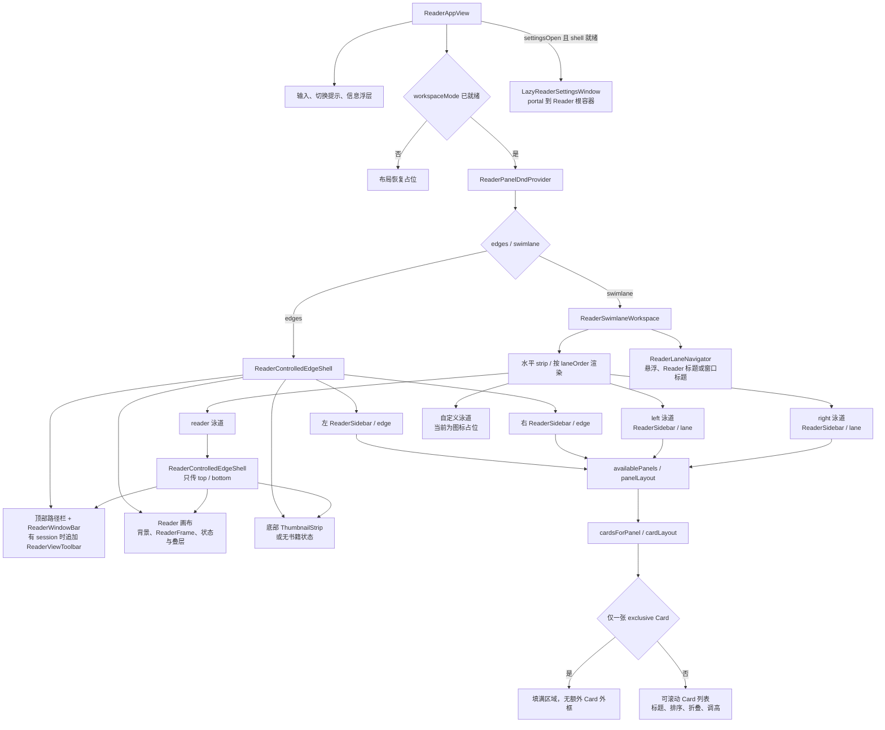

# Neoxide UI 复刻：NeoView 外壳源码证据

这是从当前 React NeoView 源码提取的第一版代码图与控件清单，覆盖泳道、四边栏、侧栏、阅读工具条和它们的状态绑定。采集方式为只读源码核查；尚未运行界面或测量几何。业务 Card 内部、完整设置分页和 ReaderFrame 媒体手势另建清单。

采集日期：2026-09-14。相关源码最近提交：`ccf465fe`；采集时下列参考源码无未提交改动。目标仍是 Neoxide 的 egui 界面，迁移约束见[设计访谈](ui-migration-interview.md)与[功能复用 ADR](adr/0060-preserve-neoxide-core-for-ui-redesign.md)。

## 外壳代码图

箭头表示组件组织和条件分支；不同分支不表示同时显示。图中不包含未经测量的像素尺寸。

## 布局与默认入口

| 区域 | 源码关系 | 来源 |
| --- | --- | --- |
| 根容器 | 占满宿主、禁止原生触摸滚动和内容溢出；运行时与设置窗口并列于布局。 | [ReaderAppView.tsx](../src/nodes/neoview/app/ReaderAppView.tsx)，L707 |
| 四边栏 | Reader 画布上覆盖四个边栏，上下边栏层级高于左右边栏。 | [ReaderEdgeShell.tsx](../src/nodes/neoview/features/shell/ReaderEdgeShell.tsx)，L299 |
| 泳道 | 单个水平 flex strip；按 `laneOrder` 排列；Reader 内部保留上下边栏。 | [ReaderSwimlaneWorkspace.tsx](../src/nodes/neoview/features/workspace/ReaderSwimlaneWorkspace.tsx)，L661；ReaderAppView L735 |
| 泳道折叠 | 内容和普通标题栏替换为展开按钮、图标与竖排名称。Reader 视图全屏隐藏 Reader 标题栏并去除外框。 | ReaderSwimlaneWorkspace L851、L914 |
| 上边栏 | 第一行三列：书籍／模式操作、居中路径、页码／窗口操作；有 session 时追加阅读工具条。 | ReaderAppView L383、L431 |
| 下边栏 | 有 session 时显示控制按钮、横向缩略图轨道与可选进度条；否则为固定按钮和未打开书籍状态。 | ReaderAppView L473；[ThumbnailStrip.tsx](../src/nodes/neoview/features/thumbnails/ThumbnailStrip.tsx)，L161 |
| 侧栏 | edge 模式为图标栏和内容；lane 模式为可停靠／悬浮的操作栏和内容。 | [ReaderSidebar.tsx](../src/nodes/neoview/features/panels/ReaderSidebar.tsx)，L158 |
| Card 外框 | 普通面板显示标题及纵向 Card 列表；单张 `exclusivePanel` Card 填满空间。 | ReaderSidebar L208、L235、L260 |

默认入口来自 [ReaderLayoutManifest.ts](../packages/nodes/neoview/src/application/config/ReaderLayoutManifest.ts)，L42：

| 默认区域 | 可见入口 | 隐藏入口 |
| --- | --- | --- |
| 左 | 文件夹、历史记录、书签、页面列表、设置 | 播放列表 |
| 右 | 信息、属性、超分、洞察、控制、AI | 基准测试 |
| floating | 无 | 卡片窗口 |

实际位置、可见性和顺序由 `panelLayout.position/visible/order` 覆盖；Card 分配由 `cardLayout.panelId/visible/order` 决定。解析入口为 [registry.ts](../src/nodes/neoview/features/panels/registry.ts)，L408、L423。Neoxide 独有功能需另按已有命令与工作流建立入口映射。

## 逐控件与交互清单

同一行中列出的按钮共用一种交互模式；列出的选项值仍须分别验收。

| 控件或入口 | 动作、状态及限制 | 来源 |
| --- | --- | --- |
| 关闭／打开书籍 | session 存在时关闭；有最近路径且 chrome ready 时可重新打开；busy 时禁用打开。 | ReaderAppView L392 |
| 泳道／四边栏模式 | 可逆切换，提交 `commitWorkspace({mode})`。 | [ReaderWindowBar.tsx](../src/nodes/neoview/features/shell/ReaderWindowBar.tsx)，L36 |
| 顶、底、左、右边栏开关 | 仅 edges 模式显示四个按钮；`requestOpen(edge)`，有 pressed 状态。 | ReaderWindowBar L49 |
| 固定顶栏／取消固定 | `setPinned("top")`。 | ReaderWindowBar L74 |
| NeoView 设置 | 打开设置窗口。 | ReaderWindowBar L75 |
| 退出 Reader 视图全屏 | 仅全屏时出现在上边栏，与泳道标题入口互补。 | ReaderWindowBar L56；ReaderAppView L339 |
| 当前／最近书籍路径 | 分段路径文本与分隔图标；当前不是可点击的路径导航。 | ReaderAppView L410 |
| 当前页／总页数 | 有 session 时显示，受 `hidden … lg:flex` 响应式条件控制。 | ReaderAppView L424 |
| 排序、缩放、旋转、幻灯片扩展入口 | 与放大镜、悬停滚动组成六种扩展区；同时只展开一个。 | [ReaderViewToolbar.tsx](../src/nodes/neoview/features/reader/ReaderViewToolbar.tsx)，L149、L225 |
| 全景、横纵布局、单双页 | 分别修改 `layout.panorama`、`presentation.orientation`、`layout.pageMode`。 | ReaderViewToolbar L154 |
| 阅读方向 | 左键切换；右键锁定／解锁。 | ReaderViewToolbar L159 |
| 悬停滚动 | 左键开关；右键展开速度设置；扩展区含开关及倍率滑块。 | ReaderViewToolbar L188、L283 |
| 放大镜 | 左键开关并展开；右键展开；放大倍率及镜片大小滑块。 | ReaderViewToolbar L202、L239 |
| 缩放比例 | 百分比短按复位、长按输入；手动缩放滑块。 | ReaderViewToolbar L65、L296 |
| 适应方式 | 适应窗口、铺满窗口、适应宽度、适应高度、原始大小、居左适应、居右适应。 | ReaderViewToolbar L334 |
| 页面布局选项 | 自动分割横向页、横向页视为双页、首页独立、尾页独立；宽页无对齐／高度统一／宽度统一；重置视图。 | ReaderViewToolbar L317 |
| 旋转选项 | 手动顺时针 90°；自动关闭、纵向页左旋／右旋、横屏左旋／右旋、始终左旋／右旋。 | ReaderViewToolbar L364 |
| 排序选项 | 锁定；视频优先／图片优先；文件名、大小、修改时间、Entry 顺序、随机；已选类别点击切换升降序，右键锁定。 | [ReaderPageOrderToolbar.tsx](../src/nodes/neoview/features/reader/ReaderPageOrderToolbar.tsx)，L29、L87 |
| 幻灯片选项 | 播放／暂停、间隔滑块、快捷间隔、循环、随机、倒计时与剩余时间。 | [ReaderSlideshowToolbar.tsx](../src/nodes/neoview/features/reader/ReaderSlideshowToolbar.tsx)，L33 |
| 底栏显示选项 | 钉住底栏、页码、区域、边栏、荧光；区域／边栏参考线画在缩略图轨道内。 | ThumbnailStrip L165、L187 |
| 缩略图与进度条 | 点击或拖动调用 `onSelect(pageIndex)`；有 RTL 映射，busy 时禁用导航。 | ThumbnailStrip L190、L237 |
| 展开／折叠／拖动泳道 | 修改 `lanes[id].collapsed`；拖动结束提交 `laneOrder`；折叠后保留展开入口。 | ReaderSwimlaneWorkspace L539、L589、L867、L935 |
| 相邻泳道分隔线 | 拖动直接预览两侧宽度，结束才提交对应宽度 profile；分隔线透明但可交互。 | ReaderSwimlaneWorkspace L333、L366、L986 |
| Reader 视图全屏 | Reader 标题专用入口；与“当前泳道全屏”具有不同视觉状态。 | ReaderSwimlaneWorkspace L940；ReaderAppView L339 |
| 泳道更多菜单 | 当前泳道全屏／退出、常规宽度输入、恢复默认宽度、重置操作栏位置、折叠。 | ReaderSwimlaneWorkspace L1103 |
| 宿主窗口菜单 | 有 `windowChrome` 才显示：窗口控件归属此泳道、使用顶部窗口标题栏、展开／收起窗口按钮。 | ReaderSwimlaneWorkspace L1116 |
| 泳道导航图标 | 每个 `laneOrder` 项一个定位按钮，激活并滚动进视野。 | [ReaderLaneNavigator.tsx](../src/nodes/neoview/features/workspace/ReaderLaneNavigator.tsx)，L112 |
| 导航栏菜单 | 添加泳道、按当前比例填满视口、常驻按比例适应；悬浮／固定到 Reader 标题／固定到窗口标题；Reader 独占时显示；删除当前自定义泳道。 | ReaderLaneNavigator L127 |
| 添加泳道 | 名称输入和确认；trim 后为空不提交；Escape／外部点击关闭。 | ReaderLaneNavigator L89、L97 |
| 操作栏外观 | 手柄：六点、三槽、四向、抓手、短轨；手柄位置：左／右。 | [SwimlaneBarAppearanceMenu.tsx](../src/components/workspace/swimlane/SwimlaneBarAppearanceMenu.tsx)，L14 |
| 面板图标 | 点击激活；鼠标／触摸长按拖动及键盘排序；可跨左右侧栏移动。 | ReaderSidebar L751；[ReaderPanelDnd.tsx](../src/nodes/neoview/features/panels/ReaderPanelDnd.tsx)，L32、L61、L119 |
| edge 侧栏固定 | `onLayoutCommit({side,pinned})`。 | ReaderSidebar L692 |
| edge 侧栏拖动 | 宽度、角落大小与移动手柄预览 width、customHeight、verticalAlign、horizontalPosition，pointerup 提交；移动手柄受设置与非 full height 限制。 | ReaderSidebar L174、L239、L321、L360 |
| edge 侧栏空白收起 | 配置允许时，单击／双击空白取消固定并隐藏；交互控件不触发。 | ReaderSidebar L334、L349 |
| lane 面板操作栏手柄 | 拖向上下左右边缘可停靠，否则悬浮；记录百分比坐标；可 portal 到泳道标题。 | [ReaderPanelBar.tsx](../src/nodes/neoview/features/panels/ReaderPanelBar.tsx)，L76、L122 |
| 面板操作栏菜单 | 悬浮／固定到当前位置；限制在本泳道／允许移出。 | ReaderPanelBar L215 |
| Card 外框控件 | 上移／下移、展开／折叠、恢复自动高度、调整高度；高度拖动结束提交，取消恢复；独占 Card 隐藏这些外框控件。 | [CollapsibleReaderCard.tsx](../src/nodes/neoview/features/panels/CollapsibleReaderCard.tsx)，L73、L105、L142；ReaderSidebar L287 |
| 信息面板更多菜单 | 有 session 时显示复制路径、在资源管理器中打开；按 metadata、pending 和宿主能力禁用。 | [InfoPanelActions.tsx](../src/nodes/neoview/features/panels/InfoPanelActions.tsx)，L10、L57 |
| 浮动侧栏控制器 | edges 模式；可拖动位置；逐边开关、右键循环锁定、自动／锁定展开／锁定隐藏菜单。 | ReaderAppView L701；[SidebarFloatingController.tsx](../src/nodes/neoview/features/shell/SidebarFloatingController.tsx)，L122、L177 |
| 泳道错误恢复 | ErrorBoundary 提供返回四边栏入口。 | ReaderSwimlaneWorkspace L1218 |

## 状态和持久化边界

| 状态 | 实际绑定 |
| --- | --- |
| 模式、laneOrder、折叠、宽度 profiles、操作栏位置、lane.activePanelId | `commitWorkspace` → optimistic patch → 串行 `updateShellControl(expectedRevision, …)`；有 409 重试及失败协调。[ReaderAppWorkspaceActions.ts](../src/nodes/neoview/app/ReaderAppWorkspaceActions.ts)，L307、L340。 |
| activeLane、readerSolo、soloLaneId | `splitReaderWorkspacePatch` 单独送 session store，和普通 workspace 配置 patch 分开。[ReaderAppModules.tsx](../src/nodes/neoview/app/ReaderAppModules.tsx)，L42。 |
| Reader 视图全屏 | 更新 restore store、回调及泳道 session patch。ReaderAppView L339。 |
| 侧栏布局、Card 高度／展开、Panel／Card 排序 | 分别调用 `updateSidebarLayout`、`updateCardLayout`、`updateBoardLayout`，各有回滚。ReaderAppWorkspaceActions L383、L399、L424、L445。 |
| 当前 Panel | lane 模式由 App 传 `activePanelId` 并提交；edge 模式使用 Sidebar 局部 state。ReaderAppView L610、L759；ReaderSidebar L339。 |
| 阅读显示设置 | fit、orientation、autoRotation、widePageStretch 写 view defaults；manualScale、手动 rotation 只改 presentation；pageMode、splitWidePages 在 session 更新成功后补写默认值。[ReaderAppSettingsActions.ts](../src/nodes/neoview/app/ReaderAppSettingsActions.ts)，L354、L375。 |
| 底栏显示开关 | 页码／荧光为内存 store；区域／边栏参考线为组件 state，这些路径没有配置写入。[ReaderViewerToggleStore.ts](../src/nodes/neoview/features/viewer/ReaderViewerToggleStore.ts)，L20。 |

类型入口为 [reader-http-runtime-contract.ts](../src/nodes/neoview/adapters/reader-http-runtime-contract.ts)：Shell L13、Lane L93、Sidebar patch L681、Card patch L690、Board patch L698、Shell control patch L715。[ReaderWorkspaceLayout.ts](../src/nodes/neoview/features/workspace/ReaderWorkspaceLayout.ts) 从这些 DTO 派生类型并归一化布局。

上述绑定是 React 参考的行为证据。Neoxide 将映射到自己的设置、业务与会话边界；这份清单不要求迁移 Xiranite 的数据库或直接复制其 HTTP 协议。

## 动态范围与验证现状

- 自定义泳道当前只有 `Columns3` 占位图标（ReaderSwimlaneWorkspace L517）。它尚不能作为任意 Panel 容器的功能基线。
- 边栏具有自动、锁定展开、锁定隐藏、固定、延迟显示／隐藏及输入保护。[ReaderControlledEdgeShell.tsx](../src/nodes/neoview/features/shell/ReaderControlledEdgeShell.tsx) L53；ReaderEdgeShell L240。
- 首次访问和 Card 挂载是动态的：访问过的 File Panel 特别保活，其他非活动面板会卸载；Card 按视口调度。ReaderSidebar L208、L476。
- 当前未测量运行时 geometry、字体、各主题、portal 遮挡和拖拽手感。后续通过固定 fixture 的布局 JSON／SVG 和 Vitest Browser Mode 补充；尚未实现完整自动导出器。
- 业务 Card 内部、设置窗口所有分页、ReaderFrame 图像手势、宿主窗口按钮内部实现不在本版清单范围内。

以下记录已有测试的断言范围，本次未执行：

| 测试 | 已编写的覆盖 |
| --- | --- |
| [ReaderSwimlaneWorkspace.browser.test.tsx](../src/nodes/neoview/features/workspace/ReaderSwimlaneWorkspace.browser.test.tsx)，L9、L47 | Reader fullscreen 时透明分隔线仍可拖动；相邻真实宽度变化、回调与折叠邻栏边界。 |
| [ReaderSidebar.browser.test.tsx](../src/nodes/neoview/features/panels/ReaderSidebar.browser.test.tsx)，L15 | 切换页面列表再返回文件夹，File Card DOM、缩略图与目录 session 保留且不重复探测。 |
| [ReaderViewToolbar.browser.test.tsx](../src/nodes/neoview/features/reader/ReaderViewToolbar.browser.test.tsx)，L7 | 固定宿主宽度下工具条按钮组几何居中。 |
| [ReaderApp.browser.test.tsx](../src/nodes/neoview/app/ReaderApp.browser.test.tsx)，L22、L38、L190、L224、L352、L371 | 配置未返回时泳道启动；外部目录越过左边栏禁用／延迟加载；缓存布局恢复与启动写入竞争。 |

普通 `*.test.tsx` 另有排序、折叠、独占、预览、菜单及窗口控件归属断言；真实拖拽／几何覆盖仍以 Browser Mode 用例及实际执行结果为准。

## 关键源码指纹

SHA-256 用于识别本版清单是否需要重新核查：

| 文件 | SHA-256 |
| --- | --- |
| ReaderAppView.tsx | `c57cf366d8c58c40fd2513c62b22658da654a9f5133e4dd567c8dacf775340e4` |
| ReaderSwimlaneWorkspace.tsx | `a4318bcb0569065d47593e8dbc9a278eb8a7499edb4b14d1978f9acca5e13144` |
| ReaderSidebar.tsx | `344c7d24914ea2c94d78fac85c2d76919bde192f354c30815914a03806437909` |
| ReaderViewToolbar.tsx | `83dc98f7f6941b55b7848580b25f7c2f67cb769d60a6b4253863a901eaeaf8fc` |
| ReaderAppWorkspaceActions.ts | `169458758a40c898b3a1c6f9e6184e3eef2955cb4b4f1cb0dca559309c72d97a` |
| ReaderLayoutManifest.ts | `129a165b8a88ccf15ecd98ea174cad3303e50ea6ff2f7bbbf047bb2f2fd91fa8` |

## UI 组件规范与生态 Crate 复用准则

### 1. 新 UI 组件规范（严禁重复手搓）
- **禁止手写基础控件**：新增或重构 egui / 网页端 UI 组件时，禁止从底层裸 `ui.painter()` 或原生 primitive 盲目手写基础交互部件（如各类按钮变体、卡片容器、输入框、下拉框、标签栏、徽章、工具提示与模态对话框）。
- **参考与对齐成熟设计系统**：
  - 参考 [`egui-shadcn`](https://github.com/pjankiewicz/egui-shadcn) 的设计系统与部件变体范式（Button Variants: `Default`, `Secondary`, `Outline`, `Ghost`, `Destructive`；Card、Badge、Dropdown、Slider、Tooltip、Separator、Dialog 等），保持整套 UI 的视觉层次感、微交互和专业质感。
  - 参考 [`ouroboros-ui`](https://github.com/Type-zero-labs/ouroboros-ui) 的复合组件设计理念与状态生命周期，采用高内聚、易组合的 Widget 抽象，将泳道、侧栏、卡片和阅读控制条组装为整洁的声明式 UI。
- **Tokens 与状态系统**：
  - 颜色、圆角、外边距、内边距严格收敛在 `theme::metrics` 与 `ThemeColors` 中，禁止在具体控件中硬编码魔法像素值。
  - 完整覆盖 `Normal`、`Hover`、`Active/Pressed`、`Focused`、`Selected` 与 `Disabled` 六态交互视觉反馈。

### 2. 现有 Crate 选型与复用准则
- **通用能力优先复用**：所有新功能需求必须首先调研 crates.io 与开源生态中成熟且维护活跃的已有库，禁止在业务项目中重新手写通用基础设施代码。
- **多 Crate 选型门禁**：若存在多个候选 crate，必须进行明确的技术选型评估并记录在文档或 ADR 中：
  1. **跨平台兼容性**：必须支持原生 Windows（Win32/D3D11/DX12）以及 WebAssembly (`wasm32-unknown-unknown` + WebGPU/WebGL)，禁止在通用 UI 与业务层中硬编码平台专属系统调用。
  2. **API 人机工学与类型安全**：API 清晰、符合 Rust 惯用法、所有权与生命周期契约明确。
  3. **许可证安全性**：必须符合宽松商业友好的开源协议（MIT、Apache-2.0、BSD-3-Clause 等），严禁引入 GPL/AGPL 等具有感染性的许可证。
  4. **维护活跃度与健康状态**：评估近期的 commit 活跃度、Issue 响应速度、Crates.io 下载量以及依赖链深度。
  5. **包体与运行时性能**：对二进制体积、启动耗时和渲染每帧开销进行基准核查，避免引入过重或存在全局锁竞争的庞大依赖。
