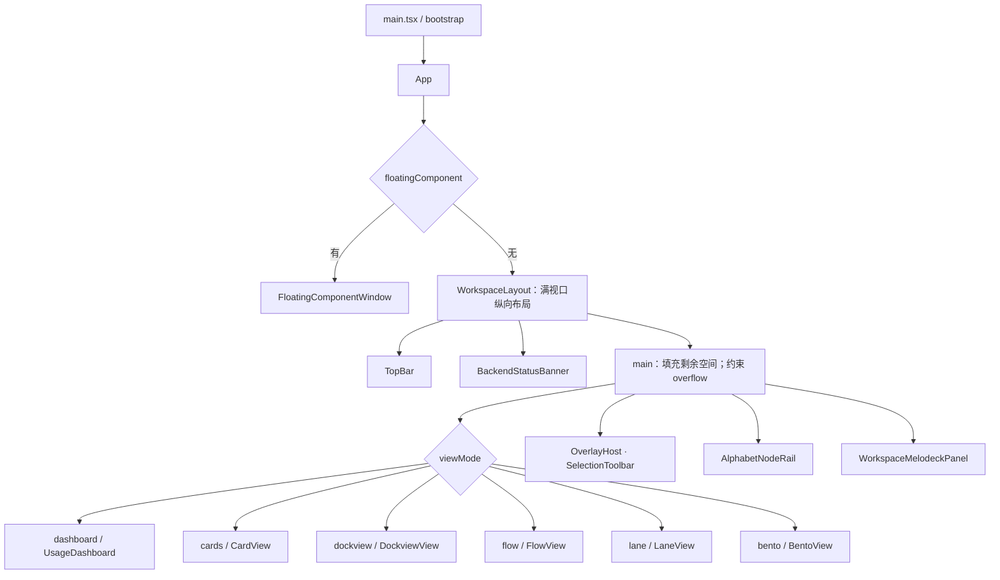

# 原生与浏览器 UI 迁移访谈

状态：需求澄清中。2026-09-14 核查当前工作区，HEAD 为 `ccf465fe`。
本文记录用户目标、源码事实、设计证据和未决问题；不代表已经选定目标框架或开始生产迁移。

## 已明确的目标

- 以现有 React UI 为体验来源，在新框架中复刻界面；优先通过可读结构图、SVG 和结构化数据理解设计，减少逐张人工截图。
- 保留 Windows 特性，同时针对 macOS 优化。此次目标扩展了现有 Windows/Wails 交付范围；不能用旧的平台优先级排除 Mac 工作。
- 浏览器直接运行 WASM UI，同时保留原生 UI 的 GPU 渲染路径。
- 用户使用的框架名称是“一级 UI”；`egui/eframe` 目前只是待核实的解释。

## 当前源码事实

| 事实 | 证据与含义 |
| --- | --- |
| 主界面由 React 挂载 | [`src/main.tsx`](../src/main.tsx) 的 `bootstrap()` / `createRoot()`，以及 [`src/App.tsx`](../src/App.tsx)。 |
| 桌面主窗口是 Wails WebView | [`main.go`](../main.go) 嵌入 `dist` 并创建 `WebviewWindow`。此处的原生窗口不等于已有原生 GPU UI 实现。 |
| 主工作区与组件浮窗共用 App | [`src/App.tsx`](../src/App.tsx) 依据 `floatingComponent` 选择 `FloatingComponentWindow` 或 `WorkspaceLayout`；[`web.ts`](../src/backend/adapters/web.ts) 用当前 URL 加查询参数打开浏览器浮窗。 |
| 设置页已有“外部前端”入口 | [`RuntimeSection.tsx`](../src/components/views/settings/RuntimeSection.tsx) 打开 `runtimeInfo.frontendDevUrl`；[`runtimeConnectionInfo.ts`](../src/backend/runtimeConnectionInfo.ts) 从 `VITE_XIRANITE_FRONTEND_DEV_URL` 读取它。它目前是开发服务器入口，尚不是生产版 WASM 前端。 |
| 浏览器业务与宿主能力需要分别看待 | Web adapter 对窗口、托盘、进程等有限制，但节点、配置和 NeoView 另有 HTTP 客户端。不能因为 Web adapter 使用 MemoryFS 就判定全部浏览器业务脱离本机后端。 |
| 存在另一个 HTML 入口 | [`node-host.html`](../src/entrypoints/node-host.html) 用于外部节点启动宿主，其入口仍为 React；它不是 WASM UI。 |
| 未定位到目标框架实现 | 在维护中的源码、选定本地分支文档和浅层相邻项目 manifest 中，未找到本次 egui/eframe UI 迁移。Cargo 缓存中的依赖不能作为项目已采用框架的证据。 |

本次只核查源码，未启动应用、测试、构建或用户数据库。

## 已提取的 React 工作区结构图

下面按 [`WorkspaceLayout.tsx`](../src/components/workspace/WorkspaceLayout.tsx) 的声明整理，表示组件组合和条件分支，不表示实测像素位置。上下文 Provider 与同步组件在图中省略，可从 `App` 和 `WorkspaceLayout` 回溯。

结构之外还要保留生命周期：`NeoViewKeepAliveProvider` 在工作区视图切换时维持 NeoView 实例；只对照静态界面可能漏掉阅读状态、解码成本和窗口恢复行为。

[`design-axes.css`](../src/styles/themes/design-axes.css) 已提供可提取的设计参数：

| 参数 | 根级默认声明 | 说明 |
| --- | --- | --- |
| 控件最小高度 | `2.25rem` | compact 为 `2rem`，comfortable 为 `2.5rem`。 |
| 节点间距 / 内边距 | `0.75rem` / `1rem` | 密度选择会覆盖。 |
| 动效时长 | `200ms` | 动效轴和组件自身声明都可能覆盖。 |
| 圆角、面板颜色、字体 | `var(...)` / `color-mix(...)` | 必须结合主题和运行时计算值解析。 |

这些是 CSS 声明证据，不能直接当作当前主题的实测样式。

## 建议采用的 UI 证据包

复用已有 OXC、迁移清单和 Vitest Browser Mode 能力，按选定模块生成下列材料。当前没有发现完整的 React UI → SVG 导出器，不能把已有 Svelte → React 工具反向当成现成转换器。

| 材料 | 内容 | 可证明的范围 |
| --- | --- | --- |
| 源码结构图 | 组件/元素树、条件、循环、控件类型、事件、文件与行号 | 声明结构与绑定关系。动态生成或无法解析的节点显式列为未覆盖。 |
| 控件与状态清单 | 默认、选中、禁用、展开、折叠、加载、错误；快捷键、持久化与生命周期 | 复刻验收项与源码来源；行为仍需执行验证。 |
| 布局 JSON | 固定 viewport、主题、密度、fixture 下的 bounds、computed style、role/name 和动作结果 | 对应状态下真实浏览器布局与可见行为。 |
| SVG 布局图 | 从布局 JSON 绘制区域、控件、标签及源码索引 | 可缩放、可检索的布局示意；不冒充字体、阴影、媒体和动效的无损截图。 |
| 证据 manifest | 源码 revision/hash、采集条件、支持范围、未覆盖项 | 检测基线漂移并重现采集。 |

可复用的具体事实源：

- [`packages/svelte-migrate/src/generate.ts`](../packages/svelte-migrate/src/generate.ts)：inventory、component graph、源码 revision 和 scaffold manifest 的产物组织。
- [`packages/svelte-migrate/src/react-scaffold.ts`](../packages/svelte-migrate/src/react-scaffold.ts)：条件、循环、事件及 unsupported 的溯源模式。
- [`migration/neoview/card-acceptance-contract.json`](../migration/neoview/card-acceptance-contract.json)：逐控件、快捷键、状态、持久化、生命周期与偏离记录的验收维度；新迁移建立独立基线。
- [`ReaderSwimlaneWorkspace.browser.test.tsx`](../src/nodes/neoview/features/workspace/ReaderSwimlaneWorkspace.browser.test.tsx)：已有真实组件挂载、几何测量、透明拖拽边界及拖拽后配置 patch 的验证。

候选首个样本是 NeoView 三泳道外壳：普通布局、Reader 全屏、右栏折叠、拖拽调整四种状态。它能检验分栏、焦点、折叠和持久化，但不代表阅读器和所有 Card 已经迁移；是否采用取决于 Q1 的范围。

新 React 布局采集沿用 Browser Mode；不新增普通 Playwright spec 或临时探针。原生 GPU UI 与 macOS 窗口行为需要对应宿主验证，不能用 DOM 测试替代。

## 平台与渲染边界

Windows 现有能力包括任务栏身份、单实例唤起、Job Object 进程回收、自定义 URL 协议、Explorer 菜单、快捷方式和系统缩略图。Mac 已有部分 Wails 窗口配置、Unix socket 和平台命令分支，但多处 `*_other.go` 仍为空实现或明确不支持；当前不能宣称 Mac 已完成适配。可从 [`main.go`](../main.go)、[`external_node_launch_instance_other.go`](../external_node_launch_instance_other.go)、[`local_backend_containment_other.go`](../local_backend_containment_other.go) 和 [`windows-release.yml`](../.github/workflows/windows-release.yml) 继续建立逐能力清单。

WASM 是代码执行形式，GPU 绘制由各端图形后端承担；两者可以同时存在。普通原生 GPU 绘制、接入外部解码器纹理、跨进程纹理共享是不同要求。浏览器不能直接沿用桌面进程的原生纹理句柄，浏览器媒体传输和原生纹理互操作必须分别设计。

如果目标确定为 egui/eframe，优先核查现成布局/控件扩展与应用层定制能否实现体验，再决定是否需要框架源码改动。尚未选择依赖、fork 或重写业务后端。

## 第一轮待决策项

以下问题已发给用户。建议值不是已接受决定，未答项保持开放。

| 编号 | 决策 | 当前建议 | 状态 |
| --- | --- | --- | --- |
| Q1 | 迁移范围：整个 Xiranite、仅 NeoView，还是分阶段限制入口 | 先明确整体目标，再按模块验收 | 待答 |
| Q2 | 浏览器 UI 是否允许依赖本机后端 | 浏览器本地渲染 UI，本机服务提供文件、数据库和原生工具能力 | 待答 |
| Q3 | 体验复刻的验收标准 | 布局、密度、控件和交互逐项对齐，记录平台惯例差异 | 待答 |
| Q4 | “一级 UI”是否确指 egui/eframe；目标源码是否另有位置 | 核实英文框架名与目标，再讨论框架修改 | 待答 |
| Q5 | GPU 要求是否包括已有纹理接入、CPU 读回限制 | 先区分原生 GPU 绘制与额外纹理互操作要求 | 待答 |
| Q6 | Windows 专属能力在 Mac 上如何验收 | 保留 Windows 能力，Mac 建立对应体验并明确能力缺口 | 待答 |

本仓库术语表中“外部浏览请求”也用于 NeoView 目录标签导航；本次用户描述的是系统浏览器中的 UI。后续需要确认这两类入口的正式名称，避免混用。

## 后续决策依赖

待第一轮回答后，再展开依赖它们的细节：

- Q1/Q3/Q4 → 源码基线、主题/密度覆盖、模块顺序、迁移共存方式、组件复刻策略与框架选型证据。
- Q2 → 浏览器入口部署、关闭桌面后的服务生命周期、访问本机或远程服务、认证、离线能力、多窗口/多端状态冲突。
- Q4/Q5 → 原生与 WASM 的共享边界、纹理来源、上传/读回预算、浏览器图形后端兼容范围及媒体性能验证。
- Q6 → macOS 架构和系统版本、快捷键/输入法/触控板/窗口行为、平台专属节点替代、签名公证与真实 Mac 验收。

术语明确时写入 `CONTEXT.md`；只有形成包含实际取舍的架构决定后才创建 ADR。此轮尚未写入接受状态的 ADR，也未修改生产代码。
