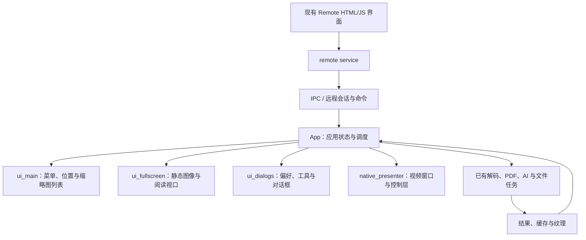
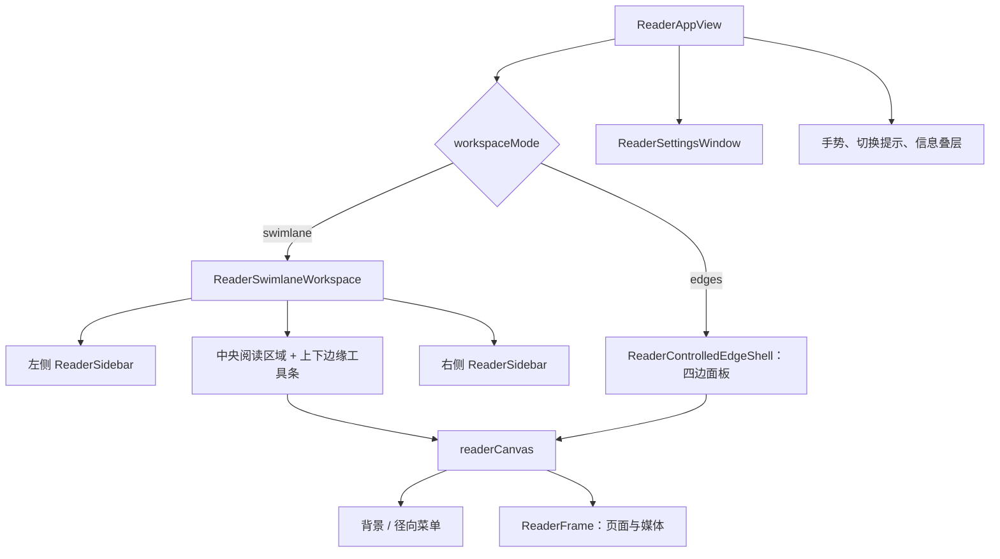
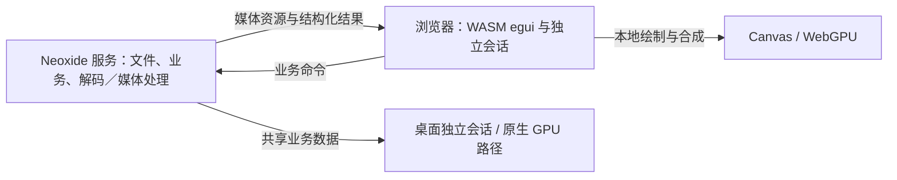

# Neoxide 界面复刻、国际化与跨平台设计访谈

状态：目标、功能复用边界、双端会话与 i18n 彻底重构已确认，其余设计继续澄清。2026-09-14 核查本地 `vendor/neoxide`，其 HEAD 为 `f2380d2b`，另有未提交改动。它是根仓库忽略的独立 checkout，origin 为 `HibernalGlow/neoxide`，上游为 `MikageSawatari/mimageviewer`。
本文记录设计过程；当前未修改 Neoxide 生产代码。已确认的边界见 [功能复用 ADR-0060](adr/0060-preserve-neoxide-core-for-ui-redesign.md)、[渲染与会话 ADR-0061](adr/0061-render-neoxide-clients-locally-with-independent-sessions.md) 和 [国际化 ADR-0062](adr/0062-use-semantic-messages-for-neoxide-i18n.md)。

## 已明确的目标

- 目标是 Neoxide，框架确定为 egui。用户看重它已经实现的功能，希望重做不满意的界面，复用现有业务能力。
- 已确定采用 Xiranite 当前 NeoView 的泳道／侧栏布局与交互，并为 Neoxide 独有功能保留合适入口。
- 优先通过可读结构图、SVG 和结构化数据理解设计，减少逐张人工截图。
- 彻底重构 i18n 基础设施及全部应用文案调用点：稳定语义 key、语言资源、参数化消息，中英日完整覆盖。现有译文仅作为文案素材迁入新目录；移除日文字面量查表、成句后补翻译和字符替换路径。
- 保留 Windows 特性，同时针对 macOS 优化；浏览器直接运行 WASM UI，同时保留原生 UI 的 GPU 渲染路径。
- 浏览器继续使用 Neoxide 本机核心／远程服务，尽量保持原生功能一致；性能优先，界面在客户端本地 GPU 绘制。
- 桌面与浏览器独立浏览并同时可操作，共享文件和业务数据。WebGPU 为浏览器版必需能力，允许必要的媒体转码兼容。

## 当前源码事实

| 事实 | 证据与含义 |
| --- | --- |
| egui 已是目标应用框架 | [`vendor/neoxide/Cargo.toml`](../vendor/neoxide/Cargo.toml) 使用 eframe/egui/egui-wgpu 0.33 和 wgpu 27；已有三个 UI crate 的本地 patch，不能默认当成未修改的上游。 |
| 日文上游与当前分支需区分 | 上游 README 写明 Japanese only；当前 [`src/i18n.rs`](../vendor/neoxide/src/i18n.rs) 已有 Japanese / SimplifiedChinese、语言持久化及切换，默认设置为简体中文。English 尚未接入。 |
| 功能可复用，但 UI 尚非完全独立 | [`src/ui_main.rs`](../vendor/neoxide/src/ui_main.rs) 菜单会直接改变 App 字段、重载、保存或触发系统动作；[`src/keymap.rs`](../vendor/neoxide/src/keymap.rs) 已有稳定命令身份与描述，但不等于统一执行总线。 |
| 原生 GPU 渲染确实存在 | 普通 UI 使用 egui/wgpu；视频是独立 HWND + D3D11 swap chain + DirectComposition，HUD 还有独立 egui/DX12 overlay。事实源是 [`video-architecture.md`](../vendor/neoxide/docs/video-architecture.md) 与 [`overlay_gpu.rs`](../vendor/neoxide/src/video/native_presenter/overlay_gpu.rs)。 |
| 已有独立浏览器页面 | [`crates/remote-web/web/index.html`](../vendor/neoxide/crates/remote-web/web/index.html) 加载独立 HTML/CSS/JS UI，由 remote service 经 IPC 访问 core；当前不是 egui WASM。 |
| 远程显示所有权影响功能 | 当前 Remote 会取得显示所有权并限制本机通常操作；浏览器与原生的会话关系不能仅由“换前端资源”决定。见 [`web-remote-plan.md`](../vendor/neoxide/docs/web-remote-plan.md)。 |
| 关闭窗口与退出应用不是同一生命周期 | [`tray_integration.rs`](../vendor/neoxide/src/tray_integration.rs) 仅在关闭到托盘设置开启且托盘可用时拦截关闭；明确退出绕过拦截。`run_native` 返回后 [`remote_ipc/service.rs`](../vendor/neoxide/src/remote_ipc/service.rs) 的 manager 收尾其拥有的远程子进程。保留 HTTP 子进程本身不足以实现独立常驻 core。 |
| 当前续读位置按书籍容器共享 | [`book_resume_db.rs`](../vendor/neoxide/src/book_resume_db.rs) 使用 `path PRIMARY KEY` 和 `page`，没有客户端或会话维度；原生与 [`remote_ipc/ui.rs`](../vendor/neoxide/src/remote_ipc/ui.rs) 均写同一个 writer。开放双端操作后直接沿用会按处理／落库顺序覆盖；独立当前画面与各端独立续读必须分别定义。 |
| Mac 需要实际平台适配 | [`src/lib.rs`](../vendor/neoxide/src/lib.rs) 当前 GPU backend 选择仅含 DX12/Vulkan；字体、视频呈现、系统解码、AI、IPC 与分发也存在 Windows 专属实现。已有非 Windows 编译检查不代表 Mac 运行交付完成。 |

本次只核查源码，未启动应用、测试、构建或用户数据库。

## 已提取的界面结构图

Neoxide 的当前组合关系如下，依据 [`architecture-overview.md`](../vendor/neoxide/docs/architecture-overview.md) 和实际 UI/视频入口整理。箭头表示调用或组织关系，不表示实测布局。

已选定的 React 参考来源是 [`ReaderAppView.tsx`](../src/nodes/neoview/app/ReaderAppView.tsx)，它实际具有以下两种布局。这是界面参考，不表示 Neoxide 已有同名布局。

[`design-axes.css`](../src/styles/themes/design-axes.css) 已提供可提取的设计参数：

| 参数 | 根级默认声明 | 说明 |
| --- | --- | --- |
| 控件最小高度 | `2.25rem` | compact 为 `2rem`，comfortable 为 `2.5rem`。 |
| 节点间距 / 内边距 | `0.75rem` / `1rem` | 密度选择会覆盖。 |
| 动效时长 | `200ms` | 动效轴和组件自身声明都可能覆盖。 |
| 圆角、面板颜色、字体 | `var(...)` / `color-mix(...)` | 必须结合主题和运行时计算值解析。 |

这些是 CSS 声明证据，不能直接当作当前主题的实测样式。

## 建议采用的 UI 证据包

React 侧复用 OXC、迁移清单和 Vitest Browser Mode；Neoxide 侧复用 egui_kittest、命令目录和实际绘制输出。当前没有发现完整的 UI → SVG 导出器，不能把已有 Svelte → React 工具反向当成现成转换器。

| 材料 | 内容 | 可证明的范围 |
| --- | --- | --- |
| 源码结构图 | 组件/元素树、条件、循环、控件类型、事件、文件与行号 | 声明结构与绑定关系。动态生成或无法解析的节点显式列为未覆盖。 |
| 控件与状态清单 | 默认、选中、禁用、展开、折叠、加载、错误；快捷键、持久化与生命周期 | 复刻验收项与源码来源；行为仍需执行验证。 |
| 布局 JSON | 固定 viewport、主题、密度、fixture 下的 bounds、computed style、role/name 和动作结果 | 对应状态下真实浏览器布局与可见行为。 |
| SVG 布局图 | 从布局 JSON 绘制区域、控件、标签及源码索引 | 可缩放、可检索的布局示意；不冒充字体、阴影、媒体和动效的无损截图。 |
| 证据 manifest | 源码 revision/hash、采集条件、支持范围、未覆盖项 | 检测基线漂移并重现采集。 |

Neoxide 的 `FullOutput` 已包含 shapes、纹理增量、像素比例和 viewport，PlatformOutput 可含 AccessKit 数据。它们可作为控件/几何导出的原料；原生视频、GPU callback、纹理图片和未渲染的虚拟化项目需要单独标注，不能假称 SVG 覆盖全部画面。

可复用的具体事实源：

- [`packages/svelte-migrate/src/generate.ts`](../packages/svelte-migrate/src/generate.ts)：inventory、component graph、源码 revision 和 scaffold manifest 的产物组织。
- [`packages/svelte-migrate/src/react-scaffold.ts`](../packages/svelte-migrate/src/react-scaffold.ts)：条件、循环、事件及 unsupported 的溯源模式。
- [`migration/neoview/card-acceptance-contract.json`](../migration/neoview/card-acceptance-contract.json)：逐控件、快捷键、状态、持久化、生命周期与偏离记录的验收维度；新迁移建立独立基线。
- [`ReaderSwimlaneWorkspace.browser.test.tsx`](../src/nodes/neoview/features/workspace/ReaderSwimlaneWorkspace.browser.test.tsx)：已有真实组件挂载、几何测量、透明拖拽边界及拖拽后配置 patch 的验证。
- [`vendor/neoxide/tests/ui_snapshot.rs`](../vendor/neoxide/tests/ui_snapshot.rs)：已有 egui_kittest 离屏绘制和真实生产控件入口；原生组件复刻复用这套框架。

参考采集可从 NeoView 三泳道外壳开始：普通布局、Reader 全屏、右栏折叠、拖拽调整。Neoxide 实现验证可先选已有独立绘制函数的“视频缩略图标记设置”，覆盖中英文、窄宽布局、选项值与语言切换后的控件身份，再扩大到菜单与主布局。样本通过不代表其他功能已复刻。

新 React 布局采集沿用 Browser Mode；不新增普通 Playwright spec 或临时探针。原生 GPU UI 与 macOS 窗口行为需要对应宿主验证，不能用 DOM 测试替代。

## 国际化与身份边界

当前 [`i18n-plan.md`](../vendor/neoxide/docs/i18n-plan.md) 和 `src/i18n.rs` 模块说明使用日文源文案作为增量查表 key，并以减少上游冲突为由回避语义键迁移。这是被用户明确否定的旧方案，不能再作为实现依据。i18n 彻底重构已确认，无需重新选择机制；目标为语义消息 ID、语言目录和类型化参数，例如 `viewer-selected-count` 接收数字参数 `count`，由语言资源处理词序和复数。

完成标准包括桌面和 WASM 的全部应用自有文案：菜单、侧栏、设置及搜索、提示、可访问标签、进度和用户可见错误。逐项迁移调用点，并退出旧查表 API／词表、`t_owned(format!(...))` 和 `i18n_tool.py wrap` 工作流；新 API 底层也不得继续查日文原句。语言目录以语义 key 和参数契约检查完整性，不能用假名扫描或字符替换数量证明覆盖。现有译文只复用内容，维护文档与检查工具同步更新；完整验收条件见 ADR-0062。

locale 由浏览会话显式持有，共享词库不持有可变的全局当前语言。现有中文译文按调用点含义迁入资源，英文补齐，日文也进入正式目录。当前推荐评估 Fluent/FTL 与 `fluent-templates`；依赖取舍、WASM 证据和待测成本见 ADR-0062，尚未引入依赖。

翻译仅改变显示文字，不改变 `stable_name`、`ini_name`、serde 值、设置键、路径、用户内容、anchor 或 widget ID。`Window::new` 等 egui API 默认可能从标题生成 ID，换文案前必须保留明确的稳定身份。偏好窗口和菜单需逐项核对。

[`ui_fonts.rs`](../vendor/neoxide/src/ui_fonts.rs) 当前使用 Windows 字体路径，中文 fallback 主要补缺字。Mac/WASM 需确定可分发字体和加载方式，验证中日字形、英文宽度、缺字与输入法；翻译覆盖率与字体覆盖率分别验收。

## 平台与渲染边界

WASM 是代码执行形式，GPU 绘制由各端图形后端承担；两者可以同时存在。普通原生 GPU 绘制、接入外部解码器纹理、跨进程纹理共享是不同要求。浏览器不能直接沿用桌面进程的原生纹理句柄，浏览器媒体传输和原生纹理互操作必须分别设计。

Windows 保留 D3D11 视频呈现与 egui/DX12 HUD overlay 的配合链。旧的“视频纹理导入 wgpu”路径已撤销，部分旧注释仍描述该路径；不能据旧注释重建已经移除的架构。Mac 针对 GPU 后端、视频解码/呈现、WIC、AI、字体、IPC 和发行物建立独立适配清单。

egui/eframe 已确定，优先核查现成布局/控件扩展与应用层定制能否实现体验。已有 framework patch 是当前应用基线，是否增加修改要由具体缺口决定。

浏览器已确定复用现有 core，沿用 remote 的命令、认证、取消和媒体能力，补足共同 UI 所需契约；WASM 目标不能直接链接 Windows API、FFmpeg DLL、数据库或本机纹理句柄。当前 Remote 的排他接管需要改成独立会话，资源完成、取消和失效操作均须携带所属会话身份。

Canvas 是显示表面，WebGPU 是可用于该表面的绘制 API。服务端解码与浏览器本地 GPU 绘制可以组合；本地绘制不强制所有源媒体都在客户端解码。现有远程静图已有 core 解码/合成 → 编码资源 → IPC/HTTP → 浏览器解码的路径。选择 JPEG/WebP 等传输格式时浏览器仍需解码该格式；原始像素可省此步骤，但会增加传输和上传成本。

本次禁止通过 IPC 传桌面界面帧或 egui 绘制指令来驱动浏览器 UI。服务端内部 IPC 可以继续承载业务命令、解码任务及媒体资源结果；缩放、平移、侧栏拖动和界面合成由客户端完成。WebGPU 与 Canvas 2D 的性能不能只凭 API 名称判断，必须计入解码、传输、复制、纹理上传和绘制整条链路。

渲染选型的依据是复用 egui/wgpu、合成与着色器能力，而非声称 WebGPU 总比 Canvas 2D 快。WebGPU 远程入口需要 HTTPS 等安全上下文，可复用现有 Tailscale；localhost 亦可。具体预算和基准项目见 ADR-0061。

## 决策状态

以下问题已发给用户。建议值不是已接受决定，未答项保持开放。

| 编号 | 决策 | 当前建议 | 状态 |
| --- | --- | --- | --- |
| Q1 | 迁移对象 | Neoxide 的界面，复用其已有功能；不迁移整个 Xiranite 工作区 | 已确认 |
| Q2 | WASM 浏览器 UI 与后端关系 | 继续使用 Neoxide core / remote service，尽量与原生功能一致 | 已确认 |
| Q3 | 体验复刻的验收标准 | 采用 NeoView 布局与交互；性能优先，原生功能保留 | 已确认方向，基准待量化 |
| Q4 | 框架与源码 | egui；目标已定位到 `vendor/neoxide` | 已确认 |
| Q5 | 原生 GPU 要求 | 保留 Neoxide 已有原生 GPU 路径；源码已明确视频和 HUD 两条链 | 目标已确认，性能预算后续量化 |
| Q6 | Mac 首批验收机器与平台能力 | Apple Silicon 优先验收；保留 Windows 能力，Mac 对应功能逐项适配，不默认删减 | 本轮询问；可填写 Mac 型号与 macOS 版本 |
| Q7 | React 体验基准 | Xiranite 当前 NeoView 的泳道／侧栏布局和交互，保留 Neoxide 独有功能入口 | 已确认 |
| Q8 | 双端会话 | 独立浏览、同时可操作，共享文件和业务数据 | 已确认 |
| Q9 | 浏览器 GPU 与兼容性 | WebGPU 必需，允许必要媒体转码；服务端解码与本地绘制相互独立 | 已选择，并补充解码／绘制区别 |
| Q10 | 浏览器实际使用环境 | 保留桌面、平板与手机能力；由用户常用设备、浏览器和局域网／远程网络确定验收组合 | 本轮询问 |
| Q11 | 关闭桌面后的服务存续 | 关闭窗口后已启用的核心服务继续运行；明确退出 Neoxide 时停止 | 本轮询问 |
| Q12 | 同本内容再次打开时的阅读进度 | 各端记住自己的位置，并提供接续另一端的入口；当前画面仍独立，书签与评分共享 | 本轮询问 |
| Q13 | 首个性能基准的代表负载 | 优先大漫画连续翻页、预加载和缩放；其余媒体功能继续保留 | 本轮询问；可填写素材路径、分辨率和刷新率 |
| L1 | 语言范围与机制 | 全量重构调用点与基础设施，中英日正式消息目录、稳定语义 key、类型化参数；旧查表和包装路径退出 | 已确认，用户再次强调；不再作为待选问题 |

Q6、Q10–Q13 构成本轮五项问题；建议值均未视为用户答案。Mac 验收顺序不代表永久放弃其他架构，性能样本顺序也不授权删减其他功能。涉及具体平台缺口或不可兼容行为时，先给出源码证据与可行替代，再讨论取舍。

本仓库术语表中“外部浏览请求”也用于 NeoView 目录标签导航；本文使用“浏览器客户端”指本次 WASM 界面，避免与目录导航混用。这是设计文档术语，不另设产品命名问题。

## 后续决策依赖

本轮答案用于确定以下交付边界；框架内部 API、消息库验证、缓存策略和采集工具等工程选择由源码核查与测试解决：

- 已确认的 Q3/Q7 → 从现有 NeoView 提取主题、密度、状态及交互证据，建立 Neoxide 独有功能入口映射和逐控件验收清单。
- Q6 → macOS 架构与系统版本、快捷键/输入法/触控板/窗口行为、平台专属实现、分发与真实 Mac 验收。
- Q10 → 浏览器与设备矩阵、窄屏/触摸交互、HTTPS 入口和实际网络条件；服务端解码与浏览器本地绘制仍可组合。
- Q11/Q12 → 无桌面窗口时的核心生命周期、客户端进度持久化与接续；独立会话及共享业务数据不再重新选择。
- Q13 与已确认的 Q5/Q9 → 代表素材及显示条件、原生基线、传输/复制/上传成本、双端并发资源预算与端到端性能验证。

`CONTEXT.md` 已明确 Neoxide 与独立浏览会话。ADRs 记录用户已确认的边界；实现候选、性能目标和未答问题继续显式区分。本轮落盘为根仓库设计文档，Neoxide 生产代码尚未开始重构；已有国际化代码属于必须按 ADR-0062 彻底替换的现状，不能据本轮文档完成宣称 i18n 实现完成。
